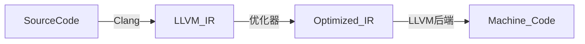

# 了解LLVM

LLVM（Low Level Virtual Machine）是一个开源的编译器基础设施项目，最初由伊利诺伊大学香槟分校（UIUC）的研究团队开发，现已成为业界广泛使用的工具链。它的核心设计目标是提供模块化、可重用的编译器技术，支持多种编程语言和硬件架构。

### **LLVM 的核心组成**
1. **中间表示（IR）**  
   LLVM 使用一种与硬件无关的**静态单赋值（SSA）形式**的中间代码（LLVM IR），兼具人类可读性（文本格式 `.ll`）和高效二进制表示（比特码 `.bc`）。IR 是 LLVM 优化的核心载体。

2. **优化器**  
   提供丰富的优化 passes（如死代码消除、循环优化、内联等），可在 IR 层面对代码进行跨语言的性能优化。

3. **后端代码生成**  
   支持多种目标架构（x86、ARM、RISC-V、GPU 等），将 IR 转换为机器码。

4. **工具链**  
   包括编译器（Clang）、调试器（LLDB）、链接器（lld）、静态分析工具等。

---

### **LLVM 的典型应用场景**
1. **编译器开发**  
   - **替代传统编译器**：Clang（LLVM 的 C/C++/Objective-C 前端）比 GCC 更快，且提供更好的错误提示。  
   - **新语言实现**：许多现代语言（如 Rust、Swift、Julia）使用 LLVM 作为后端，避免重复实现代码优化和硬件适配。  
   - **领域特定语言（DSL）**：通过 LLVM 快速为自定义语言生成高效代码（如 TensorFlow 的 XLA）。

2. **代码分析与转换**  
   - **静态分析**：通过 IR 分析代码漏洞（如 Clang Static Analyzer）。  
   - **代码混淆/加固**：在 IR 层进行控制流扁平化等安全改造。  
   - **自动化重构**：如大规模代码迁移工具（例如将 Objective-C 转为 Swift）。

3. **高性能计算与异构计算**  
   - **GPU 加速**：通过 LLVM 的 NVPTX（NVIDIA）或 AMDGPU 后端生成 GPU 代码。  
   - **AI 框架优化**：PyTorch/TensorFlow 使用 LLVM 加速计算图执行（如 MLIR 项目）。

4. **嵌入式与特殊硬件**  
   - 为自定义芯片（如 AI 加速器、RISC-V）快速开发编译器支持。  
   - 实时系统（如自动驾驶、航天）的确定性代码生成。

5. **教育与研究**  
   - 编译原理教学（模块化设计便于实验）。  
   - 探索新型优化技术（如多线程优化、量子编译）。

---

### **为什么选择 LLVM？**
- **模块化**：可单独使用前端、优化器或后端。  
- **性能**：IR 优化阶段显著提升生成代码质量。  
- **跨平台**：支持从嵌入式设备到超级计算机的架构。  
- **活跃生态**：苹果、Google、NVIDIA 等大厂持续贡献。

### **示例工具链**

总之，LLVM 是现代编译技术的基石，既用于构建工业级编译器，也支撑了代码分析、高性能计算等前沿领域。