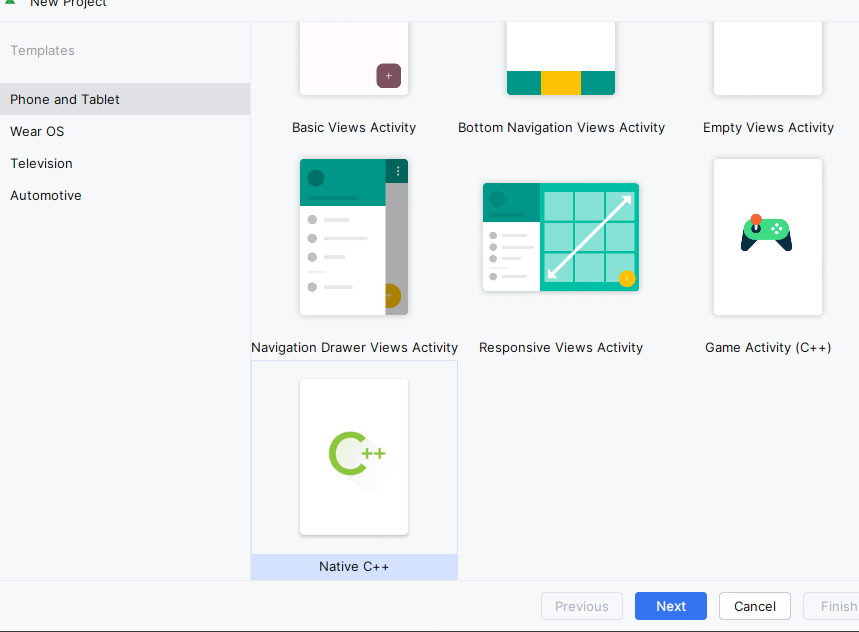
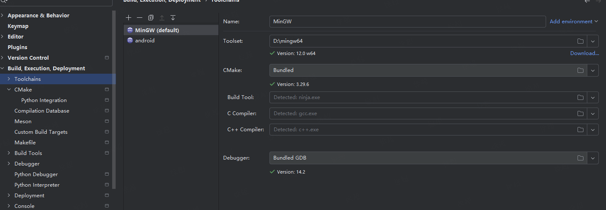
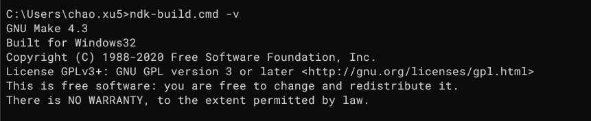
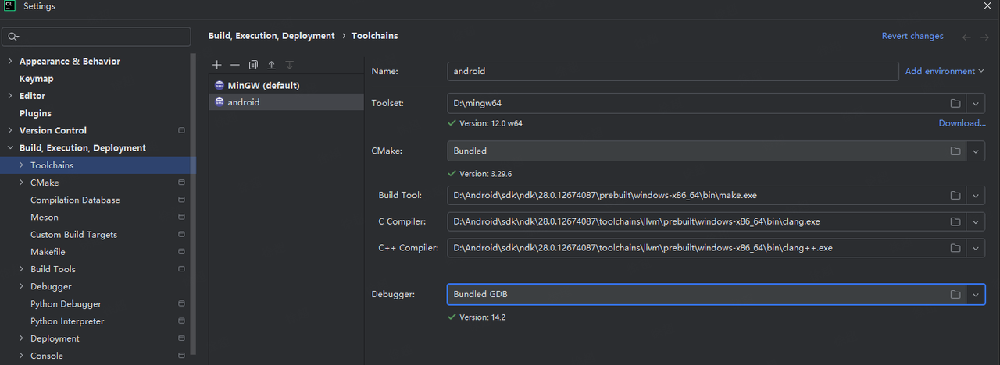
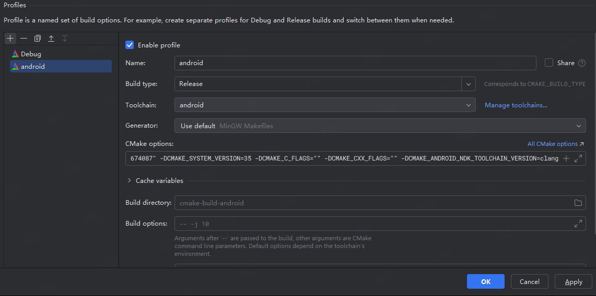

# How to use IDE for cross-compilation development

## Android Studio JNI

创建一个c++程序，采用默认配置



GameActivity会比较多的无用内容

cmakeLists.txt中配置 ----> 需要补充cmakelists的许西

add\_executable  生成二进制

add\_library 生成库文件

> 遇到compileSdk和targetSdk问题
>
> compileSdk
>
> * 决定编译时能调用的 API 范围（例如 `compileSdk 34` 允许使用 Android 14 的 API）。
>
> * 仅影响开发阶段的代码验证，不会影响应用在设备上的实际运行行为。
>
> targetSdk
>
> * 控制系统的兼容性行为（例如 Android 12 的模糊定位权限、Android 13 的通知权限等）。
>
> * 影响应用在新系统上的功能表现和限制（高版本系统会为低 `targetSdk` 应用启用兼容模式）
>
> `minSdk ≤ targetSdk ≤ compileSdk`（允许 `compileSdk` 高于 `targetSdk`，但需避免使用高版本 API）

```bash
defaultConfig {
    applicationId = "com.android.gameanalysis"
    minSdk = 33
    targetSdk = 34
    versionCode = 1
    versionName = "1.0"

    testInstrumentationRunner = "androidx.test.runner.AndroidJUnitRunner"
    ndk {
        ndkVersion = "29.0.13113456"
        abiFilters += listOf("armeabi-v7a", "arm64-v8a")
    }
}
```

build.gradle.kts 中写法与原来的groovy写法不一样了---> kotlin与groovy语法


## CLion + NDK

### Win\_x64配置

**不能用Cygwin!!!!!**

MinGW 下载地址https://github.com/niXman/mingw-builds-binaries/releases

> **命名构成**
>
> 文件名包含了多个关键信息部分，以 `i686-14.2.0-release-mcf-dwarf-ucrt-rt_v12-rev0.7z` 为例：
>
> * **架构信息**：`i686` 表示 32 位架构，`x86_64` 表示 64 位架构。
>
> * **版本号**：`14.2.0` 代表工具链的版本。
>
> * **构建类型**：`release` 表示这是发布版本。
>
> * **线程模型**：`mcf`、`posix`、`win32` 是不同的线程模型。`posix` 遵循 POSIX 标准，适用于多线程编程的可移植性；`win32` 是 Windows 原生线程模型；`mcf` 相对不常见，是一种特定的线程实现。
>
> * **异常处理模型**：`dwarf` 和 `seh` 是不同的异常处理机制。`dwarf` 常用于 32 位系统；`seh`（结构化异常处理）是 Windows 系统的异常处理方式，常用于 64 位系统。
>
> * **C 运行时库**：`ucrt` 是通用 C 运行时库，是 Windows 10 引入的；`msvcrt` 是微软 Visual C++ 运行时库。
>
> **具体区别分析**
>
> * **架构差异**
>
>   * `i686` 版本适用于 32 位的 Windows 系统，其支持的内存和处理能力受限于 32 位架构。
>
>   * `x86_64` 版本针对 64 位 Windows 系统，能利用 64 位处理器的更大内存寻址空间和更高性能。
>
> * **线程模型差异**
>
>   * `posix` 线程模型可使代码在不同系统间更易移植，因为 POSIX 标准定义了一套通用的线程操作接口。
>
>   * `win32` 线程模型与 Windows 系统紧密结合，使用 Windows 原生的线程 API，在 Windows 平台上可能有更好的性能和兼容性。
>
>   * `mcf` 线程模型可能针对特定应用场景进行了优化，不过使用范围相对较窄。
>
> * **异常处理模型差异**
>
>   * `dwarf` 异常处理主要基于 DWARF 调试信息格式，在 32 位环境中较为常用。
>
>   * `seh` 是 Windows 系统提供的异常处理机制，更适合 Windows 平台，尤其是 64 位系统。
>
> * **C 运行时库差异**
>
>   * `ucrt` 是 Windows 10 及更高版本推荐使用的运行时库，提供了更新的功能和更好的兼容性。
>
>   * `msvcrt` 是传统的微软 Visual C++ 运行时库，在旧版 Windows 系统和一些依赖该库的程序中使用较多。

配置MinGW的环境变量，把%MinGW\_HOME%\bin 加入path变量

CLION默认配置如下




### ANDROID NDK配置

#### 环境变量

NDK的HOME目录`D:\Android\sdk\ndk\28.0.12674087`

需要把NDK\_HOME配置到path路径下



需要有如图所示表示配置完成


#### 配置Toolchains



CMAKE中需要配置如下



CMAKE OPTIONS

```bash
-DCMAKE_TOOLCHAIN_FILE="D:\Android\sdk\ndk\29.0.13113456\build\cmake\android.toolchain.cmake"
-DCMAKE_SYSTEM_NAME=Android
-DANDROID_ABI=arm64-v8a
-DCMAKE_ANDROID_NDK=D:\Android\sdk\ndk\29.0.13113456"
-DCMAKE_SYSTEM_VERSION=35
-DCMAKE_C_FLAGS=""
-DCMAKE_CXX_FLAGS=""
-DCMAKE_ANDROID_NDK_TOOLCHAIN_VERSION=clang
```


## Visual code + NDK

https://zhuanlan.zhihu.com/p/157362239


## Linux_x86 + toolchains


### 系统环境变量配置

```
export NDK=/work/chao.xu5/tools/android-ndk-r27c         
export TOOLCHAIN=$NDK/toolchains/llvm/prebuilt/linux-x86_64
export TARGET=aarch64-linux-android
export API=34                              
export AR=$TOOLCHAIN/bin/llvm-ar                          
export CC=$TOOLCHAIN/bin/$TARGET$API-clang                              
export AS=$CC       
export CXX=$TOOLCHAIN/bin/$TARGET$API-clang++
export LD=$TOOLCHAIN/bin/ld
export RANLIB=$TOOLCHAIN/bin/llvm-ranlib
export STRIP=$TOOLCHAIN/bin/llvm-strip
export CFLAGS="-static --sysroot=$TOOLCHAIN/sysroot"
export LDFLAGS="-static --sysroot=$TOOLCHAIN/sysroot" 
```


## 引用资料

[官方NDK介绍文档](https://developer.android.com/ndk/guides/build?hl=zh-cn)

