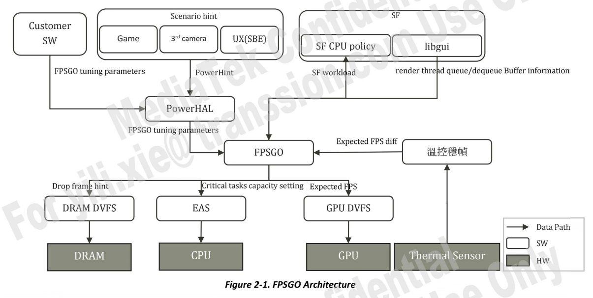
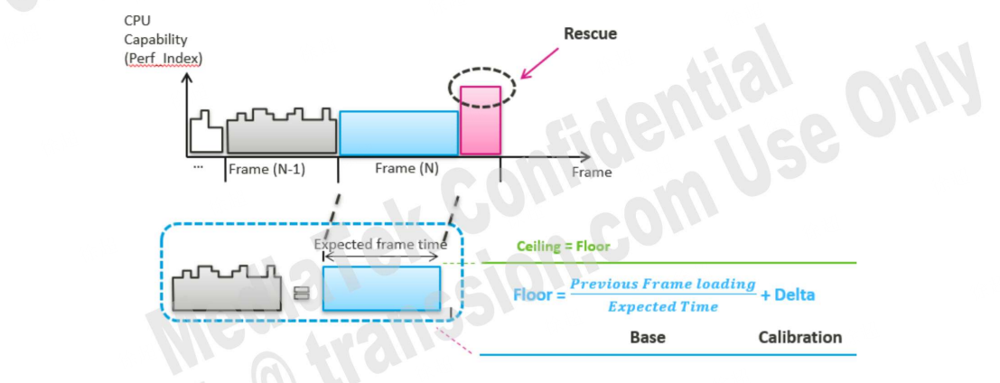
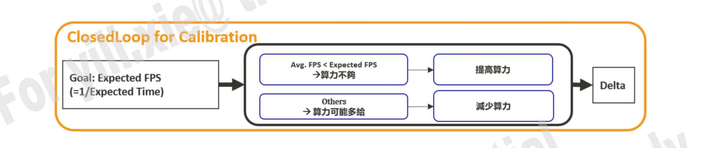
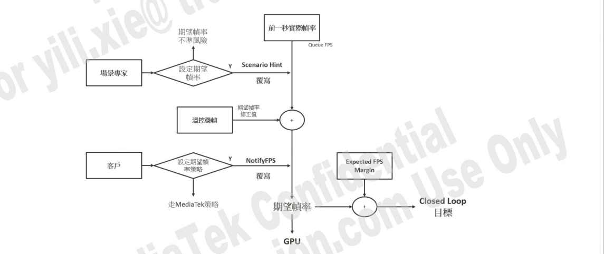
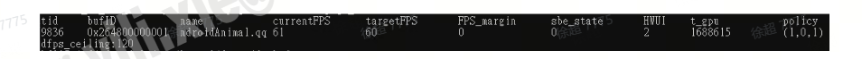

# 1.FPSGO 简介

## 1.1 FPSGO 的定义与目标  
**FPSGO**（Frame-based Performance Scaling for General Operations）是联发科（MediaTek）设计的基于帧的通用 CPU 频率控制机制，旨在通过动态调整 CPU 算力，以合理的功耗实现目标帧率（Full Frame Rate）。其核心目标包括：  
- **性能与功耗平衡**：在保证平均帧率（Avg FPS）的同时优化功耗（Power）。  
- **多场景适配**：支持游戏、第三方相机、用户体验（UX）等场景的差异化需求。  
- **灵活调控**：提供可配置参数接口，供客户根据产品需求自定义性能策略。  

---

## 1.2 FPSGO 的演进历史  
自 FPSGO 1.0 首次在 **P23/P30 平台** 落地以来，其功能不断迭代升级，主要版本演进如下：  

| 版本    | 关键改进                                                                                   | 解决的问题                                                                 |
|---------|------------------------------------------------------------------------------------------|---------------------------------------------------------------------------|
| **1.0** | 基础帧率追踪机制                                                                         | 无法支持多线程场景追踪                                                     |
| **2.0** | 支持多窗口场景                                                                           | Top-app 组内任务过多导致的 CPU 抢占问题                                     |
| **3.0** | 算力分配单元细化至 **关键任务**（Critical Task）                                           | 非关键任务性能被集群频率天花板限制（如下载速度受影响）                       |
| **5.0** | 引入 `uclamp_max` 替代集群频率天花板                                                      | 白名单配置复杂                                                             |
| **6.0** | 优化闭环控制（Closed Loop v1）算法，修复 UX/第三方相机的帧率误差                          | 参数调节复杂度高                                                           |
| **7.0** | 引入 **Closed Loop v2** 和 **L/R 分组策略**，支持动态算力分配与核心绑定                    | 极端负载场景稳定性需验证                                                   |

---

## 1.3 FPSGO 7.0 的核心功能  
FPSGO 7.0 在以下方面进行了显著优化：  

1. **多线程帧追踪**  
   - 支持同时追踪多个渲染线程（如分屏场景），独立管理各线程的算力需求。  

2. **关键任务算力优化**  
   - 从 **Top-app 组级** 提升细化至 **关键线程级**，避免非关键任务抢占资源。  
   - 使用 `uclamp_max` 限制关键线程的最大 CPU 利用率，替代全局集群频率天花板。  

3. **闭环控制算法（Closed Loop）**  
   - **动态校准**：通过性能指标（如实际帧率）实时修正算力预测误差。  
   - **分组策略**：基于线程负载排名或 L/R（渲染线程与最重非渲染线程）动态分组，差异化分配算力。  

4. **场景化优化框架**  
   - 通过 **Scenario Hint** 识别场景（如游戏、相机、UX），调用预置策略文件（如 `powerscntbl.xml`）。  
   - 支持客户自定义策略，例如通过 PowerHAL API 设置目标帧率、救援强度等参数。  

5. **救援机制（Rescue）**  
   - **配额救援（Quota Rescue）**：根据帧时间偏差动态调整算力提升时机。  
   - **二次救援（Second Rescue）**：首次救援不足时，进一步增加算力以缓解卡顿。  

---

**技术术语说明**  
- **`uclamp_max`**：任务可请求的 CPU 利用率上限（范围 0-99，对应 0%-99% 的算力）。  
- **EAS（Energy Aware Scheduler）**：Linux 内核的能耗感知调度器，接收 FPSGO 的算力需求进行任务调度。  
- **GPU DVFS**：基于 FPSGO 提供的目标帧率动态调整 GPU 频率。  

通过上述改进，FPSGO 7.0 在提升性能的同时，显著降低了多任务场景下的功耗与延迟。

# 2. FPSGO 架构

## 2.1 系统架构  
FPSGO 及其相关模块的架构如图 2-1 所示。FPSGO 需要从以下模块获取输入信息：  
- **Libgui**：提供渲染线程的 `queueBuffer` 和 `dequeueBuffer` 信息。  
- **PowerHAL**：通过 PowerHAL 设置场景提示（Scenario Hint）和客户策略（Customer SW）以调整 FPSGO 参数。  
- **帧率稳定性温控**：收集温度信息并通知 FPSGO 预期帧率降低幅度，以实现帧率稳定。  

FPSGO 向以下模块输出信息：  
- **EAS**：接收关键线程的算力需求，并根据算力逻辑调度线程及设置 CPU 频率。  
- **GPU DVFS**：接收目标帧率，并根据配置的目标帧率调整 GPU 频率。  
- **DRAM DVFS**：接收掉帧提示作为提升或降低 DRAM 频率的指标之一。  
- **SF CPU Policy**：接收 SurfaceFlinger（SF）负载信息以确定 SF 的算力需求。  



## 2.2 场景提示  
场景提示的目的是识别需要 FPSGO 帧控制的场景，并通过 PowerHAL 设置 FPSGO 控制策略。当前需要 FPSGO 帧控制的场景包括“游戏”“第三方相机”和“UX”，其他场景则使用系统默认的频率控制策略（EAS）。场景专家会在 PowerHAL 中为每个场景配置控制策略，策略配置文件位于：  
```  
vendor/mediatek/proprietary/hardware/power/config/mtxxxx/scn_tbl/powerscntbl.xml  
```
例如，游戏场景可参考 `MTKPOWER_HINT_GAME_MODE` 的配置。下表简要描述了 DX-3 平台的场景提示及其对应控制策略：  

| **场景**          | **识别方法**                     | **控制策略**                     | **场景示例**              |  
|-------------------|----------------------------------|----------------------------------|---------------------------|  
| **UX**            | 由 SBE 团队提供细节              | PowerHint: `MTKPOWER_HINT_UX*`  | 微信朋友圈滚动            |  
| **游戏**          | 由游戏厂商（客户）或游戏引擎检测（联发科可选）识别 | PowerHint: `MTKPOWER_HINT_GAME_MODE` | 《和平精英》              |  
| **第三方相机**    | 由第三方相机团队提供细节          | PowerHint: `MTKPOWER_HINT_CAMERA_MODE` | 美图相机场景              |  
| **其他**          | 不适用                           | 不适用                           | 百度地图、网页广告、视频播放 |  

## 2.3 客户策略  
客户必须通过 PowerHAL API 控制 FPSGO。PowerHAL 负责仲裁不同用户的设置，并决定最终的 FPSGO 控制参数。例如，在游戏场景中，`MTKPOWERHINT_GAME_MODE` 和客户策略均会设置“紧急度”，PowerHAL 将仲裁最终的紧急度方案。不同 PowerHAL API 的仲裁方式不同，详情请参考 PowerHAL 文档。  

若客户希望在联发科未启用 FPSGO 的场景中激活 FPSGO，需正确设置目标帧率（见 3.2.2.1），并建议咨询联发科场景专家。例如，在多数未启用 FPSGO 的 DoU 场景中，若有帧追踪需求，需在确保功耗可控后指定特定目标帧率，以避免因追求满帧率导致高功耗影响 DoU 评分。  

---

# 3. FPSGO 能力控制策略与参数  

## 3.1 FPSGO 能力控制策略  
如图 3-1 所示，FPSGO 提供的 CPU 能力控制可分为三个重叠步骤：  
1. **能力预测（基础）**：利用历史算力（前一帧负载）和目标帧率，估算下一帧所需算力（Perf Index）。  
2. **能力校正（校准）**：因预测无法完全准确（可能高估或低估），FPSGO 将通过性能指标校正（增减）算力。  
3. **能力增强（救援）**：当算力突增超出预测导致掉帧时，通过增强策略减轻掉帧对性能的影响。  





### 3.1.1 能力预测  
FPSGO 确定的 CPU 能力（Perf Index）以 1~100 的数值表示。在 BCPU 最高等级为 100 的前提下，每等级对应特定 Perf Index 值。  

如图 3-2，FPSGO 通过计算前一帧负载（运行时间 × CPU Perf Index 的总和），将负载分摊至目标帧率（Expected FPS），确定每帧关键线程的算力，并通过 `uclamp_min` API 向 EAS 提供算力提示，同时确定上限（`uclamp_max`）。  


### 3.1.2 能力校正  
为确保预测算力与性能目标（Expected FPS）一致，需通过校正机制调整算力：  
```  
Floor = 前一帧负载 / 预期时间（能力预测） + Delta（校正）  
```





**闭环校准目标**：  
- 平均 FPS < 预期 FPS → 算力不足  
- 其他情况 → 算力可能过剩  

### 3.1.3 能力救援  
当算力需求突增导致掉帧时，FPSGO 通过以下策略动态提升算力：  
- **配额救援（Quota Rescue）**：根据历史帧时间偏差动态调整增强时机。  
- **传统救援（Legacy Rescue）**：基于 VSYNC 同步调整增强时机。  

boosting 参数主要决定 boosting 的时间和强度。


---

## 3.2 FPSGO 参数说明  
FPSGO 支持两种参数调整方式：  
1. **按进程调整（通过 PID）**  
2. **全局调整**  
建议优先使用按 PID 调整的参数以避免多窗口场景下的相互影响。  

FPSGO 参数分为三类：  
1. **调优参数**：供客户调整性能与功耗平衡。  
2. **调试参数**：不建议客户修改。  
3. **遗留参数**：即将废弃，请勿使用。  

### 3.2.1 按进程参数设置  
FPSGO 支持通过 PID 为不同进程设置独立参数（示例）：  
| **AS-IS（内核 5.15 前）** | **TO-BE（内核 5.15 后）** |  
|--------------------------|--------------------------|  
| 不同渲染进程共享同一组参数 | 可为不同进程的关键线程设置独立参数（如分屏场景中仅游戏进程生效） |  

若同时设置，FPSGO 优先使用 PID 参数。例如：全局参数 `rescue_second_enable=0`，但某游戏进程设置 `rescue_second_enable=1`，则该进程的救援策略将生效。  


### 3.2.3 参数调优

#### 3.2.3.1 预期帧率（Expected FPS）
预期帧率的配置如图所示。默认情况下，使用前一秒的实际帧率或场景给出的预期帧率作为来源，并通过热控制进行帧率稳定性校正。系统提供了修改预期帧率并覆盖默认设置的接口。





|类别  | PowerHAL 命令 ID |  描述  |  范围  |  默认值|设备入口  |  全局 |  按 PID | 
| ---- | ---- | ---- | ---- | ---- | ---- |---- |----- |
|预期帧率 | PERF_RES_FPS_FSTB_NOTIFY_FPS_BY_PID | 指定目标预期帧率 | 0-120（设为 0 将清除设置）| 0  |/sys/kernel/fpsgo/fstb/notify_fstb_target_fps_by_pid | ✓ | ✓ |

#### 3.2.3.2 救援（Rescue）  
建议用户根据性能需求调整救援强度（`PERF_RES_FPS_FBT_RESCUE_F`）。  
**注意：此功能在 UX 场景中默认禁用，由 SBE（场景行为引擎）替代。**

提供两种救援触发时机的策略：  
1. **配额救援（Quota Rescue）**：  
   救援触发时间 = `expected_time * (1 + x) + quota * y`，其中 `x` 和 `y` 为可调参数。  
   - **配额（Quota）**：前 N 帧的（目标时间 - Q2Q 时间）总和（N = 预期帧率）。  
   - 若配额为正数，延迟触发救援；若为负数，提前触发救援。  
2. **旧版救援（Legacy Rescue）**：基于 VSYNC 信号调整救援触发时机。

| 类别   | PowerHAL 命令 ID                                 | 描述                                                                 | 范围          | 默认值 | 设备入口                                      | 全局 | 按 PID |
|--------|-------------------------------------------------|----------------------------------------------------------------------|---------------|--------|-----------------------------------------------|------|--------|
| 救援   | `PERF_RES_FPS_FBT_RESCUE_ENABLE_BY_PID`         | 救援功能开关                                                         | 0-1（0：禁用） | 0      | `/sys/kernel/fpsgo/fbt/rescue_enable`          | ✓    | ✓      |
|        | `PERF_RES_FPS_FBT_RESCUE_F`                     | 救援期间提升的 Perf Index 幅度（单位：%）                            | 0-100         | 25     | `/sys/module/mtk_fpsgo/parameters/rescue_enhance_f` | ✓    | ✓      |
|        | `PERF_RES_FPS_FBT_CHECK_BUFFER_QUOTA_BY_PID`    | 触发救援前检查缓冲区是否无累积（0：不检查，1：检查）                  | 0-1           | 0      | `/sys/module/mtk_fpsgo/parameters/check_buffer_quota` | ✓    | ✓      |
|        | `PERF_RES_FPS_FBT_QR_ENABLE_BY_PID`             | 选择救援策略：0：旧版救援（Legacy）1：配额救援（Quota）      | 0-1           | 0      | `/sys/module/mtk_fpsgo/parameters/qr_enable`   | ✓    | ✓      |
|        | `PERF_RES_FPS_FBT_QR_TZWNT_X_BY_PID`            | 调整公式中的 `x`（单位：百分比%）例：`x=-20` → `目标时间*(1-0.2)` | 0-100         | 0      | `/sys/module/mtk_fpsgo/parameters/qr_tzwnt_x`  | ✓    | ✓      |
|        | `PERF_RES_FPS_FBT_QR_TZWNT_V_P_BY_PID`          | 调整公式中的 `y`（当配额 > 0 时，单位：%）例：`y=80` → `quota*0.8` | 0-100         | 100    | `/sys/module/mtk_fpsgo/parameters/qr_tzwnt_v_p` | ✓    | ✓      |
|        | `PERF_RES_FPS_FBT_QR_TZWNT_V_N_BY_PID`          | 调整公式中的 `y`（当配额 < 0 时，单位：%）例：`y=100` → `quota*1` | 0-100         | 0      | `/sys/module/mtk_fpsgo/parameters/qr_tzwnt_v_n` | ✓    | ✓      |
|        | `PERF_RES_FPS_FBT_RESCUE_PERCENT`               | 救援触发时间与下一目标 VSYNC 的间距（基于目标时间的百分比）          | 0-100         | 33     | `/sys/module/mtk_fpsgo/parameters/rescue_percent` | ✓    | ✓      |
|        | `PERF_RES_FPS_FBT_SHORT_RESCUE_NS`              | 判定救援持续时间过短的阈值（单位：纳秒）                             | 0-2000000000  | 0      | `/sys/module/mtk_fpsgo/parameters/short_rescue_ns` | ✓    | ✓      |
|        | `PERF_RES_FPS_FBT_MIN_RESCUE_PERCENT`           | 救援持续时间过短时，提前触发的百分比（基于目标时间）                 | 0-100         | 0      | `/sys/module/mtk_fpsgo/parameters/min_rescue_percent` | ✓    | ✓      |
|        | `PERF_RES_FPS_FBT_RESCUE_SECOND_ENABLE_BY_PID`  | 二次救援开关（当首次救援仍无法满足帧率需求时，进一步增加算力）       | 0-1           | 0      | `/sys/module/mtk_fpsgo/parameters/rescue_second_enable` | ✓    | ✓      |

---

**说明**：  
- **配额救援**通过动态调整 `x` 和 `y` 参数，可精细化控制救援触发的敏感度，适用于负载波动较大的场景。  
- **旧版救援**依赖 VSYNC 信号，适用于帧率稳定的场景。  
- 若启用 `CHECK_BUFFER_QUOTA`，需确保缓冲区无累积后再触发救援，避免资源浪费。


#### 3.2.3.3 每任务余量（Per task Headroom, BHR）  
调整关键线程的 `uclamp_max` 值（即 `uclamp_max = perf_idx + BHR`），控制其最大算力上限。  

| 类别          | PowerHAL 命令 ID                  | 描述                                                                 | 范围    | 默认值 | 设备入口                                  | 全局 | 按 PID |
|---------------|-----------------------------------|----------------------------------------------------------------------|---------|--------|-------------------------------------------|------|--------|
| **每任务余量** | `PERF_RES_FPS_FBT_BHR`            | 任务的最大算力可超过 FPSGO 提供的算力的幅度（单位：%）               | 0-100   | 0      | `/sys/module/mtk_fpsgo/parameters/bhr`    | ✓    |        |

---

#### 3.2.2.4 限制利用率钳制（Limit Uclamp）  
通过限制关键线程的 `uclamp_max` 值（CPU 利用率上限），防止其过度占用 CPU 资源，平衡系统整体性能与功耗。  

| 类别            | PowerHAL 命令 ID                                | 描述                                                                 | 范围    | 默认值 | 设备入口                                  | 全局 | 按 PID |
|-----------------|------------------------------------------------|----------------------------------------------------------------------|---------|--------|-------------------------------------------|------|--------|
| **限制 Uclamp** | `PERF_RES_FPS_FBT_LIMIT_UCLAMP_BY_PID`         | 限制关键线程的 `uclamp_max` 值（0 表示不限制）                       | 0-99    | 0      | `/sys/kernel/fpsgo/fbt/limit_uclamp`       | ✓    | ✓      |
|                 | `PERF_RES_FPS_FBT_LIMIT_RUCLAMP_BY_PID`        | 限制救援阶段关键线程的 `uclamp_max` 值（0 表示不限制）               | 0-99    | 0      | `/sys/kernel/fpsgo/fbt/limit_ruclamp`      | ✓    | ✓      |

---

**功能详解**  
1. **`uclamp_max` 作用**  
   - `uclamp_max` 表示任务可请求的 CPU 利用率上限（范围 0-99，对应 0%-99% 的 CPU 算力）。  
   - 例如：若设置为 50，则关键线程的 CPU 利用率最高限制为 50%，避免因突发负载抢占过多资源。  

2. **参数区别**  
   - **常规限制（`LIMIT_UCLAMP`）**：适用于非救援场景，维持稳态性能。  
   - **救援限制（`LIMIT_RUCLAMP`）**：仅在救援阶段生效，允许临时放宽限制以应对帧率波动。  

3. **典型场景**  
   - **游戏场景**：限制后台任务 `uclamp_max`，确保前台渲染线程优先获得算力。  
   - **多窗口模式**：按 PID 差异化设置，避免跨进程资源争抢。  

---

**注意事项**  
- 默认值 `0` 表示完全禁用限制，关键线程可按需占用 CPU 资源。  
- 调整时需平衡性能与功耗，过高限制可能导致帧率不稳，过低则可能浪费算力。  
- 结合**分组策略（Grouping）**使用，可针对不同优先级线程精细化控制。

---

#### 3.2.3.5 分组策略（Grouping）  
FPSGO 提供两种关键线程分组方式：  
1. **按负载排名分组**（Loading Ranking）：根据线程负载排名划分组。  
   - **重度组（Heavy Group）**：前 `heavy_num` 个高负载线程（`heavy_num` 可调）。  
   - **次重度组（Second Group）**：前 `second_num` 个次高负载线程（`second_num` 可调）。  
   - **其他组（Others Group）**：剩余线程。  
2. **按 L/R 分组**（L: 除渲染线程外最重的关键任务；R: 渲染线程）：  
   - **重度组**：R 和 L 中负载更高者。  
   - **次重度组**：R 和 L 中负载次高者。  
   - **其他组**：剩余线程。  

| 类别         | PowerHAL 命令 ID                      | 描述                                              | 范围 | 默认值 | 设备入口                                 | 全局 | 按 PID |
| ------------ | ------------------------------------- | ------------------------------------------------- | ---- | ------ | ---------------------------------------- | ---- | ------ |
| **分组策略** | `PERF_RES_FPS_FBT_GROUP_BY_LR_BY_PID` | 分组方式：0：按负载排名分组1：按 L/R 分组         | 0-1  | 0      | `/sys/kernel/fpsgo/fbt/group_by_lr`      | ✓    | ✓      |
|              | `PERF_RES_FPS_FBT_HEAVY_NUM_BY_PID`   | 重度组包含的任务数量（0：根据最大集群数自动调整） | 0-10 | 0      | `/sys/kernel/fpsgo/fbt/heavy_group_num`  | ✓    | ✓      |
|              | `PERF_RES_FPS_FBT_SECOND_NUM_BY_PID`  | 次重度组包含的任务数量（0：仅重度组和其他组）     | 0-50 | 0      | `/sys/kernel/fpsgo/fbt/second_group_num` | ✓    | ✓      |

---

#### 3.2.3.6 分算力策略（SeparateCap）  
根据分组策略为不同组的关键线程分配不同的算力，并提供算力调整接口。  

| 类别          | PowerHAL 命令 ID                                | 描述                                                                 | 范围    | 默认值 | 设备入口                                  | 全局 | 按 PID |
|---------------|------------------------------------------------|----------------------------------------------------------------------|---------|--------|-------------------------------------------|------|--------|
| **分算力策略** | `PERF_RES_FPS_FBT_SEPARATE_AA_BY_PID`          | 分算力功能开关                                                       | 0-1     | 0      | `/sys/kernel/fpsgo/fbt/enable_separate_aa` | ✓    | ✓      |
|               | `PERF_RES_FPS_FBT_SEPARATE_PCT_B_BY_PID`       | 重度组算力折扣（`perf_idx_b = perf_idx_b * separate_pct_b / 100`）   | 0-199   | 0      | `/sys/kernel/fpsgo/fbt/separate_pct_b`    | ✓    | ✓      |
|               | `PERF_RES_FPS_FBT_SEPARATE_PCT_M_BY_PID`       | 次重度组算力折扣（`perf_idx_m = perf_idx_m * separate_pct_m / 100`） | 0-199   | 0      | `/sys/kernel/fpsgo/fbt/separate_pct_m`    | ✓    | ✓      |
|               | `PERF_RES_FPS_FBT_SEPARATE_PCT_OTHER_BY_PID`   | 其他组算力折扣（`perf_idx_others = perf_idx_others * separate_pct_others / 100`） | 0-100   | 100    | `/sys/kernel/fpsgo/fbt/separate_pct_other` | ✓    | ✓      |
|               | `PERF_RES_FPS_FBT_BLC_BOOST_BY_PID`            | 全局关键线程算力统一折扣（`perf_idx = perf_idx * blc_boost / 100`）  | 0-200   | 0      | `/sys/kernel/fpsgo/fbt/blc_boost`         | ✓    | ✓      |

---

**说明**：  

- **分算力策略**允许针对不同组别的关键线程进行精细化算力分配。例如，重度组任务可设置更高的算力保留（如 `separate_pct_b=150` 表示算力提升 50%），其他组任务可降低算力以节省功耗。  
- **全局折扣（BLC_BOOST）** 适用于所有关键线程，优先级低于分组折扣。  
- 参数值设为 `0` 表示不启用相关功能，设为 `100` 表示无折扣。


#### 3.2.3.7 启用系统天花板（Enable System Ceiling）  
启用或禁用按帧限制系统频率天花板的功能。  
**注意：启用此功能可能抑制非关键线程的性能需求，建议结合 CFP 解除天花板限制。**

| 类别          | PowerHAL 命令 ID                  | 描述                                                                 | 范围    | 默认值 | 设备入口                                  | 全局 | 按 PID |
|---------------|-----------------------------------|----------------------------------------------------------------------|---------|--------|-------------------------------------------|------|--------|
| **启用天花板** | `PERF_RES_FPS_FBT_CEILING_ENABLE` | 是否允许 FPSGO 限制所有系统后台线程的算力                            | 0-1     | 0      | `/sys/kernel/fpsgo/fbt/enable_ceiling`    | ✓    |        |

---

#### 3.2.3.8 提升 VIP（Boost VIP）  
根据分组调整线程的实时优先级（RT Priority）。

| 类别          | PowerHAL 命令 ID                                | 描述                                                                 | 范围    | 默认值 | 设备入口                                  | 全局 | 按 PID |
|---------------|------------------------------------------------|----------------------------------------------------------------------|---------|--------|-------------------------------------------|------|--------|
| **提升 VIP**  | `PERF_RES_FPS_FBT_BOOST_VIP_BY_PID`            | 为重度组/次重度组任务启用 RT（实时）优先级：0：禁用1：启用   | 0-1     | 0      | `/sys/kernel/fpsgo/fbt/boost_VIP`         | ✓    | ✓      |
|               | `PERF_RES_FPS_FBT_RTPRIO1_BY_PID`              | 设置重度组任务的 RT 优先级（0 表示普通任务）                        | 0-98    | 12     | `/sys/kernel/fpsgo/fbt/RT_prio1`          | ✓    | ✓      |
|               | `PERF_RES_FPS_FBT_RTPRIO2_BY_PID`              | 设置次重度组任务的 RT 优先级（0 表示普通任务）                      | 0-98    | 11     | `/sys/kernel/fpsgo/fbt/RT_prio2`          | ✓    | ✓      |
|               | `PERF_RES_FPS_FBT_RTPRIO3_BY_PID`              | 设置 `xgf_cfg` 任务的 RT 优先级（0 表示普通任务）                   | 0-98    | 10     | `/sys/kernel/fpsgo/fbt/RT_prio3`          | ✓    | ✓      |

---

#### 3.2.3.9 CFP & Minitop  
**CFP（CPU 负载监控）** 和 **Minitop（单任务负载监控）** 用于动态解除系统天花板限制：  
1. **CFP**：当总 CPU 负载 > 90% 时解除天花板。  
2. **Minitop**：当单个非关键任务负载 > 70% 时解除天花板。  

| 类别          | PowerHAL 命令 ID                                | 描述                                                                 | 范围    | 默认值 | 设备入口                                  | 全局 | 按 PID |
|---------------|------------------------------------------------|----------------------------------------------------------------------|---------|--------|-------------------------------------------|------|--------|
| **CFP**       | `PERF_RES_CFP_ENABLE`                          | CFP 功能开关                                                        | 0-1     | 1      | `/sys/module/mtk_fpsgo/parameters/cfp_onoff` | ✓    |        |
|               | `PERF_RES_CFP_POLLING_MS`                      | CFP 负载轮询间隔（单位：毫秒）                                      | 1-256   | 64     | `/sys/module/mtk_fpsgo/parameters/cfp_polling_ms` | ✓    |        |
|               | `PERF_RES_CFP_UP_LOADING`                      | 解除天花板的总 CPU 负载阈值（单位：%）                              | 0-100   | 90     | `/sys/module/mtk_fpsgo/parameters/cfp_up_loading` | ✓    |        |
|               | `PERF_RES_CFP_DOWN_LOADING`                    | 恢复天花板的总 CPU 负载阈值（单位：%）                              | 0-100   | 80     | `/sys/module/mtk_fpsgo/parameters/cfp_down_loading` | ✓    |        |
| **Minitop**   | `PERF_RES_FPS_FBT_MINITOP_ENABLE`              | Minitop 功能开关                                                    | 0-1     | 1      | `/sys/kernel/fpsgo/minitop/enable`        | ✓    |        |
|               | `PERF_RES_FPS_FBT_MINITOP_THRS_HEAVY`          | Minitop 判定单个非关键任务负载过高的阈值（单位：%）                 | 0-100   | 70     | `/sys/kernel/fpsgo/minitop/thrs_heavy`    | ✓    |        |

---

**说明**：  
- **CFP** 通过周期性轮询 CPU 总负载，动态解除频率限制，避免系统整体性能受限。  
- **Minitop** 监控单个非关键任务的高负载场景，防止因后台任务负载突增导致用户体验下降。


### 3.2.4 遗留参数（Legacy Parameters）  
**注意：以下参数已不再支持，请勿使用。**

#### 旧版闭环（Legacy Closed Loop, GCC）  

| 类别       | PowerHAL 命令 ID                                | 描述                                                                 | 范围          | 默认值 | 设备入口                                      |
|------------|------------------------------------------------|----------------------------------------------------------------------|---------------|--------|-----------------------------------------------|
| **GCC**    | `PERF_RES_FPS_FBT_GCC_FPS_MARGIN_BY_PID`       | 微调 GCC 目标帧率。例：目标帧率=60，但 59.5 可满足需求时，设为 -50 | -6000~6000    | 0      | `/sys/module/mtk_fpsgo/parameters/gcc_fps_margin` |
|            | `PERF_RES_FPS_FBT_GCC_UP_SEC_PCT_BY_PID`       | 检查上调算力的时间间隔（单位：1/100 秒）                            | 0-100         | 25     | `/sys/module/mtk_fpsgo/parameters/gcc_up_sec_pct` |
|            | `PERF_RES_FPS_FBT_GCC_DOWN_SEC_PCT_BY_PID`     | 检查下调算力的时间间隔（单位：1/100 秒）                            | 0-100         | 100    | `/sys/module/mtk_fpsgo/parameters/gcc_down_sec_pct` |
|            | `PERF_RES_FPS_FBT_GCC_UP_STEP_BY_PID`          | 每次上调算力的幅度（单位：%）                                       | 0-100         | 5      | `/sys/module/mtk_fpsgo/parameters/gcc_up_step` |
|            | `PERF_RES_FPS_FBT_GCC_DOWN_STEP_BY_PID`        | 每次下调算力的幅度（单位：%）                                       | 0-100         | 10     | `/sys/module/mtk_fpsgo/parameters/gcc_down_step` |
|            | `PERF_RES_FPS_FBT_GCC_UP_QUOTA_PCT_BY_PID`     | 判定配额不足需上调算力的阈值（单位：%）                             | 0-100         | 100    | `/sys/module/mtk_fpsgo/parameters/gcc_reserved_up_quota_pct` |
|            | `PERF_RES_FPS_FBT_GCC_DOWN_QUOTA_PCT_BY_PID`   | 判定配额过剩需下调算力的阈值（单位：%）                             | 0-100         | 5      | `/sys/module/mtk_fpsgo/parameters/gcc_reserved_down_quota_pct` |

---

#### CPU 频率限制（CPU Frequency Limit）  
限制系统全局 CPU 频率上限。

| 类别              | PowerHAL 命令 ID                        | 描述                                                                 | 范围          | 默认值 | 设备入口                                      |
|-------------------|-----------------------------------------|----------------------------------------------------------------------|---------------|--------|-----------------------------------------------|
| **CPU 频率限制** | `PERF_RES_FPS_FBT_LIMIT_CFREQ`          | 限制常规阶段大核 CPU 频率（单位：Hz）                                | 0-3000000     | 0      | `/sys/kernel/fpsgo/fbt/limit_cfreq`            |
|                   | `PERF_RES_FPS_FBT_LIMIT_RFRECQ`         | 限制救援阶段大核 CPU 频率（单位：Hz）                                | 0-3000000     | 0      | `/sys/kernel/fpsgo/fbt/limit_rfreq`            |
|                   | `PERF_RES_FPS_FBT_LIMIT_CFRECQ_M`       | 限制常规阶段中核 CPU 频率（单位：Hz）                                | 0-3000000     | 0      | `/sys/kernel/fpsgo/fbt/limit_cfreq_m`          |
|                   | `PERF_RES_FPS_FBT_LIMIT_RFRECQ_M`       | 限制救援阶段中核 CPU 频率（单位：Hz）                                | 0-3000000     | 0      | `/sys/kernel/fpsgo/fbt/limit_rfreq_m`          |

---

#### 轻载过滤（LLF, Light Loading Filter）  

| 类别          | PowerHAL 命令 ID                        | 描述                                                                 | 范围    | 默认值 | 设备入口                                      |
|---------------|-----------------------------------------|----------------------------------------------------------------------|---------|--------|-----------------------------------------------|
| **LLF**       | `PERF_RES_FPS_FPSGO_LLF_TH`             | 应用轻载过滤的阈值：任务负载低于此值时不触发算力提升（单位：%）      | 0-100   | 0      | `/sys/module/mtk_fpsgo/parameters/loading_th` |
|               | `PERF_RES_FPS_FPSGO_LLF_POLICY`         | 轻载过滤策略：0：仅过滤低负载任务1：过滤低负载任务并绑定小核 | 0-1     | 0      | `/sys/kernel/fpsgo/fbt/lif_task_policy`       |
|               | `PERF_RES_FPS_FPSGO_LLF_LIGHT_LOADING_POLICY` | 轻载任务的 Perf Index 折扣（例：设为 50 时，Perf Index = 25）        | 0-100   | 0      | `/sys/kernel/fpsgo/fbt/light_loading_policy`  |

---

**说明**：  
- **遗留参数**已逐步被新机制替代，使用可能导致兼容性问题或性能不稳定。  
- **CPU 频率限制**通过硬性上限控制功耗，但可能影响非关键任务的性能。  
- **轻载过滤（LLF）**用于优化低负载场景的能效，但需谨慎设置阈值以避免性能损失。


# 4. FPSGO 信息  
FPSGO 提供的当前帧率统计信息可通过以下两种方式获取：

## 4.1 通过 ADB 命令查看  
执行以下命令查看实时帧率信息：  
```bash
adb shell "cat /sys/kernel/fpsgo/fstb/fpsgo_status"
```
输出信息包括：  
- **tid**：渲染线程的线程 ID  
- **currentFPS**：该渲染线程的当前实际帧率  
- **targetFPS**：该渲染线程的预期帧率  
- **dfps_celling**：当前屏幕刷新率  

示例输出表格：  



---

## 4.2 通过 Systrace 查看  
**步骤**：  
1. **启用 FPSGO 的跟踪事件**：在 Systrace 中启用 `fpsgo_main_systrace`。  
2. **录制 Systrace**：执行 Systrace 录制操作。  
3. **检索关键字**：在录制结果中搜索以下关键字获取帧率信息：  
   - **`expected_fps`**：渲染线程的预期帧率（例：线程 22040 的预期帧率为 60）  
   - **`queue_fps`**：渲染线程的实际帧率（例：线程 22040 的实际帧率为 44）  
   - **`dfrc`**：屏幕刷新率（例：60Hz）  

示例 Systrace 日志片段：  
```
kfps-616 ( 616) [004] ... 11229 138351: fpsgo_main_systrace: C[22040|expected_fps|60|0x55d100000001  
kworker/-17552 (17552) [005] ... 11229 123891: fpsgo_main_systrace: C[22040|queue_fps|44|0x55d100000001  
kworker/-17552 (17552) [005] ... 11229 123895: fpsgo_main_systrace: C[22040|dfrc|60  
```
**图 4-2 Systrace 查看 FPSGO 信息示例**

---

**关键字段说明**：  
- **FPS_margin**：实际帧率与目标帧率的偏差值（单位：0.1 FPS）。  
- **she_state**：帧率稳定性状态（数值对应不同调节阶段）。  
- **policy**：当前应用的 FPSGO 控制策略组合（例：`(1,0,1)` 表示启用基础预测、禁用校准、启用救援）。  

**注意**：  
- 使用 ADB 命令可快速获取实时数据，适用于现场调试。  
- Systrace 提供更详细的时序分析，适合深入定位帧率波动原因。


# 5. 附录
## 5.1 FPSGO 演进历程  

 表 5-1 FPSGO 版本演进  

| 版本          | 落地项目        | 支援多窗口场景 | 控制单元      | 算力分配策略                     | 天花板机制                     | 主要变更                                                                 | 已知问题                                                                 |
|---------------|-----------------|----------------|---------------|----------------------------------|------------------------------|--------------------------------------------------------------------------|--------------------------------------------------------------------------|
| **FPSGO 1.0** | P23/P30         | 否             | Top-app 组    | 按 Top-app 组整体提升算力        | 无                            | - 首次支持帧率追踪机制                                                   | 无法支持多窗口场景的多渲染线程追踪                                       |
| **FPSGO 2.0** | P60/P22         | 是             | Top-app 组    | 按 Top-app 组整体提升算力        | 按集群设置 CPU 频率上限       | - 新增多窗口场景支持- 引入按集群的 CPU 频率天花板                    | Top-app 组内任务过多时，整体算力提升导致 CPU 抢占问题                    |
| **FPSGO 3.0** | P80             | 是             | 关键任务      | 针对关键任务（Critical Task）提升算力 | 按集群设置 CPU 频率上限       | - 优化算力分配单元为关键任务- 减少非关键线程的性能抑制               | 按集群的频率天花板可能限制非关键任务（如后台下载）的性能                 |
| **FPSGO 5.0** | DX1             | 是             | 关键任务      | 关键任务算力可达 100%            | 关键任务 `uclamp_max` 替代集群天花板 | - 引入 `uclamp_max` 机制替代集群频率天花板- 优化白名单策略           | 白名单配置复杂度较高                                                     |
| **FPSGO 6.0** | DX2             | 是             | 关键任务      | 关键任务算力可达 100%            | 关键任务 `uclamp_max`         | - 修复 UX 及第三方相机场景的预期帧率误差- 优化 Closed Loop v1 算法   | Closed Loop v1 参数调节复杂                                              |
| **FPSGO 7.0** | DX3             | 是             | 关键任务      | 关键任务算力可达 100%            | 关键任务 `uclamp_max`         | - 引入 Closed Loop v2：算法优化，降低参数调节复杂度- 支持按 L/R 分组动态分配算力 | 需进一步验证极端负载场景下的稳定性                                       |

---

**关键术语说明**  
1. **支援多窗口场景**：支持同时跟踪多个渲染线程的帧率需求（例如分屏多任务场景）。  
2. **控制单元**：算力分配的最小单位（如 Top-app 组或单个关键任务）。  
3. **天花板机制**：限制算力或频率的硬性上限策略。  
4. **Closed Loop v2**：闭环控制算法优化版本，通过动态校准减少人工参数调节。  

**演进趋势总结**  
- **精细化控制**：从按组（Top-app）分配算力，逐步细化到按关键任务分配，减少资源浪费。  
- **灵活性提升**：用 `uclamp_max` 替代集群频率天花板，避免全局性能抑制。  
- **场景适配**：通过分组策略（L/R）、Closed Loop 等机制，适应多窗口、游戏、相机等复杂场景需求。


## 5.2 FPSGO 参数列表  

| 类别                | PowerHAL 命令 ID                                   | 描述                                                                 | 范围          | 默认值 | 设备入口                                      | 全局 | 按 PID |
|---------------------|---------------------------------------------------|----------------------------------------------------------------------|---------------|--------|-----------------------------------------------|------|--------|
| **FPSGO 启用**      | `PERF_RES_FPS_FPSGO_ENABLE`                       | FPSGO 总开关：0：禁用1：启用                                | 0-1           | 1      | `/sys/kernel/fpsgo/common/fpsgo_enable`       | ✓    |        |
| **FPSGO 控制**      | `PERF_RES_FPS_FPSGO_CONTROL`                      | 全局控制开关：0：关闭控制1：开启控制                         | 0-1           | 0      | `/sys/kernel/fpsgo/composer/fpsgo_control`     | ✓    |        |
|                     | `PERF_RES_FPS_FPSGO_CONTROL_BY_PID`               | 按 PID 控制开关：`[进程PID] [0-1]`（例：`1234 1` 启用 PID=1234 的控制） | 进程 PID + 0-1 | 0      | `/sys/kernel/fpsgo/composer/fpsgo_control_pid` | ✓    | ✓      |
| **预期帧率**        | `PERF_RES_FPS_FSTB_NOTIFY_FPS_BY_PID`             | 指定目标预期帧率（单位：FPS）                                       | 0-120（0 表示清除设置） | 0      | `/sys/kernel/fpsgo/fstb/notify_fstb_target_fps_by_pid` | ✓    | ✓      |
| **闭环**            | `PERF_RES_FPS_FBT_GCC_ENABLE_BY_PID`              | 闭环控制模式：0：禁用1：旧版闭环2：新版闭环              | 0-2           | 0      | `/sys/module/mtk_fpsgo/parameters/gcc_enable` | ✓    | ✓      |
|                     | `PERF_RES_FPS_FBT_EXPECTED_FPS_MARGIN_BY_PID`     | 预期帧率修正值（单位：0.1 FPS）例：`margin=1` → 实际帧率 = 目标帧率 ± 0.1 | -2000~2000    | -1     | `/sys/module/mtk_fpsgo/parameters/expect_fps_margin` | ✓    | ✓      |
| **调度 – 提升亲和性** | `PERF_RES_FPS_FPSGO_BOOST_LR_BY_PID`             | 强制关键线程（如渲染线程 R）绑定大核（如 CPU7）                     | 0-1           | 0      | `/sys/module/mtk_fpsgo/parameters/boost_LR`    | ✓    | ✓      |
|                     | `PERF_RES_FPS_FPSGO_BOOST_AFFINITY_BY_PID`        | 亲和性策略：0：默认1：关键线程绑定大核，其他线程绑定小核     | 0-2           | 0      | `/sys/module/mtk_fpsgo/parameters/boost_affinity` | ✓    | ✓      |
| **限制 Uclamp**     | `PERF_RES_FPS_FBT_LIMIT_UCLAMP_BY_PID`            | 限制关键线程的 `uclamp_max` 值（单位：%）                           | 0-99（0 表示不限制） | 0      | `/sys/kernel/fpsgo/fbt/limit_uclamp`          | ✓    | ✓      |
|                     | `PERF_RES_FPS_FBT_LIMIT_RUCLAMP_BY_PID`           | 限制救援阶段关键线程的 `uclamp_max` 值                              | 0-99（0 表示不限制） | 0      | `/sys/kernel/fpsgo/fbt/limit_ruclamp`         | ✓    | ✓      |
| **每任务余量 (BHR)** | `PERF_RES_FPS_FBT_BHR`                            | 允许任务的最大算力超出 FPSGO 分配值的幅度（单位：%）                | 0-100         | 0      | `/sys/module/mtk_fpsgo/parameters/bhr`        | ✓    |        |
| **关键任务**        | `PERF_RES_FPS_FPSGO_SPID`                         | 启用 `xgf_cfg` 对关键线程进行额外处理（如优先级调整）               | 0-1           | 0      | `/sys/module/mtk_fpsgo/parameters/xgf_cfg_spid` | ✓    |        |
| **分组策略**        | `PERF_RES_FPS_FBT_GROUP_BY_LR_BY_PID`             | 分组方式：0：按负载排名分组1：按 L/R（渲染线程与最重非渲染线程）分组 | 0-1           | 0      | `/sys/kernel/fpsgo/fbt/group_by_lr`           | ✓    | ✓      |
|                     | `PERF_RES_FPS_FBT_HEAVY_NUM_BY_PID`               | 重度组任务数量（0：根据 CPU 集群数自动调整）                        | 0-10          | 0      | `/sys/kernel/fpsgo/fbt/heavy_group_num`       | ✓    | ✓      |
|                     | `PERF_RES_FPS_FBT_SECOND_NUM_BY_PID`              | 次重度组任务数量（0：仅重度组和其他组）                             | 0-50          | 0      | `/sys/kernel/fpsgo/fbt/second_group_num`      | ✓    | ✓      |
| **分算力策略**      | `PERF_RES_FPS_FBT_SEPARATE_AA_BY_PID`             | 分算力功能开关                                                     | 0-1           | 0      | `/sys/kernel/fpsgo/fbt/enable_separate_aa`    | ✓    | ✓      |
|                     | `PERF_RES_FPS_FBT_SEPARATE_PCT_B_BY_PID`          | 重度组算力折扣（例：`separate_pct_b=150` → 算力提升 50%）          | 0-199         | 0      | `/sys/kernel/fpsgo/fbt/separate_pct_b`        | ✓    | ✓      |
|                     | `PERF_RES_FPS_FBT_SEPARATE_PCT_M_BY_PID`          | 次重度组算力折扣                                                   | 0-199         | 0      | `/sys/kernel/fpsgo/fbt/separate_pct_m`        | ✓    | ✓      |
|                     | `PERF_RES_FPS_FBT_SEPARATE_PCT_OTHER_BY_PID`      | 其他组算力折扣（100：无折扣，0：完全禁用）                         | 0-100         | 100    | `/sys/kernel/fpsgo/fbt/separate_pct_other`    | ✓    | ✓      |
|                     | `PERF_RES_FPS_FBT_BLC_BOOST_BY_PID`               | 全局关键线程算力统一折扣（例：`blc_boost=80` → 算力降至 80%）       | 0-200         | 0      | `/sys/kernel/fpsgo/fbt/blc_boost`             | ✓    | ✓      |
| **CFP & Minitop**   | `PERF_RES_CFP_ENABLE`                             | CFP（总 CPU 负载监控）开关                                         | 0-1           | 1      | `/sys/module/mtk_fpsgo/parameters/cfp_onoff`  | ✓    |        |
|                     | `PERF_RES_CFP_POLLING_MS`                         | CFP 负载轮询间隔（单位：毫秒）                                     | 1-256         | 64     | `/sys/module/mtk_fpsgo/parameters/cfp_polling_ms` | ✓    |        |
|                     | `PERF_RES_CFP_UP_LOADING`                         | 解除天花板的总 CPU 负载阈值（单位：%）                             | 0-100         | 90     | `/sys/module/mtk_fpsgo/parameters/cfp_up_loading` | ✓    |        |
|                     | `PERF_RES_CFP_DOWN_LOADING`                       | 恢复天花板的总 CPU 负载阈值（单位：%）                             | 0-100         | 80     | `/sys/module/mtk_fpsgo/parameters/cfp_down_loading` | ✓    |        |
|                     | `PERF_RES_FPS_FBT_MINITOP_ENABLE`                 | Minitop（单任务负载监控）开关                                      | 0-1           | 1      | `/sys/kernel/fpsgo/minitop/enable`            | ✓    |        |
|                     | `PERF_RES_FPS_FBT_MINITOP_THRS_HEAVY`             | Minitop 判定单任务负载过高的阈值（单位：%）                        | 0-100         | 70     | `/sys/kernel/fpsgo/minitop/thrs_heavy`        | ✓    |        |
| **FPSGO 启用** | `PERF_RES_FPS_FPSGO_ENABLE` | FPSGO 总开关：0：禁用1：启用 | 0-1 | 1 | `/sys/kernel/fpsgo/common/fpsgo_enable` | ✓ | |
| **FPSGO 控制** | `PERF_RES_FPS_FPSGO_CONTROL` | 全局控制开关：0：关闭控制1：开启控制 | 0-1 | 0 | `/sys/kernel/fpsgo/composer/fpsgo_control` | ✓ | |
| | `PERF_RES_FPS_FPSGO_CONTROL_BY_PID` | 按 PID 控制开关：`[进程PID] [0-1]`（例：`1234 1` 启用 PID=1234 的控制） | 进程 PID + 0-1 | 0 | `/sys/kernel/fpsgo/composer/fpsgo_control_pid` | ✓ | ✓ |
| **预期帧率** | `PERF_RES_FPS_FSTB_NOTIFY_FPS_BY_PID` | 指定目标预期帧率（单位：FPS） | 0-120（0 表示清除设置） | 0 | `/sys/kernel/fpsgo/fstb/notify_fstb_target_fps_by_pid` | ✓ | ✓ |
| **闭环** | `PERF_RES_FPS_FBT_GCC_ENABLE_BY_PID` | 闭环控制模式：0：禁用1：旧版闭环2：新版闭环 | 0-2 | 0 | `/sys/module/mtk_fpsgo/parameters/gcc_enable` | ✓ | ✓ |
| | `PERF_RES_FPS_FBT_EXPECTED_FPS_MARGIN_BY_PID` | 预期帧率修正值（单位：0.1 FPS）例：`margin=1` → 实际帧率 = 目标帧率 ± 0.1 | -2000~2000 | -1 | `/sys/module/mtk_fpsgo/parameters/expect_fps_margin` | ✓ | ✓ |
| **调度 – 提升亲和性** | `PERF_RES_FPS_FPSGO_BOOST_LR_BY_PID` | 强制关键线程（如渲染线程 R）绑定大核（如 CPU7） | 0-1 | 0 | `/sys/module/mtk_fpsgo/parameters/boost_LR` | ✓ | ✓ |
| | `PERF_RES_FPS_FPSGO_BOOST_AFFINITY_BY_PID` | 亲和性策略：0：默认1：关键线程绑定大核，其他线程绑定小核 | 0-2 | 0 | `/sys/module/mtk_fpsgo/parameters/boost_affinity` | ✓ | ✓ |
| **限制 Uclamp** | `PERF_RES_FPS_FBT_LIMIT_UCLAMP_BY_PID` | 限制关键线程的 `uclamp_max` 值（单位：%） | 0-99（0 表示不限制） | 0 | `/sys/kernel/fpsgo/fbt/limit_uclamp` | ✓ | ✓ |
| **限制 Uclamp（中核）** | `PERF_RES_FPS_FBT_LIMIT_UCLAMP_M` | 限制中核关键线程的 `uclamp_max` 值（单位：%） | 0-99（0 表示不限制） | 0 | `/sys/kernel/fpsgo/fbt/limit_uclamp_m` | ✓ | |
| | `PERF_RES_FPS_FBT_LIMIT_UCLAMP_M_BY_PID` | 按 PID 限制中核关键线程的 `uclamp_max` 值 | 0-99（0 表示不限制） | 0 | `/sys/kernel/fpsgo/fbt/limit_uclamp_m` | ✓ | ✓ |
| **救援功能** | `PERF_RES_FPS_FBT_RESCUE_ENABLE` | 救援功能总开关：0：禁用1：启用 | 0-1 | 0 | `/sys/kernel/fpsgo/fbt/rescue_enable` | ✓ | |
| | `PERF_RES_FPS_FBT_RESCUE_ENABLE_BY_PID` | 按 PID 启用/禁用救援功能 | 0-1 | 0 | `/sys/kernel/fpsgo/fbt/rescue_enable` | ✓ | ✓ |
| | `PERF_RES_FPS_FBT_RESCUE_F` | 救援期间提升的 Perf Index 幅度（单位：%） | 0-100 | 25 | `/sys/module/mtk_fpsgo/parameters/rescue_enhance_f` | ✓ | ✓ |
| **配额救援（Quota Rescue）** | `PERF_RES_FPS_FBT_CHECK_BUFFER_QUOTA_BY_PID` | 触发救援前检查缓冲区是否无累积 | 0-1 | 0 | `/sys/module/mtk_fpsgo/parameters/check_buffer_quota` | ✓ | ✓ |
| | `PERF_RES_FPS_FBT_QR_ENABLE_BY_PID` | 救援策略选择：0：旧版救援（Legacy）1：配额救援（Quota） | 0-1 | 0 | `/sys/module/mtk_fpsgo/parameters/qr_enable` | ✓ | ✓ |
| | `PERF_RES_FPS_FBT_QR_TZWNT_X_BY_PID` | 调整救援公式中的 `x`（单位：%）例：`x=-20` → `目标时间*(1-0.2)` | 0-100 | 0 | `/sys/module/mtk_fpsgo/parameters/qr_tzwnt_x` | ✓ | ✓ |
| | `PERF_RES_FPS_FBT_QR_TZWNT_V_P_BY_PID` | 调整公式中的 `y`（当配额 > 0 时，单位：%）例：`y=80` → `quota*0.8` | 0-100 | 100 | `/sys/module/mtk_fpsgo/parameters/qr_tzwnt_v_p` | ✓ | ✓ |
| | `PERF_RES_FPS_FBT_QR_TZWNT_V_N_BY_PID` | 调整公式中的 `y`（当配额 < 0 时，单位：%）例：`y=100` → `quota*1` | 0-100 | 0 | `/sys/module/mtk_fpsgo/parameters/qr_tzwnt_v_n` | ✓ | ✓ |
| **救援触发逻辑** | `PERF_RES_FPS_FBT_RESCUE_PERCENT` | 救援触发时间与下一目标 VSYNC 的间距（基于目标时间的百分比） | 0-100 | 33 | `/sys/module/mtk_fpsgo/parameters/rescue_percent` | ✓ | ✓ |
| | `PERF_RES_FPS_FBT_SHORT_RESCUE_NS` | 判定救援持续时间过短的阈值（单位：纳秒） | 0-2000000000 | 0 | `/sys/module/mtk_fpsgo/parameters/short_rescue_ns` | ✓ | ✓ |
| | `PERF_RES_FPS_FBT_MIN_RESCUE_PERCENT` | 救援持续时间过短时，提前触发的百分比（基于目标时间） | 0-100 | 0 | `/sys/module/mtk_fpsgo/parameters/min_rescue_percent` | ✓ | ✓ |
| | `PERF_RES_FPS_FBT_RESCUE_SECOND_ENABLE_BY_PID` | 二次救援开关（首次救援不足时进一步增加算力） | 0-1 | 0 | `/sys/module/mtk_fpsgo/parameters/rescue_second_enable` | ✓ | ✓ |
| **每任务余量 (BHR)** | `PERF_RES_FPS_FBT_BHR` | 允许任务的最大算力超出 FPSGO 分配值的幅度（单位：%） | 0-100 | 0 | `/sys/module/mtk_fpsgo/parameters/bhr` | ✓ | |
| **关键任务** | `PERF_RES_FPS_FPSGO_SPID` | 启用 `xgf_cfg` 对关键线程进行额外处理（如优先级调整） | 0-1 | 0 | `/sys/module/mtk_fpsgo/parameters/xgf_cfg_spid` | ✓ | |
| **分组策略** | `PERF_RES_FPS_FBT_GROUP_BY_LR_BY_PID` | 分组方式：0：按负载排名分组1：按 L/R（渲染线程与最重非渲染线程）分组 | 0-1 | 0 | `/sys/kernel/fpsgo/fbt/group_by_lr` | ✓ | ✓ |
| | `PERF_RES_FPS_FBT_HEAVY_NUM_BY_PID` | 重度组任务数量（0：根据 CPU 集群数自动调整） | 0-10 | 0 | `/sys/kernel/fpsgo/fbt/heavy_group_num` | ✓ | ✓ |
| | `PERF_RES_FPS_FBT_SECOND_NUM_BY_PID` | 次重度组任务数量（0：仅重度组和其他组） | 0-50 | 0 | `/sys/kernel/fpsgo/fbt/second_group_num` | ✓ | ✓ |
| **分算力策略** | `PERF_RES_FPS_FBT_SEPARATE_AA_BY_PID` | 分算力功能开关 | 0-1 | 0 | `/sys/kernel/fpsgo/fbt/enable_separate_aa` | ✓ | ✓ |
| | `PERF_RES_FPS_FBT_SEPARATE_PCT_B_BY_PID` | 重度组算力折扣（例：`separate_pct_b=150` → 算力提升 50%） | 0-199（0：无限制） | 0 | `/sys/kernel/fpsgo/fbt/separate_pct_b` | ✓ | ✓ |
| | `PERF_RES_FPS_FBT_SEPARATE_PCT_M_BY_PID` | 次重度组算力折扣 | 0-199（0：无限制） | 0 | `/sys/kernel/fpsgo/fbt/separate_pct_m` | ✓ | ✓ |
| | `PERF_RES_FPS_FBT_SEPARATE_PCT_OTHER_BY_PID` | 其他组算力折扣（100：无折扣，0：完全禁用） | 0-100 | 100 | `/sys/kernel/fpsgo/fbt/separate_pct_other` | ✓ | ✓ |
| **全局算力调整** | `PERF_RES_FPS_FBT_BLC_BOOST_BY_PID` | 全局关键线程算力统一折扣（例：`blc_boost=80` → 算力降至 80%） | 0-200 | 0 | `/sys/kernel/fpsgo/fbt/blc_boost` | ✓ | ✓ |
| **启用天花板** | `PERF_RES_FPS_FBT_CEILING_ENABLE` | 是否允许 FPSGO 限制系统后台线程的算力 | 0-1 | 0 | `/sys/kernel/fpsgo/fbt/enable_ceiling` | ✓ | |
| **提升 VIP** | `PERF_RES_FPS_FBT_BOOST_VIP_BY_PID` | 为重度组/次重度组任务启用 RT（实时）优先级：0：禁用1：启用 | 0-1 | 0 | `/sys/kernel/fpsgo/fbt/boost_VIP` | ✓ | ✓ |
| | `PERF_RES_FPS_FBT_RTPRIO1_BY_PID` | 设置重度组任务的 RT 优先级（0 表示普通任务） | 0-98 | 12 | `/sys/kernel/fpsgo/fbt/RT_prio1` | ✓ | ✓ |
| **提升 VIP（次重度组）** | `PERF_RES_FPS_FBT_RTPRIO2_BY_PID` | 设置次重度组任务的 RT 优先级（0 表示普通任务） | 0-98 | 11 | `/sys/kernel/fpsgo/fbt/RT_prio2` | ✓ | ✓ |
| | `PERF_RES_FPS_FBT_RTPRIO3_BY_PID` | 设置 `xgf_cfg` 任务的 RT 优先级（0 表示普通任务） | 0-98 | 10 | `/sys/kernel/fpsgo/fbt/RT_prio3` | ✓ | ✓ |
| **CFP（总 CPU 负载监控）** | `PERF_RES_CFP_ENABLE` | CFP 功能开关 | 0-1 | 1 | `/sys/module/mtk_fpsgo/parameters/cfp_onoff` | ✓ | |
| | `PERF_RES_CFP_POLLING_MS` | CFP 负载轮询间隔（单位：毫秒） | 1-256 | 64 | `/sys/module/mtk_fpsgo/parameters/cfp_polling_ms` | ✓ | |
| | `PERF_RES_CFP_UP_LOADING` | 解除天花板的总 CPU 负载阈值（单位：%） | 0-100 | 90 | `/sys/module/mtk_fpsgo/parameters/cfp_up_loading` | ✓ | |
| | `PERF_RES_CFP_DOWN_LOADING` | 恢复天花板的总 CPU 负载阈值（单位：%） | 0-100 | 80 | `/sys/module/mtk_fpsgo/parameters/cfp_down_loading` | ✓ | |
| **Minitop（单任务负载监控）** | `PERF_RES_FPS_FBT_MINITOP_ENABLE` | Minitop 功能开关 | 0-1 | 1 | `/sys/kernel/fpsgo/minitop/enable` | ✓ | |
| | `PERF_RES_FPS_FBT_MINITOP_THRS_HEAVY` | Minitop 判定单任务负载过高的阈值（单位：%） | 0-100 | 70 | `/sys/kernel/fpsgo/minitop/thrs_heavy` | ✓ | |

---

**说明**  
1. **全局 vs. 按 PID**：标有“✓”的列表示参数支持全局或按进程（PID）单独配置。  
2. **设备入口**：参数对应的系统文件路径，可通过 `echo` 或 `cat` 命令读写。  
3. **典型用例**：  
   - 游戏场景：通过 `PERF_RES_FPS_FBT_SEPARATE_PCT_B_BY_PID` 提升重度组算力。  
   - 多窗口场景：使用 `PERF_RES_FPS_FBT_GROUP_BY_LR_BY_PID` 按 L/R 分组优化资源分配。  
4. **调试建议**：修改参数后需监控 `currentFPS` 和功耗，避免过度调优导致系统不稳定。


**FPSGO 参数表格**

| Category            | PowerHAL Command ID                          | Description                                                                 | 范围          | 默认值 | 设备入口                                      |
|---------------------|---------------------------------------------|----------------------------------------------------------------------------|---------------|--------|-----------------------------------------------|
| **GCC**             | `PERF_RES_FPS_FBT_GCC_FPS_MARGIN_BY_PID`    | 调整 GCC 目标帧率（例：目标帧率=60，允许误差为 ±30）                       | -6000~6000    | 0      | `/sys/module/mtk_fpsgo/parameters/gcc_fps_margin` |
|                     | `PERF_RES_FPS_FBT_GCC_UP_SEC_PCT_BY_PID`    | 检查上调算力的时间间隔（单位：1/100 秒）                                   | 0-100         | 25     | `/sys/module/mtk_fpsgo/parameters/gcc_up_sec_pct` |
|                     | `PERF_RES_FPS_FBT_GCC_DOWN_SEC_PCT_BY_PID`  | 检查下调算力的时间间隔（单位：1/100 秒）                                   | 0-100         | 100    | `/sys/module/mtk_fpsgo/parameters/gcc_down_sec_pct` |
|                     | `PERF_RES_FPS_FBT_GCC_UP_STEP_BY_PID`       | 每次上调算力的幅度（单位：%）                                              | 0-100         | 5      | `/sys/module/mtk_fpsgo/parameters/gcc_up_step` |
|                     | `PERF_RES_FPS_FBT_GCC_DOWN_STEP_BY_PID`     | 每次下调算力的幅度（单位：%）                                              | 0-100         | 10     | `/sys/module/mtk_fpsgo/parameters/gcc_down_step` |
|                     | `PERF_RES_FPS_FBT_GCC_UP_QUOTA_PCT_BY_PID`  | 判定配额不足需上调算力的阈值（单位：%）                                    | 0-100         | 100    | `/sys/module/mtk_fpsgo/parameters/gcc_reserved_up_quota_pct` |
|                     | `PERF_RES_FPS_FBT_GCC_DOWN_QUOTA_PCT_BY_PID`| 判定配额过剩需下调算力的阈值（单位：%）                                    | 0-100         | 5      | `/sys/module/mtk_fpsgo/parameters/gcc_reserved_down_quota_pct` |
| **CPU 频率限制**    | `PERF_RES_FPS_FBT_LIMIT_CFREQ`              | 限制常规阶段大核 CPU 频率（单位：Hz）                                      | 0-3000000     | 0      | `/sys/kernel/fpsgo/fbt/limit_cfreq`            |
|                     | `PERF_RES_FPS_FBT_LIMIT_RFREQ`              | 限制救援阶段大核 CPU 频率（单位：Hz）                                      | 0-3000000     | 0      | `/sys/kernel/fpsgo/fbt/limit_rfreq`            |
|                     | `PERF_RES_FPS_FBT_LIMIT_CFREQ_M`            | 限制常规阶段中核 CPU 频率（单位：Hz）                                      | 0-3000000     | 0      | `/sys/kernel/fpsgo/fbt/limit_cfreq_m`          |
|                     | `PERF_RES_FPS_FBT_LIMIT_RFREQ_M`            | 限制救援阶段中核 CPU 频率（单位：Hz）                                      | 0-3000000     | 0      | `/sys/kernel/fpsgo/fbt/limit_rfreq_m`          |

---

