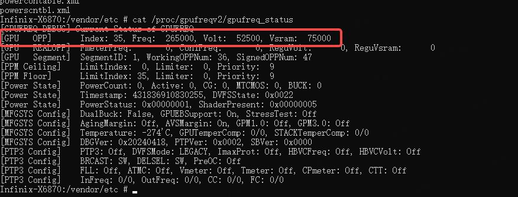

# 游戏case分析命令
> You must learn the analysis methods for all game issues as soon as possible.
>
> https://developer.android.com/agi/frame-trace/frame-profiler?hl=zh-cn

## 分析命令

### Network

#### Mobile data

```shell
grep "+ECSQ" radio_log
grep -i "cellinfo" radio_log
```

#### Wifi

```shell
grep "WifiHAL" | grep -i rssi
or
grep -i "rssi"
```

### Thermal

```shell
// open app, each app has different thermal config
cat /data/vendor/thermal/.current_tp
// board temperature threshold
cat /sys/kernel/thermal/target_tpcb
// cpu temperature threshold
cat /sys/kernel/thermal/min_ttj
```

You can see thermal config details from souce code `/vendor/mediatek/proprietary/external/thermal_core_lib/mt6985/`

### GPU

```shell
// current gpu status, about frequency battery
cat /proc/gpufreqv2/gpufreq_status
// set gpu frequency 
echo $index > /proc/gpufreqv2/fix_target_opp_index
// reset
echo -1 > /proc/gpufreqv2/fix_target_opp_index
// list supported gpu frequency
cat /proc/gpufreqv2/gpu_working_opp_table
// debug gpu
adb root
adb shell "setprop vendor.debug.gpu.provider meow"
adb shell "stop;start"
```




### CPU

```shell
// list cpu clusters
ls /sys/devices/system/cpu/cpufreq/
// or
cat /sys/devices/system/cpu/cpufreq/policy*/related_cpus
// list each cluster max frequency
cat /sys/devices/system/cpu/cpufreq/policy*/scaling_max_freq
// list each cluster min frequency
cat /sys/devices/system/cpu/cpufreq/policy*/scaling_min_freq
// list each cluster current frequency
cat /sys/devices/system/cpu/cpufreq/policy*/scaling_cur_freq
// list each cluster available frequency
cat /sys/devices/system/cpu/cpufreq/policy*/scaling_available_frequencies

while true; do cat /sys/kernel/ged/hal/current_freqency; sleep 1; done
```


### DRAM


## 日志分析

### 查找帧率

```shell
 // 查找丢帧的时间点 57可以随时修改 fifa是包名key words
 grep -nriE "queue.*fifa.*fps"  | awk -F'fps=' '{split($2, a, " "); if (a[1] < 57) print}'
 grep -ri "queue.*legends.*fps" main_log_* | awk '{print $9}' | tr '=' ' ' | awk '{print $2}' > fps.txt
 // 查找温升限制
 grep -nr "SKIN type"
 grep "SKIN type" main_log_* | awk '{print $16}' > temperature.txt
```
