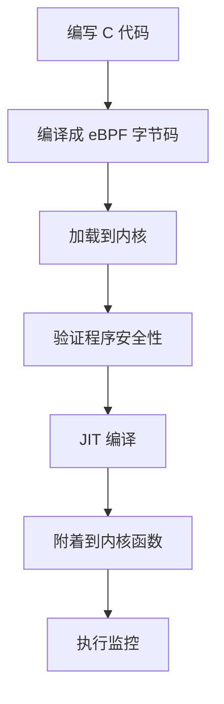
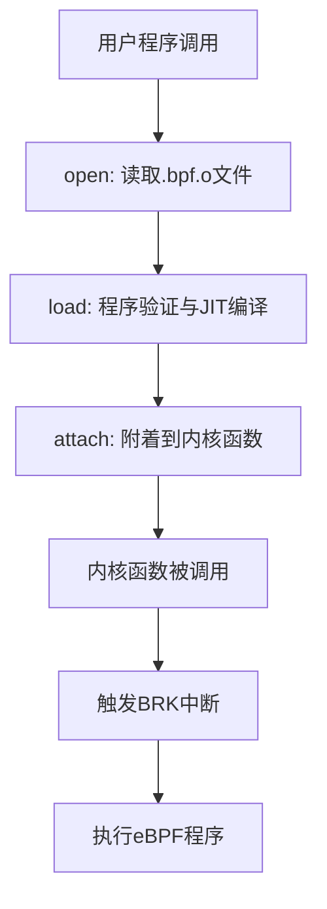

# Android eBPF 从入门到原理

## 1. eBPF 概述

### 1.1 什么是 eBPF

eBPF（Extended Berkeley Packet Filter）是一种新兴的Linux内核功能扩展技术，它允许开发者在不修改内核代码的前提下，安全地动态加载程序到内核空间执行。eBPF 的前身是 BPF（Berkeley Packet Filter），主要用于网络包过滤，而 eBPF 则大大扩展了其功能范围。

### 1.2 eBPF 的核心价值

1. **无需修改内核**：可以在运行时动态加载程序
2. **安全性保证**：通过验证器确保程序安全性
3. **高性能**：支持 JIT 编译，接近原生性能
4. **广泛应用场景**：网络监控、性能分析、安全监控等

### 1.3 eBPF 工作流程总览



------

## 2. 在 Android 上使用 eBPF

### 2.1 Android eBPF 程序结构

Android 上的 eBPF 程序通常位于 `system/bpfprogs` 目录下，一个典型的 eBPF 程序包含三个核心部分：

```c
// 1. 定义 Map 数据结构（用于内核与用户空间数据交换）
DEFINE_BPF_MAP(cpu_freq_map, ARRAY, int, int, 1024)

// 2. 定义 eBPF 程序函数
DEFINE_BPF_PROG("tracepoint/power/cpu_frequency", 
                AID_ROOT, AID_SYSTEM, tp_cpu_frequency)
(struct trace_event_raw_cpu_frequency *args) {
    int key = args->cpu_id;
    int freq = args->state;
    bpf_map_update_elem(&cpu_freq_map, &key, &freq, BPF_ANY);
    return 0;
}

// 3. 许可协议声明
LICENSE("GPL");
```

### 2.2 eBPF 程序的编译过程

#### 步骤 1：编译成字节码

```bash
clang -O2 -target bpf -c program.bpf.c -o program.bpf.o
```

编译后的 `.o` 文件是 BTF（BPF Type Format）格式的字节码文件：

```bash
# 查看编译产物
llvm-readelf -h program.bpf.o
# 输出：Machine: EM_BPF
```

#### 步骤 2：生成骨架文件

```bash
bpftool gen skeleton program.bpf.o > program.skel.h
```

生成的骨架文件包含：

- 程序结构体定义
- 字节码数据（以字符串形式存储）
- 加载和管理函数

```c
// 骨架文件示例
struct program_bpf {
    struct bpf_object_skeleton *skeleton;
    struct bpf_object *obj;
    struct {
        struct bpf_map *cpu_freq_map;
    } maps;
    struct {
        struct bpf_program *tp_cpu_frequency;
    } progs;
};

// 字节码数据
static const char program_bpf__elf_bytes[] = {
    0x7f, 0x45, 0x4c, 0x46, // ELF 魔数
    // ... 更多字节码数据
};
```

#### 步骤 3：编译用户空间程序

```bash
gcc -o program program.c -lbpf
```

### 2.3 Android 上的权限控制

Android 对 eBPF 有严格的权限控制：

```c
// bpfloader.te 中的 SEPolicy 限制
neverallow { domain -bpfloader } *:bpf { map_create prog_load };
```

这意味着：

- 只有 `bpfloader` 可以加载 eBPF 程序
- `bpfloader` 在系统启动时执行一次
- 其他程序无法动态加载 eBPF 程序

### 2.4 程序加载流程

```c
// BpfLoader.cpp 中的加载逻辑
int main() {
    // 1. 遍历 /system/etc/bpf 下的 .o 文件
    loadAllElfObjects("/system/etc/bpf");
    
    // 2. 解析并加载每个 eBPF 程序
    for (auto& file : bpf_files) {
        android::bpf::loadProg(file);
    }
    
    // 3. 将程序映射到 /sys/fs/bpf
    bpf_obj_pin(prog_fd, "/sys/fs/bpf/prog_name");
    
    return 0;
}
```

### 2.5 程序附着（Attach）

加载后的程序需要附着到内核监控点：

```c
// 附着到 tracepoint
int attach_tracepoint() {
    int prog_fd = bpf_obj_get("/sys/fs/bpf/prog_name");
    
    // 打开 tracepoint
    int tp_fd = open("/sys/kernel/tracing/events/power/cpu_frequency/id", O_RDONLY);
    
    // 附着程序
    struct perf_event_attr attr = {
        .type = PERF_TYPE_TRACEPOINT,
        .config = tp_id,
    };
    
    int event_fd = perf_event_open(&attr, -1, 0, -1, 0);
    ioctl(event_fd, PERF_EVENT_IOC_SET_BPF, prog_fd);
    ioctl(event_fd, PERF_EVENT_IOC_ENABLE, 0);
    
    return 0;
}
```

------

## 3. eBPF 工作原理详解

### 3.1 eBPF 虚拟机

eBPF 程序运行在一个专门的虚拟机上，这个虚拟机有自己的指令集和寄存器：

#### 寄存器规范

| 寄存器 | 用途               |
| ------ | ------------------ |
| R0     | 返回值寄存器       |
| R1-R5  | 函数参数寄存器     |
| R6-R9  | 被调用者保存寄存器 |
| R10    | 只读栈帧指针       |
| R11    | 辅助寄存器         |

```c
// 内核中的虚拟机实现
struct bpf_vm {
    u64 regs[11];  // R0-R10 寄存器
    u8 *stack;     // 虚拟栈
};
```

### 3.2 eBPF 指令集

eBPF 指令分为简单指令（32位）和宽指令（64位）：

#### 简单指令格式

```c
struct bpf_insn {
    __u8 code;     // 操作码 (8位)
    __u8 dst_reg:4; // 目标寄存器 (4位)
    __u8 src_reg:4; // 源寄存器 (4位)
    __s16 off;      // 偏移量 (16位)
    __s32 imm;      // 立即数 (32位)
};
```

#### 操作码分类

操作码的低3位表示指令类型：

| 类型值 | 指令类型  | 说明           |
| ------ | --------- | -------------- |
| 0x00   | BPF_LD    | 加载指令       |
| 0x01   | BPF_LDX   | 加载寄存器指令 |
| 0x02   | BPF_ST    | 存储指令       |
| 0x03   | BPF_STX   | 存储寄存器指令 |
| 0x04   | BPF_ALU   | 32位算术指令   |
| 0x05   | BPF_JMP   | 跳转指令       |
| 0x07   | BPF_ALU64 | 64位算术指令   |

#### 指令示例分析

以字节码 `07 01 00 00 44 33 22 11` 为例：

```
操作码: 0x07 = BPF_ALU64 | BPF_ADD | BPF_K
目标寄存器: 1 (R1)
源寄存器: 0
偏移: 0x0000
立即数: 0x11223344
```

对应的指令：`R1 += 0x11223344`

### 3.3 字节码执行机制

内核通过跳转表实现高效的指令分发：

```c
static u64 ___bpf_prog_run(u64 *regs, const struct bpf_insn *insn) {
    // 初始化跳转表
    static const void * const jumptable[256] = {
        [0 ... 255] = &&default_label,
        // 具体指令标签
        [BPF_ALU64 | BPF_ADD | BPF_K] = &&ALU64_ADD_K,
        [BPF_ALU64 | BPF_SUB | BPF_X] = &&ALU64_SUB_X,
        // ... 更多指令
    };
    
    // 指令分发
    goto *jumptable[insn->code];
    
ALU64_ADD_K:
    DST = DST + IMM;  // regs[insn->dst_reg] += insn->imm
    CONT;
    
ALU64_SUB_X:
    DST = DST - SRC;  // regs[insn->dst_reg] -= regs[insn->src_reg]
    CONT;
    
    // ... 其他指令实现
}
```

### 3.4 程序验证机制

eBPF 程序在执行前必须通过验证器检查：

#### 验证规则

1. **DAG 检查**：确保程序是有向无环图，禁止循环
2. **寄存器状态跟踪**：确保读取前已初始化
3. **内存访问检查**：确保访问边界合法
4. **函数调用验证**：检查参数和返回值

```c
// 验证器核心函数
int bpf_check(struct bpf_prog **prog, union bpf_attr *attr) {
    struct bpf_verifier_env *env;
    
    // 1. 控制流图检查
    ret = check_cfg(env);
    
    // 2. 指令验证
    ret = check_all_insns(env);
    
    // 3. 状态跟踪
    ret = verify_states(env);
    
    return ret;
}
```

### 3.5 JIT 编译优化

为了提高执行效率，eBPF 支持 JIT（Just-In-Time）编译：

```c
// JIT 编译入口
struct bpf_prog *bpf_int_jit_compile(struct bpf_prog *prog) {
    struct jit_ctx ctx = {0};
    
    // 1. 第一遍：计算指令大小
    ctx.image = NULL;
    build_body(&ctx);
    
    // 2. 分配内存
    ctx.image = bpf_jit_binary_alloc(ctx.idx * 4);
    
    // 3. 第二遍：生成机器码
    ctx.idx = 0;
    build_prologue(&ctx);  // 函数序言
    build_body(&ctx);      // 指令转换
    build_epilogue(&ctx);  // 函数尾声
    
    // 4. 刷新指令缓存
    flush_icache_range(ctx.image, ctx.image + ctx.idx);
    
    prog->bpf_func = (void *)ctx.image;
    prog->jited = 1;
    
    return prog;
}
```

------

## 4. eBPF 程序注入到内核的完整流程

### 4.1 完整流程概览



### 4.2 Open 阶段：解析 ELF 文件

#### 4.2.1 核心数据结构

```c
// eBPF 对象结构
struct bpf_object {
    char name[BPF_OBJ_NAME_LEN];
    struct elf_state efile;
    struct bpf_program *programs;
    struct bpf_map **maps;
    // ... 其他字段
};

// ELF 状态结构
struct elf_state {
    int fd;
    const void *obj_buf;     // .bpf.o 文件内容
    size_t obj_buf_sz;       // 文件大小
    Elf *elf;               // libelf 句柄
    // ... 其他字段
};
```

#### 4.2.2 ELF 文件解析流程

```c
// 1. 打开骨架程序
struct vfsstat_bpf *vfsstat_bpf__open(void) {
    struct bpf_object_open_opts opts = {
        .sz = sizeof(opts),
        .object_name = "vfsstat_bpf",
    };
    
    // 从内存中读取字节码
    return bpf_object__open_mem(vfsstat_bpf__elf_bytes,
                                sizeof(vfsstat_bpf__elf_bytes),
                                &opts);
}

// 2. 初始化 ELF 文件
static int bpf_object__elf_init(struct bpf_object *obj) {
    // 使用 libelf 解析 ELF 文件
    obj->efile.elf = elf_memory(obj->efile.obj_buf, 
                                obj->efile.obj_buf_sz);
    
    // 验证 ELF 文件头
    Elf64_Ehdr *ehdr = elf64_getehdr(obj->efile.elf);
    if (ehdr->e_type != ET_REL || ehdr->e_machine != EM_BPF) {
        return -EINVAL;
    }
    
    return 0;
}

// 3. 收集段落信息
static int bpf_object__elf_collect(struct bpf_object *obj) {
    Elf_Scn *scn = NULL;
    
    // 遍历所有段落
    while ((scn = elf_nextscn(obj->efile.elf, scn)) != NULL) {
        Elf64_Shdr *shdr = elf64_getshdr(scn);
        const char *name = elf_sec_str(obj, shdr->sh_name);
        
        if (strcmp(name, ".symtab") == 0) {
            // 处理符号表
            obj->efile.symbols = elf_sec_data(scn);
        } else if (strncmp(name, "kprobe/", 7) == 0) {
            // 处理 kprobe 程序段
            bpf_object__add_programs(obj, scn, name);
        }
        // ... 处理其他段落
    }
    
    return 0;
}
```

### 4.3 Load 阶段：验证与编译

#### 4.3.1 程序加载流程

```c
// 加载 eBPF 程序
int bpf_object__load(struct bpf_object *obj) {
    // 1. 加载程序
    err = bpf_object__load_progs(obj);
    
    // 2. 加载 Maps
    err = bpf_object__create_maps(obj);
    
    return err;
}

// 加载单个程序
static int bpf_object_load_prog(struct bpf_program *prog) {
    struct bpf_prog_load_opts opts = {
        .prog_type = prog->type,
        .insns = prog->insns,
        .insn_cnt = prog->insns_cnt,
        .license = prog->license,
    };
    
    // 调用系统调用加载程序
    prog->fd = bpf_prog_load(opts.prog_type, prog->name, 
                             opts.license, opts.insns, 
                             opts.insn_cnt, &opts);
    
    return prog->fd < 0 ? -errno : 0;
}
```

#### 4.3.2 内核验证与编译

```c
// 内核系统调用入口
SYSCALL_DEFINE3(bpf, int, cmd, union bpf_attr __user *, uattr, unsigned int, size) {
    switch (cmd) {
    case BPF_PROG_LOAD:
        return bpf_prog_load(&attr);
    // ... 其他命令
    }
}

// 程序加载实现
static int bpf_prog_load(union bpf_attr *attr) {
    // 1. 权限检查
    if (!capable(CAP_BPF))
        return -EPERM;
    
    // 2. 创建程序对象
    struct bpf_prog *prog = bpf_prog_alloc(attr->prog_type);
    
    // 3. 验证程序
    err = bpf_check(&prog, attr);
    if (err)
        goto free_prog;
    
    // 4. JIT 编译
    prog = bpf_prog_select_runtime(prog);
    
    // 5. 创建文件描述符
    err = bpf_prog_new_fd(prog);
    
    return err;
}
```

### 4.4 Attach 阶段：附着到内核函数

#### 4.4.1 kprobe 附着流程

```c
// 附着 kprobe
static struct bpf_link *attach_kprobe(const struct bpf_program *prog) {
    // 1. 解析函数名
    const char *func_name = prog->sec_name + 7; // 跳过 "kprobe/"
    
    // 2. 打开 perf event
    struct perf_event_attr attr = {
        .type = PERF_TYPE_KPROBE,
        .config1 = (u64)(unsigned long)func_name,
    };
    
    int pfd = perf_event_open(&attr, -1, 0, -1, 0);
    
    // 3. 将 eBPF 程序附着到 perf event
    return bpf_program__attach_perf_event_opts(prog, pfd, NULL);
}
```

#### 4.4.2 内核 kprobe 注册

```c
// perf event 初始化
static int perf_kprobe_init(struct perf_event *event) {
    // 1. 创建本地 trace kprobe
    struct trace_kprobe *tk = create_local_trace_kprobe(
        event->attr.config1,  // 函数名
        event->attr.config & 1  // 是否为 ret probe
    );
    
    // 2. 注册 kprobe
    return __register_trace_kprobe(tk);
}

// 注册 kprobe 到内核
static int __register_trace_kprobe(struct trace_kprobe *tk) {
    // 1. 查找函数地址
    tk->rp.kp.addr = kallsyms_lookup_name(tk->symbol);
    
    // 2. 设置处理函数
    tk->rp.kp.pre_handler = kprobe_dispatcher;
    
    // 3. 注册 kprobe
    ret = register_kprobe(&tk->rp.kp);
    
    // 4. 在目标地址插入断点指令
    arch_arm_kprobe(&tk->rp.kp);
    
    return ret;
}
```

#### 4.4.3 断点指令插入

```c
// ARM64 架构下插入 BRK 指令
void arch_arm_kprobe(struct kprobe *kp) {
    u32 *addr = (u32 *)kp->addr;
    u32 insn = BRK64_OPCODE_KPROBES;  // BRK #0x400
    
    // 保存原始指令
    kp->opcode = *addr;
    
    // 替换为断点指令
    text_poke(addr, &insn, AARCH64_INSN_SIZE);
}
```

### 4.5 执行阶段：程序触发与运行

#### 4.5.1 断点异常处理

```c
// 断点异常处理入口
static int brk_handler(struct pt_regs *regs, unsigned int esr) {
    // 调用断点钩子
    call_break_hook(regs, esr);
    return 0;
}

// 查找并调用 kprobe 处理函数
static int call_break_hook(struct pt_regs *regs, unsigned int esr) {
    struct break_hook *hook;
    
    list_for_each_entry(hook, &kernel_break_hook, node) {
        if (hook->imm == BRK64_ESR_KPROBES) {
            // 调用 kprobe 处理函数
            return hook->fn(regs, esr);
        }
    }
    
    return DBG_HOOK_ERROR;
}

// kprobe 断点处理
static int kprobe_breakpoint_handler(struct pt_regs *regs, unsigned int esr) {
    struct kprobe *p = get_kprobe((kprobe_opcode_t *)instruction_pointer(regs));
    
    if (p && p->pre_handler) {
        // 调用预处理函数（kprobe_dispatcher）
        p->pre_handler(p, regs);
    }
    
    return 0;
}
```

#### 4.5.2 eBPF 程序执行

```c
// kprobe 分发器
static int kprobe_dispatcher(struct kprobe *kp, struct pt_regs *regs) {
    struct trace_kprobe *tk = container_of(kp, struct trace_kprobe, rp.kp);
    
    // 检查是否有 eBPF 程序附着
    if (tk->tp.call.prog_array) {
        // 执行 eBPF 程序
        kprobe_perf_func(tk, regs);
    }
    
    return 0;
}

// 执行 eBPF 程序
static void kprobe_perf_func(struct trace_kprobe *tk, struct pt_regs *regs) {
    struct trace_event_call *call = &tk->tp.call;
    
    if (call->prog_array) {
        // 运行 eBPF 程序
        trace_call_bpf(call, regs);
    }
}

// eBPF 程序运行入口
unsigned int trace_call_bpf(struct trace_event_call *call, void *ctx) {
    struct bpf_prog_array *prog_array = call->prog_array;
    struct bpf_prog *prog;
    
    // 遍历程序数组
    bpf_prog_array_for_each_prog(prog_array, prog) {
        // 执行 eBPF 程序
        ret = bpf_prog_run(prog, ctx);
    }
    
    return ret;
}
```

### 4.6 程序执行细节

当 eBPF 程序最终执行时，实际调用的是 JIT 编译后的机器码：

```c
// JIT 编译后的函数调用
static inline u32 bpf_prog_run(const struct bpf_prog *prog, const void *ctx) {
    if (prog->jited) {
        // 调用 JIT 编译后的机器码
        return prog->bpf_func(ctx, prog->insnsi);
    } else {
        // 使用解释器执行
        return ___bpf_prog_run(prog->insnsi, ctx);
    }
}
```

------

## 5. 调试和优化

### 5.1 开发调试流程

在 Android 上调试 eBPF 程序的步骤：

```bash
# 1. 推送新的 .o 文件
adb push program.bpf.o /system/etc/bpf/

# 2. 删除旧的映射文件
adb shell "rm /sys/fs/bpf/program_*"

# 3. 重新加载程序
adb shell "/system/bin/bpfloader"

# 4. 查看加载状态
adb shell "ls -la /sys/fs/bpf/"
```

### 5.2 调试技巧

#### 5.2.1 使用 bpf_printk 输出调试信息

```c
// 在 eBPF 程序中添加调试输出
DEFINE_BPF_PROG("kprobe/vfs_read", AID_ROOT, AID_SYSTEM, kprobe_vfs_read)
(struct pt_regs *ctx) {
    bpf_printk("vfs_read called, pid=%d\n", bpf_get_current_pid_tgid() >> 32);
    return 0;
}
```

#### 5.2.2 查看内核日志

```bash
# 启用跟踪
echo 1 > /sys/kernel/tracing/tracing_on

# 查看跟踪输出
cat /sys/kernel/tracing/trace_pipe

# 关闭 rate limiting（如果日志被限制）
echo on > /proc/sys/kernel/printk_devkmsg
```

### 5.3 性能优化建议

1. **减少 Map 操作**：避免频繁的 map 查找和更新
2. **使用 Per-CPU Maps**：减少多核竞争
3. **避免复杂计算**：将复杂逻辑移到用户空间
4. **合理使用 Helper 函数**：选择最适合的内核辅助函数

```c
// 优化示例：使用 Per-CPU Map
DEFINE_BPF_MAP(stats_map, PERCPU_ARRAY, int, struct stats, 1)

DEFINE_BPF_PROG("kprobe/vfs_read", AID_ROOT, AID_SYSTEM, kprobe_vfs_read)
(struct pt_regs *ctx) {
    int key = 0;
    struct stats *stat = bpf_map_lookup_elem(&stats_map, &key);
    if (stat) {
        stat->count++;  // 无需原子操作，Per-CPU 保证安全
    }
    return 0;
}
```

------

## 6. 总结

### 6.1 eBPF 完整工作流程回顾

1. **编写阶段**：使用 C 语言编写 eBPF 程序
2. **编译阶段**：编译成 eBPF 字节码（.o 文件）
3. **生成阶段**：使用 bpftool 生成骨架文件
4. **加载阶段**：通过系统调用加载程序到内核
5. **验证阶段**：内核验证程序安全性
6. **编译阶段**：JIT 编译成机器码
7. **附着阶段**：附着到内核函数或事件
8. **执行阶段**：在内核中执行监控逻辑

### 6.2 Android eBPF 的特点

- **严格权限控制**：只有 bpfloader 可以加载程序
- **启动时加载**：程序在系统启动时统一加载
- **文件系统映射**：通过 /sys/fs/bpf 提供访问接口
- **SELinux 集成**：完整的安全策略支持

### 6.3 应用场景

eBPF 在 Android 上的典型应用包括：

#### 6.3.1 性能监控

- **CPU 频率监控**：跟踪 CPU 频率变化和性能状态
- **内存使用分析**：监控内存分配、回收和泄漏
- **I/O 性能跟踪**：文件系统读写性能分析
- **网络流量监控**：网络包过滤和流量统计

```c
// CPU 频率监控示例
DEFINE_BPF_MAP(cpu_freq_map, ARRAY, int, u64, 8)

DEFINE_BPF_PROG("tracepoint/power/cpu_frequency", AID_ROOT, AID_SYSTEM, 
                 trace_cpu_frequency)
(struct trace_event_raw_cpu_frequency *args) {
    int cpu = args->cpu_id;
    u64 freq = args->state;
    
    bpf_map_update_elem(&cpu_freq_map, &cpu, &freq, BPF_ANY);
    bpf_printk("CPU %d frequency changed to %llu\n", cpu, freq);
    
    return 0;
}
```

#### 6.3.2 系统调用跟踪

- **安全审计**：监控敏感系统调用
- **应用行为分析**：跟踪应用的系统调用模式
- **异常检测**：发现异常的系统调用序列

```c
// 系统调用监控示例
DEFINE_BPF_MAP(syscall_count, HASH, u32, u64, 1024)

DEFINE_BPF_PROG("tracepoint/raw_syscalls/sys_enter", AID_ROOT, AID_SYSTEM,
                 trace_sys_enter)
(struct trace_event_raw_sys_enter *args) {
    u32 syscall_id = args->id;
    u64 *count = bpf_map_lookup_elem(&syscall_count, &syscall_id);
    
    if (count) {
        (*count)++;
    } else {
        u64 init_count = 1;
        bpf_map_update_elem(&syscall_count, &syscall_id, &init_count, BPF_ANY);
    }
    
    return 0;
}
```

#### 6.3.3 网络安全监控

- **恶意网络行为检测**：识别异常网络连接
- **DDoS 防护**：实时检测和缓解攻击
- **流量分析**：深度包检测和协议分析

```c
// 网络连接监控示例
DEFINE_BPF_MAP(connection_map, HASH, struct conn_key, struct conn_info, 10240)

struct conn_key {
    u32 saddr;
    u32 daddr;
    u16 sport;
    u16 dport;
};

struct conn_info {
    u64 bytes;
    u64 packets;
    u64 timestamp;
};

DEFINE_BPF_PROG("kprobe/tcp_sendmsg", AID_ROOT, AID_SYSTEM, trace_tcp_send)
(struct pt_regs *ctx) {
    struct sock *sk = (struct sock *)PT_REGS_PARM1(ctx);
    size_t size = (size_t)PT_REGS_PARM3(ctx);
    
    struct conn_key key = {};
    key.saddr = sk->__sk_common.skc_rcv_saddr;
    key.daddr = sk->__sk_common.skc_daddr;
    key.sport = sk->__sk_common.skc_num;
    key.dport = sk->__sk_common.skc_dport;
    
    struct conn_info *info = bpf_map_lookup_elem(&connection_map, &key);
    if (info) {
        info->bytes += size;
        info->packets++;
        info->timestamp = bpf_ktime_get_ns();
    } else {
        struct conn_info new_info = {
            .bytes = size,
            .packets = 1,
            .timestamp = bpf_ktime_get_ns(),
        };
        bpf_map_update_elem(&connection_map, &key, &new_info, BPF_ANY);
    }
    
    return 0;
}
```

#### 6.3.4 应用性能分析

- **函数调用跟踪**：分析应用热点函数
- **延迟测量**：测量关键路径的执行时间
- **资源使用统计**：统计各种资源的使用情况

### 6.4 最佳实践

#### 6.4.1 程序设计原则

1. **保持程序简单**：eBPF 程序应该尽可能简单，复杂逻辑放在用户空间
2. **避免阻塞操作**：不要在 eBPF 程序中执行可能阻塞的操作
3. **合理使用 Map**：选择合适的 Map 类型，避免不必要的同步开销
4. **限制程序大小**：eBPF 程序有指令数量限制，通常不超过 1M 指令

```c
// 好的实践：简单的数据收集
DEFINE_BPF_PROG("kprobe/vfs_read", AID_ROOT, AID_SYSTEM, kprobe_vfs_read)
(struct pt_regs *ctx) {
    u64 pid_tgid = bpf_get_current_pid_tgid();
    u32 pid = pid_tgid >> 32;
    
    // 简单的计数操作
    u64 *count = bpf_map_lookup_elem(&read_count_map, &pid);
    if (count) {
        (*count)++;
    } else {
        u64 init_count = 1;
        bpf_map_update_elem(&read_count_map, &pid, &init_count, BPF_ANY);
    }
    
    return 0;
}
```

#### 6.4.2 错误处理

```c
// 正确的错误处理方式
DEFINE_BPF_PROG("kprobe/sys_open", AID_ROOT, AID_SYSTEM, trace_open)
(struct pt_regs *ctx) {
    char filename[256];
    const char __user *fname = (const char __user *)PT_REGS_PARM1(ctx);
    
    // 安全地读取用户空间数据
    long ret = bpf_probe_read_user_str(filename, sizeof(filename), fname);
    if (ret < 0) {
        bpf_printk("Failed to read filename, ret=%ld\n", ret);
        return 0;
    }
    
    // 检查文件名长度
    if (ret >= sizeof(filename)) {
        bpf_printk("Filename too long, truncated\n");
    }
    
    bpf_printk("Opening file: %s\n", filename);
    return 0;
}
```

#### 6.4.3 性能优化技巧

1. **使用 Per-CPU Map**：减少多核之间的竞争

```c
// Per-CPU Map 避免锁竞争
DEFINE_BPF_MAP(stats_map, PERCPU_ARRAY, int, struct stats, 1)
```

1. **批量处理**：使用 perf event 批量传输数据

```c
// 使用 perf event 高效传输数据
DEFINE_BPF_MAP(events, PERF_EVENT_ARRAY, int, int, 1024)

// 在 eBPF 程序中
struct event_data data = {
    .pid = bpf_get_current_pid_tgid() >> 32,
    .timestamp = bpf_ktime_get_ns(),
};

bpf_perf_event_output(ctx, &events, BPF_F_CURRENT_CPU, 
                      &data, sizeof(data));
```

1. **合理使用 Helper 函数**：选择最高效的辅助函数

```c
// 高效的字符串比较
if (bpf_strncmp(comm, "target_app", 10) == 0) {
    // 处理目标应用
}
```

### 6.5 限制和注意事项

#### 6.5.1 eBPF 程序限制

1. **指令数量限制**：程序不能超过 1M 条指令
2. **栈空间限制**：栈空间不能超过 512 字节
3. **循环限制**：不允许无界循环，只能使用有界循环
4. **函数调用限制**：只能调用预定义的 helper 函数

```c
// 错误示例：无界循环
while (condition) {  // 这会被验证器拒绝
    // 处理逻辑
}

// 正确示例：有界循环
#pragma unroll
for (int i = 0; i < 16; i++) {  // 编译时展开
    // 处理逻辑
    if (condition) break;
}
```

#### 6.5.2 Android 特定限制

1. **SELinux 策略**：必须符合 Android 的 SELinux 规则
2. **权限限制**：只有系统应用可以访问 eBPF Maps
3. **签名要求**：eBPF 程序必须经过适当签名

### 6.6 调试和故障排除

#### 6.6.1 常见问题及解决方案

1. **程序加载失败**

```bash
# 检查程序验证错误
dmesg | grep bpf

# 查看详细错误信息
echo 2 > /proc/sys/kernel/bpf_stats_enabled
```

1. **Map 访问失败**

```c
// 始终检查 Map 操作的返回值
void *value = bpf_map_lookup_elem(&my_map, &key);
if (!value) {
    bpf_printk("Map lookup failed\n");
    return 0;
}
```

1. **权限问题**

```bash
# 检查 SELinux 上下文
ls -Z /sys/fs/bpf/

# 查看 SELinux 拒绝记录
dmesg | grep avc
```

#### 6.6.2 调试工具使用

1. **bpftool 工具**

   当前工具不在Android系统默认编译范围内，需要在product中增加bpftool这个模块，具体代码路径是external/bpftool

```bash
# 列出所有加载的程序
bpftool prog list

# 查看程序详细信息
bpftool prog show id <ID>

# 导出程序字节码
bpftool prog dump xlated id <ID>

# 查看 JIT 编译结果
bpftool prog dump jited id <ID>
```

1. **perf 工具**

```bash
# 跟踪 eBPF 程序性能
perf record -e bpf:bpf_prog_run ./your_program
perf report
```

1. **trace-cmd 工具**

```bash
# 跟踪内核事件
trace-cmd record -e kprobes:vfs_read
trace-cmd report
```

### 6.7 未来发展方向

#### 6.7.1 技术演进

1. **CO-RE (Compile Once, Run Everywhere)**：提高程序可移植性
2. **更多 Helper 函数**：扩展 eBPF 程序的能力边界
3. **用户空间 eBPF**：在用户空间运行 eBPF 程序
4. **eBPF for Windows**：跨平台支持

#### 6.7.2 Android 集成改进

1. **更灵活的权限模型**：允许特权应用动态加载程序
2. **更好的调试支持**：集成更多调试工具
3. **性能优化**：减少程序加载和执行开销
4. **安全增强**：更严格的验证和隔离机制

### 6.8 总结

eBPF 作为一项革命性的内核技术，为 Android 系统提供了强大的可观测性和可编程性。通过本文的深入分析，我们了解了：

1. **完整的工作流程**：从源码编写到内核执行的全过程
2. **核心技术原理**：虚拟机、指令集、验证器和 JIT 编译
3. **实际应用场景**：性能监控、安全审计、网络分析等
4. **开发最佳实践**：如何编写高效、安全的 eBPF 程序
5. **调试和优化技巧**：如何快速定位和解决问题

eBPF 技术在 Android 上还处于快速发展期，随着内核版本的更新和生态系统的完善，它将在移动设备的系统监控、性能优化和安全防护等方面发挥越来越重要的作用。

对于开发者而言，掌握 eBPF 技术不仅能够深入理解系统内部机制，还能够开发出更加智能和高效的系统工具。希望本文能够为大家深入学习和应用 eBPF 技术提供有价值的参考。

------

**参考资料**

1. [Linux Kernel eBPF Documentation](https://www.kernel.org/doc/html/latest/bpf/)
2. [eBPF Instruction Set](https://www.kernel.org/doc/html/latest/bpf/instruction-set.html)
3. [Android BPF Documentation](https://source.android.com/docs/core/architecture/kernel/bpf)
4. [libbpf Documentation](https://libbpf.readthedocs.io/)
5. [BCC Developer Guide](https://github.com/iovisor/bcc/blob/master/docs/reference_guide.md)