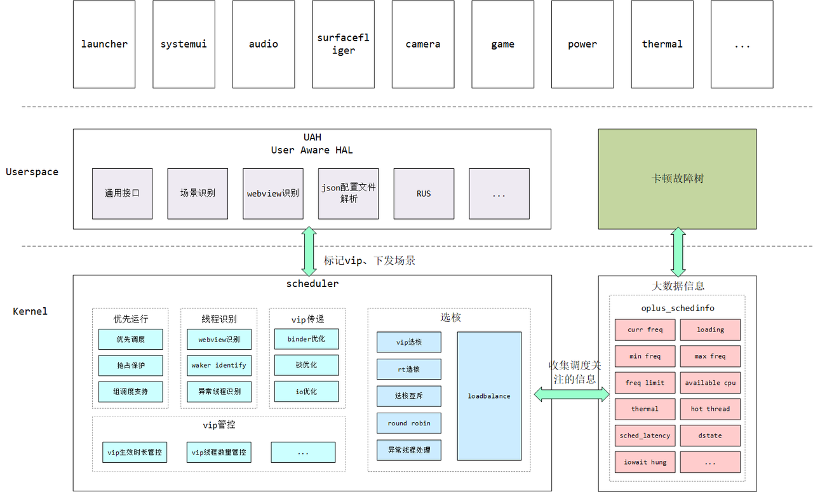
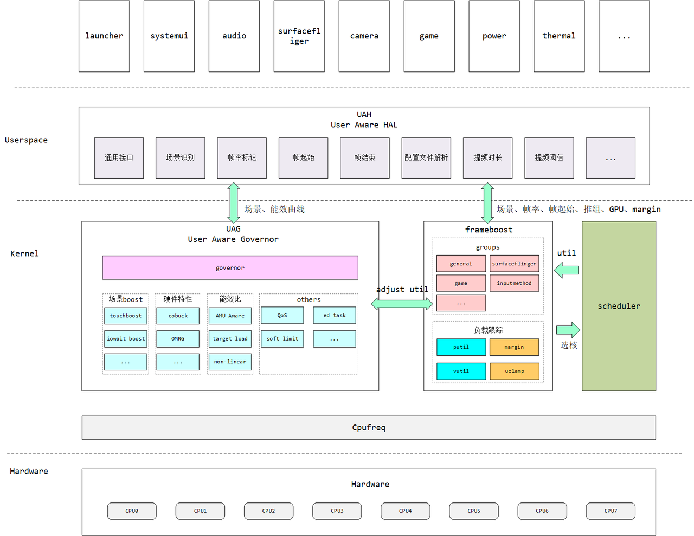
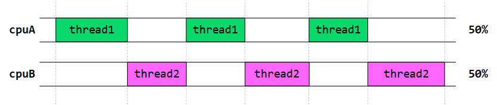
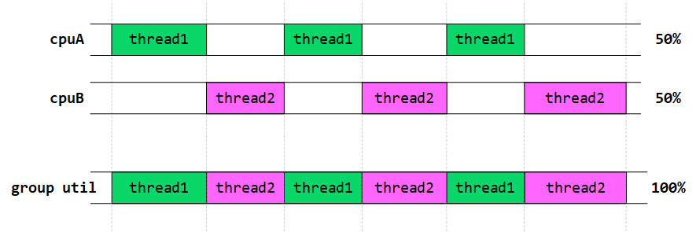
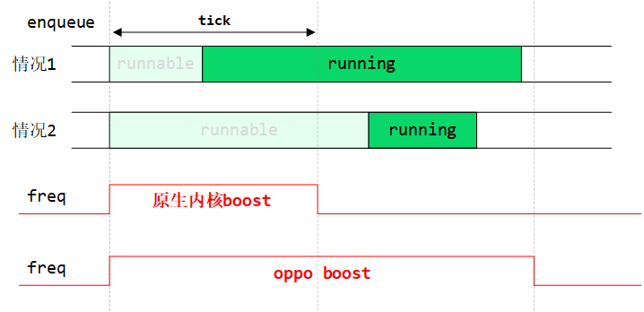
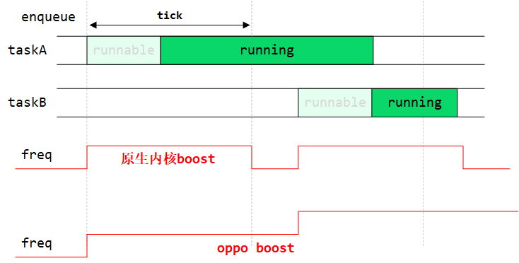
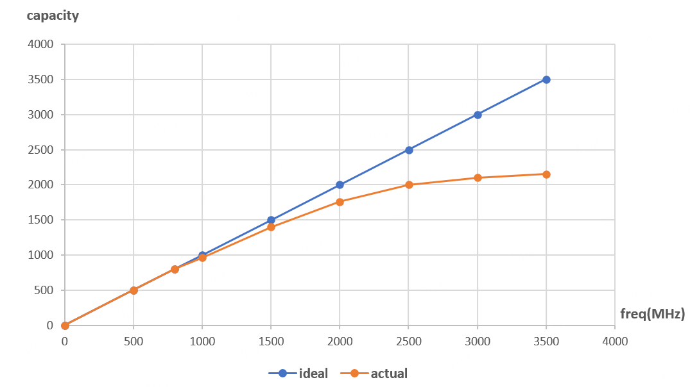
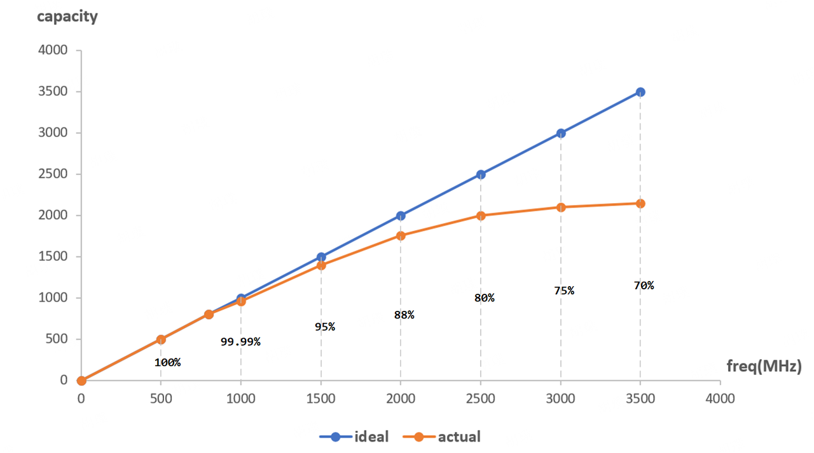
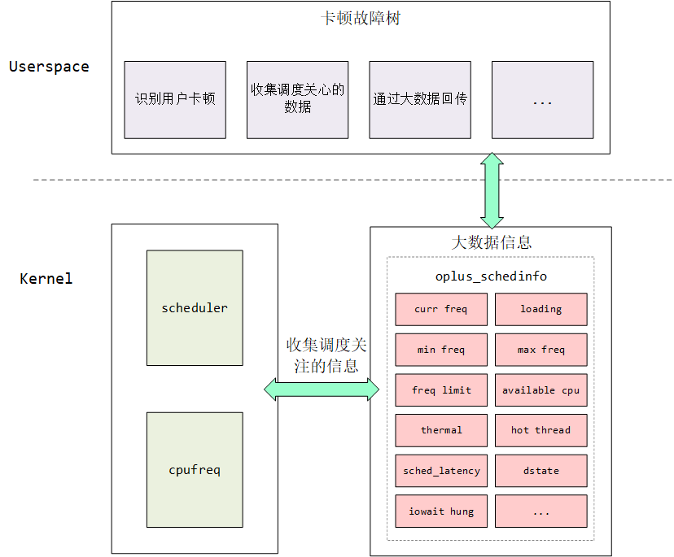

> **术语解析**
>
> User Aware，“用户感知”的意思，和OPPO的企业文化“用户导向”相关
>
>
>
> UAD : User Aware Design
>
> 一系列优化方案的集合，包括调频、调度、选核、内存、存储、IO、锁等优化
>
> &#x20;
>
> UAG : User Aware Governor
>
> 一个自定义的cpufreq governor，和调频相关
>
> &#x20;
>
> UAS : User Aware Scheduler
>
> 一系列调度优化方案的集合，包括关键任务的识别、标记和运行，关键任务的选核，负载均衡等方案
>
> &#x20;
>
> UAH : User Aware HAL
>
> 位于用户空间的HAL层设计，主要职责包括
>
> a) 提供通用接口给业务方使用
>
> b) 场景识别，例如点击、滑动、动画、冷启动、热启动等场景
>
> c) 标记当前帧率
>
> d) 标记帧起始和结束
>
> e) 配置文件解析
>
> f) 各个场景提频时长、提频阈值的维护
>
> g) 能效曲线维护

# 一、pick

目前，业界对调度器的优化主要集中在三个方向：任务选择（pick）、核的选择（选核）和频率调节（调频）。下图展示了OPPO在任务pick与选核方面的设计框图，关于频率调节的内容将在后续章节中单独介绍。

各方案描述如下：

| **方案**             | **紧急程度**  | **方案描述/必要性**                                                                                                                                                                                                                        | **传音**                            | **MTK** |
| ------------------ | --------- | ----------------------------------------------------------------------------------------------------------------------------------------------------------------------------------------------------------------------------------- | --------------------------------- | ------- |
| **vip调度**          | **必要且紧急** | vip线程忽略虚拟运行时间的影响，总能够被优先pick运行，确保关键线程能够得到快速响应，优先获取cpu资源。                                                                                                                                                                             | 有                                 | 无       |
| **抢占保护**           | **必要且紧急** | 对vip线程的抢占保护分下面两个维度：a) 确保关键线程在有效期内能够得到连续的运行，不会被频繁的打断；b) 关键线程在需要cpu资源时，能够立刻抢占cpu上正在运行的普通线程；                                                                                                                                           | 有                                 | 无       |
| **vip生效时长**        | **必要且紧急** | 防止出现部分关键线程因逻辑设计不合理，造成长时间霸占cpu的情况，需要对关键线程的生效时长加以控制，达到一定阈值后，vip属性失效。                                                                                                                                                                  | 有                                 | 无       |
| **组调度支持**          | **必要且紧急** | 在5.10之后的内核版本，谷歌强制启用了组调度特性，并且由于GKI的原因，手机厂商无法关闭该特性，这导致vip线程的优先运行在组调度背景下暴露出一些弊端，主要体现在下面两个方面：a) vip运行一段时间后影响同一个group中的其他非vip线程；b) vip属性被取消后，长时间获取不到资源的情况；                                                                               | 无，时间片问题可通过增加cpushare比重缓解，目前还没发现问题 | 无       |
| **binder优化**       | **必要且紧急** | vip/rt线程发起的binder通信，能够将vip属性传递给对端，确保对端线程能够及时获取到cpu资源，binder优化包括下面两个方面：a) binder传递vip属性；b) release buffer优化；                                                                                                                         | 有                                 | 无       |
| **锁优化**            | **必要且紧急** | vip线程在等锁期间，如果发现这把锁正在被一个普通的cfs线程持有，则将vip属性传递给该cfs线程，使持锁线程尽快获取到cpu运行，减小vip线程等锁的时间。锁优化包括下面三个维度：a) mutexb) futexc) rwsem                                                                                                                | futex不支持，另外两个支持                   | 无       |
| **io优化**           | 必要不紧急     | 识别和io读写相关的线程，并标记vip，尽快获取cpu资源，减少主进程卡io的时间                                                                                                                                                                                           | 无                                 | 无       |
| **webview识别**      | 必要不紧急     | 某些三方APP出图依赖于webview线程，和ui和render线程不同，webview线程需要单独识别出并打上vip标记                                                                                                                                                                       | 无                                 | 无       |
| **waker identify** | 必要不紧急     | 通过唤醒关系推测相关线程，并上报给用户空间关键线程的识别工作仅仅靠上面的binder通信、锁传递等方案是远远不够的，一些线程的依赖关系还隐含在线程之间的唤醒关系上，通过唤醒关系识别出有哪些线程和vip线程相关，并由业务方决定是否将其标记为ux，华为和OPPO都有类似机制：华为：render rtOPPO: waker identify                                                            | 无                                 | 无       |
| **vip线程管控**        | **必要且紧急** | vip线程泛滥会导致vip属性失效，特别是在高负载场景下，多个vip线程放到同一个cpu上会导致vip线程之间的相互等待，最终导致vip线程无法及时获取到cpu资源，因此需要对vip线程的数量加以管控。对vip线程的管控分下面两个维度a) vip线程数量管控对单个进程可设置vip线程的数量进行管控，避免后期出现vip线程太多导致vip失效的情况 b) 统一接口禁止通过proc接口标记ux，提供统一接口给业务方使用，所有标记ux接口操作必须由调度组评估 | 通过接入评估限制                          | 无       |
| **异常线程识别**         | 必要不紧急     | 那些在大核上长时间霸占cpu的非vip线程会被识别为异常线程，这类线程应该限制其cpu的使用，将算力强劲的cpu让出给真正需要的线程。同时满足下面条件将会被标记为异常线程a) 非vipb) 非自研应用c) 长时间运行，阈值100ms                                                                                                                | 调度组无相关策略，系统开发部可能会有，比如查杀/冻结之类的     | 无       |
| **RUS**            | **必要且紧急** | 通过RUS推送实现下面功能a) 动态控制各个feature的使能和关闭，可用于AB测试验证feature的收益，或紧急关闭存在bug的featureb) 实现某些参数或能效曲线的更新                                                                                                                                         | 通过云控实现                            | 无       |

## 1.1 vip调度

### 1.1.1 功能描述

vip线程忽略虚拟时间的影响，能够优先被调度运行

&#x20;

### 1.1.2 必要性

确保关键线程能够得到快速响应

&#x20;

### 1.1.3 现状

传音：有

MTK：无

&#x20;

### 1.1.4 紧急程度

必要且紧急

&#x20;

## 1.2 抢占保护

### 1.2.1 功能描述

确保关键线程运行的连续性，降低频繁上下文切换带来的开销，该功能包含下面两个维度

a) 禁止普通cfs线程抢占vip线程

b) vip及时抢占普通cfs线程

&#x20;

### 1.2.2 必要性

确保关键线程能够获得连续运行

&#x20;

### 1.2.3 现状

传音：无

MTK：无

&#x20;

### 1.2.4 紧急程度

必要且紧急

&#x20;

## 1.3 vip生效时长

### 1.3.1 功能描述

防止出现部分关键线程长时间霸占cpu的情况，需要对关键线程的生效时长加以控制，达到一定阈值后，vip属性失效。

&#x20;

### 1.3.2 必要性

防止因业务逻辑不合理，导致vip线程长时间霸占cpu的情况

&#x20;

### 1.3.3 现状

传音：无

MTK：无

&#x20;

### 1.3.4 紧急程度

必要且紧急

&#x20;

## 1.4 vip对组调度的影响

### 1.4.1 功能描述

在5.10之后的内核版本，谷歌强制启用了组调度特性，并且由于GKI的原因，手机厂商无法关闭该特性，这导致vip线程的优先运行在组调度背景下暴露出一些弊端，主要体现在下面两个方面：

a) vip运行一段时间后影响同一个group中的其他非vip线程

b) vip属性被取消后，长时间获取不到资源的情况

&#x20;

### 1.4.2 必要性

解决vip优先运行在组调度背景下的弊端

&#x20;

### 1.4.3 现状

传音：无

MTK：无

&#x20;

### 1.4.4 紧急程度

必要且紧急

&#x20;

## 1.5 binder优化

### 1.5.1 功能描述

vip/rt线程发起的binder通信，能够将vip属性传递给对端，确保对端线程能够及时获取到cpu资源，binder优化包括下面两个方面：

a) binder传递vip属性

b) release buffer优化

&#x20;

### 1.5.2 必要性

确保关键线程发起的binder通信能够及时获取到cpu资源

&#x20;

### 1.5.3 现状

传音：无

MTK：无

&#x20;

### 1.5.4 紧急程度

必要且紧急

&#x20;

## 1.6 锁优化

### 1.6.1 功能描述

vip线程在等锁期间，如果发现这把锁正在被一个普通的cfs线程持有，则将vip属性传递给该cfs线程，使持锁线程尽快获取到cpu运行，减小vip线程等锁的时间。锁优化包括下面三个维度：

a) mutex

b) futex

c) rwsem

&#x20;

### 1.6.2 必要性

减小vip线程等待锁的时间

&#x20;

### 1.6.3 现状

传音：无

MTK：无

&#x20;

### 1.6.4 紧急程度

必要且紧急

&#x20;

&#x20;

## 1.7 io优化

### 1.7.1 功能描述

识别和io读写相关的线程，并标记vip，尽快获取cpu资源，减少主进程卡io的时间

&#x20;

### 1.7.2 必要性

减少阻塞在io中的时间

&#x20;

### 1.7.3 现状

传音：无

MTK：无

&#x20;

### 1.7.4 紧急程度

必要且紧急

&#x20;

## 1.8 webview线程识别

### 1.8.1 功能描述

某些三方APP出图依赖于webview线程，和ui和render线程不同，webview线程需要单独识别出并打上vip标记

&#x20;

### 1.8.2 必要性

确保webview线程能够及时获取到cpu资源

&#x20;

### 1.8.3 现状

传音：无

MTK：无

&#x20;

### 1.8.4 紧急程度

必要且紧急

&#x20;

&#x20;

## 1.9 waker identify

通过唤醒关系推测相关线程，并上报给用户空间

### 1.9.1 功能描述

关键线程的识别工作仅仅靠上面的binder通信、锁传递方案是远远不够的，一些线程的依赖关系还隐含在线程之间的唤醒关系上，通过唤醒关系识别出有哪些线程和vip线程相关，并由业务方决定是否将其标记为ux，华为和OPPO都有类似机制：

华为：render rt

OPPO: waker identify

&#x20;

### 1.9.2 必要性

通过唤醒关系识别关键线程，并上报给用户空间

&#x20;

### 1.9.3 现状

传音：无

MTK：无

&#x20;

### 1.9.4 紧急程度

必要且紧急

&#x20;&#x20;

## 1.10 vip线程管控

### 1.10.1 功能描述

vip线程泛滥会导致vip属性失效，特别是在高负载场景下，多个vip线程放到同一个cpu上会导致vip线程之间的相互等待，最终导致vip线程无法及时获取到cpu资源，因此需要对vip线程的数量加以管控。对vip线程的管控分下面两个维度

a) vip线程管控

对单个进程可设置vip线程的数量进行管控，避免后期出现vip线程太多导致vip失效的情况

&#x20;

b) 统一接口

禁止通过proc接口标记ux，提供统一接口给业务方使用，所有标记ux接口操作必须由调度组评估

&#x20;

### 1.10.2 必要性

防止vip线程泛滥，最终导致vip机制失效

&#x20;

### 1.10.3 现状

传音：无

MTK：无

&#x20;

### 1.10.4 紧急程度

必要且紧急

&#x20;

## 1.11 异常线程识别

### 1.11.1 功能描述

那些在大核上长时间霸占cpu的非vip线程会被识别为异常线程，这类线程应该限制其cpu的使用，将算力强劲的cpu让出给真正需要的线程

&#x20;

同时满足下面条件将会被标记为异常线程

a) 非vip

b) 非自研应用

c) 长时间运行，阈值100ms

&#x20;

### 1.11.2 必要性

为了防止异常线程长时间占用大核资源，应将大核资源释放出来，分配给真正需要的线程使用。

&#x20;

### 1.11.3 现状

传音：无

MTK：无

&#x20;

### 1.11.4 紧急程度

必要且紧急

# 二、选核

vip选核的设计框图在上一章节已经介绍过，本章介绍各个部分的功能

| **方案**          | **紧急程度**  | **方案描述/必要性**                                                                                                                                                                                                                                                                                                                                                                                                                                                                                                                                                                                                                                                                                                                                                                        | **传音** | **MTK** |
| --------------- | --------- | ----------------------------------------------------------------------------------------------------------------------------------------------------------------------------------------------------------------------------------------------------------------------------------------------------------------------------------------------------------------------------------------------------------------------------------------------------------------------------------------------------------------------------------------------------------------------------------------------------------------------------------------------------------------------------------------------------------------------------------------------------------------------------------- | ------ | ------- |
| **场景识别**        | **必要且紧急** | vip线程在下面场景需要对选核做特调，优先保证vip线程能够获取到更强劲的cpu资源，压缩线程的运行时间。业务方通过UAH导出的接口将场景传递到内核。a) GPU合成场景b) 动画场景c) APP冷启动d) APP热启动e) 点击f) 滑动 注意：只在固定的几个场景下才积极的将vip线程放到大核上运行，降低对功耗的影响。                                                                                                                                                                                                                                                                                                                                                                                                                                                                                                                                                                                                                   | 无      | 无       |
| **vip/rt选核**    | **必要且紧急** | 该功能包含下面两个方面，确保vip和rt线程在唤醒时(指定场景下)能够获取到强劲的cpua) vip线程选核(fork, wakeup)b) rt线程选核(fork,   wakeup)                                                                                                                                                                                                                                                                                                                                                                                                                                                                                                                                                                                                                                                                                       | 无      | 无       |
| **选核互斥**        | **必要且紧急** | 避免将多个关键线程放到同一个cpu上，最终导致资源竞争的情况，需要对下面几种情况做互斥a) vip与vipb) vip与rtc) rt与rt                                                                                                                                                                                                                                                                                                                                                                                                                                                                                                                                                                                                                                                                                                              | 无      | 无       |
| **round robin** | **必要且紧急** | 同一个cluster内部使用round robin的方式进行选核，实现cluster内部的均衡                                                                                                                                                                                                                                                                                                                                                                                                                                                                                                                                                                                                                                                                                                                                     | 无      | 无       |
| **异常线程处理**      | **必要且紧急** | 对那些非vip并且长时间霸占大核的线程标记为异常线程，需要限制异常线程使用大核资源，尽快将大核释放给需要的线程。                                                                                                                                                                                                                                                                                                                                                                                                                                                                                                                                                                                                                                                                                                                            | 无      | 无       |
| **Loadbalance** | **必要且紧急** | 原生内核在设计调度器时通常更关注系统的整体吞吐量和性能，而较少考虑用户交互设备的实时响应性。这种设计上的先天不足导致了一些问题且无法在选核时就规避，典型的问题如下：a) 关键任务被调度到算力较弱的cpu上：这可能导致关键任务长时间运行，从而影响其实时响应能力。b) 关键任务被调度到深睡眠的cpu上：由于cpu从深睡眠状态中恢复需要较长时间，导致关键任务无法及时获取到cpu资源。c) 多个关键任务被调度到同一个cpu上：这可能引发资源相互抢占的情况，进一步降低响应速度和用户体验。d) 关键任务被调度到关闭抢占的cpu上：即使关键任务属于rt调度类，也无法及时获取cpu资源，最终可能导致用户界面的丢帧或音频卡顿。 为了减轻这些问题带来的影响，需要在事件发生但尚未导致性能恶化之前，及时将关键任务迁移到可用或计算能力更强的cpu上。为此，OPPO设计了基于任务调度延迟的Loadbalance方案，该方案包含下面10个子方案1. tick balance for running ux task2. tick balance for runnable ux task3. newidle balance for runnable ux task4. tick balance for running rt task5. tick balance for runnable rt task6. newidle balance for running rt task7. newidle balance for runnable rt task8. tick pull for running ux task 9. tick pull for runnable ux task 10. yield balance | 无      | 无       |

## 2.1 场景识别

### 2.1.1 功能描述

vip线程在下面场景需要对选核做特调，优先保证vip线程能够获取到更强劲的cpu资源，压缩线程的运行时间。业务方通过UAH导出的接口将场景传递到内核。

a) GPU合成场景

b) 动画场景

c) APP冷启动

d) APP热启动

e) 点击

f) 滑动

&#x20;

注意：只在固定的几个场景下才积极的将vip线程放到大核上运行，降低对功耗的影响。

&#x20;

### 2.1.2 必要性

在特定场景下优先保证关键线程获取强劲的cpu资源，压缩运行时间。

&#x20;

### 2.1.3 现状

传音：无

MTK：无

&#x20;

### 2.1.4 紧急程度

必要且紧急

&#x20;

## 2.2 vip线程选核

### 2.2.1 功能描述

该功能包含下面两个方面，确保vip和rt线程在唤醒时(指定场景下)能够获取到强劲的cpu

a) vip线程选核(fork, wakeup)

b) rt线程选核(fork, wakeup)

&#x20;

### 2.2.2 必要性

确保关键线程能够获取到更强劲的cpu

&#x20;

### 2.2.3 现状

传音：无

MTK：无

&#x20;

### 2.2.4 紧急程度

必要且紧急

&#x20;

## 2.3 选核互斥

### 2.3.1 功能描述

为了避免将多个关键线程放到同一个cpu上，最终导致资源竞争的情况，需要对下面几种情况做互斥

a) vip与vip

b) vip与rt

c) rt与rt

&#x20;

### 2.3.2 必要性

避免将关键线程放到同一个cpu上产生资源竞争的情况

&#x20;

### 2.3.3 现状

传音：无

MTK：无

&#x20;

### 2.3.4 紧急程度

必要且紧急

&#x20;

## 2.4 round robin

### 2.4.1 功能描述

同一个cluster内部使用round robin的方式进行选核，实现cluster内部的均衡

&#x20;

### 2.4.2 必要性

避免在cluster内部出现负载不均衡的情况

&#x20;

### 2.4.3 现状

传音：无

MTK：无

&#x20;

### 2.4.4 紧急程度

必要且紧急

&#x20;

## 2.5 异常线程处理

### 2.5.1 功能描述

对那些非vip并且长时间霸占大核的线程标记为异常线程，需要限制异常线程使用大核资源，尽快将大核释放给需要的线程。

&#x20;

### 2.5.2 必要性

防止出现异常线程的长时间霸占cpu资源的情况

&#x20;

### 2.5.3 现状

传音：无

MTK：无

&#x20;

### 2.5.4 紧急程度

必要且紧急

&#x20;

## 2.6 loadbalance

### 2.6.1 功能描述

原生内核在设计调度器时通常更关注系统的整体吞吐量和性能，而较少考虑用户交互设备的实时响应性。这种设计上的先天不足导致了一些问题无法在选核时就规避，典型的问题如下：

a) 关键任务被调度到算力较弱的cpu上：

这可能导致关键任务长时间运行，从而影响其实时响应能力。

&#x20;

b) 关键任务被调度到深睡眠的cpu上：

由于cpu从深睡眠状态中恢复需要较长时间，导致关键任务无法及时获取到cpu资源。

&#x20;

c) 多个关键任务被调度到同一个cpu上：

这可能引发资源相互抢占的情况，进一步降低响应速度和用户体验。

&#x20;

d) 关键任务被调度到关闭抢占的cpu上：

即使关键任务属于rt调度类，也无法及时获取cpu资源，最终可能导致用户界面的丢帧或音频卡顿。

&#x20;

为了减轻这些问题带来的影响，需要在事件发生但尚未导致性能恶化之前，及时将关键任务迁移到可用或计算能力更强的cpu上。

&#x20;

Loadbalance方案包含下面10个子方案

1. tick balance for running ux task

2. tick balance for runnable ux task

3. newidle balance for runnable ux task

4. tick balance for running rt task

5. tick balance for runnable rt task

6. newidle balance for running rt task

7. newidle balance for runnable rt task

8. tick pull for running ux task&#x20;

9. tick pull for runnable ux task&#x20;

10. yield balance

&#x20;

### 2.6.2 必要性

弥补原生调度器的先天不足，减少关键线程的调度延迟，确保关键线程能够及时的获取到cpu资源

&#x20;

### 2.6.3 现状

传音：无

MTK：无

&#x20;

### 2.6.4 紧急程度

必要且紧急

# 三、调频

调频系统整体设计框架如下

当前UAG和frameboost框架的搭建对于我司是必要且紧急的任务，其他方案可以作为锦上添花的功能，逐步增加。&#x20;

| **方案**                | **紧急程度**  | **方案描述/必要性**                                                                                                                                                                                                                                                                                                                                                                                                                                                               | **传音** | **MTK** |
| --------------------- | --------- | -------------------------------------------------------------------------------------------------------------------------------------------------------------------------------------------------------------------------------------------------------------------------------------------------------------------------------------------------------------------------------------------------------------------------------------------------------------------------- | ------ | ------- |
| **UAH**               | 必要不紧急     | user aware HAL&#xA;&#xA;UAH的职责包括如下几个方面：&#xA;a) 提供通用接口给业务方使用&#xA;b) 场景识别，例如点击、滑动、动画、冷启动、热启动等场景&#xA;c) 标记当前帧率&#xA;d) 标记帧起始和结束&#xA;e) 配置文件解析&#xA;f) 各个场景提频时长、提频阈值的维护&#xA;g) 能效曲线维护&#xA;&#xA;UAH的必要性包括：&#xA;a) 策略上移，简化内核实现：&#xA;内核代码大部分均为热路径，复杂的业务逻辑不适合放到内核中，内核代码应该保持简单、整洁、高效，策略上移有助于提高系统的整体性能。&#xA;b) 灵活可配置：&#xA;各个方案的使能和参数，均可通过json文件进行配置和调整，甚至可以通过RUS推送配置文件，灵活性高&#xA;c) 安全性和稳定性：&#xA;策略性的代码比机制性的代码更加复杂，可能包含更多的bug和漏洞，如果放到内核空间实现，任何错误都可能导致系统崩溃&#xA;d) 商业目的：&#xA;不用遵循GPL，不用开源 | 无      | 无       |
| **UAG**               | **必要且紧急** | user aware governor&#xA;&#xA;a) 绕过GKI限制&#xA;b) 屏蔽平台差异&#xA;c) 方便定制和扩展                                                                                                                                                                                                                                                                                                                                                                                                       | 无      | 无       |
| **frameboost**        | **必要且紧急** | 聚合调频，将具有相互依赖关系的线程添加到一个group中，并将他们的util聚合为group util，最后使用聚合后的group util指引调频和选核。                                                                                                                                                                                                                                                                                                                                                                                             | 无      | 无       |
| **ed task**           | 必要不紧急     | 优化高负载场景下调度周期长而造成某些任务长时间runnable的情况，在调频时机，如果发现cpu的runqueue中存在长时间runnable的ed task线程，则将频率拉高，通过提高频率，压缩调度周期。                                                                                                                                                                                                                                                                                                                                                                    | 无      | 无       |
| **iowait**            | 必要不紧急     | 当iowait线程被唤醒并加入队列时，系统将立即提升频率，相比于原生内核的boost策略，OPPO的方案提供了更长的boost窗口，这将在以下三种场景中带来显著优化：&#xA;a) 在高负载场景下，iowait线程的调度延迟较长；&#xA;b) iowait线程本身的负载较高；&#xA;c) iowait密集型场景。                                                                                                                                                                                                                                                                                                            | 无      | 无       |
| **AMU aware**         | 必要不紧急     | 从AMU中获取当前cpu的频率和停顿（stall）次数，从而获得实际的能效比曲线，在调频时能够将因cpu停顿而损失的算力考虑在内，从而选择一个最合适的频率点。                                                                                                                                                                                                                                                                                                                                                                                            | 无      | 无       |
| **非线性调频**             | 必要不紧急     | 系统维护着一个预先定义的“能效比-频点”键值表，记录各个频点下的能效比。该键值表可以通过UAH导出的接口进行动态更新。在调频时，系统从该键值表中查找相应频点的能效比，并考虑能效比的损失，最终选择一个满足当前util值的最佳频点。                                                                                                                                                                                                                                                                                                                                                         | 无      | 无       |
| **input/touch boost** | 必要不紧急     | 用户空间通过UAH层的接口下发点击和滑动事件，内核在调频时会根据点击和滑动场景对util值进行相应调整，从而实现boost的目的。                                                                                                                                                                                                                                                                                                                                                                                                          | 无      | 无       |
| **cobuck**            | 不紧急       | 硬件设计相关，处理两个cluster共buck的情况，防止对一个cluster调频后影响另一个cluster的频率                                                                                                                                                                                                                                                                                                                                                                                                                  | 无      | 无       |
| **OMRG**              | 不紧急       | Oplus Multiple Rail Group&#xA;硬件设计相关，多轨电源，不同的模块（例如CPU和GPU）独立供电，导致存在频率上的依赖，如果频率不匹配或者不协调，就会导致性能下降。例如，如果CPU频率上升，但GPU频率没有相应上升，可能导致CPU处理完数据后，GPU处理不过来，出现瓶颈，导致帧率下降，游戏卡顿。反之，若GPU频率上升，处理完大量图形数据后，CPU没有及时跟上处理速度，也会导致类似的问题。&#xA;&#xA;为了避免这种频率依赖性问题，需要一种机制来协调不同电源轨道上的设备频率，使它们能够协同工作，这就是OMRG模块的作用。它能够实时监控CPU和GPU的负载情况，合理调节它们的频率和电压，当CPU频率升高时，相应地提高GPU频率，反之亦然，确保两者工作频率匹配，避免瓶颈。                                                                                                          | 无      | 无       |

## 3.1 uah(user aware HAL)

### 3.1.1 功能描述

UAH的职责包括如下几个方面：

a) 提供通用接口给业务方使用

b) 场景识别，例如点击、滑动、动画、冷启动、热启动等场景

c) 标记当前帧率

d) 标记帧起始和结束

e) 配置文件解析

f) 各个场景提频时长、提频阈值的维护

g) 能效曲线维护

&#x20;

### 3.1.2 必要性

UAH的必要性体现在下面几个方面：

a) 策略上移，简化内核实现：

内核代码大部分均为热路径，复杂的业务逻辑不适合放到内核中，内核代码应该保持简单、整洁、高效，策略上移有助于提高系统的整体性能。

b) 灵活可配置：

各个方案的使能和参数，均可通过json文件进行配置和调整，甚至可以通过RUS推送配置文件，灵活性高

c) 安全性和稳定性：

策略性的代码比机制性的代码更加复杂，可能包含更多的bug和漏洞，如果放到内核空间实现，任何错误都可能导致系统崩溃

d) 商业目的：

不用遵循GPL，不用开源

&#x20;

### 3.1.3 现状

传音：无

MTK：无

&#x20;

### 3.1.4 紧急程度

必要不紧急

&#x20;

## 3.2 uag(user aware governor)

### 3.2.1 功能描述

一个自定义的调频governor，作为安卓原生的schedutil或MTK的sched\_ext的替代方案，可扩展性强，是后面所有子方案实现的基石。

&#x20;

### 3.2.2 必要性

虽然UAG governor提供的功能与schedutil或sched\_ext相似，但UAG具有以下几个独特优势：

a) 绕过GKI限制

使用原生的schedutil governor由于受GKI的限制，新功能的开发只能基于Google提供的有限几个hook，扩展性较弱。而UAG governor允许在任何位置添加自定义代码，无需考虑GKI的限制，这是下面所有调频子方案得以实现的基石。

&#x20;

b) 屏蔽平台差异

虽然基于MTK的sched\_ext也能绕过GKI实现功能定制，但难以做到平台兼容。不同平台使用的governor不同，同一个功能在MTK上实现后，在展锐平台上需要重新实现，增加了维护难度。UAG governor则可以屏蔽这些平台差异。

&#x20;

c) 方便定制和扩展

使用UAG governor，不仅可以绕过GKI实现任意功能定制，还能屏蔽平台差异。基于UAG开发的新方案可以无缝移植到MTK或展锐平台，扩展性极强。

&#x20;

### 3.2.3 现状

传音：无

MTK：无

&#x20;

### 3.2.4 紧急程度

**必要且紧急**

&#x20;

## 3.3 frameboost

### 3.3.1 功能描述

基于华为RTG(Related Thread Group)方案，将具有相互依赖关系的线程添加到一个group中，并将他们的util聚合为group util，最后使用聚合后的group util指引调频和选核。

如下图所示，thread1和thread2具有相互依赖关系：thread1执行一段时间后唤醒thread2，然后自己进入睡眠状态，同样地，thread2运行一段时间后唤醒thread1后进入睡眠，如此反复循环。假设thread1和thread2分别运行在不同的cpu上，并且每次运行的时长相等，则在这种情况下，cpuA和cpuB的利用率均为50%，还没有达到提频的阈值（假设阈值为80%），最终导致频率提不起来。

尽管这两个线程运行在不同的cpu上，但是我们可以将他们的util聚合起来得到group util（实际上就是假设他们是运行在同一个cpu上，将他们的util累加起来得到group util），这样得到的group util值为100%，再使用group util去调频就能够获得较高的频率。

上述示例中的线程关系类似于Android平台中的UI线程和Render线程。如果能够将UI线程和Render线程的util聚合起来进行频率调节，就能获得更大的util，从而及时提升频率，并将频率提升到较高水平。

你可能会有这样的疑问：何必如此复杂，直接将thread1和thread2在选择核时安排到同一个cpu上不就可以了？实际上，这么做是为了避免将两个关键线程放在同一个cpu上，最终导致相互等待的情况，因此，关键线程在选择核时通常需要进行互斥，将它们均衡分配到不同的cpu上。

上述只是一个简单的例子，用来说明系统中的线程并非孤立存在，它们之间存在各种依赖关系，无论是从调度的角度还是频率调节的角度来看，这种依赖关系都不应该被忽视。然而，目前的CFS（调度器却忽略了这种关联性，这便是RTG产生的背景。

&#x20;

### 3.3.2 必要性

XXX的必要性体现在下面几个方面：

&#x20;

### 3.3.3 现状

传音：无

MTK：无

&#x20;

### 3.3.4 紧急程度

frameboost调频框架：必要且紧急

通过UAH设置margin：必要不紧急

&#x20;

## 3.4 ed task(early detection task)

### 3.4.1 功能描述

ed task最初由华为实现，为了优化高负载场景下调度周期长而造成某些任务长时间runnable的情况，在调频时机，如果发现cpu的runqueue中存在长时间runnable的ed task线程，则将频率拉高，通过提高频率，压缩调度周期。

&#x20;

### 3.4.2 必要性

ed task的必要性体现在：

a) 高负载场景下压缩调度周期，减少任务runnable时间，降低高负载场景下ANR的概率

&#x20;

注意：ed task是一个优化方案，而非解决方案，可降低问题复现概率，而不是完全解决问题。

&#x20;

### 3.4.3 现状

传音：无

MTK：无

&#x20;

### 3.4.4 紧急程度

必要不紧急

&#x20;

## 3.5 iowait boost

### 3.5.1 功能描述

当iowait的线程刚被唤醒并enqueue进队列时，将频率拉起来。

&#x20;

### 3.5.2 必要性

原生内核也有类似的boost操作，OPPO的iowait boost方案和原生内核相比具有以下优势：

&#x20;

a) 原生内核boost窗口太短，可能会存在下面两个问题

&#x20;i.如果iowait线程本身负载较高，则在一个boost窗口内无法完成所有的工作；

ii.在高负载场景下，iowait线程在boost窗口内可能还没有获取到cpu资源；

b) 更大的boost窗口，对于密集型的iowait操作，可以boost到更高的频率

### 3.5.3 现状

传音：无

MTK：无

&#x20;

### 3.5.4 紧急程度

必要不紧急

&#x20;

## 3.6 AMU aware

### 3.6.1 功能描述

cpu的能效比和频率之间并非线性关系，这主要是由于高速cpu与低速外设或内存之间的不协调所致。高速运行的cpu经常需要停下来（stall）以读取外设或内存中的数据，这种停顿会影响整体性能。随着cpu频率的提高，这种失速现象会更加显著，导致cpu停顿的次数也会增加。因此，cpu频率的提升并不能直接转化为等比例的算力提升，实际的能效比曲线如下图所示。

AMU aware功能的作用是实时从AMU（Activity Monitors Unit）单元中获取当前cpu的频率和停顿（stall）次数，从而获得实际的能效比曲线。在调整频率时，该功能能够将因cpu停顿而损失的算力考虑在内，从而选择一个最合适的频率点。

### 3.6.2 必要性

考虑cpu stall的损失，根据能效比曲线进行调频，获取适合当前util的频点

&#x20;

### 3.6.3 现状

传音：无

MTK：无

&#x20;

### 3.6.4 紧急程度

必要不紧急

&#x20;

## 3.7 非线性调频

### 3.7.1 功能描述

系统维护着一个预先定义的“能效比-频点”键值表，记录各个频点下的能效比。该键值表可以通过UAH导出的接口进行动态更新。在调频时，系统从该键值表中查找相应频点的能效比，并考虑能效比的损失，最终选择一个满足当前util值的最佳频点。

### 3.7.2 必要性

考虑能效比调频

&#x20;

### 3.7.3 现状

传音：无

MTK：无

&#x20;

### 3.7.4 紧急程度

必要不紧急

&#x20;

## 3.8 input/touch boost

### 3.8.1 功能描述

用户空间通过UAH层的接口下发点击和滑动事件，内核在调频时会根据点击和滑动场景对util值进行相应调整，从而实现boost的目的。

&#x20;

### 3.8.2 必要性

点击滑动场景实现调频

&#x20;

### 3.8.3 现状

传音：无

MTK：无

&#x20;

### 3.8.4 紧急程度

必要不紧急

&#x20;

## 3.9 cobuck

### 3.9.1 功能描述

Buck指的是Buck Converter（降压转换器），是一种DC-DC电压转换器，其主要功能是将较高的输入电压转换为较低的输出电压。Buck转换器广泛应用于电源管理系统中，尤其适用于将高电压降至适合cpu的低电压的场合。前缀“co”表示共同或共用，co-buck表示存在两个cluster共用一个buck。在这种情况下，对一个cluster进行调频就会影响到另一个cluster。

cobuck就是为了解决这一问题，对一个cluster的调频对另一个cluster的频率影响最小，cobuck的工作原理如下：系统中为每个cluster维护一个“频点-电压值”的键值表。在对某个cluster进行调频时，要求选出的频率既能满足性能需求，又能对共用buck的另一个cluster的电压影响最小。

&#x20;

### 3.9.2 必要性

在cobuck的情况下，对一个cluster进行调频时，尽量将对另一个cluster的影响降至最低。

&#x20;

### 3.9.3 现状

传音：无

MTK：无

&#x20;

### 3.9.4 紧急程度

芯片硬件设计相关，不紧急

&#x20;

&#x20;

## 3.10 OMRG(Oplus Multiple Rail Group)

### 3.10.1 功能描述

XXX的职责包括如下几个方面：

&#x20;

### 3.10.2 必要性

XXX的必要性体现在下面几个方面：

&#x20;

### 3.10.3 现状

传音：无

MTK：无

&#x20;

### 3.10.4 紧急程度

芯片硬件设计相关，不紧急

# 四、大数据

大数据设计框架如下：位于内核空间的 oplus\_schedinfo 模块以窗口为单位持续收集调度相关的数据。当用户空间的卡顿故障树模块检测到用户卡顿时，会通过导出到用户空间的节点读取这些数据，并通过大数据系统透传回来，以便后续进行卡顿原因分析。

| **方案**               | **紧急程度** | **方案描述/必要性**                                                                                              | **传音** | **MTK** |
| -------------------- | -------- | --------------------------------------------------------------------------------------------------------- | ------ | ------- |
| **卡顿故障树**            | 必要不紧急    | 卡顿故障树要完成的工作包括：a) 识别用户层的卡顿b) 通过oplus\_schedinfo导出到用户空间的节点，读取调度关心的信息c) 将上面信息通过大数据透传回来                       | 无      | 无       |
| **oplus\_schedinfo** | 必要不紧急    | 以窗口为单位持续收集调度相关的数据，包括：a) 当前cpu频率b) cpu的限频信息c) 温度信息，排除是否触发温控限频d) 可用的cpu，排除是否存在关核e) 关键任务的调度延迟f) 热线程g) 卡D状态时间 | 无      | 无       |

# 五、debug

根据以往的经验，开发人员约有60%的精力耗费在各种群中进行无意义的“扯皮”和澄清工作，因此，在trace中预留关键的调试信息在项目交付过程至关重要。关键的调试信息应包括以下几个方面：

| **方案**         | **紧急程度**  | **方案描述/必要性**                                                                                                        | **传音** | **MTK** |
| -------------- | --------- | ------------------------------------------------------------------------------------------------------------------- | ------ | ------- |
| **设置/取消标识**    | **必要且紧急** | 所有设置、取消vip的操作均需要在trace上体现                                                                                           | 无      | 无       |
| **pid字段扩展**    | **必要且紧急** | 对trace中的pid字段进行扩展，记录线程所在group，cpumask等详细                                                                            | 无      | 无       |
| **场景标记**       | **必要且紧急** | 所有场景需要在trace上体现                                                                                                     | 无      | 无       |
| **debug信息**    | 必要不紧急     | debug信息包括下面两部分：a) 各个子方案用于debug的trace信息，默认不打开，使用宏开关控制b) 用于定位性能问题的trace信息，user版本不打开，userdebug和user root版本通过proc下的开关控制 | 无      | 无       |
| **Task track** | 必要不紧急     | 跟踪指定线程的running/runnable时间，方便后期问题定位和feature收益验证                                                                      | 无      | 无       |

# 六、稳定性

一些稳定性问题在实验室中可能无法复现，但一旦版本发布到市场，随着样本量的增加，这些小概率事件也会变得频繁，甚至成为必现问题。因此，为了能够在实验室中复现出这些小概率的稳定性问题，可以采取以下措施：

| **方案**            | **紧急程度** | **方案描述/必要性**                                                                                                                              | **传音** | **MTK** |
| ----------------- | -------- | ----------------------------------------------------------------------------------------------------------------------------------------- | ------ | ------- |
| **feature触发频率控制** | 必要不紧急    | feature的触发频率可以通过用户空间的节点进行控制，必要时还可以更改代码的执行逻辑。例如，某个功能在正常情况下每10毫秒触发一次，在进行稳定性测试时，可以通过用户空间的节点将其设置为每1毫秒触发一次。通过这种方式控制功能的触发频率，以便在实验室中复现低概率的稳定性问题。 | 无      | 无       |
| **提前预警**          | 必要不紧急    | 在user root和userdebug版本上使用WARN\_ON和BUG\_ON，提前发现问题，保留第一现场                                                                                   | 无      | 无       |
|                   |          |                                                                                                                                           |        |         |
|                   |          |                                                                                                                                           |        |         |
|                   |          |                                                                                                                                           |        |         |

# 七、收益验证

怎样验证一条修改是有正向收益的？

| **方案**        | **紧急程度** | **方案描述/必要性** | **传音** | **MTK** |
| ------------- | -------- | ------------ | ------ | ------- |
| **benchmark** | 必要不紧急    | 收益验证         | 无      | 无       |
|               |          |              |        |         |
|               |          |              |        |         |
|               |          |              |        |         |
|               |          |              |        |         |

# 八、未来规划

友商未来的规划方向：

| **方案**                 | **方案描述**                                                                                                                                                                                                                                                                                                                                                                                                                                                                                                                                                                                                                                                                                                                                                                                                                                                                                                                      |
| ---------------------- | ----------------------------------------------------------------------------------------------------------------------------------------------------------------------------------------------------------------------------------------------------------------------------------------------------------------------------------------------------------------------------------------------------------------------------------------------------------------------------------------------------------------------------------------------------------------------------------------------------------------------------------------------------------------------------------------------------------------------------------------------------------------------------------------------------------------------------------------------------------------------------------------------------------------------------- |
| **基于sched\_ext的全新调度器** | 社区已将sched\_ext的合入工作提上日程，sched\_ext又称为外部可扩展调度器，允许在用户态实现调度策略，从而提供更高的定制化和适应性。结合sched\_ext和eBPF，可以实现更加灵活和高效的调度策略，这也是当前国内外调度领域的优化新方向。目前，几乎所有国内手机厂商都在这一领域投入了人力资源。                                                                                                                                                                                                                                                                                                                                                                                                                                                                                                                                                                                                                                                                                                                                                                   |
| **global runqueue调研**  | 实际上当下针对调度器的优化（优先运行和选核）存在下面两个问题：a) 所谓的优先运行只是局部的优先，仅仅能保证在这个cpu的runqueue上优先，而无法保证全局的优先；b) 选核又会因为竞态而导致互斥失败，最终导致两个关键线程被放到同一个cpu上。 造成上面两个问题的根本原因是percpu runqueue造成的，如果我们能够维护一个全局的global runqueue，这样不管是原生cfs的公平性还是vip的优先运行，都是全局维度的；而且在判断哪个cpu是否可用的时候，只需要对正在running的线程进行判断，而不需要关注runqueue中处于runnable状态的线程。另一方面，global runqueue从根本上解决了两个vip线程因为同时选核选到同一个cpu上的问题。  Percpu Runqueue:优点：降低锁竞争：每个CPU都有自己的runqueue和rq->lock，这样可以减少多个CPU同时访问全局运行队列时的锁竞争；减少Cache竞争：每个CPU都有自己的runqueue，可以减少不同CPU之间对共享缓存的争用，提高缓存命中率，减少缓存失效的次数，进一步提高性能；灵活的负载均衡：由于每个CPU都有自己的runqueue，负载均衡可以更精确地选择要迁移的任务，快速的完成任务迁移； 缺点：局部的公平和优先：公平和优先只是在这个cpu上的公平和优先，而非全局的公平和优先可能会造成选核竞争问题：两个ux线程同时选核，选到同一个cpu上 Global Runqueue:优点：更加公平：全局运行队列可以更公平地分配CPU时间片给所有的任务，而不会因为某些CPU的负载不均衡而导致任务调度的不公平性。选核时不会产生竞争 缺点：锁竞争激烈：全局运行队列需要使用锁来保护对运行队列的并发访问，因此在多个CPU同时访问运行队列时，可能会出现较高的锁竞争而对性能产生负面影响。缓存争用：由于所有的任务都存储在同一个运行队列中，不同CPU之间可能会对共享缓存进行争用，导致缓存失效增加，进而影响性能。PS：可以先调用global ruqnueue在vip调度中的应用 |
| **kworker优化**          | 由于GKI限制，我们无法将VIP调度方案应用到kworker上。这是因为我们无法识别哪些kworker当前在处理“至关重要”的工作，即无法对kworker打上vip标记，从而无法实现优先调度或在选核上的倾斜。如何识别出哪些kworker是关键线程至关重要。目前所有厂商在这一问题上都没有好的解决方案，本人认为可以调研一下waker identify对kworker的识别的可行性。                                                                                                                                                                                                                                                                                                                                                                                                                                                                                                                                                                                                                                                                                                                                |
| **frame work识别整条出图链路** |                                                                                                                                                                                                                                                                                                                                                                                                                                                                                                                                                                                                                                                                                                                                                                                                                                                                                                                               |
| **multi rtg聚合调频**      |                                                                                                                                                                                                                                                                                                                                                                                                                                                                                                                                                                                                                                                                                                                                                                                                                                                                                                                               |
| **非抢占式内核**             |                                                                                                                                                                                                                                                                                                                                                                                                                                                                                                                                                                                                                                                                                                                                                                                                                                                                                                                               |

