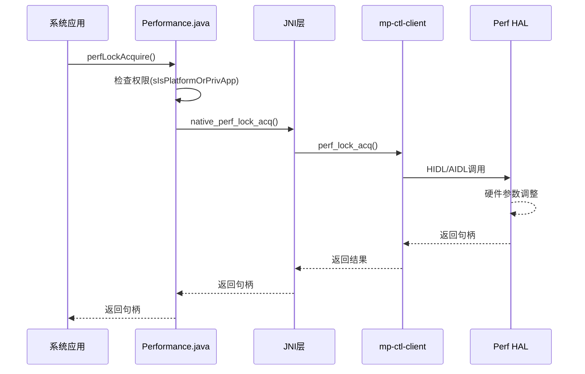
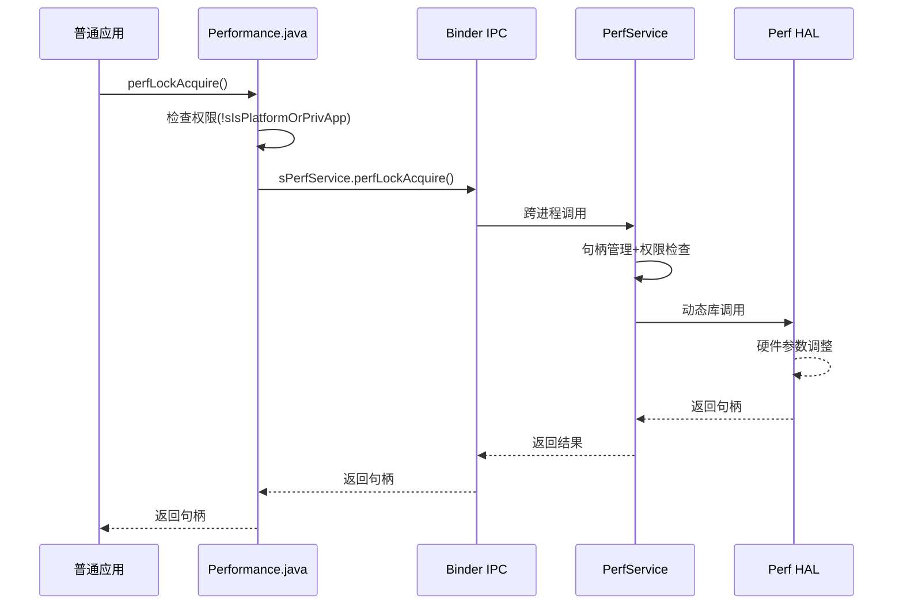
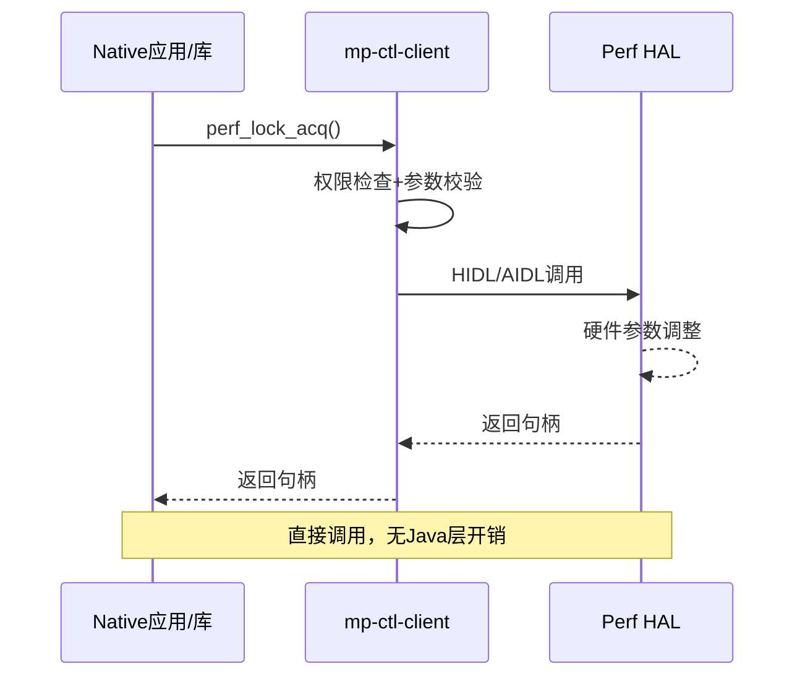

# Perf-Core性能优化框架详解

## 1. 什么是Perf-Core框架

### 1.1 框架定位

Perf-Core是X平台专门为Android系统设计的**系统级性能优化框架**，它的核心目标是：

- **动态调节系统性能**：根据应用需求实时调整CPU、GPU、内存等硬件参数
- **提升用户体验**：在关键场景下保证流畅度，如应用启动、滑动、游戏等
- **智能功耗管理**：在性能和功耗之间找到最佳平衡点

### 1.2 解决的核心问题

**传统问题**：

```
用户体验差 ← 性能不足 ← 硬件资源调度不合理
功耗过高 ← 性能过剩 ← 缺乏智能调节机制
```

**Perf-Core解决方案**：

```
应用场景感知 → 性能需求分析 → 硬件资源精准调配 → 最佳用户体验
```

------

## 2. 整体架构设计

### 2.1 五层架构模型

```
┌─────────────────────────────────────────┐
│           应用层 (Apps)                  │
┌─────────────────────────────────────────┐
│     Framework层 (BoostFramework.java)   │
├─────────────────────────────────────────┤
│        Java API层 (Performance.java)     │
├─────────────────────────────────────────┤
│    Native服务层 (PerfService + Client)   │
├─────────────────────────────────────────┤
│          HAL层 (Hardware Abstraction)    │
└─────────────────────────────────────────┘
```

### 2.2 核心设计理念

#### 双路径设计

系统采用了**智能双路径**架构：

**路径A：系统应用直通车**

```
System Apps → Framwork → JNI → mp-ctl-client → HAL
优势：低延迟、高性能
适用：系统级应用、特权应用
```

**路径B：普通应用服务化**

```
Regular Apps → Framwork → Binder IPC → PerfService → HAL
优势：安全可控、资源管理
适用：第三方应用、普通应用
```

------

## 3. [重点]Framework层集成与配置

### 3.1 BoostFramework.java - Framework层统一接口

BoostFramework是Android Framework层对Perf-Core的封装，提供了更高层次的API供系统应用使用。

路径是framework/base/core/java/android/util/BoostFramework.java

#### 3.1.1 BoostFramework与Performance的关系

```java
// BoostFramework.java - Framework层封装
public class BoostFramework {
    private static final String PERFORMANCE_CLASS = "com.qualcomm.qti.Performance";
    private Object mPerf = null;  // Performance实例
    
    public static final int VENDOR_HINT_SCROLL_BOOST = 0x00001080;
    public static final int VENDOR_HINT_FIRST_LAUNCH_BOOST = 0x00001081;
    public static final int VENDOR_HINT_SUBSEQ_LAUNCH_BOOST = 0x00001082;
    public static final int VENDOR_HINT_ANIM_BOOST = 0x00001083;
    public static final int VENDOR_HINT_ACTIVITY_BOOST = 0x00001084;
    public static final int VENDOR_HINT_TOUCH_BOOST = 0x00001085;
    public static final int VENDOR_HINT_MTP_BOOST = 0x00001086;
    public static final int VENDOR_HINT_DRAG_BOOST = 0x00001087;
    // ...
    // 通过反射加载Performance类
    private void initFunctions() {
        sPerfClass = Class.forName(PERFORMANCE_CLASS);
        sAcquireFunc = sPerfClass.getMethod("perfLockAcquire", argClasses);
        // ...
    }
}
```

**调用关系图**：

```
Android Framework (SystemUI/InputMethodService/etc.)
    ↓ 直接调用
BoostFramework.java (android.util包)
    ↓ 反射调用
Performance.java (com.qualcomm.qti包) 
    ↓ JNI调用
Native层实现
```

#### 3.1.2 BoostFramework的使用方式

```java
// 系统应用中的典型使用
public class SystemPerformanceManager {
    private BoostFramework mBoostFramework;
    
    public void initializePerformance() {
        // 1. 创建BoostFramework实例
        mBoostFramework = new BoostFramework();
        
        // 2. 检查HAL版本兼容性
        double halVersion = mBoostFramework.getPerfHalVersion();
        if (halVersion >= BoostFramework.PERF_HAL_V23) {
            // 支持新特性
        }
    }
    
    public void optimizeAppLaunch(String packageName, int launchType) {
        // 应用启动优化
        int handle = mBoostFramework.perfHint(
            BoostFramework.VENDOR_HINT_FIRST_LAUNCH_BOOST,
            packageName,
            3000,  // 3秒
            launchType
        );
        
        // 或使用更高级的API
        int advancedHandle = mBoostFramework.perfHintAcqRel(
            0,     // handle
            BoostFramework.VENDOR_HINT_FIRST_LAUNCH_BOOST,
            packageName,
            3000,  // duration
            BoostFramework.Launch.BOOST_V3,  // type
            2,     // numArgs
            BoostFramework.Launch.TYPE_START_PROC,
            BoostFramework.WorkloadType.APP
        );
    }
}
```

#### 3.1.3 预定义常量的使用

```java
// BoostFramework提供了丰富的预定义常量
public class GameOptimizer {
    public void enterGameMode(String gamePackage) {
        // 游戏性能模式
        mBoostFramework.perfHint(
            BoostFramework.VENDOR_HINT_PERFORMANCE_MODE,
            gamePackage,
            0,  // 无限期
            BoostFramework.WorkloadType.GAME
        );
        
        // 游戏相关事件
        mBoostFramework.perfUXEngine_events(
            BoostFramework.UXE_EVENT_GAME,
            Process.myPid(),
            gamePackage,
            0  // latency
        );
    }
    
    public void onGameTouch() {
        // 触摸事件优化
        mBoostFramework.perfHint(
            BoostFramework.VENDOR_HINT_TAP_EVENT,
            getCurrentPackage(),
            100,  // 100ms
            BoostFramework.Draw.EVENT_TYPE_V1
        );
    }
}
```

### 3.2 ScrollOptimizer - 滑动优化子系统

BoostFramework内置了专门的滑动优化模块：

```java
// 在RecyclerView或ListView中集成
public class OptimizedScrollView extends RecyclerView {
    @Override
    public boolean onTouchEvent(MotionEvent e) {
        switch (e.getAction()) {
            case MotionEvent.ACTION_DOWN:
                // 设置滑动类型
                BoostFramework.ScrollOptimizer.setMotionType(
                    BoostFramework.Scroll.VERTICAL
                );
                break;
                
            case MotionEvent.ACTION_MOVE:
                // 设置fling标志
                BoostFramework.ScrollOptimizer.setFlingFlag(
                    BoostFramework.ScrollOptimizer.FLING_START
                );
                break;
                
            case MotionEvent.ACTION_UP:
                BoostFramework.ScrollOptimizer.setFlingFlag(
                    BoostFramework.ScrollOptimizer.FLING_END
                );
                break;
        }
        return super.onTouchEvent(e);
    }
}
```

### 3.3 perfconfigstore.xml-功能开关配置文件

路径vendor/qcom/proprietary/perf-core/configs/{$target}/perfconfigstore.xml

#### 3.3.1 结构解析

```xml
<?xml version="1.0" encoding="utf-8"?>
<PerfConfigsStore>
    <PerfConfigs>
        <!-- 基础属性配置 -->
        <Prop Name="vendor.debug.enable.lm" Value="true" />
        
        <!-- 带目标平台的配置 -->
        <Prop Name="ro.vendor.perf.lal" Value="true" Target="volcano"/>
        
        <!-- 多条件配置 -->
        <Prop Name="ro.vendor.perf.lgl" Value="true" 
              Target="volcano" 
              SkewType="10"/>
              
        <!-- 复杂条件配置 -->
        <Prop Name="vendor.perf.example" Value="optimized"
              Target="lagoon" 
              Variant="lito" 
              Resolution="1080p"
              Ram="6" 
              Kernel="5.4"/>
    </PerfConfigs>
</PerfConfigsStore>
```

#### 3.3.2 配置属性详解

| 属性字段     | 含义                       | 可选值                  | 示例                                       |
| ------------ | -------------------------- | ----------------------- | ------------------------------------------ |
| `Name`       | 属性名称                   | vendor./ro.vendor.开头  | `vendor.debug.enable.lm`                   |
| `Value`      | 属性值                     | 字符串/数字/布尔        | `"true"`, `"1000"`, `"enabled"`            |
| `Target`     | 目标芯片平台               | 平台代号，**X平台指定** | `"volcano"`, `"lagoon"`, `"kona"`          |
| `Variant`    | 平台变体                   | 位数_内存类型           | `"bengal_32go"`, `"bengal_32"`, `"bengal"` |
| `Resolution` | 屏幕分辨率                 | 分辨率标识              | `"1080p"`, `"2560"`, `"720p"`, `"HD+"`     |
| `Ram`        | 内存大小                   | GB数字                  | `"1"`, `"3"`, `"6"`, `"12"`                |
| `Kernel`     | 内核版本                   | 版本号                  | `"4.19"`, `"5.4"`, `"5.15"`                |
| `SkewType`   | 倾斜类型（区分target变种） | 数字标识                | `"10"`, `"20"`                             |

#### 3.3.3 配置文件的使用场景

```xml
<!-- 场景1: 启动优化配置 -->
<Prop Name="ro.vendor.perf.lal" Value="true" Target="volcano"/>
<Prop Name="ro.vendor.perf.lgl" Value="true" Target="volcano" SkewType="10"/>

<!-- 场景2: 基于内存大小的配置 -->
<Prop Name="vendor.prekill_MIN_ADJ_to_Kill" Value="600" Ram="3"/>
<Prop Name="vendor.prekill_MIN_ADJ_to_Kill" Value="800" Ram="6"/>
<Prop Name="vendor.prekill_MIN_ADJ_to_Kill" Value="1000" Ram="12"/>

<!-- 场景3: 基于分辨率的GPU配置 -->
<Prop Name="vendor.perf.gpu.boost_level" Value="2" Resolution="720p"/>
<Prop Name="vendor.perf.gpu.boost_level" Value="3" Resolution="1080"/>
<Prop Name="vendor.perf.gpu.boost_level" Value="4" Resolution="2560"/>

<!-- 场景4: 内核版本相关的配置 -->
<Prop Name="vendor.perf.scheduler.v2" Value="true" Kernel="5.4"/>
<Prop Name="vendor.perf.scheduler.v1" Value="true" Kernel="4.19"/>
```

### 3.4 配置文件修改指南

#### 3.4.1 添加新的性能配置

```xml
<!-- 步骤1: 确定配置的适用条件 -->
<!-- 示例: 为新芯片平台添加游戏优化配置 -->
<Prop Name="vendor.perf.game.boost_duration" 
      Value="5000" 
      Target="newchip"/>

<!-- 步骤2: 为不同内存配置设置不同值 -->
<Prop Name="vendor.perf.game.max_fps" 
      Value="60" 
      Target="newchip" 
      Ram="6"/>
<Prop Name="vendor.perf.game.max_fps" 
      Value="90" 
      Target="newchip" 
      Ram="8"/>
<Prop Name="vendor.perf.game.max_fps" 
      Value="120" 
      Target="newchip" 
      Ram="12"/>

<!-- 步骤3: 添加调试开关 -->
<Prop Name="vendor.debug.perf.game" Value="false"/>
```

#### 3.4.2 修改现有配置

```xml
<!-- 原配置 -->
<Prop Name="vendor.perf.gestureflingboost.enable" Value="true" />

<!-- 修改为条件配置 -->
<Prop Name="vendor.perf.gestureflingboost.enable" Value="true" Ram="4"/>
<Prop Name="vendor.perf.gestureflingboost.enable" Value="false" Ram="1"/>
<Prop Name="vendor.perf.gestureflingboost.enable" Value="false" Ram="2"/>
```

### 3.5 代码中读取配置

#### 3.5.1 通过BoostFramework读取配置

```java
public class PerfConfigReader {
    private BoostFramework mBoostFramework;
    
    public boolean isLaunchOptimizationEnabled() {
        // 读取启动优化配置
        String lalConfig = mBoostFramework.perfGetProp(
            "ro.vendor.perf.lal", 
            "false"
        );
        return "true".equals(lalConfig);
    }
    
    public int getGameBoostDuration() {
        String duration = mBoostFramework.perfGetProp(
            "vendor.perf.game.boost_duration",
            "3000"  // 默认3秒
        );
        return Integer.parseInt(duration);
    }
}
```

#### 3.5.2 在Native层读取配置

```cpp
// 在client.cpp中
PropVal perf_get_prop(const char *prop, const char *def_val) {
    PropVal return_value = {""};
    
    // 从配置系统读取属性值
    if (gPerfAidl != NULL) {
        string aidlReturn = "";
        gPerfAidl->perfGetProp(prop, def_val, &aidlReturn);
        strlcpy(return_value.value, aidlReturn.c_str(), PROP_VAL_LENGTH);
    }
    
    return return_value;
}

// 使用示例
void configure_performance() {
    PropVal lal_prop = perf_get_prop("ro.vendor.perf.lal", "false");
    if (strcmp(lal_prop.value, "true") == 0) {
        // 启用启动优化
        enable_launch_optimization();
    }
}
```

### 3.6 配置文件的版本管理

#### 3.6.1 平台特定配置管理

```xml
<!-- 不同平台的差异化配置 -->
<!-- 高端平台配置 -->
<Prop Name="vendor.perf.max_cpu_freq" Value="3200000" Target="kalama"/>
<Prop Name="vendor.perf.max_gpu_freq" Value="900000000" Target="kalama"/>

<!-- 中端平台配置 -->  
<Prop Name="vendor.perf.max_cpu_freq" Value="2400000" Target="volcano"/>
<Prop Name="vendor.perf.max_gpu_freq" Value="650000000" Target="volcano"/>

<!-- 入门平台配置 -->
<Prop Name="vendor.perf.max_cpu_freq" Value="1800000" Target="entry"/>
<Prop Name="vendor.perf.max_gpu_freq" Value="400000000" Target="entry"/>
```

#### 3.6.2 配置继承和覆盖规则

```xml
<!-- 基础配置 (优先级最低) -->
<Prop Name="vendor.perf.boost_timeout" Value="3000"/>

<!-- 平台特定配置 (中等优先级) -->
<Prop Name="vendor.perf.boost_timeout" Value="5000" Target="volcano"/>

<!-- 设备特定配置 (最高优先级) -->
<Prop Name="vendor.perf.boost_timeout" Value="8000" 
      Target="volcano" 
      Ram="12" 
      Resolution="2560"/>
```


### 3.7 perfboostsconfig.xml - 性能提升配置文件

路径vendor/qcom/proprietary/perf-core/configs/{$target}/perfboostsconfig.xml

#### 3.7.1 配置文件结构与作用

`perfboostsconfig.xml`是Perf-Core框架的**核心配置文件**，它定义了各种性能提示（Hint）对应的具体硬件资源配置。这个文件直接对应BoostFramework.java中定义的各种Hint常量。

```xml
<BoostConfigs>
    <PerfBoost>
        <!-- 每个Config定义一个具体的性能提升场景 -->
        <Config
            Id="0x00001081"                    <!-- 对应BoostFramework中的常量 -->
            Type="1"                          <!-- 配置类型/变体 -->
            Enable="true"                     <!-- 是否启用 -->
            Timeout="2000"                    <!-- 超时时间(ms) -->
            Target="volcano"                <!-- 目标平台 -->
            Resources="0x40C00000, 0x3, ..."  <!-- 具体的硬件资源配置 -->
        />
    </PerfBoost>
</BoostConfigs>
```

#### 3.7.2 配置参数详解

#### 核心属性说明

| 属性        | 含义         | 示例值            | 说明                                                       |
| ----------- | ------------ | ----------------- | ---------------------------------------------------------- |
| `Id`        | 性能提示ID   | `0x00001081`      | 对应BoostFramework常量，如`VENDOR_HINT_FIRST_LAUNCH_BOOST` |
| `Type`      | 配置类型     | `1`, `2`, `3`     | 同一Hint的不同配置变体                                     |
| `Enable`    | 是否启用     | `true`/`false`    | 控制该配置是否生效                                         |
| `Timeout`   | 超时时间     | `2000`            | 毫秒，0表示手动释放                                        |
| `Target`    | 目标平台     | `volcano`         | 芯片平台代号                                               |
| `Fps`       | 帧率相关     | `60`, `90`, `120` | 不同刷新率的差异化配置                                     |
| `Resources` | 硬件资源配置 | 见下文详解        | 具体的CPU/GPU/内存等配置                                   |

#### Resources资源配置格式

```xml
<!-- Resources格式: "资源操作码, 值, 资源操作码, 值, ..." -->
Resources="0x40C00000, 0x3,           <!-- SCHEDBOOST, 等级3 -->
           0x40804000, 0xFFF,         <!-- CPU BIG核最大频率, 无限制 -->
           0x40800000, 0xFFF,         <!-- CPU BIG核最小频率, 无限制 -->
           0x42804000, 900000000"     <!-- GPU最小频率, 900MHz -->
```

#### 3.8.3 与BoostFramework.java的对应关系

##### 3.8.3.1 应用启动优化配置

```java
// BoostFramework.java中的常量定义
public static final int VENDOR_HINT_FIRST_LAUNCH_BOOST = 0x00001081;
<!-- perfboostsconfig.xml中对应的配置 -->
<!-- Type="1": 主要启动优化，2秒超时 -->
<Config
    Id="0x00001081" Type="1" Enable="true" Timeout="2000" Target="volcano"
    Resources="0x40C00000, 0x3,           <!-- 调度提升等级3 -->
               0x40804000, 0xFFF,         <!-- CPU大核最大频率无限制 -->
               0x40804100, 0xFFF,         <!-- CPU中核最大频率无限制 -->
               0x40800000, 0xFFF,         <!-- CPU大核最小频率拉满 -->
               0x40800100, 0xFFF,         <!-- CPU中核最小频率拉满 -->
               0x42804000, 900000000"     <!-- GPU频率900MHz -->
/>

<!-- Type="3": FA启动优化，15秒超时 -->
<Config
    Id="0x00001081" Type="3" Enable="true" Timeout="15000" Target="volcano"
    Resources="0x40C00000, 0x3,           <!-- 调度提升 -->
               0x40CF4000, 0x0041002D,    <!-- 调度迁移配置 -->
               0x40C74000, 0xFC"          <!-- CPU繁忙滞后配置 -->
/>
```

##### 3.8.3.2 滑动优化配置

```java
// BoostFramework.java中的滑动常量
public static final int VENDOR_HINT_SCROLL_BOOST = 0x00001080;
public class Scroll {
    public static final int VERTICAL = 1;
    public static final int HORIZONTAL = 2;
}
<!-- 垂直滑动优化 - 不同帧率的差异化配置 -->
<!-- 60fps配置 -->
<Config
    Id="0x00001080" Type="1" Enable="true" Target="volcano" Fps="60"
    Resources="0x4303C000, 0xA6428,       <!-- 内存带宽最小频率 -->
               0x4080C000, 1000000,       <!-- CPU大核自适应高频 -->
               0x4080C100, 1100000,       <!-- CPU中核自适应高频 -->
               0x40C00000, 0x2"           <!-- 调度提升等级2 -->
/>

<!-- 120fps配置 - 更激进的性能设置 -->
<Config
    Id="0x00001080" Type="1" Enable="true" Target="volcano" Fps="120"
    Resources="0x4303C000, 0xA6428,
               0x4080C000, 1000000,
               0x4080C100, 1100000,
               0x40C00000, 0x2,
               0x40C78000, 0,             <!-- 任务合并最小利用率 -->
               0x41000200, 1,             <!-- Prime核心在线数量 -->
               0x40CE0200, 0x0023000A"    <!-- 调度迁移配置 -->
/>

<!-- 预滑动优化 - 80ms短期提升 -->
<Config
    Id="0x00001080" Type="4" Enable="true" Timeout="80" Target="volcano" Fps="60"
    Resources="0x4303C000, 0xA6428,
               0x4080C000, 1000000,
               0x40C00000, 0x2"
/>
```

#### 3.8.4 游戏性能优化配置

##### 3.8.4.1 游戏模式配置

```java
// BoostFramework.java游戏相关常量
public static final int VENDOR_HINT_PERFORMANCE_MODE = 0x00001091;
public class WorkloadType {
    public static final int GAME = 2;
}
<!-- 性能模式配置 - 游戏专用 -->
<Config
    Id="0x00001091" Enable="true" Target="volcano"
    Resources="0x40CAC000, 20,            <!-- UCLAMP提升 -->
               0x40CA4000, 2,             <!-- 调度窗口更新 -->
               0x40800000, 1555,          <!-- CPU大核最小频率 -->
               0x40800100, 800,           <!-- CPU小核最小频率 -->
               0x40800200, 1670,          <!-- CPU Prime核最小频率 -->
               0x40C74000, 0xFF,          <!-- CPU繁忙滞后掩码 -->
               0x42C1C000, 1"             <!-- 禁用PASR -->
/>
```

##### 3.8.4.2 游戏启动配置

```xml
<!-- Type="6": 游戏启动优化，2秒 -->
<Config
    Id="0x00001081" Type="6" Enable="true" Timeout="2000" Target="volcano"
    Resources="0x40C00000, 0x3,           <!-- 高等级调度提升 -->
               0x42C10000, 0x1,           <!-- 存储时钟缩放 -->
               0x40800200, 0x76C,         <!-- CPU Prime核最小频率 -->
               0x40800000, 0x76C,         <!-- CPU大核最小频率 -->
               0x41844000, 0x927C0,       <!-- CPU内存带宽最小频率 -->
               0x43458000, 0x1B8A00"      <!-- L3缓存最小频率 -->
/>
```

#### 3.8.5 FPS相关动态配置

##### 3.8.5.1 FPS更新配置

```java
// BoostFramework.java FPS相关
public static final int VENDOR_HINT_FPS_UPDATE = 0x00001094;
<!-- 不同FPS的系统调度优化 -->
<!-- 30fps -->
<Config
    Id="0x00001094" Type="30" Enable="true" Target="volcano" Timeout="0"
    Resources="0x40CA4000, 8,             <!-- 调度窗口8个tick -->
               0x43468000, 32"            <!-- 内存延迟采样32ms -->
/>

<!-- 60fps -->
<Config
    Id="0x00001094" Type="60" Enable="true" Target="volcano" Timeout="0"
    Resources="0x40CA4000, 4,             <!-- 调度窗口4个tick -->
               0x43468000, 16"            <!-- 内存延迟采样16ms -->
/>

<!-- 120fps - 更精细的调度 -->
<Config
    Id="0x00001094" Type="120" Enable="true" Target="volcano" Timeout="0"
    Resources="0x40CA4000, 2,             <!-- 调度窗口2个tick -->
               0x43468000, 8,             <!-- 内存延迟采样8ms -->
               0x40C74000, 3,             <!-- CPU繁忙滞后减少 -->
               0x40800100, 600,           <!-- 小核最小频率提升 -->
               0x40CC8000, 119"           <!-- WALT RTG CFS提升优先级 -->
/>
```

#### 3.8.6 实际使用示例

##### 3.8.6.1 应用如何触发配置

```java
public class GameLauncher {
    private BoostFramework mBoostFramework;
    
    public void launchGame(String gamePackage) {
        // 1. 触发游戏启动配置 (Type="6")
        int launchHandle = mBoostFramework.perfHint(
            BoostFramework.VENDOR_HINT_FIRST_LAUNCH_BOOST,  // 0x00001081
            gamePackage,
            2000,  // 对应配置中的Timeout="2000"
            BoostFramework.Launch.BOOST_GAME  // Type=6
        );
        
        // 2. 进入性能模式
        int perfHandle = mBoostFramework.perfHint(
            BoostFramework.VENDOR_HINT_PERFORMANCE_MODE,    // 0x00001091
            gamePackage,
            0,     // 无限期，对应配置中没有Timeout
            BoostFramework.WorkloadType.GAME
        );
        
        // 3. 设置游戏FPS
        mBoostFramework.perfHint(
            BoostFramework.VENDOR_HINT_FPS_UPDATE,          // 0x00001094
            gamePackage,
            0,     // 持续生效
            120    // 对应Type="120"的配置
        );
    }
}
```

##### 3.8.6.2 系统UI滑动优化

```java
public class OptimizedRecyclerView extends RecyclerView {
    private BoostFramework mBoostFramework;
    private int mCurrentFps = 60;  // 当前屏幕刷新率
    
    @Override
    public boolean onTouchEvent(MotionEvent e) {
        switch (e.getAction()) {
            case MotionEvent.ACTION_DOWN:
                // 触发预滑动优化 (Type="4", Timeout="80")
                mBoostFramework.perfHint(
                    BoostFramework.VENDOR_HINT_SCROLL_BOOST,  // 0x00001080
                    getContext().getPackageName(),
                    80,    // 对应Timeout="80"
                    4      // 对应Type="4" (预滑动)
                );
                break;
                
            case MotionEvent.ACTION_MOVE:
                // 持续滑动优化 (Type="1")
                mBoostFramework.perfHint(
                    BoostFramework.VENDOR_HINT_SCROLL_BOOST,  // 0x00001080
                    getContext().getPackageName(),
                    1000,  // 1秒持续
                    1      // 对应Type="1"，系统会根据当前Fps选择配置
                );
                break;
        }
        return super.onTouchEvent(e);
    }
}
```

#### 3.8.7 配置优化实践

##### 3.8.7.1 平台差异化配置

```xml
<!-- 高端平台 - 激进配置 -->
<Config Id="0x00001080" Type="1" Enable="true" Target="flagship" Fps="120"
    Resources="0x40C00000, 0x3,           <!-- 最高调度等级 -->
               0x4080C000, 1300000,       <!-- 高频CPU -->
               0x42804000, 900000000"/>   <!-- 高频GPU -->

<!-- 中端平台 - 平衡配置 -->
<Config Id="0x00001080" Type="1" Enable="true" Target="midrange" Fps="90"
    Resources="0x40C00000, 0x2,           <!-- 中等调度等级 -->
               0x4080C000, 1000000,       <!-- 中频CPU -->
               0x42804000, 650000000"/>   <!-- 中频GPU -->

<!-- 入门平台 - 保守配置 -->
<Config Id="0x00001080" Type="1" Enable="true" Target="entry" Fps="60"
    Resources="0x40C00000, 0x1,           <!-- 较低调度等级 -->
               0x4080C000, 800000,        <!-- 较低频率CPU -->
               0x42804000, 400000000"/>   <!-- 较低频率GPU -->
```

通过`perfboostsconfig.xml`的灵活配置，系统可以为不同的性能场景、硬件平台、刷新率等条件提供精确的硬件资源调度策略，实现最优的性能功耗平衡。

### 3.9 配置调试与验证

#### 3.9.1 验证配置是否生效

```bash
# 根据以前经验，这两个配置文件一般存放在Android手机/vendor/etc/目录下，修改是在vendor
# 查看perf相关属性
adb shell getprop | grep vendor.perf
adb shell getprop | grep ro.vendor.perf

# 运行时修改配置测试
adb shell setprop vendor.debug.perf.test true

# 查看当前激活的性能配置
adb shell dumpsys vendor.perfservice

# 实时监控CPU频率变化
adb shell "while true; do cat /sys/devices/system/cpu/cpu*/cpufreq/scaling_cur_freq; sleep 1; done"

# 查看GPU频率
adb shell cat /sys/class/kgsl/kgsl-3d0/gpuclk

# 监控调度器状态
adb shell cat /proc/sys/kernel/sched_boost

```


### 3.10 两个配置文件的区别与使用场景

#### 3.10.1 文件作用对比

| 配置文件                 | 主要作用         | 修改目的         | 配置内容                         |
| ------------------------ | ---------------- | ---------------- | -------------------------------- |
| **perfconfigstore.xml**  | **功能开关配置** | 控制功能是否启用 | 属性开关、阈值参数、调试标志     |
| **perfboostsconfig.xml** | **性能策略配置** | 定义具体性能参数 | 硬件资源配置、频率设置、调度参数 |

#### 3.10.2 具体区别说明

#### perfconfigstore.xml - "控制开关"

```xml
<!-- 控制功能是否启用 -->
<Prop Name="vendor.perf.gestureflingboost.enable" Value="true" />

<!-- 设置功能参数 -->
<Prop Name="vendor.perf.fps_switch_hyst_time_secs" Value="10" />

<!-- 调试开关 -->
<Prop Name="vendor.debug.enable.lm" Value="true" />

<!-- 平台相关开关 -->
<Prop Name="ro.vendor.perf.lal" Value="true" Target="volcano"/>
```

**特点**: 都是**简单的键值对**，控制**是否启用**某个功能

#### perfboostsconfig.xml - "具体策略"

```xml
<!-- 定义具体的硬件配置策略 -->
<Config
    Id="0x00001081" Type="1" Enable="true" Timeout="2000"
    Resources="0x40C00000, 0x3,           <!-- CPU调度等级 -->
               0x40804000, 0xFFF,         <!-- CPU最大频率 -->
               0x42804000, 900000000"     <!-- GPU频率 -->
/>
```

**特点**: 包含**复杂的硬件资源配置**，定义**具体的性能策略**

#### 3.10.3 修改场景指南

#### 何时修改 perfconfigstore.xml？

**场景1: 启用/禁用功能**

```xml
<!-- 问题：滑动时卡顿，想启用滑动优化 -->
<Prop Name="vendor.perf.gestureflingboost.enable" Value="true" />

<!-- 问题：游戏性能不佳，启用性能模式支持 -->
<Prop Name="vendor.perf.performancemode.support" Value="true" Target="volcano" />

<!-- 问题：应用启动慢，启用启动优化 -->
<Prop Name="ro.vendor.perf.lal" Value="true" Target="volcano"/>
<Prop Name="ro.vendor.perf.lgl" Value="true" Target="volcano"/>
```

**场景2: 调整功能参数**

```xml
<!-- 问题：FPS切换太频繁，增加切换间隔 -->
<Prop Name="vendor.perf.fps_switch_hyst_time_secs" Value="15" />

<!-- 问题：预加载应用太多，调整数量 -->
<Prop Name="ro.vendor.perf.count.prefapps" Value="8" />

<!-- 问题：内存管理太激进，调整阈值 -->
<Prop Name="vendor.prekill_MIN_ADJ_to_Kill" Value="900" />
```

**场景3: 启用调试**

```xml
<!-- 问题：性能问题难以定位，启用调试日志 -->
<Prop Name="vendor.debug.enable.lm" Value="true" />
<Prop Name="vendor.debug.enable.memperfd" Value="true" />
```

#### 何时修改 perfboostsconfig.xml？

**场景1: 性能不足**

```xml
<!-- 问题：应用启动太慢，提升启动性能 -->
<Config Id="0x00001081" Type="1" Enable="true" Timeout="2000"
    Resources="0x40C00000, 0x3,           <!-- 调度等级从2提升到3 -->
               0x40800000, 1800000,       <!-- CPU最小频率从1.2GHz提升到1.8GHz -->
               0x42804000, 750000000"/>   <!-- GPU频率从650MHz提升到750MHz -->

<!-- 问题：游戏帧率不稳定，优化游戏配置 -->
<Config Id="0x00001091" Enable="true" Target="volcano"
    Resources="0x40800000, 1900,          <!-- 提升CPU最小频率 -->
               0x40800200, 2000,          <!-- 提升Prime核频率 -->
               0x42804000, 900000000"/>   <!-- GPU频率拉满 -->
```

**场景2: 功耗过高**

```xml
<!-- 问题：滑动时功耗太高，降低滑动优化强度 -->
<Config Id="0x00001080" Type="1" Enable="true" Fps="60"
    Resources="0x40C00000, 0x1,           <!-- 调度等级从2降到1 -->
               0x4080C000, 800000,        <!-- 降低CPU频率 -->
               0x42804000, 500000000"/>   <!-- 降低GPU频率 -->
```

**场景3: 新增场景支持**

```xml
<!-- 问题：需要支持180fps显示，新增配置 -->
<Config Id="0x00001094" Type="180" Enable="true" Timeout="0"
    Resources="0x40CA4000, 1,             <!-- 更快的调度窗口 -->
               0x43468000, 6,             <!-- 更快的内存采样 -->
               0x40800100, 1000"/>        <!-- 更高的CPU频率 -->
```

#### 3.10.4 典型修改流程

#### 流程1: 功能启用

```
1. 确认功能未启用 → perfconfigstore.xml
2. 修改对应的enable属性为true
3. 重启设备或重启perfservice
4. 验证功能是否生效
```

#### 流程2: 性能调优

```
1. 功能已启用但性能不佳 → perfboostsconfig.xml
2. 找到对应的Config配置
3. 调整Resources中的硬件参数
4. 测试性能表现
5. 根据结果继续微调
```

#### 3.10.5 实际案例对比

#### 案例1: 解决滑动卡顿问题

**步骤1: 检查功能是否启用**

```xml
<!-- perfconfigstore.xml -->
<Prop Name="vendor.perf.gestureflingboost.enable" Value="true" />
```

**步骤2: 如果仍然卡顿，调整性能策略**

```xml
<!-- perfboostsconfig.xml -->
<Config Id="0x00001080" Type="1" Enable="true" Fps="60"
    Resources="0x40C00000, 0x2,           <!-- 原来是0x1，提升到0x2 -->
               0x4080C000, 1200000,       <!-- 原来是1000000，提升频率 -->
               0x42804000, 650000000"/>   <!-- 适当提升GPU频率 -->
```

#### 案例2: 游戏性能优化

**步骤1: 启用游戏相关功能**

```xml
<!-- perfconfigstore.xml -->
<Prop Name="vendor.perf.performancemode.support" Value="true" Target="volcano" />
<Prop Name="ro.vendor.perf.lgl" Value="true" Target="volcano"/>
```

**步骤2: 优化游戏启动配置**

```xml
<!-- perfboostsconfig.xml -->
<Config Id="0x00001081" Type="6" Enable="true" Timeout="3000"  <!-- 延长超时 -->
    Resources="0x40C00000, 0x3,           <!-- 最高调度等级 -->
               0x40800200, 0x76C,         <!-- Prime核频率 -->
               0x42804000, 900000000"/>   <!-- GPU频率拉满 -->
```

#### 3.10.6 修改建议

#### perfconfigstore.xml 修改原则

1. 确认功能确实未启用再修改
2. 注意Target属性是否匹配当前平台
3. 生产环境避免启用过多调试开关

#### perfboostsconfig.xml 修改原则

1. 每次只调整一个参数，观察效果
2. 性能提升的同时考虑功耗影响
3. 修改前备份原始配置以便回滚

#### 3.10.7 快速判断指南

| 遇到的问题         | 首先检查             | 然后调整       |
| ------------------ | -------------------- | -------------- |
| 功能完全不工作     | perfconfigstore.xml  | 启用对应功能   |
| 功能工作但效果不佳 | perfboostsconfig.xml | 调整性能参数   |
| 功耗过高           | perfboostsconfig.xml | 降低性能参数   |
| 调试信息不足       | perfconfigstore.xml  | 启用调试开关   |
| 新硬件平台适配     | 两个文件都需要       | 添加Target配置 |

**核心原则**:

- **perfconfigstore.xml = 开关控制**
- **perfboostsconfig.xml = 性能调节**

---


## 4. 核心组件详解

### 4.1 Performance.java - 统一API入口

这是开发者直接接触的API层，提供了简洁的接口：

```java
// 典型的API调用
Performance perf = new Performance(context);
int handle = perf.perfLockAcquire(3000, 0x40C00000, 1958400);
// 3秒后自动释放，或手动释放
perf.perfLockRelease();
```

**核心特性**：

- **权限感知**：自动识别应用权限级别
- **路径选择**：智能选择最优通信路径
- **资源管理**：自动管理性能锁的生命周期

### 4.2 JNI层 - 桥接Java与Native

`com_qualcomm_qti_Performance.cpp`承担了关键的桥接作用：

```cpp
// JNI函数示例
static jint com_qualcomm_qti_performance_native_perf_lock_acq(
    JNIEnv *env, jobject clazz, 
    jint handle, jint duration, jintArray list) {
    
    // 参数转换和校验
    jint *buf = env->GetIntArrayRegion(list, 0, listlen, buf);
    
    // 调用Native实现
    ret = perf_lock_acq(handle, duration, buf, listlen);
    
    return ret;
}
```

### 4.3 双服务架构

#### PerfService - 服务化管理

```cpp
class PerfService : public BnPerfManager {
private:
    set<HandleInfo> mHandleSet;  // 句柄管理
    set<BinderInfo> mBinderSet;  // 客户端管理
    
public:
    int perfLockAcquire(int duration, int len, int* boostsList);
    int perfHint(int hint, String16& pkg, int duration, int type);
};
```

**核心职责**：

- 客户端生命周期管理
- 性能锁冲突调度
- 资源使用统计
- 死亡监听与清理

#### mp-ctl-client - 直连客户端

```cpp
// 直接与HAL通信
int perf_lock_acq(int handle, int duration, int list[], int numArgs) {
    // HIDL/AIDL调用
    if (gPerfAidl != NULL) {
        gPerfAidl->perfLockAcquire(handle, duration, boostsList, paramList, &intReturn);
    }
    return intReturn;
}
```


## 5. 关键流程分析

### 5.1 系统应用调用流程



### 5.2 普通应用调用流程



### 5.3 异步调用流程详解

```cpp
// 异步调用的核心实现
int perf_hint_offload(int hint, const char *pkg, int duration, int type, 
                     int listlen, int list[]) {
    // 1. 创建线程池任务
    PerfThreadPool &ptp = PerfThreadPool::getPerfThreadPool(THREADS_IN_POOL);
    
    // 2. 生成异步句柄
    int offload_handle = poh.getNewOffloadHandle();
    
    // 3. 异步执行
    rc = ptp.placeTask([=]() mutable {
        int handle = perf_hint_private(hint, pkg_t, duration, type, 
                                     SET_OFFLOAD_FLAG, listlen, list_t);
        // 句柄映射管理
        poh.mapPerfHandle(offload_handle, handle);
    });
    
    return offload_handle;
}
```


### 5.4 Native层直接调用流程

#### 5.4.1 Native调用架构

Native层可以直接使用mp-ctl-client库，绕过Java层和JNI层：

```cpp
// 在Android.bp中添加依赖
shared_libs: [
    "libqti-perfd-client_system",
],

// 包含头文件
#include "client.h"
#include "mp-ctl.h"
```

#### 5.4.2 Native直接调用流程



#### 5.4.3 Native API调用示例

```cpp
// 基础性能锁调用
int handle = perf_lock_acq(0, 3000, resource_list, num_resources);
if (handle > 0) {
    ALOGI("Performance lock acquired: %d", handle);
    
    // 执行需要性能保障的代码
    // ...
    
    // 释放性能锁
    perf_lock_rel(handle);
}

// 性能提示调用
int hint_handle = perf_hint(VENDOR_HINT_SCROLL_BOOST, 
                           "com.example.app", 
                           1000,  // duration
                           0);    // type

// 异步性能调用
int async_handle = perf_hint_offload(VENDOR_HINT_PERFORMANCE_MODE,
                                   "com.example.game",
                                   0,     // duration: 0表示持续
                                   GAME,  // type
                                   2,     // numArgs
                                   game_args);
```

#### 5.4.4 Native层线程安全调用

```cpp
// 线程安全的性能管理类
class NativePerfManager {
private:
    std::mutex mLock;
    std::unordered_map<std::string, int> mActiveHandles;
    
public:
    int acquirePerformanceLock(const std::string& tag, 
                              int duration, 
                              const std::vector<int>& resources) {
        std::lock_guard<std::mutex> lock(mLock);
        
        // 检查是否已有相同tag的锁
        auto it = mActiveHandles.find(tag);
        if (it != mActiveHandles.end()) {
            perf_lock_rel(it->second);  // 先释放旧锁
        }
        
        // 申请新锁
        int handle = perf_lock_acq(0, duration, 
                                  resources.data(), 
                                  resources.size());
        if (handle > 0) {
            mActiveHandles[tag] = handle;
        }
        
        return handle;
    }
    
    void releasePerformanceLock(const std::string& tag) {
        std::lock_guard<std::mutex> lock(mLock);
        
        auto it = mActiveHandles.find(tag);
        if (it != mActiveHandles.end()) {
            perf_lock_rel(it->second);
            mActiveHandles.erase(it);
        }
    }
};
```


## 6. API方法分类与区别

### 6.1 性能锁类API

#### 基础性能锁

```java
// 获取性能锁 - 立即生效
int handle = perfLockAcquire(duration, resource_list...);

// 释放性能锁 - 立即失效  
perfLockRelease(handle);

// 原子操作 - 获取并自动释放
perfLockAcqAndRelease(handle, duration, args...);
```

**使用场景对比**：

- `perfLockAcquire`: 长时间性能保障，如游戏场景
- `perfLockAcqAndRelease`: 短暂性能提升，如启动优化

### 6.2 性能提示类API

#### 场景感知提示

```java
// 基础提示
perfHint(VENDOR_HINT_SCROLL_BOOST, packageName, duration, type);

// 高级提示 - 带句柄管理
int handle = perfHintAcqRel(handle, hint, pkg, duration, type, args...);

// 提示更新
perfHintRenew(handle, hint, pkg, duration, type, args...);
```

**关键区别**：

| API类型        | 适用场景   | 资源占用 | 管理复杂度 |
| -------------- | ---------- | -------- | ---------- |
| perfHint       | 一次性提示 | 低       | 简单       |
| perfHintAcqRel | 持续性优化 | 中等     | 中等       |
| perfHintRenew  | 动态调整   | 低       | 复杂       |

### 6.3 异步API - 高级特性

```java
// 异步性能提示 - 不阻塞主线程
int handle = perf_hint_offload(hint, pkg, duration, type, args...);

// 异步释放
perf_lock_rel_offload(handle);
```

**异步API优势**：

- **无阻塞**：不影响主线程执行
- **批处理**：多个请求可合并处理
- **资源优化**：线程池复用

------

## 7. 设计思想与优势

### 7.1 设计思想

#### 1. 分层解耦设计

```
高内聚：每层职责明确
低耦合：层间接口标准化
可扩展：新功能易于集成
```

#### 2. 资源生命周期管理

```cpp
// 死亡监听机制
void PerfService::DeathNotifier::binderDied(const wp<IBinder>& who) {
    // 自动清理客户端资源
    for (it2=mPerf->mHandleSet.begin(); it2!=mPerf->mHandleSet.end();) {
        if (it2->pid == pid) {
            mPerf->perf_lock_rel(it2->handle);  // 释放性能锁
            mPerf->mHandleSet.erase(it2++);     // 清理句柄
        }
    }
}
```

------

## 8. 应用场景Demo

### 8.1 应用启动优化

```java
public class LaunchOptimizer {
    private Performance mPerf;
    
    public void optimizeAppLaunch(String packageName) {
        // 应用启动提示
        int handle = mPerf.perfHint(VENDOR_HINT_FIRST_LAUNCH_BOOST, 
                                   packageName, 3000, TYPE_START_PROC);
        
        // CPU频率锁定
        int lockHandle = mPerf.perfLockAcquire(3000, 
                                              0x40C00000, 1958400,  // CPU
                                              0x42804000, 710000000); // GPU
        
        // 3秒后自动释放或在应用完全启动后主动释放
    }
}
```

### 8.2 游戏性能优化

```java
public class GamePerformanceManager {
    public void enterGameMode(String gamePackage) {
        // 游戏模式长期性能锁
        int handle = mPerf.perfHintAcqRel(
            0,                           // handle
            VENDOR_HINT_PERFORMANCE_MODE, // hint
            gamePackage,                 // package
            0,                          // duration (持续到手动释放)
            GAME,                       // type
            2,                          // numArgs
            GAME_MODE_ARGS...           // 游戏优化参数
        );
        
        // 存储handle用于后续释放
        mGameModeHandle = handle;
    }
}
```

### 8.3 滑动优化

```java
public class ScrollOptimizer implements View.OnScrollListener {
    @Override
    public void onScrollStateChanged(AbsListView view, int scrollState) {
        switch (scrollState) {
            case SCROLL_STATE_TOUCH_SCROLL:
                // 开始滑动，申请性能提升
                mScrollHandle = mPerf.perfHint(VENDOR_HINT_SCROLL_BOOST, 
                                             getPackageName(), 1000, 0);
                break;
                
            case SCROLL_STATE_IDLE:
                // 滑动结束，释放性能锁
                if (mScrollHandle > 0) {
                    mPerf.perfLockReleaseHandler(mScrollHandle);
                }
                break;
        }
    }
}
```

### 8.4 游戏引擎Native集成

```cpp
class GameEngine {
private:
    int mGameModeHandle = -1;
    bool mInGameMode = false;
    
public:
    void enterGameMode(const std::string& gameName) {
        if (mInGameMode) return;
        
        // 游戏模式性能配置
        std::vector<int> game_config = {
            0x40C00000, 2496000,     // CPU big core最高频率
            0x40C04000, 1900800,     // CPU prime core频率
            0x42804000, 900000000,   // GPU最高频率
            0x43000000, 8000000,     // 内存带宽最大
            0x43800000, 1           // 禁用温控降频
        };
        
        // 使用异步API避免阻塞游戏主线程
        mGameModeHandle = perf_hint_offload(
            VENDOR_HINT_PERFORMANCE_MODE,
            gameName.c_str(),
            0,        // 持续到手动释放
            GAME,     // 游戏类型
            game_config.size(),
            game_config.data()
        );
        
        if (mGameModeHandle > 0) {
            mInGameMode = true;
            ALOGI("Game mode activated: %s, handle=%d", 
                  gameName.c_str(), mGameModeHandle);
            
            // 发送游戏开始事件
            std::vector<int> game_event = {GAME_START_EVENT};
            perf_event_offload(VENDOR_HINT_APP_WORKLOAD_TYPE,
                              gameName.c_str(),
                              1,
                              game_event.data());
        }
    }
    
    void exitGameMode() {
        if (!mInGameMode) return;
        
        // 释放游戏模式性能锁
        if (mGameModeHandle > 0) {
            perf_lock_rel_offload(mGameModeHandle);
            mGameModeHandle = -1;
        }
        
        mInGameMode = false;
        ALOGI("Game mode deactivated");
    }
    
    void onFrameStart() {
        if (mInGameMode) {
            // 每帧开始时的性能提示
            perf_hint(VENDOR_HINT_FIRST_DRAW, 
                     "game.engine", 
                     16, // 一帧的时间
                     0);
        }
    }
    
    void onTouchEvent() {
        if (mInGameMode) {
            // 触摸事件性能提升
            perf_hint(VENDOR_HINT_TAP_EVENT,
                     "game.engine",
                     100, // 100ms提升
                     0);
        }
    }
};
```

