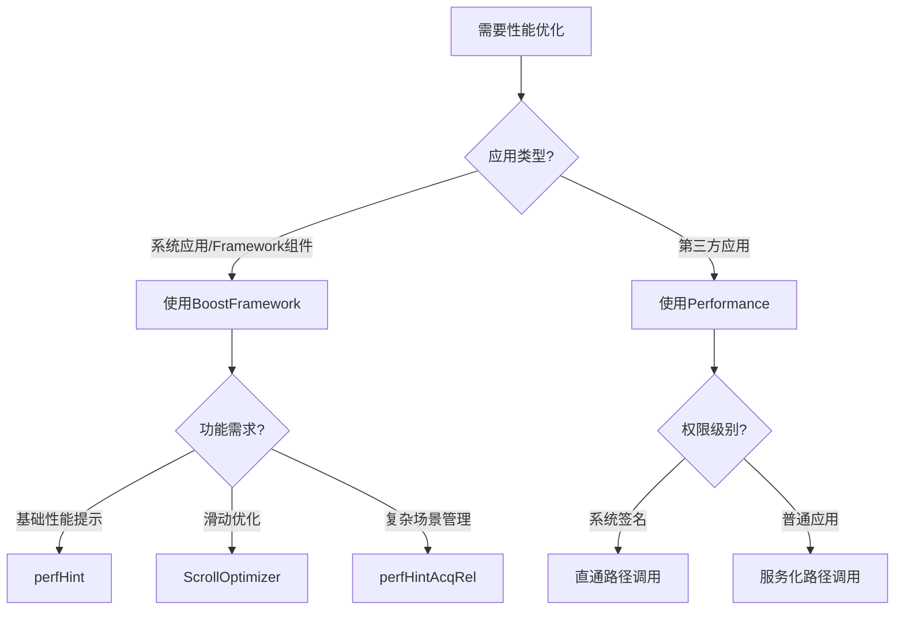
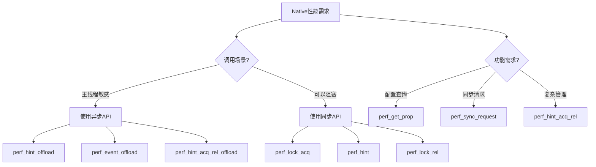
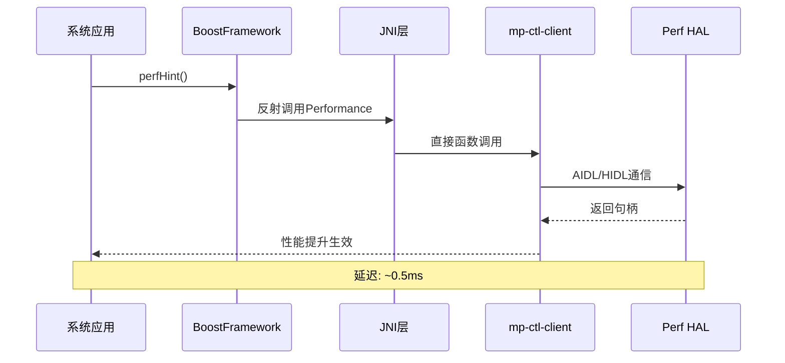
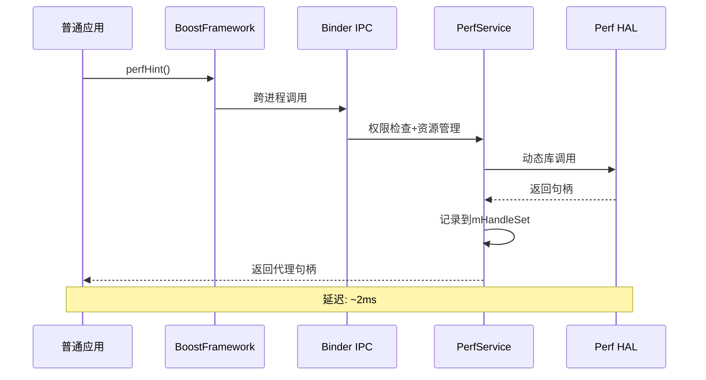
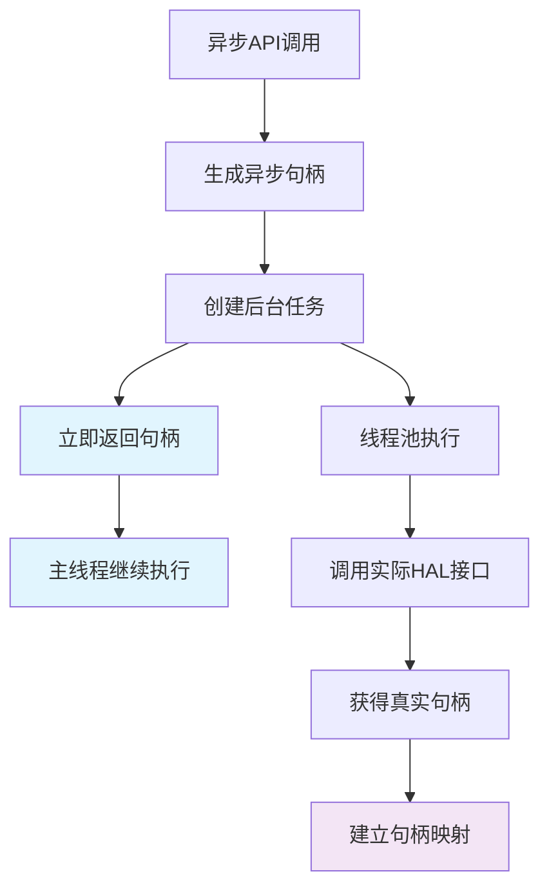
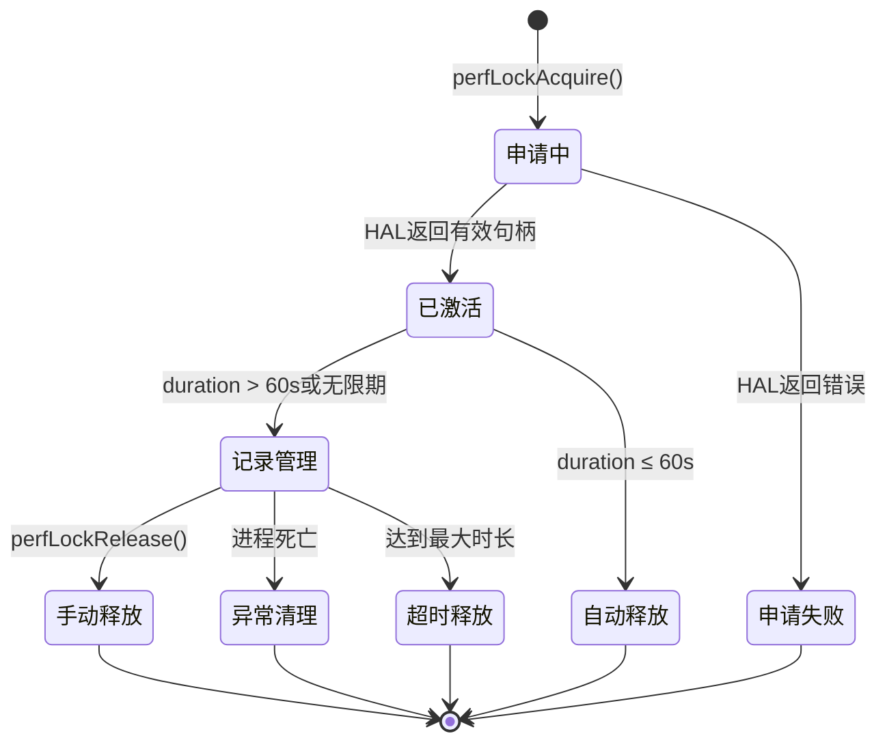
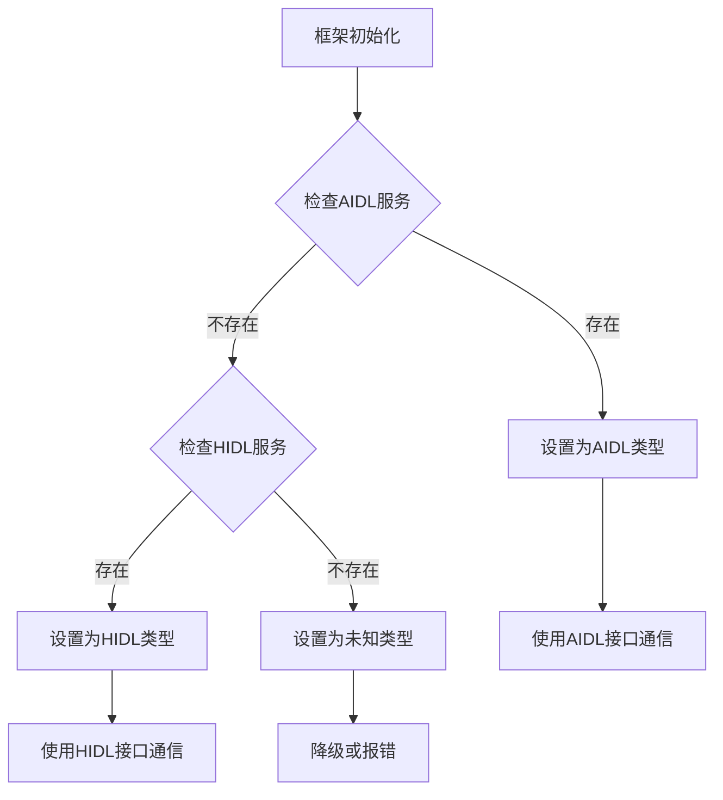
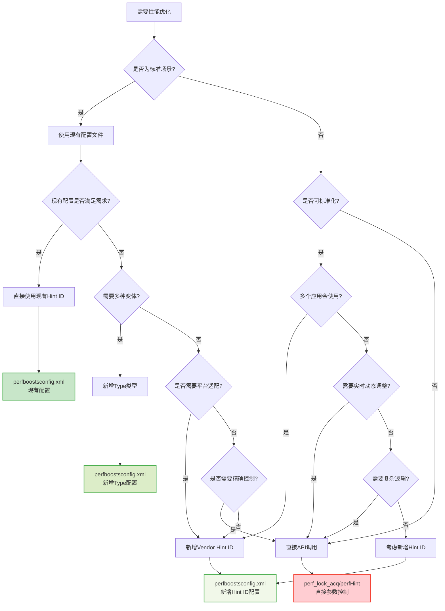

# Perf-Core性能优化框架详解

### 1. 什么是Perf-Core框架

### 1.1 框架定位

Perf-Core是Q平台专门为Android系统设计的**系统级性能优化框架**，它的核心目标是：

- **动态调节系统性能**：根据应用需求实时调整CPU、GPU、内存等硬件参数
- **提升用户体验**：在关键场景下保证流畅度，如应用启动、滑动、游戏等
- **智能功耗管理**：在性能和功耗之间找到最佳平衡点
- **类比理解**：MTK平台PowerHal，Unisoc平台UniPnp


## 2. 整体架构

### 2.1 架构模型

```
┌─────────────────────────────────────────┐
│           应用层 (Apps)                  │
├─────────────────────────────────────────┤
│     Framework层 (BoostFramework.java)   │
├─────────────────────────────────────────┤
│        Java API层 (Performance.java)    │
├─────────────────────────────────────────┤
│    Native服务层 (PerfService + Client)   │
├─────────────────────────────────────────┤
│          HAL层 (Hardware Abstraction)    │
└─────────────────────────────────────────┘
```

### 2.2 核心设计理念

系统采用了双路径架构：

**路径A：系统应用**

```
System Apps → Framwork → JNI → mp-ctl-client → HAL
优势：低延迟、高性能
适用：系统级应用、特权应用
```

**路径B：普通应用服务化**

```
Regular Apps → Framwork → Binder IPC → PerfService → HAL
优势：安全可控、资源管理
适用：第三方应用、普通应用
```


## 3. 核心组件详解

### 3.1 Framework层 (BoostFramework.java)

#### 3.1.1 组件定位与职责

- **文件位置**：`framework/base/core/java/android/util/BoostFramework.java`
- **主要用户**：SystemUI、输入法、系统服务等Framework组件

#### 3.1.2 系统代码展示

```java
// BoostFramework.java - Framework层封装
public class BoostFramework {
    private static final String PERFORMANCE_CLASS = "com.qualcomm.qti.Performance";
    private Object mPerf = null;  // Performance实例
    
    public static final int VENDOR_HINT_SCROLL_BOOST = 0x00001080;
    public static final int VENDOR_HINT_FIRST_LAUNCH_BOOST = 0x00001081;
    public static final int VENDOR_HINT_SUBSEQ_LAUNCH_BOOST = 0x00001082;
    public static final int VENDOR_HINT_ANIM_BOOST = 0x00001083;
    public static final int VENDOR_HINT_ACTIVITY_BOOST = 0x00001084;
    public static final int VENDOR_HINT_TOUCH_BOOST = 0x00001085;
    public static final int VENDOR_HINT_MTP_BOOST = 0x00001086;
    public static final int VENDOR_HINT_DRAG_BOOST = 0x00001087;
    // ...
    // 通过反射加载Performance类
    private void initFunctions() {
        sPerfClass = Class.forName(PERFORMANCE_CLASS);
        sAcquireFunc = sPerfClass.getMethod("perfLockAcquire", argClasses);
        // ...
    }
}
```

**调用关系图**：

```
Android Framework (SystemUI/InputMethodService/etc.)
    ↓ 直接调用
BoostFramework.java (android.util包)
    ↓ 反射调用
Performance.java (com.qualcomm.qti包) 
    ↓ JNI调用
Native层实现
```

#### 3.1.3 Framework中使用方式

```java
// 系统应用中的典型使用
public class SystemPerformanceManager {
    private BoostFramework mBoostFramework;
    
    public void initializePerformance() {
        // 创建BoostFramework实例
        mBoostFramework = new BoostFramework();
        
    }
    
    public void optimizeAppLaunch(String packageName, int launchType) {
        // 应用启动优化
        int handle = mBoostFramework.perfHint(
            BoostFramework.VENDOR_HINT_FIRST_LAUNCH_BOOST,
            packageName,
            3000,  // 3秒
            launchType
        );
        
        // 或使用更高级的API
        int advancedHandle = mBoostFramework.perfHintAcqRel(
            0,     // handle
            BoostFramework.VENDOR_HINT_FIRST_LAUNCH_BOOST,
            packageName,
            3000,  // duration
            BoostFramework.Launch.BOOST_V3,  // type
            2,     // numArgs
            BoostFramework.Launch.TYPE_START_PROC,
            BoostFramework.WorkloadType.APP
        );
    }
}
```


### 3.2 Java API层 (Performance.java)

#### 3.2.1 组件职责

- **权限适配**：自动识别应用权限，选择合适的执行路径
- **接口封装**：为应用层提供统一的性能控制接口
- **生命周期管理**：管理性能锁的创建、使用和释放

#### 3.2.2 智能路径选择机制

```java
public int perfLockAcquire(int duration, int... list) {
    if (sIsPlatformOrPrivApp && !sIsUntrustedDomain) {
        // 路径A：系统应用直接调用Native
        mHandle = native_perf_lock_acq(mHandle, duration, list);
    } else {
        // 路径B：普通应用通过Binder服务
        mHandle = sPerfService.perfLockAcquire(duration, list.length, list);
    }
    return mHandle;
}
```


### 3.3 Native服务层

#### 3.3.1 PerfService - 集中式管理

**设计目标**：为普通应用提供安全、可控的性能优化服务

**核心功能**：

- **客户端管理**：跟踪所有连接的客户端进程
- **资源调度**：统一管理和调度性能资源
- **死亡监听**：自动清理异常退出进程的资源
- **权限控制**：验证客户端的调用权限

#### 3.3.2 mp-ctl-client - 直连组件

**设计目标**：为系统应用提供最高性能的直接访问路径

**核心功能**：

- **HAL适配**：自动检测并适配HIDL/AIDL不同版本HAL
- **异步支持**：提供非阻塞的异步调用接口
- **连接管理**：维护与HAL层的持久连接
- **版本兼容**：支持多版本HAL的向后兼容


### 3.4 组件协作

#### 3.4.1 系统应用调用链

```
BoostFramework → Performance → JNI → mp-ctl-client → HAL
优势：最短路径，最低延迟，最高性能
```

#### 3.4.2 普通应用调用链

```
BoostFramework → Performance → Binder → PerfService → HAL
优势：安全可控，统一管理，资源保护
```

#### 3.4.3 配置文件角色

- **perfconfigstore.xml**：控制组件功能的开启和关闭
- **perfboostsconfig.xml**：定义具体的性能优化策略


## 4. API分类与使用指南

### 4.1 API完整列表对比

#### 4.1.1 Framework层API (BoostFramework.java)

| API方法                 | 功能         | 参数                                       | 返回值 | 适用场景            |
| ----------------------- | ------------ | ------------------------------------------ | ------ | ------------------- |
| `perfHint()`            | 性能提示     | hint, pkg, duration, type                  | handle | 系统组件性能优化    |
| `perfLockAcquire()`     | 获取性能锁   | duration, resources...                     | handle | 需要硬件资源控制    |
| `perfLockRelease()`     | 释放性能锁   | -                                          | result | 配合perfLockAcquire |
| `perfHintAcqRel()`      | 高级性能提示 | handle, hint, pkg, duration, type, args... | handle | 复杂场景管理        |
| `perfGetProp()`         | 获取配置属性 | prop_name, def_val                         | string | 读取性能配置        |
| `perfUXEngine_events()` | UX引擎事件   | opcode, pid, pkg, lat                      | handle | UX相关优化          |

#### 4.1.2 Java API层 (Performance.java)

| API方法                 | 功能     | 与Framework区别        | 使用建议         |
| ----------------------- | -------- | ---------------------- | ---------------- |
| `perfLockAcquire()`     | 性能锁   | 增加权限检查和路径选择 | 第三方应用使用   |
| `perfHint()`            | 性能提示 | 自动权限识别           | 应用层直接调用   |
| `perfIOPrefetchStart()` | IO预取   | Framework层无此接口    | IO密集型应用     |
| `perfGetFeedbackExtn()` | 扩展反馈 | 支持参数扩展           | 需要系统状态查询 |
| `perfEvent()`           | 性能事件 | 支持自定义事件         | 事件驱动优化     |

#### 4.1.3 Native API (client.h)

| API类别     | 主要方法                                      | 特点                   | 性能 |
| ----------- | --------------------------------------------- | ---------------------- | ---- |
| **同步API** | `perf_lock_acq`, `perf_hint`, `perf_lock_rel` | 阻塞调用，立即返回结果 | 最高 |
| **异步API** | `perf_hint_offload`, `perf_lock_rel_offload`  | 非阻塞，后台执行       | 高   |
| **属性API** | `perf_get_prop`, `perf_sync_request`          | 配置查询和同步请求     | 中等 |
| **扩展API** | `perf_hint_acq_rel`, `perf_hint_renew`        | 高级功能，复杂参数     | 高   |

### 4.2 API选择决策树

#### 4.2.1 应用层API选择



#### 4.2.2 Native层API选择



#### 4.2.3 API调用时机建议

| 场景     | 推荐API               | 调用时机       | 持续时间       | 注意事项                 |
| -------- | --------------------- | -------------- | -------------- | ------------------------ |
| 应用启动 | `perfHint`            | `onCreate()`前 | 2-3秒          | 避免过长占用             |
| 动画播放 | `perfHint`            | 动画开始前     | 动画时长+100ms | 及时释放                 |
| 游戏运行 | `perfHintAcqRel`      | 游戏启动时     | 整个游戏过程   | 退出时必须释放           |
| 滑动操作 | `ScrollOptimizer`     | Touch事件中    | 实时控制       | 跟随手势状态             |
| 文件IO   | `perfIOPrefetchStart` | IO操作前       | IO完成后       | 配合`perfIOPrefetchStop` |


## 5. 关键流程分析

### 5.1 调用路径对比

#### 5.1.1 系统应用直通路径



**流程特点**：

- **权限检查**：应用启动时一次性检查，后续调用无权限开销
- **直接调用**：JNI层直接调用Native函数，无跨进程通信
- **性能最优**：延迟最低，适合性能敏感的系统组件

#### 5.1.2 普通应用服务化路径



**流程特点**：

- **安全控制**：每次调用都进行权限和参数校验
- **资源管理**：统一记录和管理所有性能锁
- **死亡监听**：客户端异常退出时自动清理资源

### 5.2 异步调用机制

#### 5.2.1 异步任务流程



**核心优势**：

- **主线程无阻塞**：异步句柄立即返回，不影响UI线程
- **线程池复用**：后台线程统一管理，避免频繁创建销毁
- **句柄映射**：异步句柄与真实句柄建立映射关系

#### 5.2.2 句柄映射管理

| 阶段         | 异步句柄状态      | 真实句柄状态 | 操作结果         |
| ------------ | ----------------- | ------------ | ---------------- |
| **调用中**   | NEW_HANDLE_STATE  | 未生成       | 立即返回异步句柄 |
| **执行中**   | NEW_HANDLE_STATE  | 正在申请     | 后台线程处理     |
| **完成**     | MAPPED            | 已获得       | 建立映射关系     |
| **释放请求** | RELEASE_REQ_STATE | 待释放       | 标记为待释放     |

### 5.3 资源管理流程

#### 5.3.1 性能锁生命周期



#### 5.3.2 死亡监听机制

**监听注册流程**：

1. 客户端连接时调用`setClientBinder()`
2. PerfService为客户端Binder注册死亡监听
3. 记录PID与Binder的对应关系
4. 将关联信息存储到`mBinderSet`

**异常清理流程**：

1. 客户端进程意外退出
2. 死亡监听器触发`binderDied()`回调
3. 根据Binder找到对应的PID
4. 遍历`mHandleSet`，释放该PID的所有性能锁
5. 清理`mBinderSet`中的记录

### 5.4 HAL层适配流程

#### 5.4.1 HAL类型检测



**适配策略**：

- **优先AIDL**：新版本Android优先尝试AIDL接口
- **降级HIDL**：AIDL不可用时使用传统HIDL接口
- **版本检测**：根据Android API Level确定HAL版本
- **动态切换**：运行时检测并选择合适的HAL类型

#### 5.4.2 配置下发流程


**配置匹配优先级**：

1. **平台匹配**：Target属性必须与当前平台一致
2. **类型匹配**：Type参数确定具体的配置变体
3. **条件匹配**：FPS、Ram等附加条件进一步筛选
4. **默认回退**：无匹配时使用默认配置或忽略


## 6. 配置系统详解

### 6.1 配置文件概览

#### 6.1.1 两套配置文件的职责分工

| 配置文件                 | 主要作用       | 配置内容                     | 修改场景                    |
| ------------------------ | -------------- | ---------------------------- | --------------------------- |
| **perfconfigstore.xml**  | **功能总开关** | 属性开关、参数阈值、调试标志 | 启用/禁用功能、调整功能参数 |
| **perfboostsconfig.xml** | **性能策略库** | 硬件资源配置、性能参数组合   | 调整性能强度、新增场景支持  |

#### 6.1.2 配置文件路径

```
vendor/qcom/proprietary/perf-core/configs/{platform}/
├── perfconfigstore.xml      # 功能开关配置
├── perfboostsconfig.xml     # 性能策略配置
└── targetconfig.xml         # 平台相关配置
```

### 6.2 perfconfigstore.xml 详解

路径vendor/qcom/proprietary/perf-core/configs/{$target}/perfboostsconfig.xml

#### 6.2.1 配置结构与属性作用

**结构示例**

```xml
<?xml version="1.0" encoding="utf-8"?>
<PerfConfigsStore>
    <PerfConfigs>
        <!-- 基础属性配置 -->
        <Prop Name="vendor.debug.enable.lm" Value="true" />
        
        <!-- 带目标平台的配置 -->
        <Prop Name="ro.vendor.perf.lal" Value="true" Target="volcano"/>
        
        <!-- 多条件配置 -->
        <Prop Name="ro.vendor.perf.lgl" Value="true" 
              Target="volcano" 
              SkewType="10"/>
              
        <!-- 复杂条件配置 -->
        <Prop Name="vendor.perf.example" Value="optimized"
              Target="lagoon" 
              Variant="lito" 
              Resolution="1080p"
              Ram="6" 
              Kernel="5.4"/>
    </PerfConfigs>
</PerfConfigsStore>
```


**基础结构**：

```xml
<PerfConfigsStore>
    <PerfConfigs>
        <Prop Name="属性名" Value="属性值" [Target="平台"] [其他条件]/>
    </PerfConfigs>
</PerfConfigsStore>
```

#### 6.2.2 核心功能属性

| 属性字段     | 含义                       | 可选值                  | 示例                                       |
| ------------ | -------------------------- | ----------------------- | ------------------------------------------ |
| `Name`       | 属性名称                   | vendor./ro.vendor.开头  | `vendor.debug.enable.lm`                   |
| `Value`      | 属性值                     | 字符串/数字/布尔        | `"true"`, `"1000"`, `"enabled"`            |
| `Target`     | 目标芯片平台               | 平台代号，**X平台指定** | `"volcano"`, `"lagoon"`, `"kona"`          |
| `Variant`    | 平台变体                   | 位数_内存类型           | `"bengal_32go"`, `"bengal_32"`, `"bengal"` |
| `Resolution` | 屏幕分辨率                 | 分辨率标识              | `"1080p"`, `"2560"`, `"720p"`, `"HD+"`     |
| `Ram`        | 内存大小                   | GB数字                  | `"1"`, `"3"`, `"6"`, `"12"`                |
| `Kernel`     | 内核版本                   | 版本号                  | `"4.19"`, `"5.4"`, `"5.15"`                |
| `SkewType`   | 倾斜类型（区分target变种） | 数字标识                | `"10"`, `"20"`                             |


| 属性名                                       | 作用说明                           | 可选值     | 影响范围         |
| -------------------------------------------- | ---------------------------------- | ---------- | ---------------- |
| **启动优化相关**                             |                                    |            |                  |
| `ro.vendor.perf.lal`                         | Lightning App Launch启用开关       | true/false | 应用启动速度     |
| `ro.vendor.perf.lgl`                         | Lightning Game Launch启用开关      | true/false | 游戏启动速度     |
| `ro.vendor.perf.ss`                          | Smart Start启用开关                | true/false | 智能启动预测     |
| `ro.vendor.perf.ssv2`                        | Smart Start V2启用开关             | true/false | 启动预测增强     |
| **滑动优化相关**                             |                                    |            |                  |
| `vendor.perf.gestureflingboost.enable`       | 手势滑动优化开关                   | true/false | 滑动流畅度       |
| `vendor.perf.topAppRenderThreadBoost.enable` | 顶层应用渲染线程优化               | true/false | 渲染性能         |
| `vendor.perf.phr.enable`                     | Performance Hint Response启用      | 0/1        | 性能提示响应     |
| **FPS相关配置**                              |                                    |            |                  |
| `vendor.perf.fps_switch_hyst_time_secs`      | FPS切换滞后时间                    | 数字(秒)   | FPS切换频率      |
| `vendor.perf.pfar2.enable`                   | Performance Frame Aware Rating 2.0 | 0/1        | 帧率感知优化     |
| `vendor.perf.pfar2.boost_level`              | PFAR2优化等级                      | 1-5        | 帧率优化强度     |
| **内存管理相关**                             |                                    |            |                  |
| `vendor.debug.enable.memperfd`               | 内存性能守护进程                   | true/false | 内存优化         |
| `vendor.prekill_MIN_ADJ_to_Kill`             | 预杀进程最小ADJ值                  | 数字       | 内存回收激进程度 |
| `vendor.prekill_MAX_ADJ_to_Kill`             | 预杀进程最大ADJ值                  | 数字       | 内存回收范围     |

#### 6.2.3 调试相关属性

| 属性名                         | 调试作用             | 使用场景         |
| ------------------------------ | -------------------- | ---------------- |
| `vendor.debug.enable.lm`       | 启用Load Manager调试 | 性能调度问题排查 |
| `vendor.debug.enable.memperfd` | 启用内存性能调试     | 内存优化问题分析 |
| `vendor.debug.perf.game`       | 游戏性能调试开关     | 游戏性能问题定位 |

### 6.3 perfboostsconfig.xml 详解

路径vendor/qcom/proprietary/perf-core/configs/{$target}/perfboostsconfig.xml

#### 6.3.1 配置结构与资源码含义

`perfboostsconfig.xml`是Perf-Core框架的**核心配置文件**，它定义了各种性能提示（Hint）对应的具体硬件资源配置。这个文件直接对应BoostFramework.java中定义的各种Hint常量。

**配置结构**：

```xml
<BoostConfigs>
    <PerfBoost>
        <!-- 每个Config定义一个具体的性能提升场景 -->
        <Config
            Id="0x00001081"                    <!-- 对应BoostFramework中的常量 -->
            Type="1"                          <!-- 配置类型/变体 -->
            Enable="true"                     <!-- 是否启用 -->
            Timeout="2000"                    <!-- 超时时间(ms) -->
            Target="volcano"                <!-- 目标平台 -->
            Resources="0x40C00000, 0x3, ..."  <!-- 具体的硬件资源配置 -->
        />
    </PerfBoost>
</BoostConfigs>
```

#### 6.3.2 Resources资源码详解

| 资源操作码      | 硬件组件             | 参数含义          | 调整效果              |
| --------------- | -------------------- | ----------------- | --------------------- |
| **CPU调度相关** |                      |                   |                       |
| `0x40C00000`    | 调度器               | 调度提升等级(0-3) | 等级越高CPU响应越快   |
| `0x40C74000`    | CPU繁忙滞后          | 滞后掩码值        | 控制CPU负载检测敏感度 |
| `0x40CE0000`    | 调度迁移             | 迁移阈值          | CPU核心间任务迁移策略 |
| **CPU频率控制** |                      |                   |                       |
| `0x40800000`    | CPU Big核最小频率    | 频率值(Hz)        | 大核最低工作频率      |
| `0x40800100`    | CPU Little核最小频率 | 频率值(Hz)        | 小核最低工作频率      |
| `0x40804000`    | CPU Big核最大频率    | 频率值(Hz)        | 大核最高允许频率      |
| `0x4080C000`    | CPU自适应高频        | 目标频率          | 动态调频上限          |
| **GPU相关**     |                      |                   |                       |
| `0x42804000`    | GPU最小频率          | 频率值(Hz)        | GPU最低工作频率       |
| `0x4281C000`    | GPU提前唤醒          | 唤醒时间(ms)      | GPU预唤醒时间         |
| `0x42C20000`    | GPU强制唤醒          | 0/1               | 是否强制GPU保持唤醒   |
| **内存与缓存**  |                      |                   |                       |
| `0x41844000`    | CPU内存带宽          | 带宽值            | 内存控制器频率        |
| `0x43458000`    | L3缓存频率           | 频率值            | 三级缓存工作频率      |
| `0x4303C000`    | DDR带宽              | 带宽值            | 内存总线带宽          |

#### 6.3.3 常用配置组合模式

| 场景类型     | 典型Resources组合                      | 优化目标     |
| ------------ | -------------------------------------- | ------------ |
| **轻度优化** | `0x40C00000,1 + 0x40800000,1200000`    | 基础性能提升 |
| **中度优化** | `0x40C00000,2 + CPU频率 + 少量GPU`     | 平衡性能功耗 |
| **重度优化** | `0x40C00000,3 + 全频率拉满 + 内存带宽` | 极致性能表现 |
| **游戏专用** | `调度+CPU+GPU+内存+缓存`               | 游戏流畅度   |

#### 6.3.4 Type类型说明与使用场景

| Type值        | 使用场景     | 配置特点           | 何时选择             |
| ------------- | ------------ | ------------------ | -------------------- |
| **Type="1"**  | 标准场景     | 平衡性能功耗       | 大部分应用的默认选择 |
| **Type="2"**  | 功耗优先     | 降低性能减少发热   | 长时间使用、发热敏感 |
| **Type="3"**  | 性能优先     | 激进配置追求极致   | 短时间高性能需求     |
| **Type="4"**  | 预处理       | 短时间快速响应     | 预滑动、预加载等     |
| **Type="6"**  | 游戏模式     | 针对游戏场景优化   | 游戏启动和运行       |
| **Type="10"** | Activity启动 | 专门的Activity启动 | 界面切换和启动       |

### 6.4 配置修改指南

#### 6.4.1 perfconfigstore.xml 修改场景

**何时修改**：

- **功能不生效**：相关性能优化完全无效果
- **功能需要调整**：优化效果不理想需要参数微调
- **调试需要**：需要更多日志信息排查问题
- **平台适配**：新平台需要启用或禁用特定功能

**修改方法**：

```xml
<!-- 场景1：启用被禁用的功能 -->
<Prop Name="vendor.perf.gestureflingboost.enable" Value="true" />

<!-- 场景2：调整功能参数 -->
<Prop Name="vendor.perf.fps_switch_hyst_time_secs" Value="5" />  <!-- 降低切换延迟 -->

<!-- 场景3：平台差异化配置 -->
<Prop Name="ro.vendor.perf.lal" Value="true" Target="volcano"/>
<Prop Name="ro.vendor.perf.lal" Value="false" Target="entry_platform"/>

<!-- 场景4：基于硬件条件的配置 -->
<Prop Name="vendor.perf.game.max_fps" Value="120" Ram="8"/>
<Prop Name="vendor.perf.game.max_fps" Value="60" Ram="4"/>
```

#### 6.4.2 perfboostsconfig.xml 修改场景

**何时修改**：

- **性能不足**：现有配置无法满足性能要求
- **功耗过高**：性能过度导致发热或耗电
- **新场景支持**：需要支持新的FPS或新的使用场景
- **平台调优**：针对特定平台进行性能调优

**何时新增Type**：

- **差异化需求**：同一场景需要多种性能策略
- **条件分支**：根据不同条件(FPS/Ram/Resolution)需要不同配置
- **AB测试**：需要对比不同配置的效果
- **向前兼容**：保留旧配置的同时添加新优化

**修改示例**：

```xml
<!-- 场景1：性能不足，提升现有配置 -->
<Config Id="0x00001080" Type="1" Enable="true" Fps="60"
    Resources="0x40C00000, 3,        <!-- 调度等级从2提升到3 -->
               0x40800000, 1800000,  <!-- CPU频率从1.5GHz提升到1.8GHz -->
               0x42804000, 750000000"/> <!-- GPU频率适当提升 -->

<!-- 场景2：功耗过高，降低配置强度 -->
<Config Id="0x00001091" Enable="true"
    Resources="0x40C00000, 1,        <!-- 调度等级从3降到1 -->
               0x40800000, 1200000,  <!-- 降低CPU最小频率 -->
               0x42804000, 500000000"/> <!-- 降低GPU频率 -->

<!-- 场景3：新增144fps支持 -->
<Config Id="0x00001094" Type="144" Enable="true" Timeout="0"
    Resources="0x40CA4000, 1,        <!-- 更快的调度窗口 -->
               0x43468000, 7,        <!-- 更短的内存采样间隔 -->
               0x40800100, 1200"/>   <!-- 提升小核频率 -->

<!-- 场景4：新增Type=5轻量级配置 -->
<Config Id="0x00001080" Type="5" Enable="true" Fps="60"
    Resources="0x40C00000, 1,        <!-- 较低调度等级 -->
               0x40800000, 1000000"/> <!-- 适中的CPU频率 -->
```

### 6.5 配置验证与调试

#### 6.5.1 配置生效验证

**验证perfconfigstore.xml**：

```bash
# 检查属性是否正确设置
adb shell getprop ro.vendor.perf.lal
adb shell getprop vendor.perf.gestureflingboost.enable

# 检查调试开关是否生效
adb shell getprop vendor.debug.enable.lm
```

**验证perfboostsconfig.xml**：

```bash
# 监控性能提示调用
adb shell dumpsys vendor.perfservice

# 实时监控硬件参数变化
adb shell cat /sys/devices/system/cpu/cpu*/cpufreq/scaling_cur_freq
adb shell cat /sys/class/kgsl/kgsl-3d0/gpuclk
adb shell cat /proc/sys/kernel/sched_boost
```

#### 6.5.2 常见配置问题排查

| 问题现象       | 可能原因                         | 排查方法                 |
| -------------- | -------------------------------- | ------------------------ |
| 功能完全无效   | perfconfigstore.xml中开关未启用  | 检查对应属性值           |
| 性能提升不明显 | perfboostsconfig.xml配置过于保守 | 检查Resources参数        |
| 特定平台无效   | Target属性不匹配                 | 确认Target名称正确       |
| 高FPS场景无效  | 缺少对应Fps的配置                | 添加相应FPS配置          |
| 配置冲突       | 多个Config匹配到同一场景         | 检查Id、Type、条件的组合 |


## 7. 实际应用场景

### 7.1 应用启动优化

```java
public class LaunchOptimizer {
    private Performance mPerf;
    
    public void optimizeAppLaunch(String packageName) {
        // 应用启动提示
        int handle = mPerf.perfHint(VENDOR_HINT_FIRST_LAUNCH_BOOST, 
                                   packageName, 3000, TYPE_START_PROC);
        
        // CPU频率锁定
        int lockHandle = mPerf.perfLockAcquire(3000, 
                                              0x40C00000, 1958400,  // CPU
                                              0x42804000, 710000000); // GPU
        
        // 3秒后自动释放或在应用完全启动后主动释放
    }
}
```

### 7.2 游戏性能优化

```java
public class GamePerformanceManager {
    public void enterGameMode(String gamePackage) {
        // 游戏模式长期性能锁
        int handle = mPerf.perfHintAcqRel(
            0,                           // handle
            VENDOR_HINT_PERFORMANCE_MODE, // hint
            gamePackage,                 // package
            0,                          // duration (持续到手动释放)
            GAME,                       // type
            2,                          // numArgs
            GAME_MODE_ARGS...           // 游戏优化参数
        );
        
        // 存储handle用于后续释放
        mGameModeHandle = handle;
    }
}
```

### 7.3 滑动优化

```java
public class ScrollOptimizer implements View.OnScrollListener {
    @Override
    public void onScrollStateChanged(AbsListView view, int scrollState) {
        switch (scrollState) {
            case SCROLL_STATE_TOUCH_SCROLL:
                // 开始滑动，申请性能提升
                mScrollHandle = mPerf.perfHint(VENDOR_HINT_SCROLL_BOOST, 
                                             getPackageName(), 1000, 0);
                break;
                
            case SCROLL_STATE_IDLE:
                // 滑动结束，释放性能锁
                if (mScrollHandle > 0) {
                    mPerf.perfLockReleaseHandler(mScrollHandle);
                }
                break;
        }
    }
}
```

### 7.4 游戏引擎Native集成

```cpp
class GameEngine {
private:
    int mGameModeHandle = -1;
    bool mInGameMode = false;
    
public:
    void enterGameMode(const std::string& gameName) {
        if (mInGameMode) return;
        
        // 游戏模式性能配置
        std::vector<int> game_config = {
            0x40C00000, 2496000,     // CPU big core最高频率
            0x40C04000, 1900800,     // CPU prime core频率
            0x42804000, 900000000,   // GPU最高频率
            0x43000000, 8000000,     // 内存带宽最大
            0x43800000, 1           // 禁用温控降频
        };
        
        // 使用异步API避免阻塞游戏主线程
        mGameModeHandle = perf_hint_offload(
            VENDOR_HINT_PERFORMANCE_MODE,
            gameName.c_str(),
            0,        // 持续到手动释放
            GAME,     // 游戏类型
            game_config.size(),
            game_config.data()
        );
        
        if (mGameModeHandle > 0) {
            mInGameMode = true;
            ALOGI("Game mode activated: %s, handle=%d", 
                  gameName.c_str(), mGameModeHandle);
            
            // 发送游戏开始事件
            std::vector<int> game_event = {GAME_START_EVENT};
            perf_event_offload(VENDOR_HINT_APP_WORKLOAD_TYPE,
                              gameName.c_str(),
                              1,
                              game_event.data());
        }
    }
    
    void exitGameMode() {
        if (!mInGameMode) return;
        
        // 释放游戏模式性能锁
        if (mGameModeHandle > 0) {
            perf_lock_rel_offload(mGameModeHandle);
            mGameModeHandle = -1;
        }
        
        mInGameMode = false;
        ALOGI("Game mode deactivated");
    }
    
    void onFrameStart() {
        if (mInGameMode) {
            // 每帧开始时的性能提示
            perf_hint(VENDOR_HINT_FIRST_DRAW, 
                     "game.engine", 
                     16, // 一帧的时间
                     0);
        }
    }
    
    void onTouchEvent() {
        if (mInGameMode) {
            // 触摸事件性能提升
            perf_hint(VENDOR_HINT_TAP_EVENT,
                     "game.engine",
                     100, // 100ms提升
                     0);
        }
    }
};
```

### 7.5 tuning决策树


    



