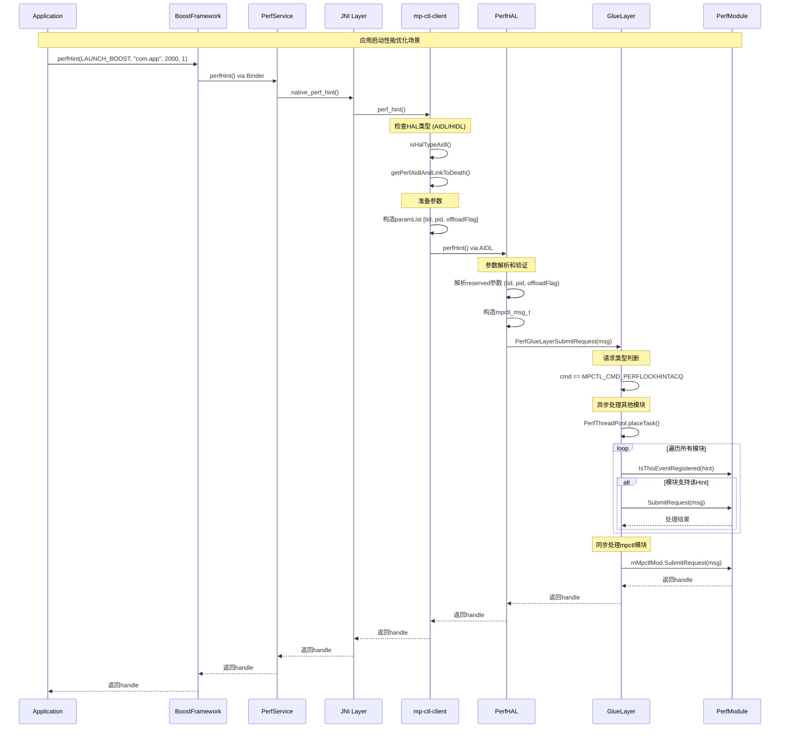

# PerfHAL 源码分析

## 1. PerfHAL 组件部署结构

### 1.1 Binary 文件

```bash
# AIDL HAL服务
/vendor/bin/hw/vendor.qti.hardware.perf2-service

# Socket HAL服务（低端设备）
/vendor/bin/hw/vendor.qti.hardware.perf-hal-service

# 客户端库
/system/lib64/libqti-perfd-client.so
/system/lib64/libqti-perfd-client_system.so
/vendor/lib64/libqti-perfd.so
```

### 1.2 配置文件

```bash
# 服务启动配置
/vendor/etc/init/vendor.qti.hardware.perf2-hal-service.rc
/vendor/etc/init/vendor.qti.hardware.perf-hal-service.rc

# XML配置文件
/vendor/etc/perf/targetconfig.xml
/vendor/etc/perf/perfconfigstore.xml  
/vendor/etc/perf/perfboostsconfig.xml

# 接口描述文件
/vendor/etc/vintf/manifest/vendor.qti.hardware.perf2.xml
```

### 1.3 启动时机分析

#### AIDL服务启动

```bash
# vendor.qti.hardware.perf2-hal-service.rc
service vendor.qti.hardware.perf2-service /vendor/bin/hw/vendor.qti.hardware.perf2-service
    class hal
    user system
    group system
    capabilities SYS_NICE
    task_profiles ProcessCapacityHigh HighPerformance
```

#### Socket服务启动

```bash
# vendor.qti.hardware.perf-hal-service.rc  
service vendor.qti.hardware.perf-hal-service /vendor/bin/hw/vendor.qti.hardware.perf-hal-service
    class hal
    user system
    group system
    socket perfservice stream 0666 system system
```

## 2. 调用链路分析

### 2.1 客户端调用入口

#### mp-ctl-client 调用链

```cpp
// mp-ctl-client/client.cpp
int perf_lock_acq(int handle, int duration, int list[], int numArgs) {
    // 1. 检查HAL类型 (AIDL vs HIDL)
    if (isHalTypeAidl()) {
        if (getPerfAidlAndLinkToDeath() == false) {
            return rc;
        }
    } else {
        if (getPerfServiceAndLinkToDeath() == false) {
            return rc;
        }
    }
    
    // 2. 准备参数
    std::vector<int32_t> boostsList;
    std::vector<int32_t> paramList;
    
    paramList.push_back(gettid());  // 客户端TID
    paramList.push_back(getpid());  // 客户端PID
    boostsList.assign(list, (list + numArgs));
    
    // 3. 调用HAL接口
    shared_lock<shared_timed_mutex> read_lock(gPerf_lock);
    if (gPerfAidl != NULL) {
        gPerfAidl->perfLockAcquire(handle, duration, boostsList, paramList, &intReturn);
        rc = intReturn;
    }
    
    return rc;
}
```

#### PerfService 调用链

```java
// Performance.java
public int perfLockAcquire(int duration, int... list) {
    if (sIsPlatformOrPrivApp && !sIsUntrustedDomain) {
        // 直接调用native方法
        mHandle = native_perf_lock_acq(mHandle, duration, list);
    } else {
        // 通过Binder调用PerfService
        synchronized (mLock) {
            if (sPerfService != null) {
                mHandle = sPerfService.perfLockAcquire(duration, list.length, list);
            }
        }
    }
    return mHandle;
}

// JNI调用 (com_qualcomm_qti_Performance.cpp)
static jint com_qualcomm_qti_performance_native_perf_lock_acq(JNIEnv *env, jobject clazz, 
                                                             jint handle, jint duration, 
                                                             jintArray list) {
    jint listlen = env->GetArrayLength(list);
    jint buf[MAX_SIZE_ALLOWED];
    env->GetIntArrayRegion(list, 0, listlen, buf);
    
    ret = perf_lock_acq(handle, duration, buf, listlen);
    return ret;
}
```

### 2.2 HAL服务接收处理

#### AIDL接口实现 (Perf.cpp)

```cpp
ScopedAStatus Perf::perfLockAcquire(int32_t in_pl_handle, int32_t in_duration, 
                                   const std::vector<int32_t>& in_boostsList, 
                                   const std::vector<int32_t>& in_reserved, 
                                   int32_t* _aidl_return) {
    *_aidl_return = -1;
    
    // 1. 检查服务状态
    if (!checkPerfStatus(__func__)) {
        return ndk::ScopedAStatus::ok();
    }
    
    // 2. 构造内部消息结构
    mpctl_msg_t pMsg;
    memset(&pMsg, 0, sizeof(mpctl_msg_t));
    
    pMsg.req_type = MPCTL_CMD_PERFLOCKACQ;  // 请求类型
    
    // 3. 解析客户端信息
    for (uint32_t i = 0; i < INDEX_END && i < in_reserved.size(); i++) {
        switch (i) {
            case INDEX_CLIENT_TID: 
                pMsg.client_tid = in_reserved[i];
                break;
            case INDEX_CLIENT_PID: 
                pMsg.client_pid = in_reserved[i];
                break;
        }
    }
    
    // 4. 拷贝boost参数列表
    uint32_t size = in_boostsList.size();
    if (size > MAX_ARGS_PER_REQUEST) {
        QLOGE(LOG_TAG, "Maximum number of arguments exceeded");
        return ndk::ScopedAStatus::ok();
    }
    
    std::copy(in_boostsList.begin(), in_boostsList.end(), pMsg.pl_args);
    pMsg.data = size;           // 参数个数
    pMsg.pl_time = in_duration; // 持续时间
    pMsg.pl_handle = in_pl_handle; // 性能锁句柄
    pMsg.version = MSG_VERSION;
    pMsg.size = sizeof(mpctl_msg_t);
    
    // 5. 处理续期标志
    if (in_pl_handle > 0) {
        pMsg.renewFlag = true;
    }
    
    // 6. 提交到GlueLayer处理
    *_aidl_return = mImpl.PerfGlueLayerSubmitRequest(&pMsg);
    return ndk::ScopedAStatus::ok();
}
```

#### Hint处理实现

```cpp
ScopedAStatus Perf::perfHint(int32_t hint, const std::string& userDataStr, 
                            int32_t userData1, int32_t userData2, 
                            const std::vector<int32_t>& reserved, 
                            int32_t* _aidl_return) {
    *_aidl_return = -1;
    
    if (!checkPerfStatus(__func__)) {
        return ndk::ScopedAStatus::ok();
    }
    
    mpctl_msg_t pMsg;
    memset(&pMsg, 0, sizeof(mpctl_msg_t));
    
    pMsg.req_type = MPCTL_CMD_PERFLOCKHINTACQ;
    
    // 解析扩展参数
    for (uint32_t i = 0; i < INDEX_END && i < reserved.size(); i++) {
        switch (i) {
            case INDEX_CLIENT_TID: 
                pMsg.client_tid = reserved[i];
                break;
            case INDEX_CLIENT_PID: 
                pMsg.client_pid = reserved[i];
                break;
            case INDEX_REQUEST_OFFLOAD_FLAG: 
                pMsg.offloadFlag = reserved[i];  // 异步处理标志
                break;
        }
    }
    
    pMsg.hint_id = hint;        // Hint ID
    pMsg.pl_time = userData1;   // 持续时间
    pMsg.hint_type = userData2; // Hint类型
    pMsg.version = MSG_VERSION;
    pMsg.size = sizeof(mpctl_msg_t);
    
    // 拷贝包名
    strlcpy(pMsg.usrdata_str, userDataStr.c_str(), MAX_MSG_APP_NAME_LEN);
    pMsg.usrdata_str[MAX_MSG_APP_NAME_LEN - 1] = '\0';
    
    *_aidl_return = mImpl.PerfGlueLayerSubmitRequest(&pMsg);
    
    // 发送回调通知
    if (*_aidl_return != INIT_NOT_COMPLETED) {
        sendPerfCallbackOffload(hint, userDataStr, userData1, userData2, reserved);
    }
    
    return ndk::ScopedAStatus::ok();
}
```

### 2.3 PerfGlueLayer 请求分发

#### 请求类型判断与分发

```cpp
int32_t PerfGlueLayer::PerfGlueLayerSubmitRequest(mpctl_msg_t *msg) {
    PerfThreadPool &ptp = PerfThreadPool::getPerfThreadPool();
    int32_t handle = -1, ret = -1;
    uint8_t cmd = msg->req_type;
    TargetConfig &tc = TargetConfig::getTargetConfig();
    
    // 1. 检查初始化状态
    if (tc.getInitCompleted() == false) {
        QLOGE(LOG_TAG, "Request not submitted as target init is not complete");
        return INIT_NOT_COMPLETED;
    }
    
    pthread_mutex_lock(&mMutex);
    
    // 2. 根据命令类型分发处理
    if ((cmd >= MPCTL_CMD_PERFLOCKACQ) && 
        (cmd <= MPCTL_CMD_PERFLOCK_RESTORE_GOV_PARAMS)) {
        
        // 2.1 直接性能锁请求 - 同步处理
        QLOGL(LOG_TAG, QLOG_L2, "Direct perflock request");
        if (mMpctlMod && !mMpctlMod->IsEmpty()) {
            if (mMpctlMod->GetLib().SubmitRequest) {
                handle = mMpctlMod->GetLib().SubmitRequest(msg);
            }
        }
    }
    else if (MPCTL_CMD_PERFLOCKHINTACQ == cmd || MPCTL_CMD_PERFEVENT == cmd) {
        
        // 2.2 Hint请求 - 需要多模块处理
        QLOGL(LOG_TAG, QLOG_L2, "Hint request");
        handle = INVALID_VAL;
        uint32_t hint = msg->hint_id;
        
        // 异步处理其他模块
        mpctl_msg_t *tmp_msg = (mpctl_msg_t*)calloc(1, sizeof(mpctl_msg_t));
        if (tmp_msg != NULL) {
            memcpy(tmp_msg, msg, sizeof(mpctl_msg_t));
            
            // 提交异步任务
            int32_t rc = ptp.placeTask([=] () mutable {
                for (uint8_t i = 0; i < MAX_MODULES; i++) {
                    if (&mModules[i] == mMpctlMod) {
                        continue; // 跳过mpctl模块，后面同步处理
                    }
                    
                    if (!mModules[i].IsEmpty() && 
                        mModules[i].IsThisEventRegistered(hint)) {
                        if (mModules[i].GetLib().SubmitRequest) {
                            int32_t handle_in = mModules[i].GetLib().SubmitRequest(tmp_msg);
                            QLOGL(LOG_TAG, QLOG_L2, "Request %x for %s returned Handle: %d", 
                                  tmp_msg->hint_id, mModules[i].GetLib().mLibFileName, handle_in);
                        }
                    }
                }
                
                if (tmp_msg != NULL) {
                    free(tmp_msg);
                }
            });
            
            // 如果线程池满了，动态扩展
            if (rc == FAILED) {
                uint32_t new_size = ptp.resize(1);
                QLOGE(LOG_TAG, "Request %x failed, adding thread. New pool size: %u", 
                      msg->hint_id, new_size);
            }
        }
        
        // 同步处理mpctl模块
        if (mMpctlMod && !mMpctlMod->IsEmpty() && 
            mMpctlMod->IsThisEventRegistered(hint)) {
            if (mMpctlMod->GetLib().SubmitRequest) {
                handle = ret = mMpctlMod->GetLib().SubmitRequest(msg);
                QLOGL(LOG_TAG, QLOG_L1, "Package: %s, hint: %x, libname: %s, Handle: %d",
                      msg->usrdata_str, hint, mMpctlMod->GetLib().mLibFileName, handle);
            }
        }
    }
    else if (MPCTL_CMD_PERFGETFEEDBACK == cmd) {
        
        // 2.3 反馈请求 - 同步处理所有模块
        QLOGL(LOG_TAG, QLOG_L2, "Feedback request");
        handle = INVALID_VAL;
        uint32_t hint = msg->hint_id;
        
        for (uint8_t i = 0; i < MAX_MODULES; i++) {
            if (&mModules[i] == mMpctlMod) {
                continue; // 最后处理mpctl
            }
            
            if (!mModules[i].IsEmpty() && 
                mModules[i].IsThisEventRegistered(hint)) {
                if (mModules[i].GetLib().SubmitRequest) {
                    ret = mModules[i].GetLib().SubmitRequest(msg);
                    if (&mModules[i] == mMpctlMod) {
                        handle = ret;
                    }
                }
            }
        }
    }
    
    // 3. 返回值处理 - mpctl的返回值优先
    if (handle == INVALID_VAL) {
        handle = ret;
    }
    
    pthread_mutex_unlock(&mMutex);
    return handle;
}
```

### 2.4 性能模块动态加载

#### 模块加载机制

```cpp
int32_t PerfGlueLayer::LoadPerfLib(const char *libname) {
    int32_t ret = -1;
    PerfModule tmp;
    
    pthread_mutex_lock(&mMutex);
    
    // 1. 检查是否已加载
    if (!mLoadedModules.empty() &&
        std::find(mLoadedModules.begin(), mLoadedModules.end(), libname) != 
        mLoadedModules.end()) {
        pthread_mutex_unlock(&mMutex);
        return ret;
    }
    
    // 2. 标记正在加载
    mLoadedModules.push_back(libname);
    pthread_mutex_unlock(&mMutex);
    
    // 3. 加载动态库
    int32_t libret = tmp.LoadPerfLib(libname);
    
    pthread_mutex_lock(&mMutex);
    if (libret < 0) {
        // 加载失败，清理标记
        mLoadedModules.erase(std::remove(mLoadedModules.begin(),
                                       mLoadedModules.end(), libname),
                           mLoadedModules.end());
        pthread_mutex_unlock(&mMutex);
        return ret;
    }
    
    // 4. 查找已注册的模块并关联
    for (uint8_t i = 0; i < MAX_MODULES; i++) {
        int32_t len = strlen(mModules[i].GetLib().mLibFileName);
        if (!mModules[i].IsEmpty() &&
            !strncmp(mModules[i].GetLib().mLibFileName, libname, len) &&
            !mModules[i].GetLib().is_opened) {
            
            // 关联函数指针
            mModules[i].GetLib().is_opened = tmp.GetLib().is_opened;
            mModules[i].GetLib().dlhandle = tmp.GetLib().dlhandle;
            mModules[i].GetLib().Init = tmp.GetLib().Init;
            mModules[i].GetLib().Exit = tmp.GetLib().Exit;
            mModules[i].GetLib().SubmitRequest = tmp.GetLib().SubmitRequest;
            mModules[i].GetLib().SyncRequest = tmp.GetLib().SyncRequest;
            
            ret = i;
            QLOGL(LOG_TAG, QLOG_L1, "LoadPerfLib loading %s at %u", libname, ret);
            break;
        }
    }
    
    pthread_mutex_unlock(&mMutex);
    return ret;
}

// 模块具体加载实现
int32_t PerfModule::LoadPerfLib(const char *libname) {
    const char *rc = NULL;
    int32_t ret = -1;
    
    if (!mLibHandle.is_opened && (NULL != libname)) {
        // 1. 打开动态库
        mLibHandle.dlhandle = dlopen(libname, RTLD_NOW | RTLD_LOCAL);
        if (mLibHandle.dlhandle == NULL) {
            QLOGE(LOG_TAG, "Failed to dlopen %s: %s", libname, dlerror());
            return ret;
        }
        
        // 2. 获取函数符号
        dlerror();
        
        *(void **)(&mLibHandle.Init) = dlsym(mLibHandle.dlhandle, "perfmodule_init");
        if ((rc = dlerror()) != NULL) {
            QLOGE(LOG_TAG, "Failed to get perfmodule_init");
            dlclose(mLibHandle.dlhandle);
            return ret;
        }
        
        *(void **)(&mLibHandle.Exit) = dlsym(mLibHandle.dlhandle, "perfmodule_exit");
        if ((rc = dlerror()) != NULL) {
            QLOGE(LOG_TAG, "Failed to get perfmodule_exit");
            dlclose(mLibHandle.dlhandle);
            return ret;
        }
        
        *(void **)(&mLibHandle.SubmitRequest) = dlsym(mLibHandle.dlhandle, 
                                                     "perfmodule_submit_request");
        if ((rc = dlerror()) != NULL) {
            QLOGE(LOG_TAG, "Failed to get perfmodule_submit_request");
            dlclose(mLibHandle.dlhandle);
            return ret;
        }
        
        *(void **)(&mLibHandle.SyncRequest) = dlsym(mLibHandle.dlhandle, 
                                                   "perfmodule_sync_request_ext");
        if ((rc = dlerror()) != NULL) {
            QLOGE(LOG_TAG, "Failed to get perfmodule_sync_request_ext");
        }
        
        // 3. 标记加载成功
        mLibHandle.is_opened = true;
        strlcpy(mLibHandle.mLibFileName, libname, MAX_FILE_NAME);
        ret = 0;
    }
    
    return ret;
}
```

### 2.5 HAL初始化流程

#### 服务初始化

```cpp
void Perf::Init() {
    char trace_prop[PROPERTY_VALUE_MAX];
    
    QLOGV(LOG_TAG, "PERF2: inside Perf::Init()");
    
    // 1. 初始化日志系统
    if (PerfLogInit() < 0) {
        QLOGE(LOG_TAG, "PerfLogInit failed");
    }
    
    // 2. 初始化目标配置
    mTargetConfig.InitializeTargetConfig();
    QLOGL(LOG_TAG, QLOG_L1, "TargetConfig Init Complete");
    
    // 3. 初始化配置存储
    mPerfDataStore.ConfigStoreInit();
    
    // 4. 加载核心性能模块
    mImpl.LoadPerfLib("libqti-perfd.so");
    
    // 5. 根据配置加载学习模块
    string prop = "";
    perfGetProp("vendor.debug.enable.lm", "false", &prop);
    bool enableLM = (!prop.compare("false")) ? false : true;
    if (enableLM) {
        QLOGL(LOG_TAG, QLOG_L1, "LM enabled: Loading liblearningmodule.so");
        mImpl.LoadPerfLib("liblearningmodule.so");
    }
    
    // 6. 根据内存配置加载内存性能模块
    perfGetProp("vendor.debug.enable.memperfd", "false", &prop);
    bool enableMemperfd = (!prop.compare("false")) ? false : true;
    if (enableLM && enableMemperfd) {
        perfGetProp("vendor.enable.memperfd_MIN_RAM_in_KB", "1048576", &prop);
        uint32_t minRAMKB = stoi(prop.c_str(), NULL);
        perfGetProp("vendor.enable.memperfd_MAX_RAM_in_KB", "20971520", &prop);
        uint32_t maxRAMKB = stoi(prop.c_str(), NULL);
        uint32_t memTotal = mTargetConfig.getRamInKB();
        
        if (memTotal > minRAMKB && memTotal <= maxRAMKB) {
            mImpl.LoadPerfLib("libmemperfd.so");
        }
    }
    
    // 7. 初始化调试跟踪
    if (property_get(PROP_NAME, trace_prop, NULL) > 0) {
        if (trace_prop[0] == '1') {
            perf_debug_output = PERF_SYSTRACE = atoi(trace_prop);
        }
    }
    
    // 8. 初始化所有已加载的模块
    mImpl.PerfGlueLayerInit();
}
```

#### 目标配置初始化

```cpp
void TargetConfig::InitializeTargetConfig() {
    int16_t socid = 0;
    char prop_val[PROPERTY_VALUE_MAX];
    
    QLOGV(LOG_TAG, "Inside InitializeTargetConfig");
    
    // 1. 读取硬件信息
    socid = readSocID();           // 读取SoC ID
    mRam = readRamSize();          // 读取内存大小
    readVariant();                 // 读取设备变体
    readResolution();              // 读取屏幕分辨率
    readKernelVersion();           // 读取内核版本
    
    // 2. 获取API级别
    if (property_get(API_LEVEL_PROP_NAME, prop_val, "31")) {
        mFirstAPILevel = atoi(prop_val);
    }
    
    // 3. 解析XML配置
    InitTargetConfigXML();
    
    // 4. 应用配置
    TargetConfigInit();
    
    QLOGL(LOG_TAG, QLOG_L1, "Init complete for: %s", getTargetName().c_str());
    
    // 5. 输出配置信息
    DumpAll();
}
```

## 3. 参数解析与处理机制

### 3.1 Boost参数格式

#### 标准格式

```cpp
// boost参数格式: [resource_id, value, resource_id, value, ...]
// 例如: CPU频率锁定
int32_t boost_params[] = {
    0x40800000, 1500000,  // CPU0最小频率设为1.5GHz
    0x40800100, 1200000,  // CPU1最小频率设为1.2GHz  
    0x40804000, 2000000,  // CPU0最大频率设为2.0GHz
    0x40804100, 1800000   // CPU1最大频率设为1.8GHz
};
```

#### 参数验证

```cpp
// Perf.cpp中的参数检查
uint32_t size = in_boostsList.size();
if (size > MAX_ARGS_PER_REQUEST) {
    QLOGE(LOG_TAG, "Maximum number of arguments allowed exceeded");
    return ndk::ScopedAStatus::ok();
}

// 参数必须成对出现
if (size % 2 != 0) {
    QLOGE(LOG_TAG, "Invalid boost parameters: must be resource-value pairs");
    return ndk::ScopedAStatus::ok();
}
```

### 3.2 Hint参数处理

#### Hint ID映射

```cpp
// mp-ctl.h中定义的Hint类型
enum {
    VENDOR_HINT_SCROLL_BOOST = 0x00001080,        // 滚动优化
    VENDOR_HINT_FIRST_LAUNCH_BOOST = 0x00001081,  // 首次启动优化
    VENDOR_HINT_ANIM_BOOST = 0x00001083,          // 动画优化
    VENDOR_HINT_TOUCH_BOOST = 0x00001085,         // 触摸优化
    VENDOR_HINT_PERFORMANCE_MODE = 0x00001091,    // 性能模式
};
```

#### Hint处理逻辑

```cpp
// PerfGlueLayer.cpp中的Hint分发
uint32_t hint = msg->hint_id;

// 检查模块是否注册了该Hint
bool PerfModule::IsThisEventRegistered(int32_t event) {
    bool ret = false;
    
    // 首先检查是否在范围内
    ret = (event >= mEventsLowerBound) && (event <= mEventsUpperBound);
    
    if (!ret) {
        // 检查具体事件列表
        for (uint8_t i = 0; i < mNumEvents; i++) {
            if (event == mEvents[i]) {
                ret = true;
                break;
            }
        }
    }
    
    return ret;
}
```

### 3.3 配置参数解析

#### XML配置解析

```cpp
// TargetConfig.cpp中的配置解析
void TargetConfig::TargetConfigsCB(xmlNodePtr node, void *index) {
    if (!xmlStrcmp(node->name, BAD_CAST TARGET_CONFIGS_XML_ELEM_TARGETINFO_TAG)) {
        // 解析目标基本信息
        config->mNumCluster = ConvertNodeValueToInt(node, 
                              TARGET_CONFIGS_XML_ELEM_NUMCLUSTERS_TAG, 
                              config->mNumCluster);
        config->mTotalNumCores = ConvertNodeValueToInt(node,
                                 TARGET_CONFIGS_XML_ELEM_TOTALNUMCORES_TAG,
                                 config->mTotalNumCores);
        
        // 解析SoC ID列表
        if (xmlHasProp(node, BAD_CAST TARGET_CONFIGS_XML_ELEM_SOCIDS_TAG)) {
            idPtr = (char *)xmlGetProp(node, BAD_CAST TARGET_CONFIGS_XML_ELEM_SOCIDS_TAG);
            if (NULL != idPtr) {
                config->mNumSocids = ConvertToIntArray(idPtr, config->mSupportedSocids, 
                                                      MAX_SUPPORTED_SOCIDS);
                xmlFree(idPtr);
            }
        }
    }
    
    if (!xmlStrcmp(node->name, BAD_CAST TARGET_CONFIGS_XML_ELEM_CLUSTER_TAG)) {
        // 解析集群配置
        id = ConvertNodeValueToInt(node, TARGET_CONFIGS_XML_ELEM_ID_TAG, id);
        core_per_cluster = ConvertNodeValueToInt(node, 
                          TARGET_CONFIGS_XML_ELEM_NUMCORES_TAG, 
                          core_per_cluster);
        frequency = ConvertNodeValueToInt(node,
                   TARGET_CONFIGS_XML_ELEM_MAXFREQUENCY_TAG,
                   frequency);
        
        // 解析集群类型
        if (xmlHasProp(node, BAD_CAST TARGET_CONFIGS_XML_ELEM_TYPE_TAG)) {
            idPtr = (char *)xmlGetProp(node, BAD_CAST TARGET_CONFIGS_XML_ELEM_TYPE_TAG);
            if (NULL != idPtr) {
                config->mClusterNameToIdMap[idPtr] = id;
                
                // 设置集群类型标志
                if (id == 0) {
                    if (strncmp("little", idPtr, strlen(idPtr)) == 0) {
                        config->mType = 1;  // little core在cluster 0
                    } else {
                        config->mType = 0;  // big core在cluster 0
                    }
                }
                xmlFree(idPtr);
            }
        }
        
        // 保存集群配置
        config->mCorepercluster[id] = core_per_cluster;
        config->mCpumaxfrequency[id] = frequency;
    }
}
```


## 4. Socket服务实现（低端设备）

### 4.1 Socket服务架构

```cpp
// Perf_sock.cpp - Socket服务实现
class Perf {
private:
    int32_t mSocketHandler;    // Socket句柄
    int32_t mListnerHandler;   // 监听句柄
    bool mSignalFlag;          // 信号标志
    pthread_t mPerfThread;     // 服务线程
    struct sockaddr_un mAddr;  // Unix域套接字地址

public:
    // Socket连接建立
    int32_t connectToSocket() {
        char mode[] = "0666";
        int perm = 0;
        
        // 1. 创建Unix域套接字
        mListnerHandler = socket(AF_UNIX, SOCK_STREAM, 0);
        if (mListnerHandler < 0) {
            QLOGE(LOG_TAG_HAL, "Unable to open socket: %s", SOCKET_NAME);
            return FAILED;
        }
        
        // 2. 绑定套接字地址
        mAddr.sun_family = AF_LOCAL;
        snprintf(mAddr.sun_path, UNIX_PATH_MAX, SOCKET_NAME);
        unlink(mAddr.sun_path);  // 清理旧的套接字文件
        
        int32_t rc = bind(mListnerHandler, (struct sockaddr*)&mAddr, 
                         sizeof(struct sockaddr_un));
        if (rc < 0) {
            QLOGE(LOG_TAG_HAL, "bind() failed %s", SOCKET_NAME);
            return FAILED;
        }
        
        // 3. 设置权限
        perm = strtol(mode, 0, 8);
        if (chmod(SOCKET_NAME, perm) < 0) {
            QLOGE(LOG_TAG_HAL, "Failed to set file perm %s", mode);
        }
        
        // 4. 开始监听
        if (listen(mListnerHandler, MAX_CONNECTIONS) < 0) {
            QLOGE(LOG_TAG_HAL, "Unable to listen on handle %d for socket %s", 
                  mListnerHandler, SOCKET_NAME);
            return FAILED;
        }
        
        return SUCCESS;
    }
};
```

### 4.2 客户端连接处理

```cpp
// service_sock.cpp - 主服务循环
void Perf::startListener() {
    mpctl_msg_t msg;
    
    while (!mSignalFlag) {
        memset(&msg, 0, sizeof(mpctl_msg_t));
        struct sockaddr addr;
        socklen_t alen = sizeof(addr);
        
        // 1. 等待客户端连接
        QLOGV(LOG_TAG_HAL, "waiting to accept");
        int32_t handler = accept(mListnerHandler, (struct sockaddr *)&addr, &alen);
        QLOGL(LOG_TAG_HAL, QLOG_L2, "accepted");
        
        if (handler > 0) {
            // 2. 设置连接句柄
            setSocketHandler(handler);
            
            // 3. 接收消息
            if (recvMsg(msg) == SUCCESS) {
                // 4. 处理API调用
                callAPI(msg);
            }
        } else {
            QLOGE(LOG_TAG_HAL, "Failed to accept incoming connection: %s", 
                  strerror(errno));
        }
    }
    
    QLOGL(LOG_TAG_HAL, QLOG_L2, "Stopping Listener Handler");
    close(mListnerHandler);
    mListnerHandler = -1;
}

// 消息接收
int32_t Perf::recvMsg(mpctl_msg_t &msg) {
    QLOGV(LOG_TAG_HAL, "waiting to recv msg %s", __func__);
    int32_t msgSize = sizeof(mpctl_msg_t);
    int32_t bytes_read = recv(mSocketHandler, &msg, msgSize, 0);
    
    QLOGL(LOG_TAG_HAL, QLOG_L2, "received msg %s", __func__);
    if (bytes_read != msgSize) {
        QLOGE(LOG_TAG_HAL, "Invalid msg received from client");
        return FAILED;
    }
    return SUCCESS;
}

// 消息发送
int32_t Perf::sendMsg(void *msg, int32_t type) {
    int32_t msgSize = 0;
    int32_t rc = FAILED;
    
    switch (type) {
        case PERF_LOCK_TYPE: {
            msgSize = sizeof(client_msg_int_t);
            break;
        }
        case PERF_GET_PROP_TYPE: {
            client_msg_str_t *tmp = (client_msg_str_t*)msg;
            if (tmp == NULL) {
                return rc;
            }
            QLOGL(LOG_TAG_HAL, QLOG_L2, "value %s", tmp->value);
            msgSize = sizeof(client_msg_str_t);
            break;
        }
        case PERF_SYNC_REQ_TYPE: {
            msgSize = sizeof(client_msg_sync_req_t);
            break;
        }
        default: {
            QLOGE(LOG_TAG_HAL, "Invalid Msg type Received %d", type);
            return rc;
        }
    }
    
    rc = send(mSocketHandler, msg, msgSize, 0);
    QLOGV(LOG_TAG_HAL, "sent msg");
    return rc;
}
```

### 4.3 API调用分发处理

```cpp
void Perf::callAPI(mpctl_msg_t &msg) {
    QLOGV(LOG_TAG_HAL, "API type: %u", msg.req_type);
    printMsg(msg);  // 调试输出消息内容
    
    switch (msg.req_type) {
        case PERF_LOCK_CMD: {
            perfLockCmd(msg);
            break;
        }
        case PERF_LOCK_RELEASE: {
            perfLockRelease(msg);
            break;
        }
        case PERF_HINT: {
            perfHint(msg);
            break;
        }
        case PERF_GET_PROP: {
            perfGetProp(msg);
            break;
        }
        case PERF_LOCK_ACQUIRE: {
            perfLockAcquire(msg);
            break;
        }
        case PERF_LOCK_ACQUIRE_RELEASE: {
            perfLockAcqAndRelease(msg);
            break;
        }
        case PERF_GET_FEEDBACK: {
            perfGetFeedback(msg);
            break;
        }
        case PERF_EVENT: {
            perfEvent(msg);
            break;
        }
        case PERF_HINT_ACQUIRE_RELEASE: {
            perfHintAcqRel(msg);
            break;
        }
        case PERF_HINT_RENEW: {
            perfHintRenew(msg);
            break;
        }
        case PERF_SYNC_REQ: {
            perfSyncRequest(msg);
            break;
        }
        default:
            QLOGE(LOG_TAG_HAL, "Invalid API Called %d", msg.req_type);
    }
    
    // 处理完成后关闭连接
    closeSocket(getSocketHandler());
}
```

### 4.4 Socket版本API实现

```cpp
// 性能锁获取
int32_t Perf::perfLockAcquire(mpctl_msg_t &pMsg) {
    int32_t retVal = -1;
    client_msg_int_t reply;
    memset(&reply, 0, sizeof(client_msg_int_t));
    reply.handle = retVal;
    
    if (!checkPerfStatus(__func__)) {
        sendMsg(&reply);
        return retVal;
    }
    
    pMsg.req_type = MPCTL_CMD_PERFLOCKACQ;
    retVal = mImpl.PerfGlueLayerSubmitRequest(&pMsg);
    reply.handle = retVal;
    sendMsg(&reply);
    
    return retVal;
}

// 性能提示
int32_t Perf::perfHint(mpctl_msg_t &pMsg) {
    int32_t retVal = -1;
    client_msg_int_t reply;
    memset(&reply, 0, sizeof(client_msg_int_t));
    reply.handle = retVal;
    
    if (!checkPerfStatus(__func__)) {
        sendMsg(&reply);
        return retVal;
    }
    
    pMsg.req_type = MPCTL_CMD_PERFLOCKHINTACQ;
    retVal = mImpl.PerfGlueLayerSubmitRequest(&pMsg);
    QLOGL(LOG_TAG_HAL, QLOG_L2, "Perf glueLayer submitRequest returned %d", retVal);
    reply.handle = retVal;
    sendMsg(&reply);
    return retVal;
}

// 属性获取
void Perf::perfGetProp(mpctl_msg_t &pMsg) {
    client_msg_str_t reply;
    char *retVal = NULL;
    char trace_buf[TRACE_BUF_SZ];
    memset(&reply, 0, sizeof(client_msg_str_t));
    
    if (!checkPerfStatus(__func__)) {
        retVal = NULL;
    } else {
        retVal = mPerfDataStore.GetProperty(pMsg.usrdata_str, reply.value, 
                                          sizeof(reply.value));
        
        if (retVal != NULL) {
            if (perf_debug_output) {
                snprintf(trace_buf, TRACE_BUF_SZ, 
                        "perfGetProp: Return Val from %s is %s", __func__, retVal);
                QLOGE(LOG_TAG_HAL, "%s", trace_buf);
            }
        }
    }
    
    if (retVal == NULL) {
        strlcpy(reply.value, pMsg.propDefVal, PROP_VAL_LENGTH);
        reply.value[PROP_VAL_LENGTH - 1] = '\0';
    }
    
    sendMsg(&reply, PERF_GET_PROP_TYPE);
}

// 同步请求
void Perf::perfSyncRequest(mpctl_msg_t &pMsg) {
    client_msg_sync_req_t reply;
    memset(&reply, 0, sizeof(client_msg_sync_req_t));
    
    if (!checkPerfStatus(__func__)) {
        sendMsg(&reply, PERF_SYNC_REQ_TYPE);
        return;
    }
    
    std::string requestInfo = mImpl.PerfGlueLayerSyncRequest(pMsg.hint_id);
    strlcpy(reply.value, requestInfo.c_str(), SYNC_REQ_VAL_LEN);
    sendMsg(&reply, PERF_SYNC_REQ_TYPE);
}
```

## 5. 配置文件解析与应用

### 5.1 Boost配置解析 (perfboostsconfig.xml)

```cpp
// 配置文件结构示例
<?xml version="1.0" encoding="utf-8"?>
<BoostConfigs>
    <PerfBoost>
        <!-- 应用启动优化 -->
        <Config
            Id="0x00001081" Type="1" Enable="true" Timeout="2000" Target="pineapple"
            Resources="0x40C00000, 0x3, 0x40804000, 0xFFF, 0x40804100, 0xFFF, 
                       0x40800000, 0xFFF, 0x40800100, 0xFFF, 0x41848000, 0x104410" />
        
        <!-- 滚动优化 -->
        <Config
            Id="0x00001080" Type="1" Enable="true" Target="pineapple" Fps="60"
            Resources="0x4303C000, 0xA6428, 0x4080C000, 1000000, 0x40C00000, 0x2" />
    </PerfBoost>
</BoostConfigs>
```

### 5.2 目标配置应用 (TargetConfig.cpp)

```cpp
// 配置应用逻辑
void TargetConfig::TargetConfigInit() {
    QLOGV(LOG_TAG, "TargetConfigInit start");
    TargetConfigInfo *config = getTargetConfigInfo(getSocID());
    
    if (NULL == config) {
        QLOGE(LOG_TAG, "Initialization of TargetConfigInfo Object failed");
        return;
    }
    
    if (!config->mUpdateTargetInfo) {
        QLOGE(LOG_TAG, "Target initialized with default values due to XML error");
        return;
    }
    
    // 1. 验证配置一致性
    if (config->mCalculatedCores != config->mTotalNumCores) {
        QLOGE(LOG_TAG, "Mismatch between TotalNumCores and CalculatedCores");
        return;
    }
    
    // 2. 检查是否为默认多样化配置
    isDefaultDivergent = CheckDefaultDivergent(config);
    
    // 3. 应用基本配置
    mTargetName = string(config->mTargetName);
    mNumCluster = config->mNumCluster;
    mTotalNumCores = config->mTotalNumCores;
    mClusterNameToIdMap = config->mClusterNameToIdMap;
    
    // 4. 验证和应用TargetMaxArgsPerReq
    if (config->mTargetMaxArgsPerReq != 0) {
        mTargetMaxArgsPerReq = config->mTargetMaxArgsPerReq;
        if (mTargetMaxArgsPerReq % 2 != 0 || 
            mTargetMaxArgsPerReq > MAX_ARGS_PER_REQUEST_LIMIT) {
            mTargetMaxArgsPerReq = MAX_ARGS_PER_REQUEST;
            QLOGE(LOG_TAG, "TargetMaxArgsPerReq initialized with wrong value");
        }
    }
    
    // 5. 初始化集群配置
    if (mNumCluster > 0) {
        mCorePerCluster = new(std::nothrow) int8_t[mNumCluster];
    }
    
    if (mCorePerCluster) {
        for (uint8_t i = 0; i < mNumCluster; i++) {
            mCorePerCluster[i] = determineCoresPerCluster(config, i);
            mCpuMaxFreqResetVal[i] = config->mCpumaxfrequency[i];
            mCpuCappedMaxfreqVal[i] = config->mCpuCappedMaxfreq[i];
            
            // 更新集群映射
            updateClusterNameToIdMap(i);
        }
    }
    
    // 6. 应用其他配置
    mSyncCore = config->mSyncCore;
    mType = config->mType;
    mType2 = config->mType2;
    mCoreCtlCpu = config->mCoreCtlCpu;
    mMinCoreOnline = config->mMinCoreOnline;
    mGovInstanceType = determineGovernorInstType(config);
    mCpufreqGov = config->mCpufreqGov;
    mMinFpsTuning = config->mMinFpsTuning;
    
    // 7. 设置多样化配置
    mDivergentNumber = divergentConf.getDivergentNumber();
    mDisplayEnabled = divergentConf.checkDisplayEnabled();
    mGpuEnabled = divergentConf.checkGpuEnabled();
    
    QLOGV(LOG_TAG, "TargetConfigInit end");
}
```

## 6. 完整调用时序图



