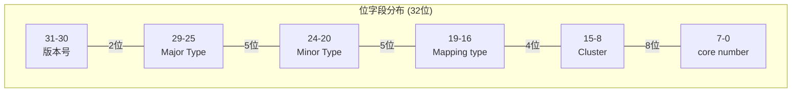
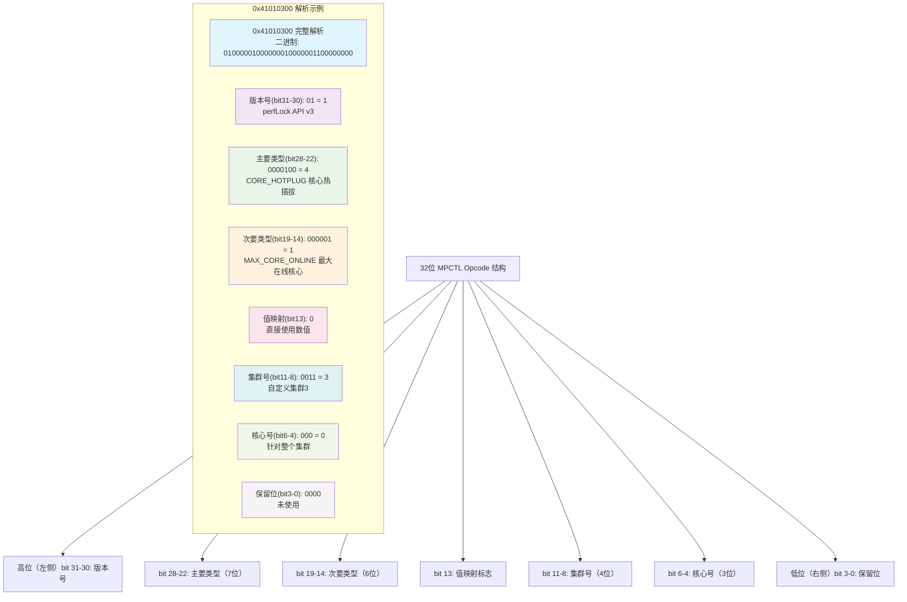
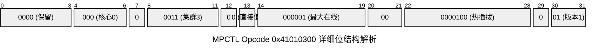

# 背景

1. 现在高通平台Perflock api在上层使用非常频繁,会碰到各种perflock opcode。一般基本的opcode的意义和其相

对应的sysnode,可以查阅KBA-200524182546,但是该文档老旧,没有更新,不不包含新平台新增的opcode

* 关于perflock opcode为32位的二进制value,关于valuemap介绍在80-NR2556-2中有涉及

* 经常会遇到两类问题,这个opcode控制什么节点?控制这个节点的opcode是什么?怎么为自定义的节点新增

opcode呢?

本篇可以回答以上疑问。


# Perflock opcode value map

1. 已知perflock opcode查找控制节点

以"0x41010300"为例,我们不知道这个opcode到底有什么用。

0x41010300 ----->> 100000100000000000000000000000000

详解见下图:











* 已知控制节点查找perflock opcode

同样的,如果我们知道某个节点,想知道上层通过哪个opcode来控制的呢?可以先在resource config配置里面搜

素节点关键字,确定MajorType和MinorType,即可通过上述方式组合成ogocode


# 自定义 perflock opcode

可以按照高通的规则,新增perflock opcode,便于上层借助perflock来操作底层自定义的节点。

```bash
<Major OpcodeValue="0x10"/>
<Minor OpcodeValue="0x1" Node="/sys/block/zram0/smartswap_swapd_pause" />
```

Major type=0x10,MinorType=0x1。

所以opcode value =100010000000000000000000000000000 ......>>0x44004000


# 参考文档

https://docs.qualcomm.com/bundle/80-NR256-2/resource/80-NR256-2\_REV\_E\_MPCTL\_Feature.pdf Chapter3.3 & Chapter 3.4


# 1. 理解Opcode的本质

在高通的MPCTL系统中，Opcode就像是一把"钥匙"，它告诉系统你想要控制哪个硬件资源，以及如何控制它。这个32位的数字包含了所有必要的信息，就像身份证号码包含了一个人的各种信息一样。

# 2. Opcode的结构解析

根据文档Figure 3-1，Opcode是一个32位整数，结构如下：

```plain&#x20;text
31-30: 版本号 (Version Number)
28-22: 主要类型 (Major Type) 
19-14: 次要类型 (Minor Type)
13:    值映射类型 (Value Mapping)
11-8:  集群号 (Cluster Number)
6-4:   核心号 (Core Number)
其他:   保留位 (Reserved)
```

32位的Opcode每个部分都有特定的含义：

**版本号（31-30位）**：告诉系统这是第几代的指令格式。对于新的perfLock API，这个值固定为1，对应二进制的"01"，十六进制就是0x4。

**主要类型（28-22位，共7位）**：在MPCTL中，它表示要控制的硬件大类，比如CPU频率、调度器、GPU等。

**次要类型（19-14位，共6位）**：比如在CPU频率大类下，是要控制最小频率还是最大频率。

**值映射标志（13位）**：这是一个开关，决定传入的数值是直接使用，还是需要通过映射表转换。

**集群编号（11-8位，共4位）**：在多核CPU中，这指定要控制哪个CPU集群。现代手机通常有大核集群和小核集群。

**核心编号（6-4位，共3位）**：在指定的集群内，进一步指定要控制哪个具体的CPU核心，就像指定楼里的哪个房间。

# 3. 构造Opcode的步骤详解

通过一个具体例子来演示如何构造Opcode。假设我们要创建一个控制大核集群最小频率的Opcode：

**第一步：确定版本号** 所有新的perfLock API都使用版本1，所以我们的基础值是：

```plain&#x20;text
基础Opcode = 0x40000000
```

这里的4代表版本号1（二进制01），后面的0都是占位符。

**第二步：选择主要资源类型** 我们要控制CPU频率，根据文档中的表格，CPU频率对应的主要类型是0x2。我们需要把这个值放到第28-22位：

```plain&#x20;text
0x2 << 22 = 0x800000
```

**第三步：选择次要资源类型** 我们要控制最小频率，对应的次要类型是0x0。放到第19-14位：

```plain&#x20;text
0x0 << 14 = 0x0
```

**第四步：设置其他参数**

* 值映射：不使用映射，设为0

* 集群：大核集群，设为0

* 核心：第0个核心，设为0

最终的Opcode计算：

```plain&#x20;text
Opcode = 0x40000000 + 0x800000 + 0x0 + 0x0 + 0x0 + 0x0 = 0x40800000
```

# 4. 深入理解值映射机制

值映射是一个非常重要的概念，让我用一个生活化的例子来解释。假设在不同的城市都有房子，每个城市的"舒适温度"标准不同。北京可能是22度，海南可能是26度。如果想在所有房子里都设置"舒适温度"，传统做法是给每个房子发送不同的具体温度值。

但值映射机制允许只需要发送"舒适温度"这个抽象概念（比如用数字2表示），然后每个城市的系统会自动转换成当地的具体温度值。这样，代码可以在不同平台上运行，而无需修改。

在MPCTL中，这个机制用于处理不同芯片平台的差异。比如，"高性能频率"在骁龙855上可能是2.84GHz，在骁龙888上可能是2.995GHz。通过值映射，只需要指定"我要高性能级别"，系统会自动选择合适的频率。

# 5. 集群概念的深度理解

现代ARM处理器采用big.LITTLE架构，就像一个公司里有高级工程师和初级工程师。大核（big cores）能力强但耗电多，适合处理复杂任务；小核（little cores）能力一般但省电，适合处理简单任务。

高通还引入了"预定义集群"概念，这是一种更智能的抽象。比如：

* LAUNCH\_CLUSTER：专门优化应用启动的集群配置

* SCROLL\_CLUSTER：专门优化滚动操作的集群配置

* ANIMATION\_CLUSTER：专门优化动画显示的集群配置

这就像为不同的使用场景预设了最佳的"工作组配置"。

# 6. 高级技巧

## 6.1 值映射机制的深层应用

值映射机制的设计哲学体现了高通工程师的前瞻性思考。当为多个不同芯片平台开发应用时，比如需要同时支持骁龙855、骁龙888、骁龙8 Gen1等，每个平台的硬件能力和最优频率配置都有差异。传统方式下，需要为每个平台编写不同版本的性能调优代码，这不仅增加了维护成本，还容易出错。

值映射允许定义抽象的性能级别，比如"节能模式"、"均衡模式"、"高性能模式"等概念性描述。系统会根据当前平台的硬件特性，自动将这些抽象级别转换为具体的硬件参数。

在实际开发中，建议优先考虑使用值映射，特别是当应用需要在多个设备上运行时。只有在需要精确控制特定硬件参数时，才使用直接数值设置。

## 6.2 预定义集群的智能调度策略

预定义集群是高通MPCTL系统中一个非常巧妙的设计。它不仅仅是简单的硬件抽象，更是基于大量性能测试和用户行为分析得出的最佳实践封装。

1. 以LAUNCH\_CLUSTER为例，这个集群配置是专门为应用启动场景优化的。通过分析f应用启动过程，发现启动阶段通常需要短时间的高性能计算能力，但持续时间不长。因此LAUNCH\_CLUSTER可能会倾向于使用大核集群，但会智能地控制持续时间，避免过度发热和耗电。

2. SCROLL\_CLUSTER则针对滚动操作进行了优化。滚动操作的特点是需要连续的、相对稳定的性能输出，而不是突发的高性能。因此这个集群可能会选择中等频率但稳定的配置，既保证流畅度又控制功耗。

3. ANIMATION\_CLUSTER专注于动画显示的优化，这通常需要与GPU协同工作，因此可能会同时调整CPU和GPU的频率配置，确保动画播放的一致性和流畅度。

## 6.3 核心编号的精细控制策略

在多核CPU系统中，核心编号的使用需要特别谨慎。现代ARM处理器通常采用异构多处理架构，不同的核心具有不同的性能特征和功耗表现。

对于大多数应用场景，建议将核心编号设置为0，这表示对整个集群进行控制，而不是针对特定核心。这种做法有几个优势：首先，它让系统的调度器保持更大的灵活性，能够根据实际负载情况动态分配任务到最合适的核心；其次，它避免了硬绑定某个核心可能带来的热点问题；最后，它提高了代码的可移植性，因为不同平台的核心数量和编号可能不同。

只有在非常特殊的情况下，比如需要进行精确的性能测试或者实现特定的负载均衡策略时，才考虑使用具体的核心编号。即使在这种情况下，也要充分测试以确保不会对系统稳定性造成负面影响。

## 6.4 性能与功耗的平衡

在Android系统中使用MPCTL进行性能优化时，最大的挑战之一是在性能和功耗之间找到合适的平衡点。过度的性能提升会导致设备发热严重、电池续航缩短，而保守的配置则可能影响用户体验。

建议采用渐进式的调优策略。首先从最基本的配置开始，比如适度提升最小频率或增加在线核心数，然后通过实际测试观察效果。在测试过程中，不仅要关注性能指标，还要监控温度变化、电池消耗速度、以及长时间运行的稳定性。

对于不同的应用场景，应该制定差异化的调优策略。游戏应用可能需要更激进的性能配置，而工具类应用则应该优先考虑功耗控制。社交媒体应用需要在滚动浏览时保证流畅度，但在静态查看内容时应该降低功耗。
