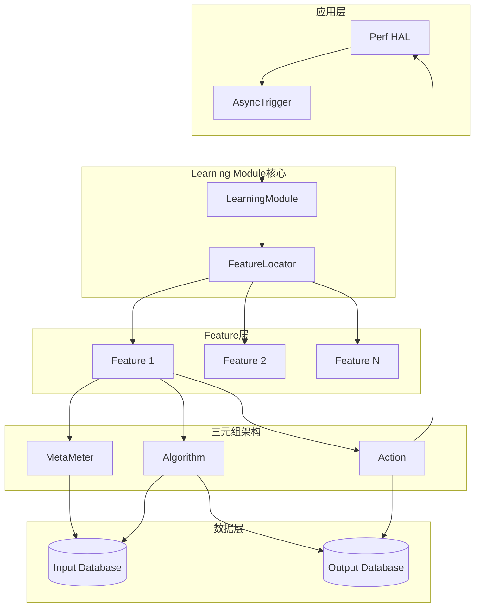
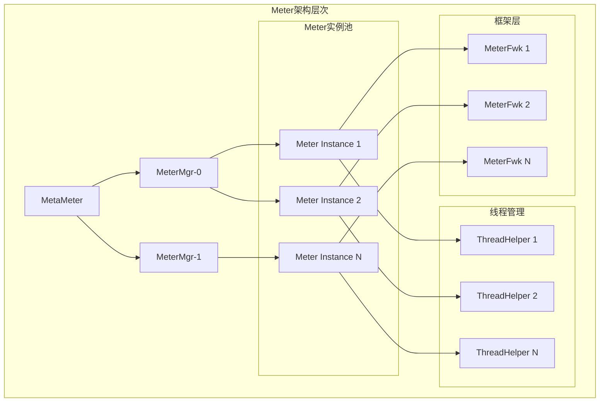
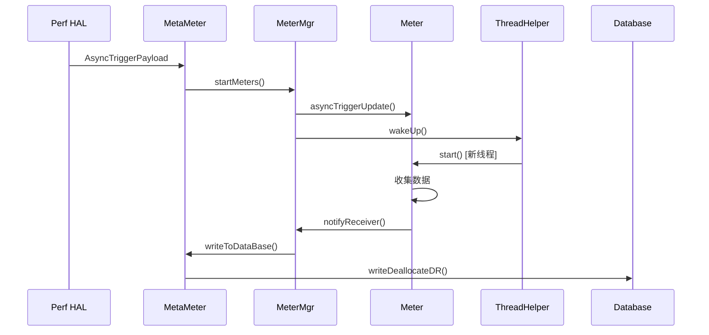
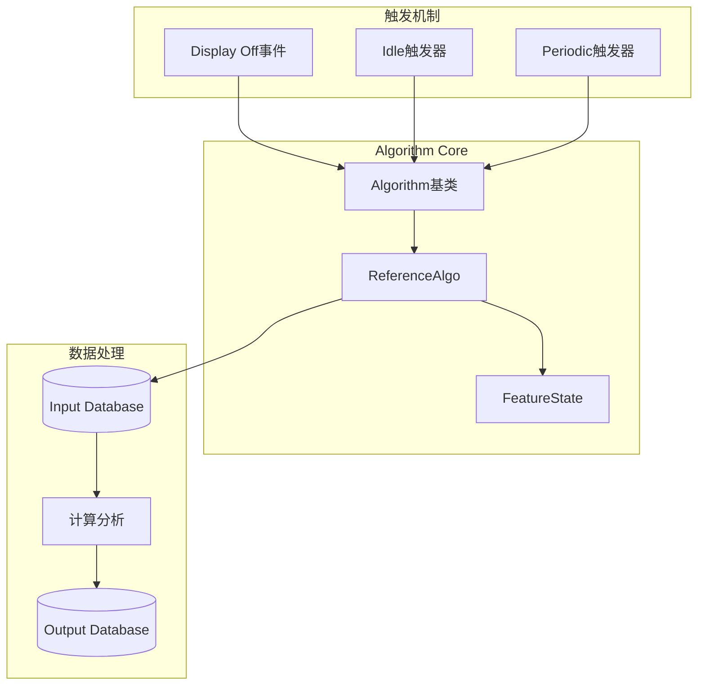
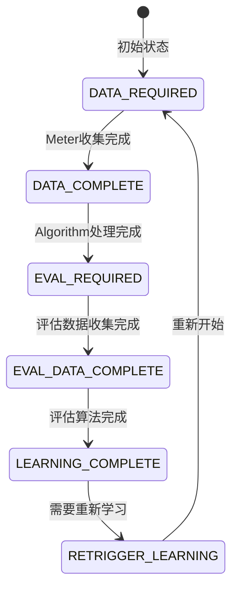
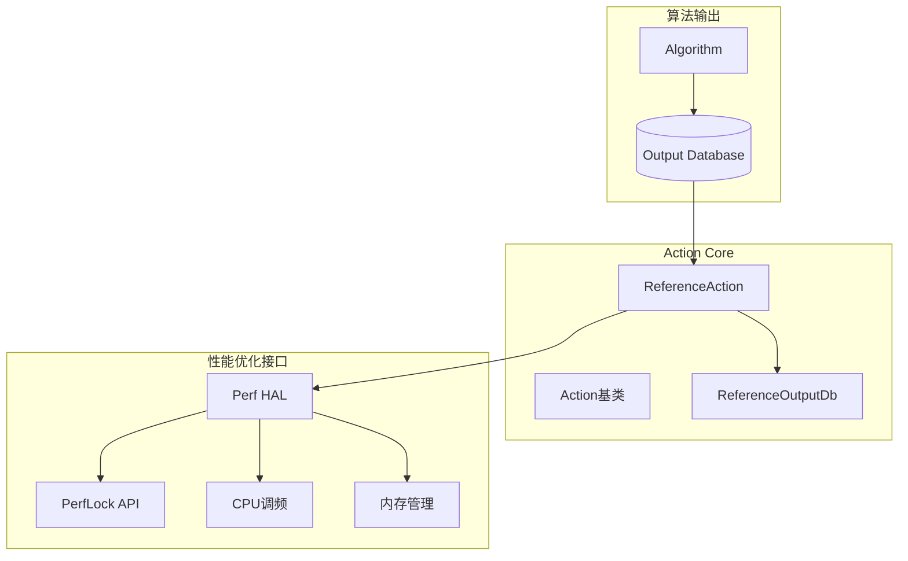

## 概述

Android Learning Module（LM）是Android性能优化框架的核心组件，采用机器学习技术在运行时学习用户行为模式并应用相应的性能优化策略。该框架基于ARM和ARM64架构，针对移动设备的性能特点进行了深度优化。

### 设计理念

Learning Module采用**三元组架构**（Meter-Algorithm-Action），通过数据收集、模式学习和策略应用三个阶段实现智能性能优化：

- **Meter（测量器）**：收集系统和应用的性能数据
- **Algorithm（算法）**：分析收集到的数据，进行机器学习和模式识别
- **Action（动作）**：根据算法输出应用性能优化策略

### 核心特性

- **异步触发机制**：基于系统事件的非阻塞数据收集
- **持久化学习**：使用SQLite数据库存储学习状态和结果
- **资源感知**：根据电池状态和系统负载智能调度
- **模块化设计**：支持动态加载和扩展新的学习特性
- **中断响应**：确保不影响用户体验的响应式处理

## 第一章 整体架构

### 1.1 架构概览



### 1.2 核心组件

#### LearningModule（核心管理器）

- 框架初始化和生命周期管理
- 处理来自perf-hal的异步触发器
- 调度空闲时算法执行
- 管理Feature加载和注册

#### Feature（功能特性）

- 每个Feature包含完整的学习流水线
- 管理MetaMeter、Algorithm、Action三个组件
- 维护应用级别的学习状态

#### FeatureLocator（特性定位器）

- 提供Feature间的服务发现和通信
- 支持跨Feature数据共享

### 1.3 数据库系统

基于SQLite的Learning Module Database（LMDB）提供：

- **输入数据库**：存储Meter收集的原始性能数据
- **输出数据库**：存储Algorithm分析的学习结果
- **状态数据库**：持久化Feature和应用的学习状态

### 1.4 工作流程

1. **初始化阶段**：解析XML配置文件，动态加载Feature库，初始化数据库和线程
2. **数据收集阶段**：接收perf-hal的异步触发器，启动相应的Meter收集数据
3. **学习阶段**：在系统空闲时触发算法，分析历史数据生成优化策略
4. **优化应用阶段**：根据学习结果在适当时机应用性能优化

## 第二章 Meter模块

### 2.1 模块架构

Meter模块负责系统性能数据的收集，采用多线程异步架构确保数据收集不影响系统性能。



### 2.2 核心类设计

#### Meter基类

```cpp
class Meter {
private:
    std::string mMeterName;
    MeterFwk* mMeterFwk;
    bool hasStop;
    std::vector<AsyncTriggerPayload> asyncUpdates;
    mutex mClearMutex;
    
public:
    virtual void start() = 0;  // 核心数据收集接口
    virtual void asyncTriggerUpdate(const AsyncTriggerPayload& asyncUpdate);
    bool hasStopNotification();
};
```

#### ReferenceMeter实现

```cpp
class ReferenceMeter: public Meter {
private:
    std::time_t mTimeField;
    
public:
    void start() override {
        std::time_t timeNow = std::time(nullptr);
        if (timeNow != (std::time_t)(-1)) {
            mTimeField = timeNow;  // 收集当前时间戳
        }
    }
    
    std::time_t getTime() { return mTimeField; }
};

// 自动注册到工厂
MeterRegistry<ReferenceMeter> ReferenceMeter::registerMeter("RefMeter");
```

### 2.3 设计模式应用

#### 工厂模式 + 注册表模式

- 通过MeterRegistry实现Meter的自动注册和创建
- 支持运行时动态加载新的Meter实现

#### Observer模式

- MeterReceiver作为观察者接口
- MeterMgr实现具体观察者，处理Meter完成通知

#### 双缓冲管理器模式

- 使用两个MeterMgr实现双缓冲，避免数据收集阻塞
- MeterMgr-0和MeterMgr-1交替工作

### 2.4 数据收集流程



### 2.5 性能优化特性

#### 防洪机制

当触发器队列达到阈值时自动清空，防止系统过载。

#### 线程池管理

每个Meter在独立线程中运行，使用ThreadHelper管理线程生命周期。

#### 中断机制

支持优雅中断，确保不影响用户体验。

## 第三章 Algorithm模块

### 3.1 模块架构

Algorithm模块负责分析Meter收集的数据，学习用户行为模式并生成优化策略。



### 3.2 核心算法实现

#### ReferenceAlgo核心逻辑

```cpp
void ReferenceAlgo::runAlgo(const atomic_bool& interrupt) {
    // 1. 获取所有应用列表
    auto appNameList = mReferenceInputDb->getTxtColUniqList<time_t>(TXTCOL_APPNAME);
    
    // 2. 遍历每个应用
    for(string currAppName : appNameList) {
        // 3. 中断检查机制
        if(interrupt) {
            break;  // 响应中断，避免影响用户体验
        }
        
        // 4. 状态验证
        if(isValidAlgoState(currAppName)) {
            // 5. 数据读取和分析
            processAppData(currAppName);
            
            // 6. 状态转换
            evalRequired(currAppName);
        }
    }
}
```

### 3.3 学习算法详解

#### 启动间隔时间学习

当前实现的核心算法学习用户应用启动模式：

1. **数据收集**：Meter记录每次应用启动时间戳
2. **间隔计算**：计算相邻启动之间的时间差
3. **模式学习**：计算平均启动间隔时间
4. **结果存储**：将学习结果存入输出数据库

#### 计算示例

```
输入数据：
com.android.mms启动时间记录：
- 10:00:00 (1640995200)
- 10:10:00 (1640995800) 
- 10:25:00 (1640996700)
- 10:35:00 (1640997300)

计算过程：
间隔1 = 10:10:00 - 10:00:00 = 600秒  (10分钟)
间隔2 = 10:25:00 - 10:10:00 = 900秒  (15分钟)  
间隔3 = 10:35:00 - 10:25:00 = 600秒  (10分钟)

结果：
平均启动间隔 = (600 + 900 + 600) / 3 = 700秒 (11.67分钟)
```

### 3.4 状态管理

#### 应用学习状态机



### 3.5 触发机制

#### 三种触发方式

1. **空闲触发**：屏幕关闭且电池充电时
2. **周期性触发**：定时执行学习算法
3. **手动触发**：调试和测试使用

#### 电池状态检测

```cpp
void LearningModule::detectAndRunIdle(bool debugIdleTrigger) {
    if(!debugIdleTrigger) {
        // 检查充电状态
        BatteryStatus chargeStatus = getBatteryStatus();
        if(chargeStatus != BatteryStatus::CHARGING && 
           chargeStatus != BatteryStatus::FULL) {
            return;  // 未充电不执行算法
        }
        
        // 检查电量水平
        unsigned int batteryLevel = getBatteryLevel();
        if(batteryLevel < IDLE_BATTERY_THRESHOLD) {  // 50%
            this_thread::sleep_for(5min);
        }
    }
    
    // 执行算法
    runAlgorithms();
}
```

## 第四章 Action模块

### 4.1 模块架构

Action模块将算法学习结果转化为实际的系统性能优化动作。



### 4.2 核心实现

#### Action基类接口

```cpp
class Action {
public:
    virtual void* getActionOutputDb() = 0;
    virtual void applyAction(const AsyncTriggerPayload& payload) = 0;
};
```

#### ReferenceAction实现

```cpp
class ReferenceAction : public Action {
private:
    ReferenceOutputDb* mReferenceActionOutputDb;
    
public:
    static ReferenceAction& getInstance() {
        static ReferenceAction refActionInstance;  // Meyer's单例
        return refActionInstance;
    }
    
    void applyAction(const AsyncTriggerPayload& payload) override {
        // 读取学习结果并应用优化策略
        applyOptimizationStrategy(payload);
    }
};
```

### 4.3 数据库设计

#### 输出数据结构

```cpp
struct ReferenceOutput {
    double timeBetweenLaunches;  // 启动间隔时间(秒)
};

// 数据库表结构示例
// 表名: ReferenceOutput.db
// APPNAME | PAYLOAD(ReferenceOutput)
// com.android.mms | {700.0}
```

### 4.4 优化策略示例

```cpp
void ReferenceAction::applyAction(const AsyncTriggerPayload& payload) {
    // 读取学习结果
    double avgInterval = getLearnedInterval(payload.appName);
    
    // 决策优化策略
    if(avgInterval < 300) {  // 5分钟内高频使用
        applyPreloadStrategy(payload.appName);
    } else if(avgInterval < 1800) {  // 30分钟内中频使用  
        applyCpuBoostStrategy(payload.appName);
    }
}
```

## 第五章 数据库系统

### 5.1 数据库架构

Learning Module Database（LMDB）基于SQLite实现，提供类型安全的数据存储。

#### 统一表结构

```sql
CREATE TABLE IF NOT EXISTS table_name (
    INTCOL1 INTEGER,
    APPNAME TEXT NOT NULL, 
    RSVNAME TEXT,
    PAYLOAD BLOB,
    rowid INTEGER PRIMARY KEY
);
```

### 5.2 数据存储模式

#### 模板化数据库

```cpp
template <class... T>
class LMDatabase : LMDBDataTable<T>... {
public:
    template <class T1>
    vecT<T1> allocateDR(DRSize);
    
    template <class T1>
    int writeDeallocateDR(vecT<T1>&);
    
    template <class T1>
    vecT<T1> readAllocateDR(LMDBDataRowKey&, DRSize);
};
```

#### 数据行结构

```cpp
template <class S>
class LMDBDataRow {
    LMDBDataRowHeader dataRowHeader;  // 行头信息
    LMDBDataRowKey dataRowKey;        // 键值信息
    S dataRowPayload;                 // 实际数据负载
};
```

### 5.3 数据流示例

#### 输入数据存储

```
表名：Reference.db
APPNAME           | PAYLOAD      | 说明
com.android.mms   | 1640995200   | 启动时间戳1
com.android.mms   | 1640995800   | 启动时间戳2
com.android.settings | 1640996000 | 启动时间戳3
```

#### 输出数据存储

```
表名：ReferenceOutput.db
APPNAME           | PAYLOAD      | 说明
com.android.mms   | {700.0}      | 平均启动间隔700秒
com.android.settings | {1200.0}  | 平均启动间隔1200秒
```

## 第六章 系统集成

### 6.1 配置管理

#### XML配置文件

Learning Module通过XML文件配置Feature的行为：

```xml
<Feature>
    <Name>RefFeature</Name>
    <Libname>libreffeature.so</Libname>
    <Meters>
        <SamplesRequired>10</SamplesRequired>
        <Meter>
            <Name>RefMeter</Name>
            <Triggers>
                <Trigger>
                    <Primary>true</Primary>
                    <AsyncId>VENDOR_HINT_FIRST_LAUNCH_BOOST</AsyncId>
                    <AsyncType>1</AsyncType>
                </Trigger>
            </Triggers>
        </Meter>
    </Meters>
</Feature>
```

### 6.2 动态加载机制

#### Feature注册

```cpp
// Feature自动注册
FeatureRegistry<ReferenceFeature> ReferenceFeature::registerFeature("RefFeature");

// 运行时加载
Feature* feature = FeatureRegistryBase::get(featureInfo);
```

### 6.3 线程模型

#### 多线程架构

- **LM Core Thread**：主控制线程，处理触发器分发
- **Meter Threads**：数据收集线程池
- **Algorithm Thread**：空闲时算法执行线程
- **Async Delivery Threads**：异步事件分发线程

### 6.4 性能监控

#### Trace支持

```cpp
if(mEnableTracing) {
    string traceLog = "LM-runAlgo() " + featureName;
    ATRACE_ASYNC_BEGIN(traceLog.c_str(), 0);
    runAlgorithm();
    ATRACE_ASYNC_END(traceLog.c_str(), 0);
}
```

## 第七章 扩展与展望

### 7.1 架构扩展能力

#### 新Meter类型扩展

可以开发更多专业的Meter实现：

```cpp
class MemoryMeter : public Meter {
    void start() override {
        // 读取/proc/meminfo
        // 收集RSS, PSS, USS等内存指标
        collectMemoryMetrics();
    }
};

class CPUMeter : public Meter {
    void start() override {
        // 读取/proc/stat, /proc/pid/stat
        // 收集CPU使用率、频率等
        collectCpuMetrics();
    }
};

class IOPMeter : public Meter {
    void start() override {
        // 读取/proc/pid/io
        // 收集I/O统计信息
        collectIOMetrics();
    }
};
```

#### 高级算法扩展

```cpp
class MLAlgorithm : public Algorithm {
    void runAlgo(const atomic_bool& interrupt) override {
        // 实现机器学习算法
        // - 神经网络预测
        // - 聚类分析
        // - 时间序列预测
        runMLAnalysis();
    }
};
```

### 7.2 优化策略扩展

#### 智能预加载

```cpp
class PreloadAction : public Action {
    void applyAction(const AsyncTriggerPayload& payload) override {
        if(shouldPreload(payload.appName)) {
            // 预加载应用到内存
            perf_hint(VENDOR_HINT_PRELOAD, payload.appName.c_str(), 0, 0);
        }
    }
};
```

#### 动态CPU调度

```cpp
class CPUBoostAction : public Action {
    void applyAction(const AsyncTriggerPayload& payload) override {
        int boostLevel = calculateBoostLevel(payload.appName);
        // 动态调整CPU频率
        perf_lock_acq(handle, duration, cpuConfigs, configSize);
    }
};
```

#### 内存管理优化

```cpp
class MemoryAction : public Action {
    void applyAction(const AsyncTriggerPayload& payload) override {
        // 基于学习结果优化内存分配
        optimizeMemoryForApp(payload.appName);
    }
};
```

### 7.3 AI集成展望

#### 深度学习集成

- **TensorFlow Lite集成**：在设备端运行轻量级神经网络模型
- **用户行为预测**：基于多维特征预测用户下一步操作
- **个性化优化**：为每个用户定制专属的性能优化策略

#### 联邦学习支持

- **隐私保护学习**：在不泄露用户数据的前提下进行模型训练
- **跨设备知识共享**：共享通用的优化模式
- **持续学习能力**：模型随着使用不断改进

### 7.4 生态系统集成

#### Android系统集成

- **ActivityManager集成**：预测应用生命周期
- **WindowManager集成**：优化窗口切换性能
- **PackageManager集成**：应用安装和更新优化

#### 硬件厂商定制

- **SoC特定优化**：针对不同芯片平台的定制优化
- **传感器数据融合**：利用加速度计、陀螺仪等传感器数据
- **电源管理集成**：与PMIC深度集成的功耗优化

### 7.5 发展方向

#### 短期目标

1. **完善基础Framework**：增强Meter、Algorithm、Action的基础能力
2. **丰富学习算法**：实现更多机器学习算法
3. **扩展数据源**：集成更多系统性能指标

#### 中期目标

1. **AI算法集成**：引入深度学习和强化学习
2. **跨应用优化**：实现应用间的协同优化
3. **实时优化能力**：毫秒级响应的性能调优

#### 长期愿景

1. **自适应系统**：完全自主的性能优化系统
2. **预测性优化**：基于用户意图的主动优化
3. **生态协同**：与云端服务、IoT设备的协同优化

Learning Module框架为Android性能优化提供了一个强大、可扩展的基础平台，通过持续的算法创新和系统集成，有望实现真正智能的移动设备性能管理。