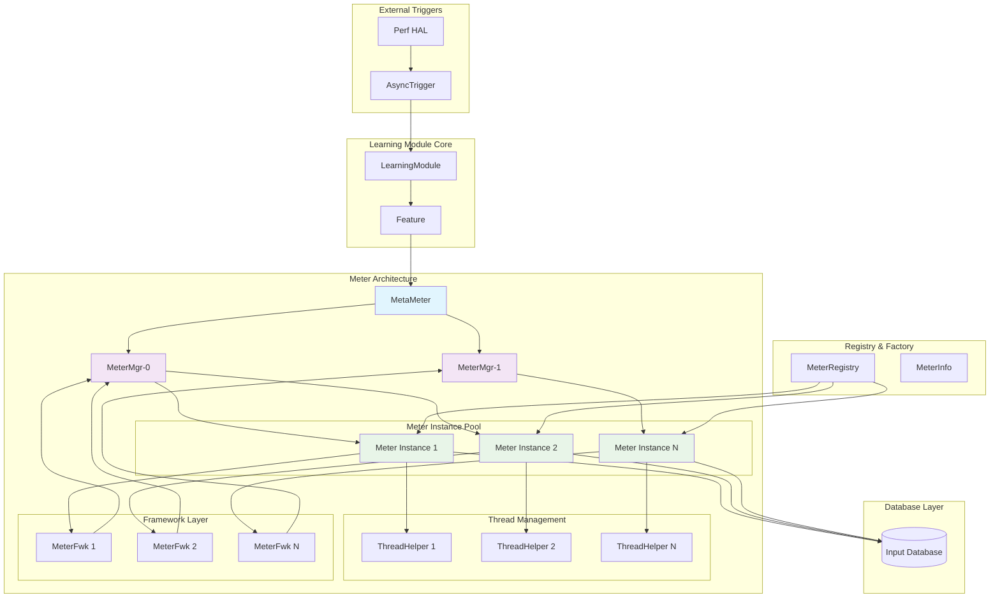
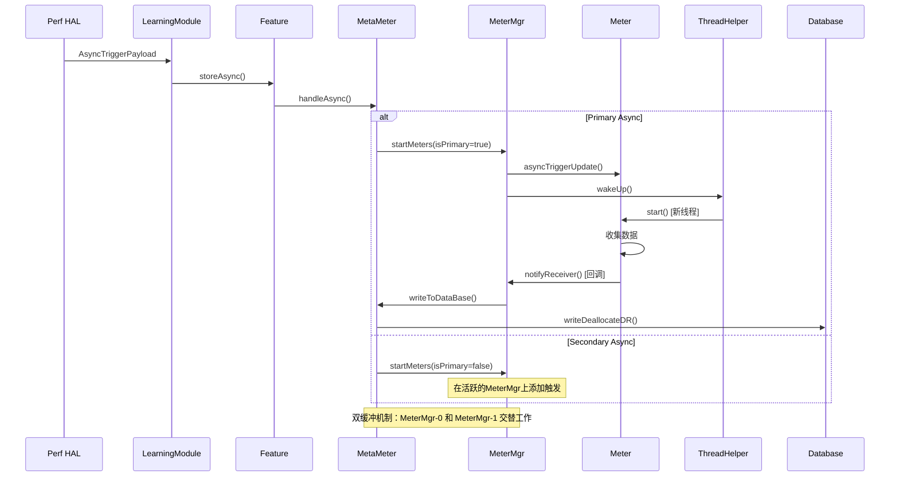
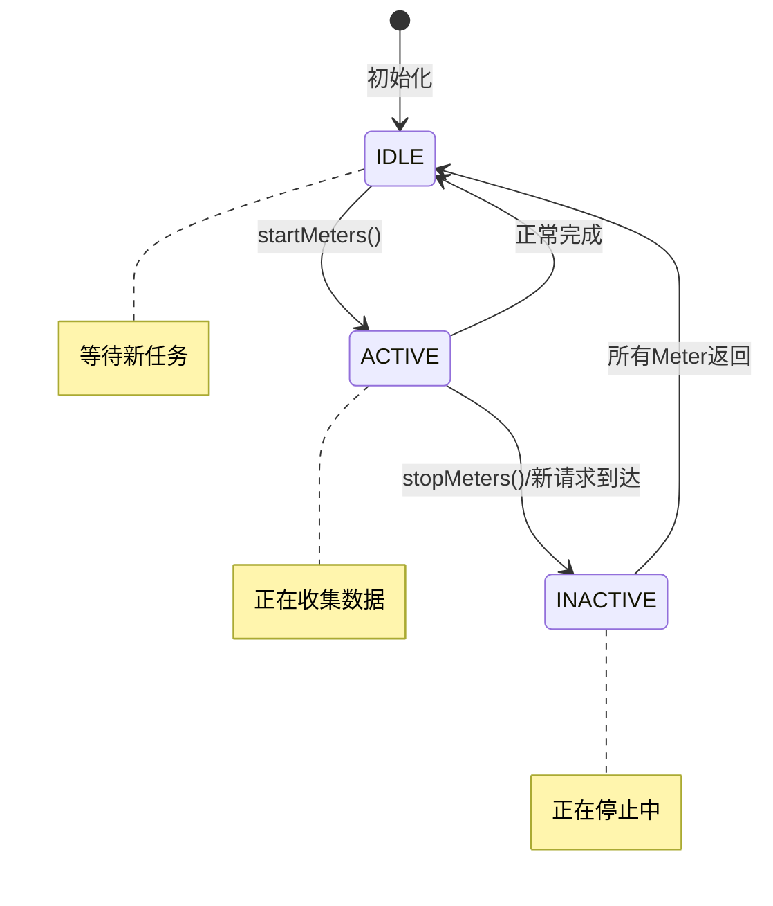
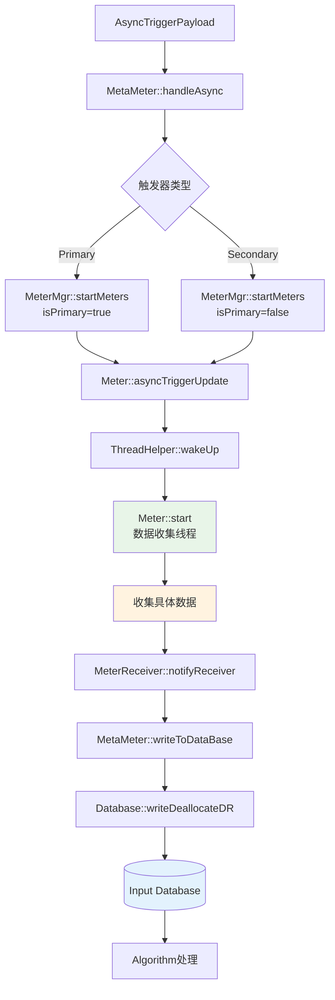
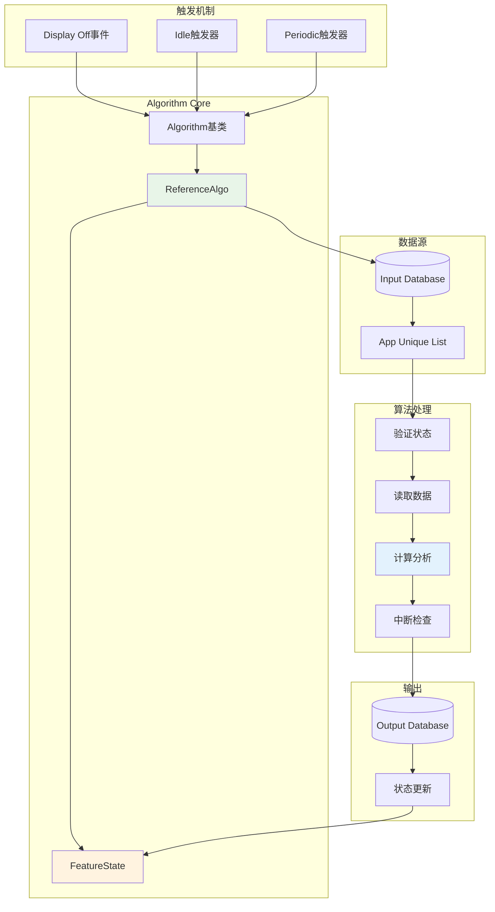
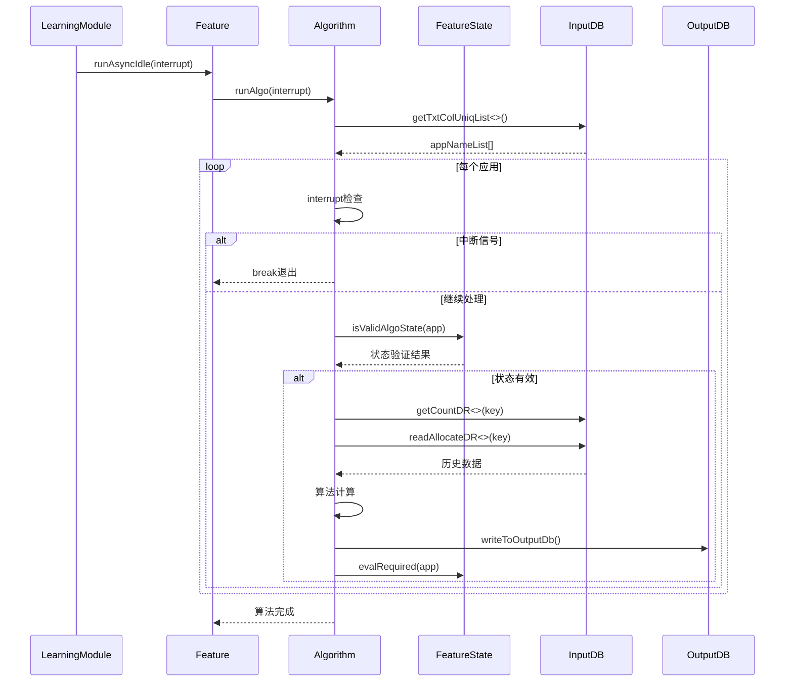
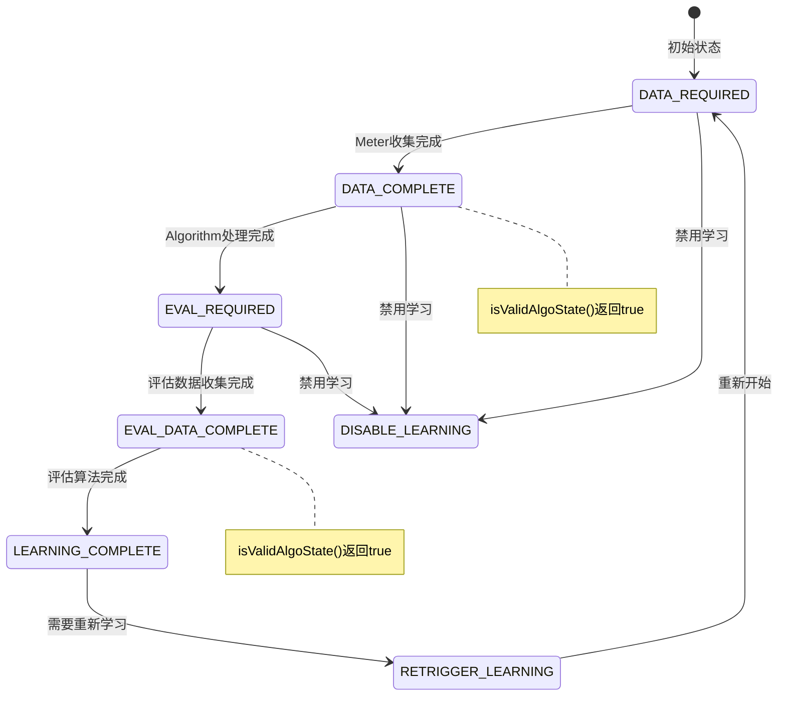
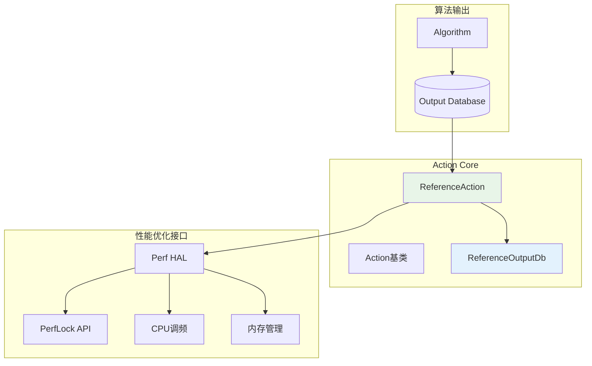
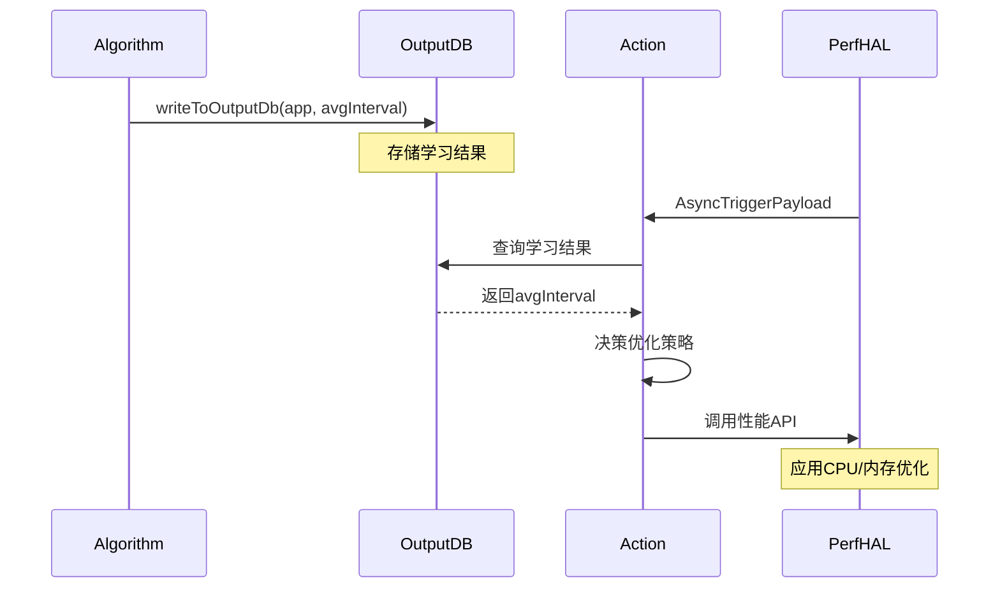

# 核心架构

Learning Module采用了**三元组架构**（Meter-Algorithm-Action）：

## Meter（测量器）

- **作用**：收集系统和应用的性能数据
- **实现**：`Meter`基类和具体实现如`ReferenceMeter`
- **数据收集**：通过异步触发器收集时间戳、内存状态等数据
- **线程模型**：每个Meter在独立线程中运行，使用`ThreadHelper`管理

## Algorithm（算法）

- **作用**：分析收集到的数据，进行机器学习和模式识别
- **实现**：`Algorithm`基类，具体如`ReferenceAlgo`
- **学习过程**：分析应用启动间隔时间等模式
- **状态管理**：通过`FeatureState`跟踪每个应用的学习状态

## Action（动作）

- **作用**：根据算法输出应用性能优化策略
- **实现**：`Action`基类，具体如`ReferenceAction`
- **优化策略**：可以调用perflock、调整CPU频率等

# 核心组件详解

## LearningModule（核心管理器）

```cpp
// 主要职责：
- 初始化整个框架
- 管理Feature生命周期
- 处理来自perf-hal的异步触发器
- 调度空闲时算法执行
```

## Feature（功能特性）

```cpp
// 每个Feature包含：
- MetaMeter: 管理多个Meter
- Algorithm: 数据分析算法
- Action: 性能优化动作
- FeatureState: 应用状态管理
```

## 数据库系统（LMDB）

- **输入数据库**：存储Meter收集的原始数据
- **输出数据库**：存储Algorithm分析结果
- **基于SQLite**：持久化存储，支持事务

## 异步触发机制

```cpp
// 触发器类型：
- VENDOR_HINT_FIRST_LAUNCH_BOOST: 应用首次启动
- VENDOR_HINT_FIRST_DRAW: 应用首次绘制
- VENDOR_HINT_DISPLAY_OFF: 屏幕关闭（触发算法）
```

# 工作流程

1. **初始化阶段**：
   - 解析XML配置文件
   - 动态加载Feature库
   - 初始化数据库和线程
2. **数据收集阶段**：
   - 接收perf-hal的异步触发器
   - 启动相应的Meter收集数据
   - 数据存储到输入数据库
3. **学习阶段**：
   - 屏幕关闭时触发算法
   - 分析数据库中的历史数据
   - 生成优化策略存储到输出数据库
4. **优化应用阶段**：
   - 根据输出数据库的策略
   - 在适当时机应用性能优化


# Meter分析

## 模块产物分析

### 编译产物

```bash
# 从Android.bp可以看出产物结构
libmeters.so              # Meter实现库
├── ReferenceMeter.cpp     # 具体Meter实现
└── perf_lm_meters_headers # 头文件

liblearningmodule.so       # 框架核心库  
├── Meter.cpp             # Meter基类实现
├── MeterMgr.cpp          # Meter管理器
├── MetaMeter.cpp         # 元Meter管理器
├── ThreadHelper.cpp      # 线程辅助类
└── MeterFwk.cpp          # Meter框架类
```

### 核心类层次结构

```cpp
Meter (抽象基类)
├── ReferenceMeter (具体实现)
├── MemoryMeter (潜在扩展)
└── CPUMeter (潜在扩展)

MeterReceiver (回调接口)
└── MeterMgr (管理器实现)

ThreadHelper (线程管理)
MeterFwk (框架封装)
MetaMeter (元管理器)
```

## 整体架构图



## 架构模式分析

### 工厂模式 + 注册表模式

```cpp
// MeterRegistry.h - 工厂注册模式
template<typename TMeter>
using MeterRegistry = Registry<Meter, MeterInfo, TMeter>;

// ReferenceMeter.cpp - 自动注册
MeterRegistry<ReferenceMeter> ReferenceMeter::registerMeter("RefMeter");

// 创建流程
Meter* meter = MeterRegistryBase::get(meterInfo);  // 工厂创建
```

### Observer模式

```cpp
// MeterReceiver.h - 观察者接口
class MeterReceiver {
public:
    virtual void notifyReceiver(Meter *m) = 0;  // 回调通知
};

// MeterMgr.cpp - 具体观察者
class MeterMgr : public MeterReceiver {
    void notifyReceiver(Meter *m) override {
        // 处理Meter完成通知
        lock();
        returnedMeters++;
        // 状态更新和数据写入
        unlock();
    }
};
```

### 管理器模式

```cpp
// MetaMeter.h - 双缓冲管理器模式
class MetaMeter {
    MeterMgr* metaMgrList[METER_MGR_MAX];  // 双缓冲：0和1
    
    int handlePrimaryAsync(const AsyncTriggerPayload& data);    // 主要异步处理
    int handleSecondaryAsync(const AsyncTriggerPayload& data);  // 次要异步处理
};
```

## 数据收集机制详解

### 数据收集时序图



### 线程模型分析

```cpp
// ThreadHelper.cpp - 线程管理核心
void* ThreadHelper::thread_callback(void* helper) {
    ThreadHelper *threadHelper = (ThreadHelper *)helper;
    
    while(!shouldExit) {
        // 1. 等待唤醒信号
        pthread_mutex_lock(&threadHelper->mutex);
        while(!threadHelper->update) {
            threadHelper->threadCreated = true;
            pthread_cond_wait(&threadHelper->cond_wait, &threadHelper->mutex);
        }
        threadHelper->update = false;
        pthread_mutex_unlock(&threadHelper->mutex);
        
        // 2. 执行Meter数据收集
        if(!shouldExit) {
            threadHelper->meter->start();  // 核心数据收集
            
            // 3. 通知完成
            MeterReceiver* receiver = threadHelper->meter->getMeterFwk()->getReceiver();
            if(receiver) {
                receiver->notifyReceiver(threadHelper->meter);
            }
        }
    }
    return NULL;
}
```

### **4.3 双缓冲机制**

```cpp
// MetaMeter.cpp - 双缓冲避免阻塞
#define METER_MGR_MAX 2  // 两个MeterMgr实现双缓冲

int MetaMeter::handlePrimaryAsync(const AsyncTriggerPayload& asyncData) {
    int meterMgrIndex = 0;
    int meterMgrIndexToStart = -1;
    
    // 寻找空闲的MeterMgr
    do {
        MeterMgr* meterMgr = metaMgrList[meterMgrIndex];
        meterMgr->lock();
        if(meterMgr->getState() == IDLE) {
            meterMgr->setState(ACTIVE);
            meterMgrIndexToStart = meterMgrIndex;
        }
        meterMgr->unlock();
        meterMgrIndex++;
    } while((meterMgrIndexToStart == -1) && (meterMgrIndex != METER_MGR_MAX));
    
    if(meterMgrIndexToStart != -1) {
        // 启动找到的空闲MeterMgr
        metaMgrList[meterMgrIndexToStart]->startMeters(asyncData, true);
        
        // 停止其他正在运行的MeterMgr
        for(int i = 0; i < METER_MGR_MAX && i != meterMgrIndexToStart; i++) {
            restoreMeterMgr(i);
        }
    }
}
```

## 5. 状态机管理

### **5.1 MeterMgr状态机**



### **5.2 状态代码实现**

```cpp
// MeterMgr.h - 状态定义
enum MeterMgrState{
    IDLE = 0,      // 空闲状态
    ACTIVE = 1,    // 活跃收集数据
    INACTIVE = 2   // 停止中
};

// MeterMgr.cpp - 状态转换
void MeterMgr::notifyReceiver(Meter *m) {
    lock();
    returnedMeters++;
    
    if(startedMeters == returnedMeters) {
        if(getState() == INACTIVE) {
            // 停止完成，回到空闲
            setState(IDLE);
            reset();
        } else if(getState() == ACTIVE && returnedMeters == totalMeters) {
            // 正常完成，写入数据库
            unlock();
            if(!m->hasStopNotification()) {
                mMetaMeter->writeToDataBase(mMeterInstanceList);
            }
            lock();
            setState(IDLE);
            reset();
        }
    }
    unlock();
}
```

## 6. 核心类详细分析

### **6.1 Meter基类**

```cpp
// Meter.h - 核心抽象接口
class Meter {
private:
    std::string mMeterName;
    MeterFwk* mMeterFwk;                           // 框架封装
    bool hasStop;                                  // 停止标志
    std::vector<AsyncTriggerPayload> asyncUpdates; // 异步更新队列
    mutex mClearMutex;                             // 线程安全
    
public:
    MeterInfo mInfo;                               // Meter元信息
    
    // 核心接口
    virtual void start() = 0;                      // 数据收集主接口
    virtual void asyncTriggerUpdate(const AsyncTriggerPayload& asyncUpdate); // 异步更新
    virtual void getAsyncUpdates(std::vector<AsyncTriggerPayload>& asyncUpdates_t); // 获取更新
    
    bool hasStopNotification();                    // 检查停止信号
};
```

### **6.2 ReferenceMeter具体实现**

```cpp
// ReferenceMeter.cpp - 参考实现
class ReferenceMeter: public Meter {
private:
    std::time_t mTimeField;  // 收集的时间数据
    
public:
    void start() override {
        // 核心数据收集逻辑
        std::time_t timeNow = std::time(nullptr);
        if (timeNow != (std::time_t)(-1)) {
            mTimeField = timeNow;  // 收集当前时间戳
        } else {
            mTimeField = 0;
        }
        
        // 可以在这里添加更多数据收集逻辑：
        // - CPU使用率
        // - 内存使用量  
        // - I/O统计
        // - 网络流量等
    }
    
    std::time_t getTime() { return mTimeField; }
};

// 自动注册到工厂
MeterRegistry<ReferenceMeter> ReferenceMeter::registerMeter("RefMeter");
```

## 7. 数据流向分析

### **7.1 数据流向图**



### **7.2 内存管理**

```cpp
// MeterMgr.cpp - 内存管理
void MeterMgr::createMeterHelper(MeterInfo& meterInfo) {
    // 1. 创建Meter助手
    MeterHelper *meterHelper = new(std::nothrow) MeterHelper();
    
    // 2. 创建线程助手
    meterHelper->meterThread = new(std::nothrow) ThreadHelper(
        mFInfo.name + " " + meterInfo.name.c_str(), false);
    
    // 3. 通过工厂创建具体Meter实例
    meterHelper->meterInstance = MeterRegistryBase::get(meterInfo);
    
    // 4. 建立关联关系
    MeterFwk* meterFwk = meterHelper->meterInstance->getMeterFwk();
    meterFwk->setThreadHelper(meterHelper->meterThread);
    meterFwk->setReceiver(this);  // 设置回调
    
    // 5. 启动线程
    meterHelper->meterThread->createThread(meterHelper->meterInstance);
}
```

## 8. 性能优化特性

### **8.1 防洪机制**

```cpp
// WaitingQueue.h - 队列防洪
template<typename T>
void WaitingQueue<T>::push(const T& item) {
    std::unique_lock<std::mutex> mlock(mMutex);
    
    // 防洪：达到阈值清空队列
    if(mFlushThreshold != 0 && getSize() >= mFlushThreshold) {
        DEBUGW(TAG_WQ, "flooding detected, clearing Queue");
        while (!mQueue.empty()) {
            mQueue.pop();
        }
    }
    mQueue.push(item);
    mCond.notify_one();
}
```

### **8.2 中断机制**

```cpp
// Algorithm.h - 算法中断机制
void ReferenceAlgo::runAlgo(const atomic_bool& interrupt) {
    for(string currAppName : appNameList) {
        if(interrupt) {
            // 检查中断信号，避免影响用户体验
            break;
        }
        // 执行算法逻辑...
    }
}
```

## 9. 扩展建议

要实现生产级的Meter，建议开发：

### **MemoryMeter示例**

```cpp
class MemoryMeter : public Meter {
    void start() override {
        // 读取/proc/meminfo
        // 收集RSS, PSS, USS等内存指标
        // 存储到mMemoryData结构
    }
};
```

### **CPUMeter示例**

```cpp
class CPUMeter : public Meter {
    void start() override {
        // 读取/proc/stat, /proc/pid/stat
        // 收集CPU使用率、频率等
        // 分析CPU负载模式
    }
};
```

这个Meter模块展现了一个高度模块化、可扩展的数据收集框架，通过工厂模式、观察者模式和管理器模式的组合，实现了高效的异步数据收集和处理机制。


# Algorithm模块详细分析

## 1. 模块产物

```cpp
// 核心抽象基类
Algorithm.h              // 算法基类定义
├── runAlgo()            // 核心算法接口
├── FeatureState管理     // 应用状态控制
└── 中断机制支持

// 具体实现
ReferenceAlgo.cpp        // 参考算法实现
├── 启动间隔时间分析
├── 平均值计算
└── 输出数据库写入
```

## 2. 整体架构图



## 3. 架构模式

### **3.1 策略模式**

```cpp
// Algorithm.h - 抽象策略
class Algorithm {
protected:
    FeatureState& mFeatureState;
public:
    virtual void runAlgo(const std::atomic_bool& interrupt) = 0;
};

// ReferenceAlgo.h - 具体策略
class ReferenceAlgo: public Algorithm {
    void runAlgo(const std::atomic_bool& interrupt) override;
};
```

### **3.2 状态模式**

```cpp
// Algorithm.h - 状态管理接口
class Algorithm {
protected:
    void evalRequired(std::string& appName) {
        mFeatureState.setState(appName, AppState::EVAL_REQUIRED);
    }
    void dataRequired(std::string& appName) {
        mFeatureState.setState(appName, AppState::DATA_REQUIRED);
    }
    void evalDone(std::string& appName) {
        mFeatureState.setState(appName, AppState::LEARNING_COMPLETE);
    }
    bool isValidAlgoState(std::string& appName) {
        AppState state = mFeatureState.getState(appName);
        return (state == AppState::DATA_COMPLETE || state == AppState::EVAL_DATA_COMPLETE);
    }
};
```

## 4. 算法执行时序



## 5. 核心实现分析

### **5.1 ReferenceAlgo核心逻辑**

```cpp
// ReferenceAlgo.cpp - 主算法流程
void ReferenceAlgo::runAlgo(const atomic_bool& interrupt) {
    // 1. 获取所有应用列表
    auto appNameList = mReferenceInputDb->getTxtColUniqList<time_t>(TXTCOL_APPNAME);
    
    // 2. 遍历每个应用
    for(string currAppName : appNameList) {
        // 3. 中断检查机制
        if(interrupt) {
            break;  // 响应中断，避免影响用户体验
        }
        
        // 4. 状态验证
        if(isValidAlgoState(currAppName)) {
            LMDBDataRowKey key(currAppName);
            
            // 5. 数据读取
            int totalCount = mReferenceInputDb->getCountDR<time_t>(key);
            vector<LMDBDataRow<time_t>*> dbRows = 
                mReferenceInputDb->readAllocateDR<time_t>(key, 0);
            
            // 6. 算法计算
            time_t prevMeterData = 0;
            vector<double> timeBetweenLaunches;
            
            for (int iter = 0; iter < readCount; iter++) {
                time_t currMeterData = dbRows[iter]->dataRowPayload;
                if(prevMeterData != 0) {
                    double interval = difftime(currMeterData, prevMeterData);
                    timeBetweenLaunches.emplace_back(interval);
                }
                prevMeterData = currMeterData;
            }
            
            // 7. 计算平均启动间隔
            double sumTimes = 0;
            for(auto currTime : timeBetweenLaunches) {
                sumTimes += currTime;
            }
            double averageInterval = sumTimes / timeBetweenLaunches.size();
            
            // 8. 写入输出数据库
            writeToOutputDb(currAppName, averageInterval);
            
            // 9. 状态转换
            evalRequired(currAppName);
            
            // 10. 模拟算法耗时（测试用）
            this_thread::sleep_for(1s);
        }
    }
}
```

### **5.2 状态机管理**



### **5.3 中断机制实现**

```cpp
// 关键设计：响应式中断
void ReferenceAlgo::runAlgo(const atomic_bool& interrupt) {
    for(string currAppName : appNameList) {
        if(interrupt) {
            // 立即响应中断信号
            // 建议：每秒至少检查一次以保证用户体验
            break;
        }
        
        // 算法处理...
        // 可在耗时操作中再次检查interrupt
        
        this_thread::sleep_for(1s);  // 模拟耗时
    }
}

// Feature.cpp - 中断触发
void Feature::runAsyncIdle(const atomic_bool& interrupt) {
    if(mAlgorithm) {
        mAlgorithm->runAlgo(interrupt);  // 传递中断信号
    }
}
```

## 6. 算法触发机制

### **6.1 三种触发方式**

```cpp
// 1. 空闲触发 - 主要方式
LearningModule::detectAndRunIdle() {
    // 电池充电 + 电量>50% 时触发
    for (Feature* feature : mFeatureList) {
        feature->runAsyncIdle(algoThreadInterrupt);
    }
}

// 2. 周期性触发
Feature::runPeriodic() {
    while (!runPeriodicThreadInterrupt) {
        // 等待信号
        mFeatureRunner.mRunPeriodic.wait(lk);
        // 执行算法
        runAsyncPeriodic(false);
    }
}

// 3. 手动触发 - 调试用
VENDOR_HINT_DISPLAY_OFF + LMTESTS_HINTTYPE
```

### **6.2 电池状态检测**

```cpp
// LearningModule.cpp - 智能触发条件
void LearningModule::detectAndRunIdle(bool debugIdleTrigger) {
    if(!debugIdleTrigger) {
        // 1. 检查充电状态
        ifstream batteryStatusFile(SYSFS_BATTERY_STATUS_PATH);
        string batteryStatus;
        getline(batteryStatusFile, batteryStatus);
        
        BatteryStatusMap statusMap;
        BatteryStatus chargeStatus = statusMap[batteryStatus];
        if(chargeStatus != BatteryStatus::CHARGING && 
           chargeStatus != BatteryStatus::FULL) {
            return;  // 未充电不执行算法
        }
        
        // 2. 检查电量水平
        unsigned int batteryLevel;
        ifstream batteryLevelFile(SYSFS_BATTERY_LEVEL_PATH);
        batteryLevelFile >> batteryLevel;
        
        if(batteryLevel < IDLE_BATTERY_THRESHOLD) {  // 50%
            this_thread::sleep_for(5min);  // 等待电量提升
        }
    }
    
    // 执行算法
    for (Feature* feature : mFeatureList) {
        feature->runAsyncIdle(algoThreadInterrupt);
    }
}
```

## 7. 数据流分析

### **7.1 输入数据处理**

```cpp
// 数据读取流程
LMDBDataRowKey key(currAppName);

// 1. 获取数据总数
int totalCount = mReferenceInputDb->getCountDR<time_t>(key);

// 2. 读取所有历史数据
vector<LMDBDataRow<time_t>*> dbRows = 
    mReferenceInputDb->readAllocateDR<time_t>(key, 0);

// 3. 提取时间序列
for (int iter = 0; iter < readCount; iter++) {
    time_t currMeterData = dbRows[iter]->dataRowPayload;
    // 处理时间数据...
}

// 4. 释放内存
mReferenceInputDb->deallocateDR<time_t>(dbRows);
```

### **7.2 输出数据写入**

```cpp
// ReferenceAlgo.cpp - 结果输出
void ReferenceAlgo::writeToOutputDb(string& appName, double timeBetweenLaunches) {
    // 1. 分配输出数据行
    vector<LMDBDataRow<ReferenceOutput>*> dbRows = 
        mActionOutputDb->allocateDR<ReferenceOutput>(1);
    
    if(dbRows.size() == 1) {
        // 2. 设置应用名作为键
        dbRows[0]->dataRowKey.appNm = appName;
        
        // 3. 设置算法结果
        dbRows[0]->dataRowPayload.timeBetweenLaunches = timeBetweenLaunches;
        
        // 4. 写入数据库
        mActionOutputDb->writeDeallocateDR<ReferenceOutput>(dbRows);
    }
}
```

## 8. 性能优化特性

### **8.1 中断响应性**

- **每秒检查**：确保算法能快速响应用户操作
- **原子信号**：使用`atomic_bool`保证线程安全
- **分步处理**：按应用分批处理，避免长时间阻塞

### **8.2 资源管理**

- **内存自动释放**：`deallocateDR()`确保内存回收
- **电池感知**：仅在充电且电量充足时运行
- **负载控制**：避免在用户使用时执行重算法

### **8.3 状态持久化**

- **数据库存储**：算法状态持久化到SQLite
- **崩溃恢复**：重启后能恢复学习进度
- **状态校验**：执行前验证数据完整性

## 9. 核心算法逻辑

当前`ReferenceAlgo`实现的是**启动间隔时间学习**：

1. **数据收集**：Meter记录每次应用启动时间戳
2. **间隔计算**：计算相邻启动之间的时间差
3. **模式学习**：计算平均启动间隔时间
4. **结果存储**：将学习结果存入输出数据库
5. **状态管理**：更新应用学习状态为"需要评估"

这为后续的**预测性优化**提供了基础数据支持。


**是的，源码中有体现数据库表结构。**

## 表结构定义

从`lmDBMacros.h`可以看到统一的表结构：

```cpp
// lmDBMacros.h - 通用表结构
#define Q_C_TBL_COLUMNS (INTCOL1 INTEGER, \
        APPNAME TEXT NOT null, \
        RSVNAME TEXT, \
        PAYLOAD BLOB)
```

## 实际表结构

每个表都包含以下字段：

| 字段名    | 类型          | 说明                 |
| --------- | ------------- | -------------------- |
| `INTCOL1` | INTEGER       | 整型键值（可选）     |
| `APPNAME` | TEXT NOT NULL | 应用包名（主键）     |
| `RSVNAME` | TEXT          | 保留字段名           |
| `PAYLOAD` | BLOB          | 实际数据负载         |
| `rowid`   | INTEGER       | SQLite自动生成的行ID |

## 具体实现

### **输入数据库**

```cpp
// ReferenceFeature.cpp
LMDatabase<time_t>* mFeatureInputDb;  // 存储时间戳

// 表名：Reference.db
// PAYLOAD字段存储：time_t类型的时间戳
```

### **输出数据库**

```cpp
// ReferenceAction.h
struct ReferenceOutput {
    double timeBetweenLaunches;  // 启动间隔时间
};

LMDatabase<ReferenceOutput>* mReferenceActionOutputDb;

// 表名：ReferenceOutput.db  
// PAYLOAD字段存储：ReferenceOutput结构体
```

## 数据示例

### **输入表数据**

```sql
-- Reference.db表内容
INTCOL1 | APPNAME           | RSVNAME | PAYLOAD      | rowid
--------|-------------------|---------|--------------|------
NULL    | com.android.mms   | NULL    | 1640995200   | 1
NULL    | com.android.mms   | NULL    | 1640995800   | 2  
NULL    | com.android.settings | NULL | 1640996000   | 3
```

### **输出表数据**

```sql
-- ReferenceOutput.db表内容  
INTCOL1 | APPNAME           | RSVNAME | PAYLOAD           | rowid
--------|-------------------|---------|-------------------|------
NULL    | com.android.mms   | NULL    | {600.0}          | 1
NULL    | com.android.settings | NULL | {1200.0}         | 2
```

## 表创建SQL

```sql
-- 实际生成的CREATE TABLE语句
CREATE TABLE IF NOT EXISTS Reference (
    INTCOL1 INTEGER,
    APPNAME TEXT NOT NULL, 
    RSVNAME TEXT,
    PAYLOAD BLOB
);
```

**核心设计**：使用BLOB字段存储任意结构体数据，通过模板类型`LMDatabase<T>`实现类型安全的序列化存储。


# ReferenceAlgo核心算法分析

## 算法目标

**学习用户应用启动模式，计算平均启动间隔时间**

## 核心计算逻辑

```cpp
// ReferenceAlgo.cpp - 核心算法
void ReferenceAlgo::runAlgo(const atomic_bool& interrupt) {
    // 1. 获取所有应用列表
    auto appNameList = mReferenceInputDb->getTxtColUniqList<time_t>(TXTCOL_APPNAME);
    
    // 2. 逐个应用分析
    for(string currAppName : appNameList) {
        // 3. 读取该应用的所有启动时间记录
        LMDBDataRowKey key(currAppName);
        vector<LMDBDataRow<time_t>*> dbRows = 
            mReferenceInputDb->readAllocateDR<time_t>(key, 0);
        
        // 4. 计算相邻启动间的时间间隔
        time_t prevMeterData = 0;
        vector<double> timeBetweenLaunches;
        
        for (int iter = 0; iter < readCount; iter++) {
            time_t currMeterData = dbRows[iter]->dataRowPayload;
            if(prevMeterData != 0) {
                // 核心计算：时间差
                double currTimeBetweenLaunches = difftime(currMeterData, prevMeterData);
                timeBetweenLaunches.emplace_back(currTimeBetweenLaunches);
            }
            prevMeterData = currMeterData;
        }
        
        // 5. 计算平均启动间隔
        double sumTimes = 0;
        for(auto currTime : timeBetweenLaunches) {
            sumTimes += currTime;
        }
        double averageTimeBetweenLaunches = sumTimes / timeBetweenLaunches.size();
        
        // 6. 存储学习结果
        writeToOutputDb(currAppName, averageTimeBetweenLaunches);
    }
}
```

## 算法示例

### 输入数据

```
com.android.mms启动时间记录：
- 10:00:00 (1640995200)
- 10:10:00 (1640995800) 
- 10:25:00 (1640996700)
- 10:35:00 (1640997300)
```

### 计算过程

```cpp
// 时间间隔计算
间隔1 = 10:10:00 - 10:00:00 = 600秒  (10分钟)
间隔2 = 10:25:00 - 10:10:00 = 900秒  (15分钟)  
间隔3 = 10:35:00 - 10:25:00 = 600秒  (10分钟)

// 平均值计算
平均启动间隔 = (600 + 900 + 600) / 3 = 700秒 (11.67分钟)
```

### 输出结果

```cpp
// 存储到输出数据库
ReferenceOutput {
    appName: "com.android.mms",
    timeBetweenLaunches: 700.0  // 秒
}
```

## 算法特点

1. **简单统计学习**：使用基本的平均值计算
2. **时序数据分析**：基于时间序列计算间隔
3. **个性化学习**：每个应用独立学习模式
4. **增量学习**：新数据不断更新平均值

## 实际应用价值

这个平均启动间隔可用于：

- **预加载决策**：间隔短的应用可预先加载
- **内存管理**：预测应用再次使用时间
- **CPU调度**：为高频应用预留资源
- **电池优化**：避免频繁的冷启动

**核心思想**：通过学习历史行为模式，预测未来使用需求，实现主动性能优化。


# Action模块详细分析

## 1. 模块产物

```cpp
Action.h                 // 抽象基类
ReferenceAction.h/.cpp   // 具体实现
ReferenceOutputDb        // 输出数据库
```

## 2. 架构图



## 3. 核心实现

### **Action基类接口**

```cpp
// Action.h
class Action {
public:
    virtual void* getActionOutputDb() = 0;        // 获取输出数据库
    virtual void applyAction(const AsyncTriggerPayload& payload) = 0;  // 应用优化动作
};
```

### **ReferenceAction实现**

```cpp
// ReferenceAction.h - 单例模式
class ReferenceAction : public Action {
private:
    ReferenceOutputDb* mReferenceActionOutputDb;
    
public:
    static ReferenceAction& getInstance() {
        static ReferenceAction refActionInstance;  // Meyer's单例
        return refActionInstance;
    }
    
    void* getActionOutputDb() override {
        return mReferenceActionOutputDb;  // 返回输出数据库
    }
    
    void applyAction(const AsyncTriggerPayload& payload) override {
        // 当前为空实现，实际可在此应用优化策略
    }
};
```

## 4. 数据库设计

### **输出数据结构**

```cpp
// ReferenceAction.h
struct ReferenceOutput {
    double timeBetweenLaunches;  // 启动间隔时间(秒)
};

// 数据库表结构
// 表名: ReferenceOutput.db
// APPNAME | PAYLOAD(ReferenceOutput)
// com.android.mms | {700.0}
```

### **数据库单例**

```cpp
class ReferenceOutputDb : LMDatabase<ReferenceOutput> {
public:
    static ReferenceOutputDb* getInstance() {
        if (!mDbInstance) {
            mDbInstance = new ReferenceOutputDb(0, "ReferenceOutput.db", "Reference");
            mDbInstance->LMDatabaseInit();
        }
        return mDbInstance;
    }
};
```

## 5. 工作流程



## 6. 当前限制与扩展空间

### **当前实现**

- **空的applyAction()**：仅打印日志
- **无实际优化动作**：缺少与perf-hal的集成

### **扩展示例**

```cpp
void ReferenceAction::applyAction(const AsyncTriggerPayload& payload) {
    // 1. 读取学习结果
    LMDBDataRowKey key(payload.appName);
    auto dbRows = mReferenceActionOutputDb->readAllocateDR<ReferenceOutput>(key, 1);
    
    if(dbRows.size() == 1) {
        double avgInterval = dbRows[0]->dataRowPayload.timeBetweenLaunches;
        
        // 2. 决策优化策略
        if(avgInterval < 300) {  // 5分钟内高频使用
            // 预加载到内存
            applyPreloadStrategy(payload.appName);
        } else if(avgInterval < 1800) {  // 30分钟内中频使用  
            // CPU频率预调整
            applyCpuBoostStrategy(payload.appName);
        }
    }
}

void applyPreloadStrategy(const string& appName) {
    // 调用perf-hal接口，预加载应用到内存
    // perf_hint(VENDOR_HINT_PRELOAD, appName.c_str(), 0, 0);
}
```

## 7. 架构特点

1. **单例模式**：确保输出数据库唯一实例
2. **策略模式**：Action作为算法输出的执行策略
3. **数据驱动**：基于学习结果决策优化动作
4. **接口分离**：数据库访问与动作执行分离

**核心价值**：将机器学习结果转化为实际的系统性能优化动作，闭合整个学习循环。
