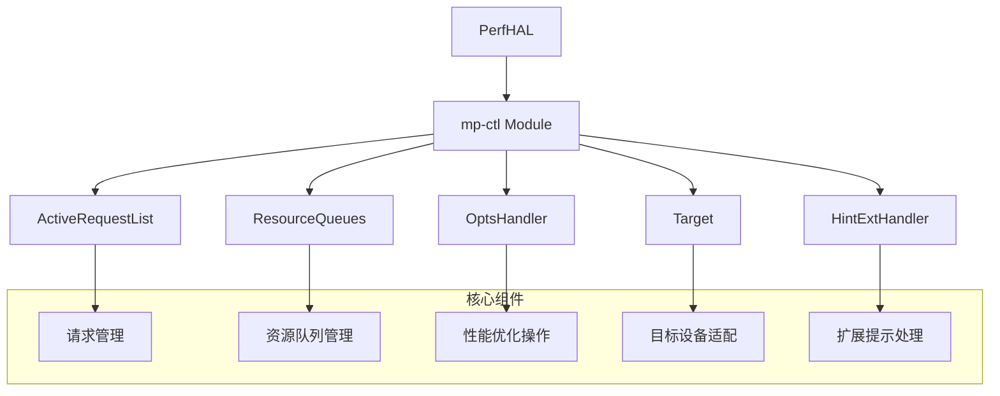
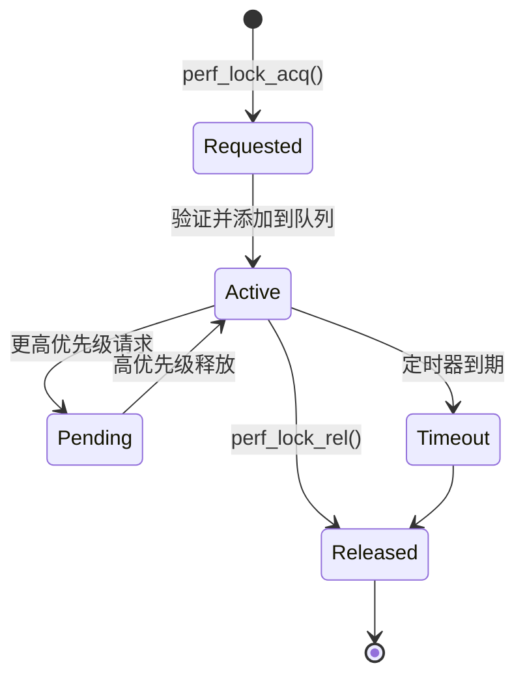
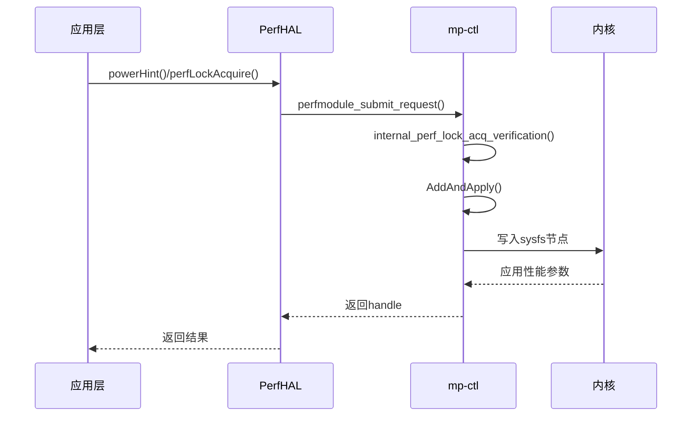
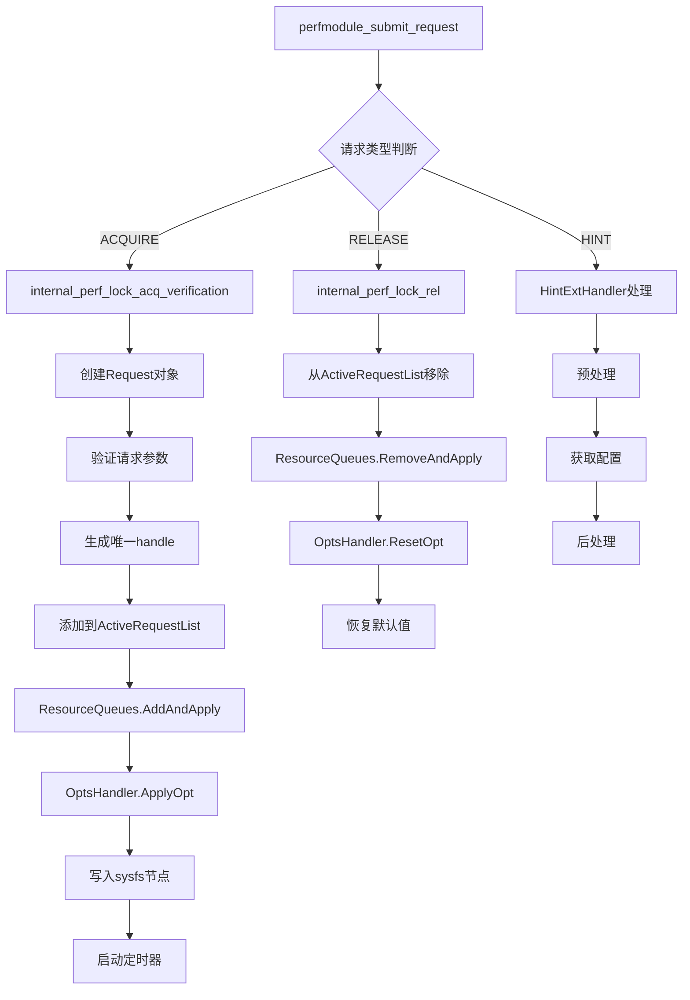
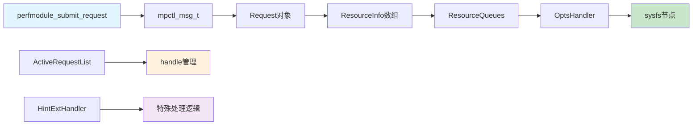
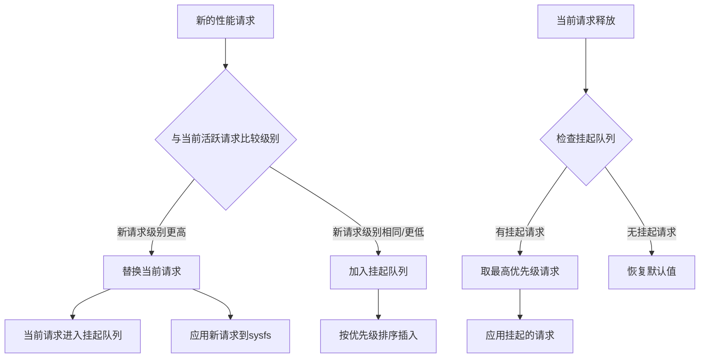
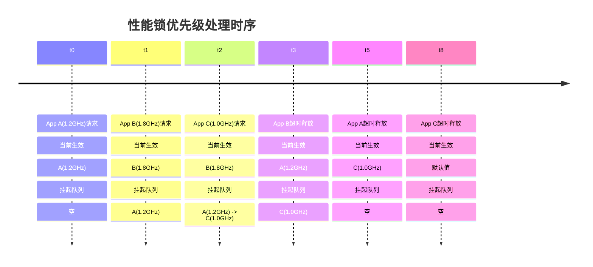

# mp-ctl模块源码分析

## 1. 编译产物分析

根据源码结构和Android.bp配置，主要编译产物包括：

```
libqti-perfd.so     # 性能调优动态库
perfd               # 性能守护进程
libqti-perf.so      # 性能接口库
```

**作用说明：**

- `libqti-perfd.so`: 核心性能调优库，包含所有性能控制逻辑
- `perfd`: 系统性能守护进程，负责处理性能锁请求
- `libqti-perf.so`: 对外接口库，供应用层调用

## 2. mp-ctl模块作用分析

### 2.1 核心功能架构



### 2.2 主要模块功能

| 模块         | 主要功能                 | 关键类                           |
| ------------ | ------------------------ | -------------------------------- |
| **请求管理** | 管理性能锁请求的生命周期 | `ActiveRequestList`, `Request`   |
| **资源调度** | 管理系统资源的分配和释放 | `ResourceQueues`, `ResourceInfo` |
| **性能操作** | 执行具体的性能优化操作   | `OptsHandler`, `ResetHandler`    |
| **设备适配** | 针对不同SOC的适配        | `Target`, `TargetConfig`         |
| **扩展处理** | 处理特殊性能提示         | `HintExtHandler`                 |

### 2.3 性能锁机制



## 3. PerfHAL到mp-ctl调用流程

### 3.1 整体调用架构




### 3.2 请求处理详细流程



### 3.3 核心数据流



### 3.4 关键接口说明

#### 主要入口函数

```cpp
// 模块初始化
int32_t perfmodule_init(void);

// 请求提交
int perfmodule_submit_request(mpctl_msg_t *msg);

// 模块退出  
void perfmodule_exit(void);
```

#### 核心处理流程

```cpp
// 性能锁获取验证
Request* internal_perf_lock_acq_verification(
    int32_t &handle, uint32_t duration, int32_t list[], 
    uint32_t num_args, pid_t client_pid, pid_t client_tid, 
    bool renew, bool isHint, enum client_t client
);

// 性能锁应用
int32_t internal_perf_lock_acq_apply(int32_t handle, Request *req);

// 性能锁释放
int32_t internal_perf_lock_rel(int32_t handle);
```

### 3.5 资源管理机制

mp-ctl通过以下机制管理系统资源：

1. **请求队列化**: 使用ResourceQueues管理资源请求的优先级
2. **动态调度**: 根据请求优先级动态调整资源分配
3. **定时管理**: 通过定时器自动释放临时性能锁
4. **状态恢复**: 通过ResetHandler恢复系统默认状态


## 4. 优先级机制的核心实现

### 4.1 优先级判断逻辑

在 `ResourceQueues.cpp` 中的 `AddAndApply` 方法是优先级处理的核心：

```cpp
bool ResourceQueue::AddAndApply(Request *req) {
    // ...
    for (i = 0; i < req->GetNumLocks(); i++) {
        ResourceInfo *res = req->GetResource(i);
        Resource &resObj = res->GetResourceObject();
        uint32_t level = resObj.value;  // 这就是性能级别
        
        current = GetNode(resObj);
        
        // 关键：比较性能级别来决定优先级
        if (resource_queue_not_empty) {
            needAction = oh.CompareOpt(resObj.qindex, level, current->resource.level);
        }
        
        if (needAction == ADD_AND_UPDATE_REQUEST) {
            // 新请求级别更高，当前请求被挂起
            pended = (struct q_node *)calloc(1, sizeof(struct q_node));
            CopyQnode(pended, current);
            
            // 应用新的高优先级请求
            rc = oh.ApplyOpt(resObj);
            current->handle = req;
            current->resource = resObj;
            current->next = pended;  // 原请求进入挂起队列
        }
        else if (needAction == PEND_REQUEST) {
            // 新请求级别较低，加入挂起队列
            recent = (struct q_node *)calloc(1, sizeof(struct q_node));
            recent->handle = req;
            recent->resource = resObj;
            // 插入到合适的挂起位置
            iter->next = recent;
        }
    }
}
```

### 4.2 比较函数实现

在 `OptsHandler.cpp` 中定义了多种比较策略：

```cpp
// 数值越高优先级越高（性能级别）
int32_t OptsHandler::higher_is_better(uint32_t reqLevel, uint32_t curLevel) {
    if (reqLevel > curLevel) {
        return ADD_AND_UPDATE_REQUEST;  // 新请求优先级更高，替换当前
    } else if (reqLevel == curLevel) {
        return PEND_REQUEST;            // 相同级别，加入挂起队列
    } else {
        return PEND_REQUEST;            // 新请求优先级较低，挂起
    }
}

// 数值越低优先级越高（延迟、功耗）
int32_t OptsHandler::lower_is_better(uint32_t reqLevel, uint32_t curLevel) {
    if (reqLevel < curLevel) {
        return ADD_AND_UPDATE_REQUEST;  // 新请求优先级更高
    } else {
        return PEND_REQUEST;            // 挂起
    }
}
```

### 4.3 优先级队列管理



## 5. 具体资源的优先级配置

在 `OptsHandler.cpp` 的 `InitializeOptsTable()` 中为不同资源配置比较函数：

```cpp
void OptsHandler::InitializeOptsTable() {
    // CPU频率相关 - 频率越高性能越好
    mOptsTable[CPUFREQ_START_INDEX + CPUFREQ_MIN_FREQ_OPCODE].mCompareOpts = higher_is_better;
    mOptsTable[CPUFREQ_START_INDEX + CPUFREQ_MAX_FREQ_OPCODE].mCompareOpts = higher_is_better;
    
    // 调度相关 - boost值越高性能越好  
    mOptsTable[SCHED_START_INDEX + SCHED_BOOST_OPCODE].mCompareOpts = higher_is_better;
    
    // 带宽相关 - 带宽越高性能越好
    mOptsTable[CPUBW_HWMON_START_INDEX + CPUBW_HWMON_MINFREQ_OPCODE].mCompareOpts = higher_is_better;
    
    // GPU相关 - 功耗级别越低性能越好（反向逻辑）
    mOptsTable[GPU_START_INDEX + GPU_POWER_LEVEL].mCompareOpts = lower_is_better;
}
```

## 6. 实际使用示例分析

### 6.1 CPU频率请求场景

```cpp
// 场景：多个应用同时请求CPU最小频率
// App A: 请求 1.2GHz
int args_a[] = {MPCTLV3_MIN_FREQ_CLUSTER_BIG_CORE_0, 1200000};
int handle_a = perf_lock_acq(5000, 0, args_a, 2);  // 5秒

// App B: 请求 1.8GHz (更高性能)
int args_b[] = {MPCTLV3_MIN_FREQ_CLUSTER_BIG_CORE_0, 1800000};  
int handle_b = perf_lock_acq(3000, 0, args_b, 2);  // 3秒

// App C: 请求 1.0GHz (较低性能)
int args_c[] = {MPCTLV3_MIN_FREQ_CLUSTER_BIG_CORE_0, 1000000};
int handle_c = perf_lock_acq(8000, 0, args_c, 2);  // 8秒
```

**执行流程：**

1. App A请求生效：CPU最小频率设为1.2GHz
2. App B请求到达：1.8GHz > 1.2GHz，App B生效，App A挂起
3. App C请求到达：1.0GHz < 1.8GHz，App C挂起
4. 3秒后App B超时：检查挂起队列，App A(1.2GHz) > App C(1.0GHz)，App A恢复生效
5. 5秒后App A超时：App C生效
6. 8秒后App C超时：恢复系统默认值

### 6.2 队列状态变化



## 7. 用户使用注意事项

### 7.1 性能级别设计原则

```cpp
// ✅ 正确：根据实际性能需求设置合理值
int light_boost[] = {MPCTLV3_MIN_FREQ_CLUSTER_BIG_CORE_0, 1200000};    // 轻度提升
int heavy_boost[] = {MPCTLV3_MIN_FREQ_CLUSTER_BIG_CORE_0, 1800000};    // 重度提升

// ❌ 错误：过度使用最高性能级别
int always_max[] = {MPCTLV3_MIN_FREQ_CLUSTER_BIG_CORE_0, 0xFFFFFFFF}; // 可能导致功耗问题
```

### 7.2 优先级冲突处理策略

**建议用户：**

1. **分层设计性能需求**

   ```cpp
   #define PERF_LEVEL_LOW    800000   // 基础性能
   #define PERF_LEVEL_MID    1200000  // 中等性能  
   #define PERF_LEVEL_HIGH   1800000  // 高性能
   #define PERF_LEVEL_BOOST  2200000  // 极限性能
   ```

2. **合理设置持续时间**

   ```cpp
   // 短时高性能冲刺
   perf_lock_acq(2000, 0, high_perf_args, 2);  // 2秒
   
   // 长时稳定性能
   perf_lock_acq(30000, 0, mid_perf_args, 2);  // 30秒
   ```

3. **及时释放不需要的锁**

   ```cpp
   if (task_completed) {
       perf_lock_rel(handle);  // 主动释放
   }
   ```

### 7.3 调试优先级问题

可以通过以下方式查看当前活跃的性能锁：

```bash
# 查看活跃的性能锁请求
adb shell dumpsys vendor.qti.hardware.perf@2.0::IPerf/default

# 或通过调试接口
perfmodule_sync_request_ext(SYNC_CMD_DUMP_DEG_INFO, &debugInfo);
```

**总结：** mp-ctl的优先级机制通过数值比较确定性能级别的高低，高性能级别的请求会抢占当前资源，而低优先级请求会被挂起。用户需要根据实际需求合理设置性能级别，避免不必要的高性能请求导致功耗问题。