# mp-ctl模块源码分析

## 1. 编译产物分析

根据源码结构和Android.bp配置，主要编译产物包括：

```
libqti-perfd.so     # 性能调优动态库
perfd               # 性能守护进程
libqti-perf.so      # 性能接口库
```

**作用说明：**

- `libqti-perfd.so`: 核心性能调优库，包含所有性能控制逻辑
- `perfd`: 系统性能守护进程，负责处理性能锁请求
- `libqti-perf.so`: 对外接口库，供应用层调用

## 2. mp-ctl模块作用分析

### 2.1 核心功能架构

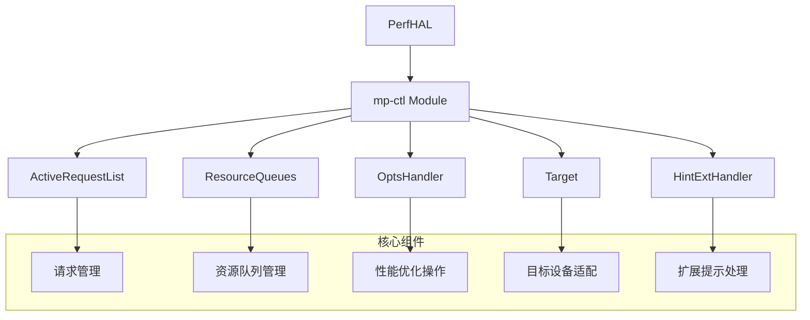

### 2.2 主要模块功能

| 模块         | 主要功能                 | 关键类                           |
| ------------ | ------------------------ | -------------------------------- |
| **请求管理** | 管理性能锁请求的生命周期 | `ActiveRequestList`, `Request`   |
| **资源调度** | 管理系统资源的分配和释放 | `ResourceQueues`, `ResourceInfo` |
| **性能操作** | 执行具体的性能优化操作   | `OptsHandler`, `ResetHandler`    |
| **设备适配** | 针对不同SOC的适配        | `Target`, `TargetConfig`         |
| **扩展处理** | 处理特殊性能提示         | `HintExtHandler`                 |

### 2.3 性能锁机制

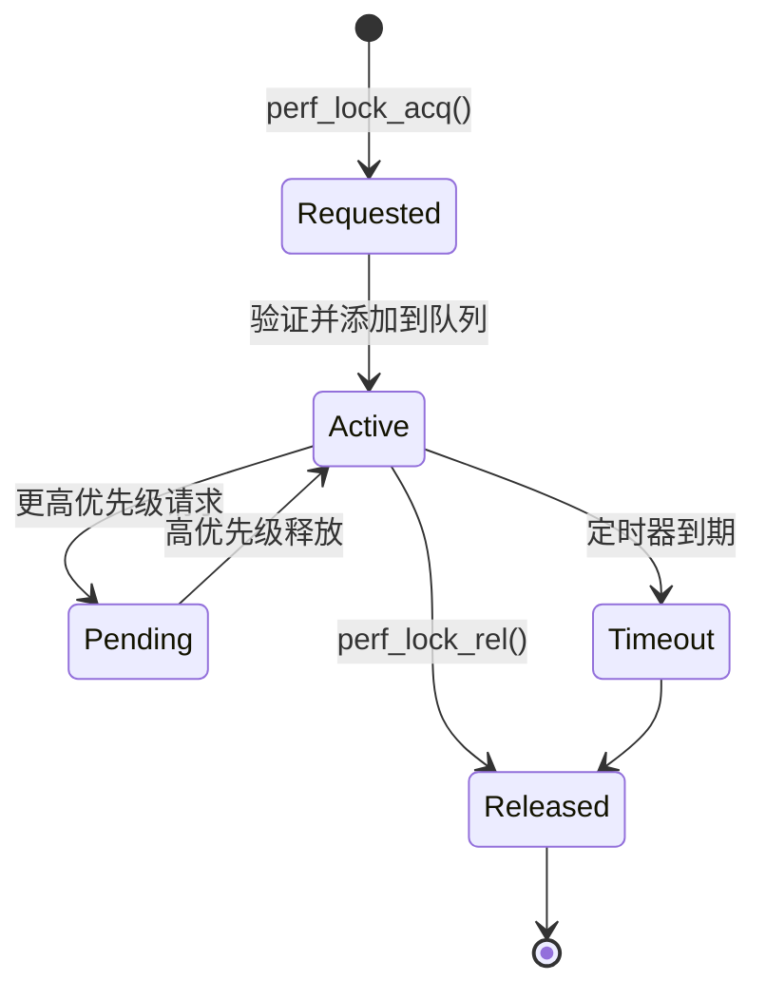

## 3. PerfHAL到mp-ctl调用流程

### 3.1 整体调用架构


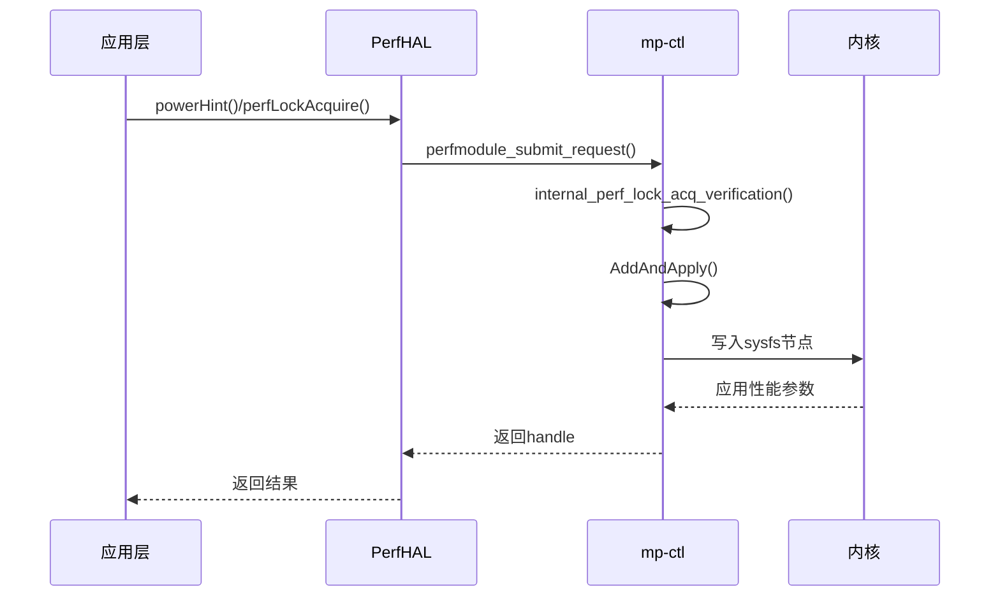

### 3.2 请求处理详细流程

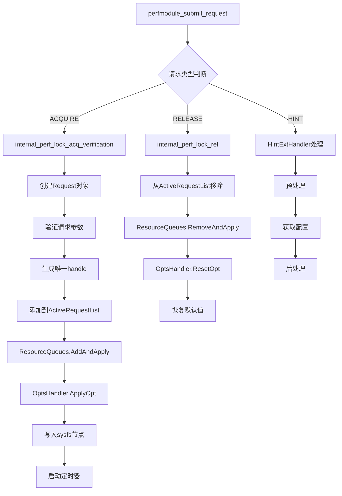

### 3.3 核心数据流

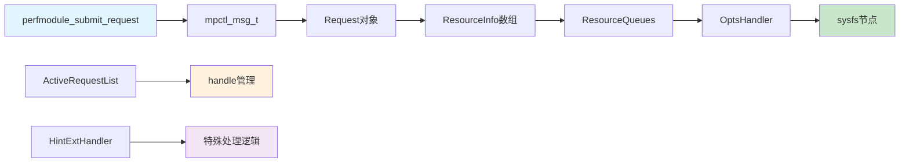

### 3.4 关键接口说明

#### 主要入口函数

```cpp
// 模块初始化
int32_t perfmodule_init(void);

// 请求提交
int perfmodule_submit_request(mpctl_msg_t *msg);

// 模块退出  
void perfmodule_exit(void);
```

#### 核心处理流程

```cpp
// 性能锁获取验证
Request* internal_perf_lock_acq_verification(
    int32_t &handle, uint32_t duration, int32_t list[], 
    uint32_t num_args, pid_t client_pid, pid_t client_tid, 
    bool renew, bool isHint, enum client_t client
);

// 性能锁应用
int32_t internal_perf_lock_acq_apply(int32_t handle, Request *req);

// 性能锁释放
int32_t internal_perf_lock_rel(int32_t handle);
```

### 3.5 资源管理机制

mp-ctl通过以下机制管理系统资源：

1. **请求队列化**: 使用ResourceQueues管理资源请求的优先级
2. **动态调度**: 根据请求优先级动态调整资源分配
3. **定时管理**: 通过定时器自动释放临时性能锁
4. **状态恢复**: 通过ResetHandler恢复系统默认状态


## 4. 优先级机制的核心实现

### 4.1 优先级判断逻辑

在 `ResourceQueues.cpp` 中的 `AddAndApply` 方法是优先级处理的核心：

```cpp
bool ResourceQueue::AddAndApply(Request *req) {
    // ...
    for (i = 0; i < req->GetNumLocks(); i++) {
        ResourceInfo *res = req->GetResource(i);
        Resource &resObj = res->GetResourceObject();
        uint32_t level = resObj.value;  // 这就是性能级别
        
        current = GetNode(resObj);
        
        // 关键：比较性能级别来决定优先级
        if (resource_queue_not_empty) {
            needAction = oh.CompareOpt(resObj.qindex, level, current->resource.level);
        }
        
        if (needAction == ADD_AND_UPDATE_REQUEST) {
            // 新请求级别更高，当前请求被挂起
            pended = (struct q_node *)calloc(1, sizeof(struct q_node));
            CopyQnode(pended, current);
            
            // 应用新的高优先级请求
            rc = oh.ApplyOpt(resObj);
            current->handle = req;
            current->resource = resObj;
            current->next = pended;  // 原请求进入挂起队列
        }
        else if (needAction == PEND_REQUEST) {
            // 新请求级别较低，加入挂起队列
            recent = (struct q_node *)calloc(1, sizeof(struct q_node));
            recent->handle = req;
            recent->resource = resObj;
            // 插入到合适的挂起位置
            iter->next = recent;
        }
    }
}
```

### 4.2 比较函数实现

在 `OptsHandler.cpp` 中定义了多种比较策略：

```cpp
// 数值越高优先级越高（性能级别）
int32_t OptsHandler::higher_is_better(uint32_t reqLevel, uint32_t curLevel) {
    if (reqLevel > curLevel) {
        return ADD_AND_UPDATE_REQUEST;  // 新请求优先级更高，替换当前
    } else if (reqLevel == curLevel) {
        return PEND_REQUEST;            // 相同级别，加入挂起队列
    } else {
        return PEND_REQUEST;            // 新请求优先级较低，挂起
    }
}

// 数值越低优先级越高（延迟、功耗）
int32_t OptsHandler::lower_is_better(uint32_t reqLevel, uint32_t curLevel) {
    if (reqLevel < curLevel) {
        return ADD_AND_UPDATE_REQUEST;  // 新请求优先级更高
    } else {
        return PEND_REQUEST;            // 挂起
    }
}
```

### 4.3 优先级队列管理

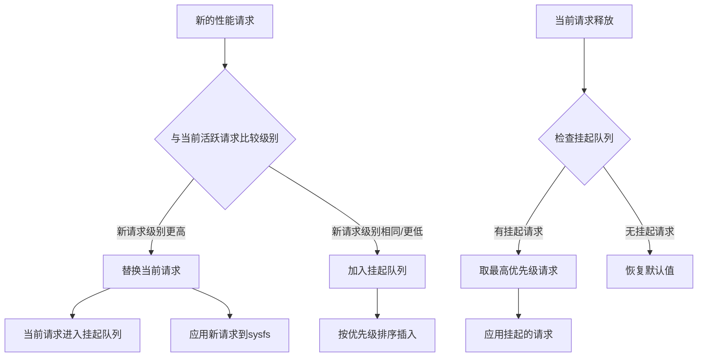

## 5. 具体资源的优先级配置

在 `OptsHandler.cpp` 的 `InitializeOptsTable()` 中为不同资源配置比较函数：

```cpp
void OptsHandler::InitializeOptsTable() {
    // CPU频率相关 - 频率越高性能越好
    mOptsTable[CPUFREQ_START_INDEX + CPUFREQ_MIN_FREQ_OPCODE].mCompareOpts = higher_is_better;
    mOptsTable[CPUFREQ_START_INDEX + CPUFREQ_MAX_FREQ_OPCODE].mCompareOpts = higher_is_better;
    
    // 调度相关 - boost值越高性能越好  
    mOptsTable[SCHED_START_INDEX + SCHED_BOOST_OPCODE].mCompareOpts = higher_is_better;
    
    // 带宽相关 - 带宽越高性能越好
    mOptsTable[CPUBW_HWMON_START_INDEX + CPUBW_HWMON_MINFREQ_OPCODE].mCompareOpts = higher_is_better;
    
    // GPU相关 - 功耗级别越低性能越好（反向逻辑）
    mOptsTable[GPU_START_INDEX + GPU_POWER_LEVEL].mCompareOpts = lower_is_better;
}
```

## 6. 实际使用示例分析

### 6.1 CPU频率请求场景

```cpp
// 场景：多个应用同时请求CPU最小频率
// App A: 请求 1.2GHz
int args_a[] = {MPCTLV3_MIN_FREQ_CLUSTER_BIG_CORE_0, 1200000};
int handle_a = perf_lock_acq(5000, 0, args_a, 2);  // 5秒

// App B: 请求 1.8GHz (更高性能)
int args_b[] = {MPCTLV3_MIN_FREQ_CLUSTER_BIG_CORE_0, 1800000};  
int handle_b = perf_lock_acq(3000, 0, args_b, 2);  // 3秒

// App C: 请求 1.0GHz (较低性能)
int args_c[] = {MPCTLV3_MIN_FREQ_CLUSTER_BIG_CORE_0, 1000000};
int handle_c = perf_lock_acq(8000, 0, args_c, 2);  // 8秒
```

**执行流程：**

1. App A请求生效：CPU最小频率设为1.2GHz
2. App B请求到达：1.8GHz > 1.2GHz，App B生效，App A挂起
3. App C请求到达：1.0GHz < 1.8GHz，App C挂起
4. 3秒后App B超时：检查挂起队列，App A(1.2GHz) > App C(1.0GHz)，App A恢复生效
5. 5秒后App A超时：App C生效
6. 8秒后App C超时：恢复系统默认值

### 6.2 队列状态变化

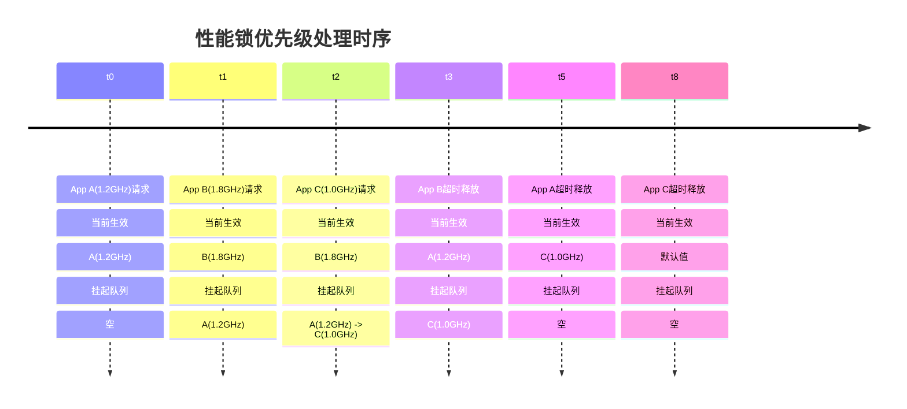

## 7. 用户使用注意事项

### 7.1 性能级别设计原则

```cpp
// ✅ 正确：根据实际性能需求设置合理值
int light_boost[] = {MPCTLV3_MIN_FREQ_CLUSTER_BIG_CORE_0, 1200000};    // 轻度提升
int heavy_boost[] = {MPCTLV3_MIN_FREQ_CLUSTER_BIG_CORE_0, 1800000};    // 重度提升

// ❌ 错误：过度使用最高性能级别
int always_max[] = {MPCTLV3_MIN_FREQ_CLUSTER_BIG_CORE_0, 0xFFFFFFFF}; // 可能导致功耗问题
```

### 7.2 优先级冲突处理策略

**建议用户：**

1. **分层设计性能需求**

   ```cpp
   #define PERF_LEVEL_LOW    800000   // 基础性能
   #define PERF_LEVEL_MID    1200000  // 中等性能  
   #define PERF_LEVEL_HIGH   1800000  // 高性能
   #define PERF_LEVEL_BOOST  2200000  // 极限性能
   ```

2. **合理设置持续时间**

   ```cpp
   // 短时高性能冲刺
   perf_lock_acq(2000, 0, high_perf_args, 2);  // 2秒
   
   // 长时稳定性能
   perf_lock_acq(30000, 0, mid_perf_args, 2);  // 30秒
   ```

3. **及时释放不需要的锁**

   ```cpp
   if (task_completed) {
       perf_lock_rel(handle);  // 主动释放
   }
   ```

### 7.3 调试优先级问题

可以通过以下方式查看当前活跃的性能锁：

```bash
# 查看活跃的性能锁请求
adb shell dumpsys vendor.qti.hardware.perf@2.0::IPerf/default

# 或通过调试接口
perfmodule_sync_request_ext(SYNC_CMD_DUMP_DEG_INFO, &debugInfo);
```

**总结：** mp-ctl的优先级机制通过数值比较确定性能级别的高低，高性能级别的请求会抢占当前资源，而低优先级请求会被挂起。用户需要根据实际需求合理设置性能级别，避免不必要的高性能请求导致功耗问题。


## 8. Config解析

### 8.1 系统初始化时的配置加载流程

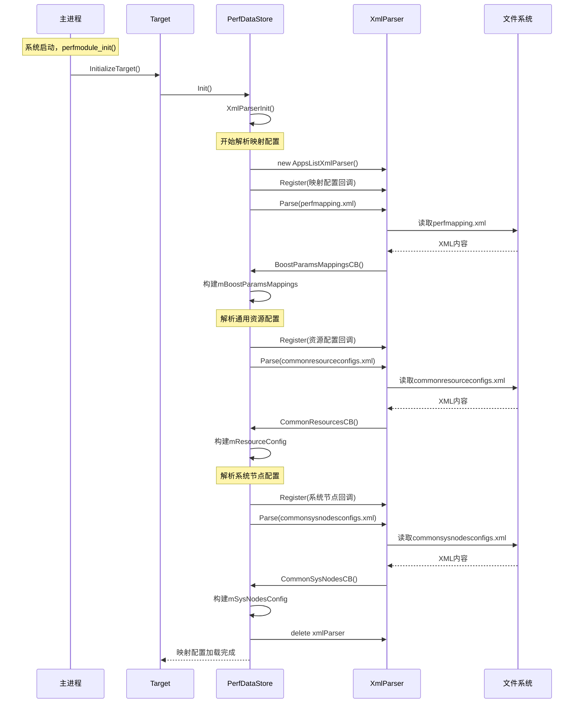

### 8.2 目标设备特定配置加载流程

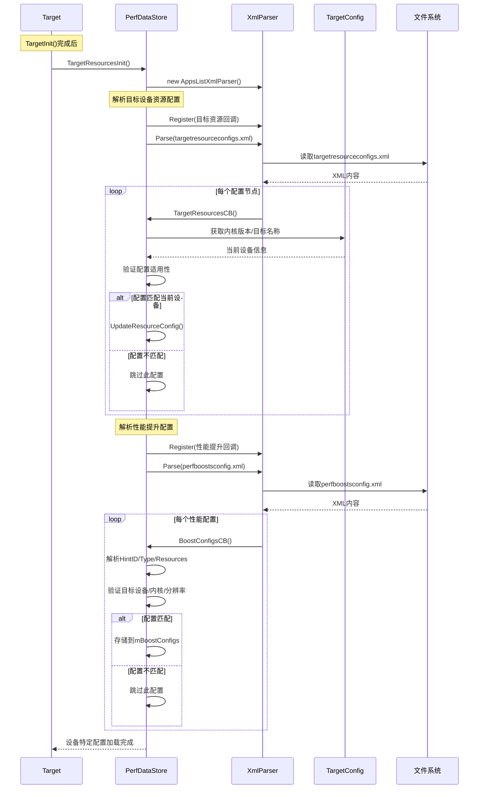

### 8.3 两个加载流程的区别

#### 8.3.1 加载时机不同

- **系统初始化**：`perfmodule_init()` → `Target::InitializeTarget()` → `PerfDataStore::Init()`
- **目标设备特定**：`Target::TargetInit()` 完成后 → `PerfDataStore::TargetResourcesInit()`

#### 8.3.2 **配置文件类型不同**

- 系统初始化：加载通用配置
  - `perfmapping.xml` (参数映射)
  - `commonresourceconfigs.xml` (通用资源)
  - `commonsysnodesconfigs.xml` (通用系统节点)
- 目标设备特定：加载设备相关配置
  - `targetresourceconfigs.xml` (设备特定资源)
  - `targetsysnodesconfigs.xml` (设备特定系统节点)
  - `perfboostsconfig.xml` (性能提升配置)
  - `powerhint.xml` (电源提示配置)

### 8.4 XML配置文件解析详细流程

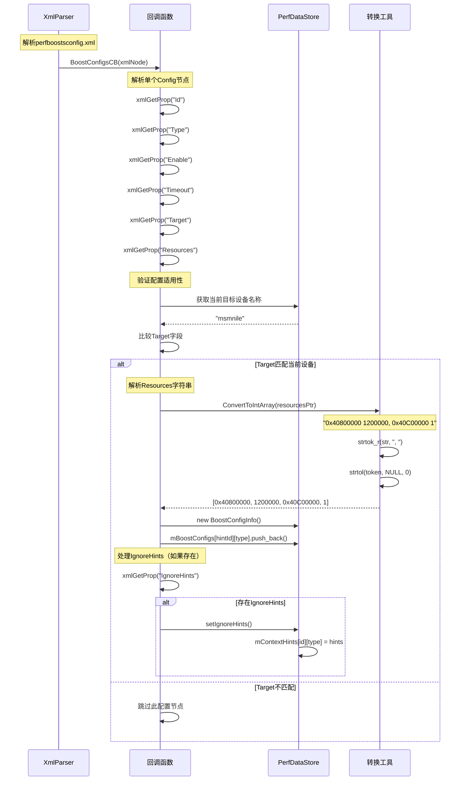

### 8.5 运行时配置查询流程

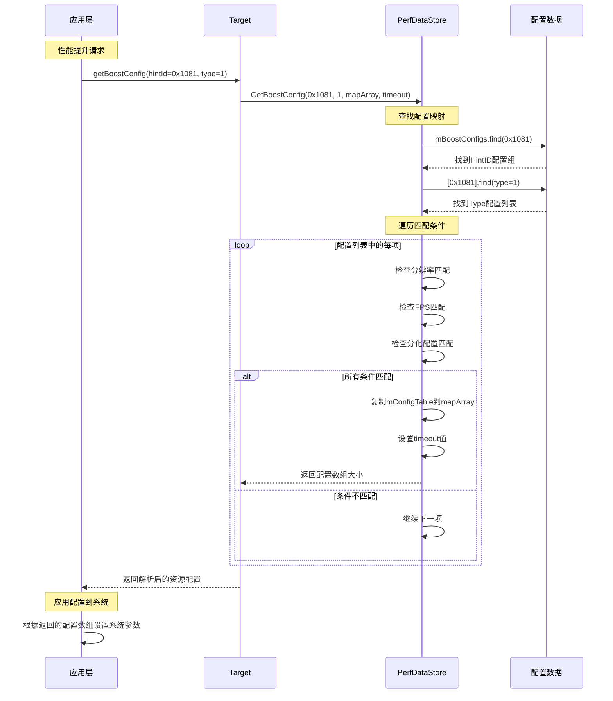

### 8.6 配置数据结构构建流程

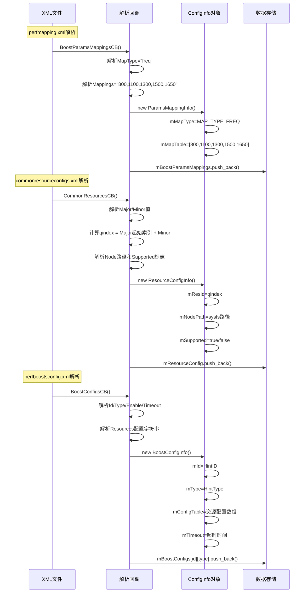


## 9. BoostConfigReader核心功能

### 9.1 主要解析的配置文件

```cpp
// BoostConfigReader.cpp - 配置文件路径定义
#define PERF_MAPPING_XML (VENDOR_DIR"/perf/perfmapping.xml")           // 性能映射配置
#define PERF_BOOSTS_CONFIGS_XML (VENDOR_DIR"/perf/perfboostsconfig.xml") // 性能提升配置  
#define POWER_CONFIGS_XML (VENDOR_DIR"/powerhint.xml")                 // 电源提示配置
#define COMMONRESOURCE_CONFIGS_XML (VENDOR_DIR"/perf/commonresourceconfigs.xml") // 通用资源配置
#define TARGETRESOURCE_CONFIGS_XML (VENDOR_DIR"/perf/targetresourceconfigs.xml") // 目标设备资源配置
```

### 9.2 配置数据存储结构

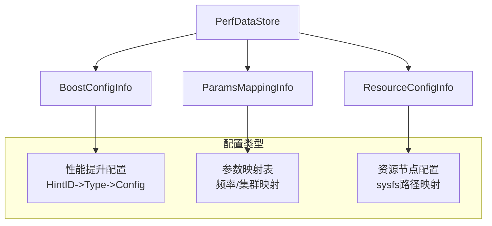

### 9.3 关键配置解析逻辑

#### 性能提升配置解析

```cpp
// BoostConfigReader.cpp
void PerfDataStore::BoostConfigsCB(xmlNodePtr node, void *) {
    // 解析性能提升配置
    if(!xmlStrcmp(node->name, BAD_CAST BOOSTS_CONFIGS_XML_ELEM_CONFIG_TAG)) {
        idnum = strtol(idPtr, NULL, 0);    // Hint ID
        type = strtol(idPtr, NULL, 0);     // Hint Type  
        timeout = strtol(timeoutPtr, NULL, 0); // 超时时间
        
        // 解析资源配置字符串 "0x40800000 1200000, 0x40C00000 1"
        resourcesPtr = (char *) xmlGetProp(node, BAD_CAST BOOSTS_CONFIGS_XML_ELEM_RESOURCES_TAG);
        
        // 存储到配置映射表
        auto obj = BoostConfigInfo(idnum, type, en, timeout, fps, tname, res, resourcesPtr);
        store->mBoostConfigs[idnum][type].push_back(obj);
    }
}
```

#### 参数映射解析

```cpp
void PerfDataStore::BoostParamsMappingsCB(xmlNodePtr node, void *) {
    // 解析频率/集群映射表
    maptype = (char *) xmlGetProp(node, BAD_CAST PERF_BOOSTS_XML_MAPTYPE_TAG);     // "freq" or "cluster"
    mappings = (char *) xmlGetProp(node, BAD_CAST PERF_BOOSTS_XML_MAPPINGS_TAG);   // "800,1100,1300,1500,1650"
    
    msize = ConvertToIntArray(mappings, marray, MAX_MAP_TABLE_SIZE);
    auto tmp = new ParamsMappingInfo(mtype, tname, res, marray, msize);
    store->mBoostParamsMappings.push_back(tmp);
}
```

### 9.4 配置查询接口

```cpp
// 获取性能提升配置
uint32_t PerfDataStore::GetBoostConfig(int32_t hintId, int32_t type, 
                                       int32_t *mapArray, int32_t *timeout,
                                       const char *tName, uint32_t res, int32_t fps) {
    // 从mBoostConfigs中查找对应配置
    if (mBoostConfigs.find(hintId) != mBoostConfigs.end() && 
        mBoostConfigs[hintId].find(type) != mBoostConfigs[hintId].end()) {
        
        for (auto it = itbegin; it != itend; ++it) {
            if (匹配条件) {
                mapsize = (*it).mConfigsSize;
                for (uint32_t i=0; i<mapsize; i++) {
                    mapArray[i] = (*it).mConfigTable[i];  // 返回资源配置数组
                }
                *timeout = (*it).mTimeout;
                return mapsize;
            }
        }
    }
}
```

### 9.5 实际使用流程

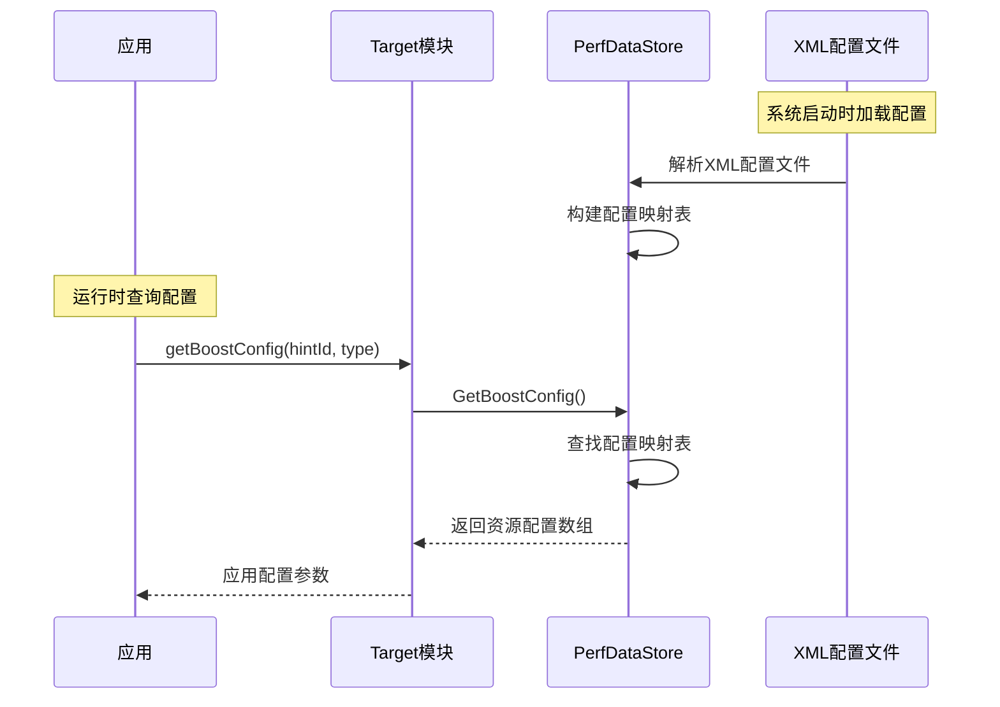

### 9.6 配置文件示例结构

```xml
<!-- perfboostsconfig.xml 示例 -->
<BoostConfigs>
    <PerfBoost>
        <Config Id="0x1081" Type="1" Enable="true" Timeout="4000" Target="msmnile">
            <Resources>0x40800000 1200000, 0x40C00000 1</Resources>
        </Config>
    </PerfBoost>
</BoostConfigs>

<!-- perfmapping.xml 示例 -->  
<PerfBoosts>
    <BoostParamsMappings>
        <BoostAttributes MapType="freq" Target="msmnile" Resolution="1080p">
            <Mappings>800,1100,1300,1500,1650</Mappings>
        </BoostAttributes>
    </BoostParamsMappings>
</PerfBoosts>
```


## 10. MP-CTL加密云控方案设计

### 10.1 架构设计

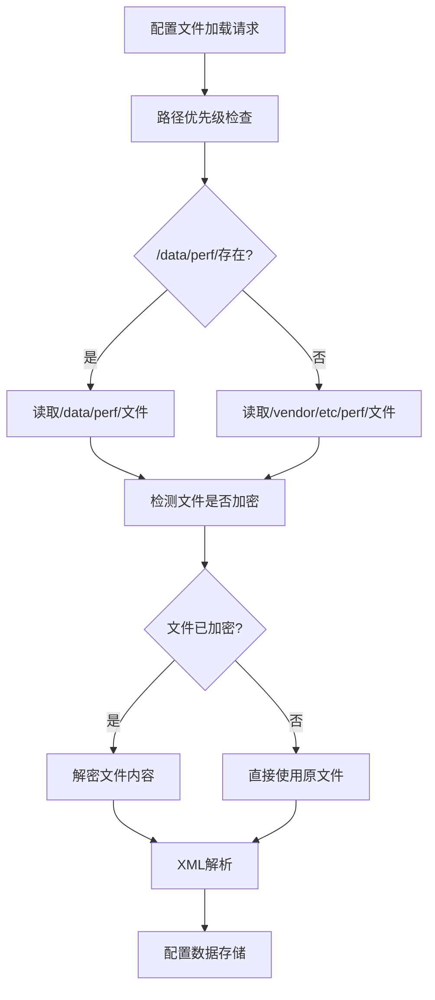

### 10.2 核心实现策略

1. **文件路径管理器**：统一管理配置文件路径选择
2. **加密检测与解密**：自动识别加密文件并解密
3. **透明集成**：对现有XML解析逻辑透明

### 10.3 详细实现方案

#### 10.3.1 新增配置文件管理类

**插入位置：** `BoostConfigReader.h` 和 `BoostConfigReader.cpp`

```cpp
// BoostConfigReader.h 新增
class ConfigFileManager {
private:
    static const char* DEBUG_CONFIG_DIR;     // "/data/perf/"
    static const char* VENDOR_CONFIG_DIR;    // "/vendor/etc/perf/"
    
    struct ConfigFileInfo {
        const char* filename;
        bool isEncrypted;
        std::string content;
    };
    
public:
    // 获取配置文件路径（支持优先级）
    static std::string getConfigFilePath(const char* filename);
    
    // 读取并解密配置文件
    static bool readAndDecryptConfig(const std::string& filepath, std::string& content);
    
    // 检测文件是否加密
    static bool isFileEncrypted(const std::string& filepath);
    
    // 解密文件内容
    static bool decryptFileContent(const std::string& encryptedContent, std::string& decryptedContent);
};
```

#### 10.3.2 修改现有宏定义

**修改位置：** `BoostConfigReader.cpp` 文件开头

```cpp
// 原来的固定路径定义 - 删除
// #define PERF_MAPPING_XML (VENDOR_DIR"/perf/perfmapping.xml")

// 新的动态路径获取
#define PERF_MAPPING_XML ConfigFileManager::getConfigFilePath("perfmapping.xml").c_str()
#define PERF_BOOSTS_CONFIGS_XML ConfigFileManager::getConfigFilePath("perfboostsconfig.xml").c_str()
#define POWER_CONFIGS_XML ConfigFileManager::getConfigFilePath("powerhint.xml").c_str()
#define COMMONRESOURCE_CONFIGS_XML ConfigFileManager::getConfigFilePath("commonresourceconfigs.xml").c_str()
#define TARGETRESOURCE_CONFIGS_XML ConfigFileManager::getConfigFilePath("targetresourceconfigs.xml").c_str()
```

#### 10.3.3 核心实现代码

**插入位置：** `BoostConfigReader.cpp`

```cpp
// 静态成员定义
const char* ConfigFileManager::DEBUG_CONFIG_DIR = "/data/perf/";
const char* ConfigFileManager::VENDOR_CONFIG_DIR = "/vendor/etc/perf/";

std::string ConfigFileManager::getConfigFilePath(const char* filename) {
    std::string debugPath = std::string(DEBUG_CONFIG_DIR) + filename;
    std::string vendorPath = std::string(VENDOR_CONFIG_DIR) + filename;
    
    // 优先检查debug目录
    if (access(debugPath.c_str(), F_OK) == 0) {
        QLOGL(LOG_TAG, QLOG_L1, "Using debug config: %s", debugPath.c_str());
        return debugPath;
    }
    
    // 回退到vendor目录
    QLOGL(LOG_TAG, QLOG_L1, "Using vendor config: %s", vendorPath.c_str());
    return vendorPath;
}

bool ConfigFileManager::isFileEncrypted(const std::string& filepath) {
    FILE* file = fopen(filepath.c_str(), "rb");
    if (!file) return false;
    
    // 读取文件头部Magic Number判断是否加密
    char header[8];
    size_t read = fread(header, 1, 8, file);
    fclose(file);
    
    if (read >= 4) {
        // 检查加密标识 (例如: "ENC\x01")
        return (memcmp(header, "ENC\x01", 4) == 0);
    }
    return false;
}

bool ConfigFileManager::decryptFileContent(const std::string& encryptedContent, 
                                          std::string& decryptedContent) {
    // 实现你的解密算法
    // 这里以简单的XOR解密为例
    const char* key = "your_secret_key";
    size_t keyLen = strlen(key);
    
    decryptedContent.clear();
    decryptedContent.reserve(encryptedContent.length());
    
    for (size_t i = 4; i < encryptedContent.length(); ++i) { // 跳过4字节头部
        char decrypted = encryptedContent[i] ^ key[(i-4) % keyLen];
        decryptedContent.push_back(decrypted);
    }
    
    return true;
}

bool ConfigFileManager::readAndDecryptConfig(const std::string& filepath, 
                                           std::string& content) {
    // 读取文件内容
    std::ifstream file(filepath, std::ios::binary);
    if (!file.is_open()) {
        QLOGE(LOG_TAG, "Failed to open config file: %s", filepath.c_str());
        return false;
    }
    
    std::string fileContent((std::istreambuf_iterator<char>(file)),
                           std::istreambuf_iterator<char>());
    file.close();
    
    // 检查是否加密
    if (isFileEncrypted(filepath)) {
        QLOGL(LOG_TAG, QLOG_L1, "Decrypting config file: %s", filepath.c_str());
        return decryptFileContent(fileContent, content);
    } else {
        QLOGL(LOG_TAG, QLOG_L1, "Using plain config file: %s", filepath.c_str());
        content = fileContent;
        return true;
    }
}
```

#### 10.3.4 修改XML解析器集成

**修改位置：** `XmlParser.h` 和 `XmlParser.cpp`

需要为 `AppsListXmlParser` 类添加支持内存XML解析的方法：

```cpp
// XmlParser.h 新增方法声明
class AppsListXmlParser {
public:
    // 现有方法...
    
    // 新增：从内存内容解析XML
    bool ParseFromMemory(const std::string& xmlContent);
    
private:
    // 现有成员...
};

// XmlParser.cpp 实现
bool AppsListXmlParser::ParseFromMemory(const std::string& xmlContent) {
    xmlDocPtr doc = xmlParseMemory(xmlContent.c_str(), xmlContent.length());
    if (doc == NULL) {
        QLOGE(LOG_TAG, "Failed to parse XML from memory");
        return false;
    }
    
    // 复用现有的解析逻辑
    bool result = processXmlDoc(doc);
    xmlFreeDoc(doc);
    return result;
}
```

#### 10.3.5 修改PerfDataStore解析流程

**修改位置：** `BoostConfigReader.cpp` 中的 `XmlParserInit()` 和 `TargetResourcesInit()` 方法

```cpp
void PerfDataStore::XmlParserInit() {
    AppsListXmlParser *xmlParser = new(std::nothrow) AppsListXmlParser();
    if (NULL == xmlParser) return;

    // 解析映射配置 - 修改后
    std::string mappingContent;
    std::string mappingPath = ConfigFileManager::getConfigFilePath("perfmapping.xml");
    if (ConfigFileManager::readAndDecryptConfig(mappingPath, mappingContent)) {
        int32_t idnum = xmlParser->Register(xmlMappingsRoot, xmlChildMappings, 
                                          BoostParamsMappingsCB, NULL);
        xmlParser->ParseFromMemory(mappingContent);  // 使用内存解析
        xmlParser->DeRegister(idnum);
    }

    // 类似地修改其他配置文件的解析...
    
    delete xmlParser;
}

void PerfDataStore::TargetResourcesInit() {
    AppsListXmlParser *xmlParser = new(std::nothrow) AppsListXmlParser();
    if (NULL == xmlParser) return;
    
    // 解析性能提升配置 - 修改后
    std::string boostContent;
    std::string boostPath = ConfigFileManager::getConfigFilePath("perfboostsconfig.xml");
    if (ConfigFileManager::readAndDecryptConfig(boostPath, boostContent)) {
        int32_t idnum = xmlParser->Register(xmlConfigsRoot, xmlChildConfigs, 
                                          BoostConfigsCB, NULL);
        xmlParser->ParseFromMemory(boostContent);
        xmlParser->DeRegister(idnum);
    }
    
    // 类似地修改其他配置文件...
    
    delete xmlParser;
}
```

### 10.4 实现时序图

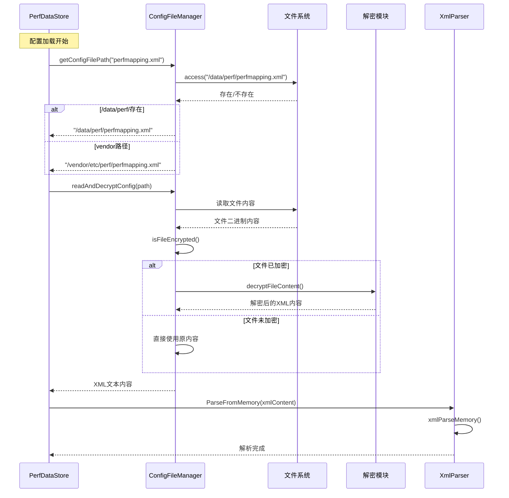

## 11. 自定义事件

### 11.1 定义新的Hint ID

**位置：** `VendorIPerf.h`

```cpp
VENDOR_HINT_DOWN_CONTROL = 0x00001093,
```

### 11.2 添加XML配置文件条目

**位置：** `perfboostsconfig.xml` 配置文件

```xml
<Config Id="0x1093" Type="0" Enable="true" Timeout="3000" Target="你的目标设备">
    <Resources>0x40800000 1200000, 0x40C00000 1</Resources>
</Config>
```

### 11.3 注册Hint扩展处理器（如需特殊处理）

**位置：** `TargetInit.cpp` 中的 `Target::InitializeTarget()`

```cpp
void Target::InitializeTarget() {
    // 现有的hint注册...
    
    // 添加新的hint处理器
    hintExt.Register(VENDOR_HINT_DOWN_CONTROL, 
                     DownControlAction::DownControlPreAction,    // 可选：预处理
                     DownControlAction::DownControlPostAction,   // 可选：后处理  
                     DownControlAction::DownControlHintExcluder); // 可选：排除器
}
```

### 11.4 实现Hint处理逻辑（如需特殊处理）

**位置：** `HintExtHandler.h` 和 `HintExtHandler.cpp`

#### 11.4.1 头文件声明

```cpp
// HintExtHandler.h
class DownControlAction {
public:
    static int32_t DownControlPreAction(mpctl_msg_t *pMsg);
    static int32_t DownControlPostAction(mpctl_msg_t *pMsg); 
    static int32_t DownControlHintExcluder(mpctl_msg_t *pMsg);
};
```

#### 11.4.2 实现文件

```cpp
// HintExtHandler.cpp
int32_t DownControlAction::DownControlPreAction(mpctl_msg_t *pMsg) {
    if (NULL == pMsg) {
        return FAILED;
    }
    
    // 你的预处理逻辑
    // 例如：修改参数、检查条件等
    QLOGL(LOG_TAG, QLOG_L1, "DownControl PreAction: hint_id=0x%x", pMsg->hint_id);
    
    return SUCCESS;
}

int32_t DownControlAction::DownControlPostAction(mpctl_msg_t *pMsg) {
    if (NULL == pMsg) {
        return FAILED; 
    }
    
    // 你的后处理逻辑
    // 例如：调整资源配置、设置特殊参数等
    uint16_t size = pMsg->data;
    
    for (uint16_t i = 0; i < size-1; i = i + 2) {
        // 处理资源配置对
        int32_t opcode = pMsg->pl_args[i];
        int32_t value = pMsg->pl_args[i+1];
        
        // 根据需要修改配置
        if (opcode == MPCTLV3_MIN_FREQ_CLUSTER_BIG_CORE_0) {
            pMsg->pl_args[i+1] = value * 0.8;  // 例如：降频处理
        }
    }
    
    return SUCCESS;
}

int32_t DownControlAction::DownControlHintExcluder(mpctl_msg_t *pMsg) {
    // 排除逻辑：返回SUCCESS表示排除此hint，返回FAILED表示允许执行
    if (某种条件) {
        return SUCCESS;  // 排除
    }
    return FAILED;       // 允许执行
}
```

## 5. 添加资源处理逻辑（如需新的OpCode）

**位置：** `OptsHandler.cpp` 中的 `InitializeOptsTable()`

如果你的hint使用了新的OpCode，需要注册对应的处理函数：

```cpp
void OptsHandler::InitializeOptsTable() {
    // 现有初始化...
    
    // 如果有新的资源OpCode需要特殊处理
    mOptsTable[YOUR_NEW_OPCODE_INDEX].mApplyOpts = your_apply_function;
    mOptsTable[YOUR_NEW_OPCODE_INDEX].mResetOpts = your_reset_function;
    mOptsTable[YOUR_NEW_OPCODE_INDEX].mCompareOpts = your_compare_function;
}
```

## 6. 调试和验证

### 6.1 日志验证

**位置：** `PerfController.cpp` 中的 `perfmodule_submit_request()`

```cpp
QLOGL(LOG_TAG, QLOG_L1, "Received hint_id=0x%" PRIx32 ", hint_type=%" PRId32, 
      pMsg->hint_id, pMsg->hint_type);
```

### 6.2 配置验证

检查你的XML配置是否被正确加载：

```bash
# 查看加载的配置
adb shell dumpsys vendor.qti.hardware.perf@2.0::IPerf/default
```

## 核心流程总结

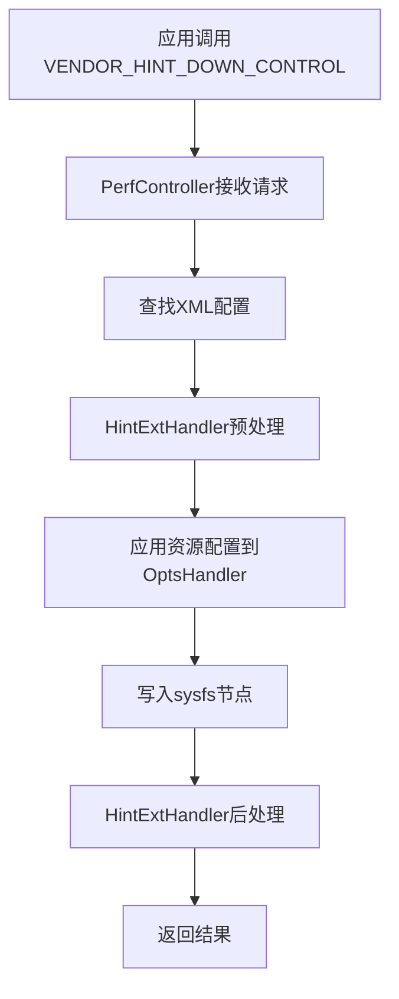

