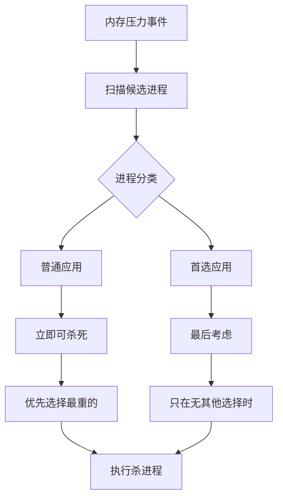

# 首选应用(Preferred Apps)功能

## 详细实现逻辑

让我用一个生活化的例子来解释：

```c
// 这就像图书管理员检查VIP名单的过程
static void init_PreferredApps() {
    // 图书管理员联系VIP服务中心，获取服务接口
    if (!use_perf_api_for_pref_apps) {
        // 方式一：通过传统的VIP通知系统
        perf_ux_engine_trigger = dlsym(handle_iopd, "perf_ux_engine_trigger");
    } else {
        // 方式二：通过新的VIP查询系统
        perf_sync_request = dlsym(handle_perfd, "perf_sync_request");
    }
    
    // 准备VIP名单存储空间
    preferred_apps = malloc(PREFERRED_OUT_LENGTH * sizeof(char));
}
```

**为什么这样设计？**

发现用户经常使用某些特定的应用（比如微信、支付宝），如果这些应用被频繁杀死，用户体验会很差。所以他们设计了一个动态的VIP系统，能够：

1. **实时更新VIP名单** - 每隔一段时间（pa_update_timeout_ms，默认60秒）更新一次
2. **智能识别重要应用** - 通过性能库分析用户使用模式
3. **保护重要应用** - 在杀进程时优先保护VIP应用

## 工作流程详解

```c
// 在内存压力事件中的处理逻辑
if (level == VMPRESS_LEVEL_MEDIUM) {
    // 当内存压力达到中等级别时，检查是否需要更新VIP名单
    if (enable_preferred_apps && 
        (get_time_diff_ms(&last_pa_update_tm, &curr_tm) >= pa_update_timeout_ms)) {
        
        // 就像管理员定期联系VIP服务中心更新名单
        if (perf_ux_engine_trigger) {
            perf_ux_engine_trigger(PAPP_OPCODE, preferred_apps);
        }
        last_pa_update_tm = curr_tm;
    }
}
```

**这里的巧妙之处在于**：系统不是盲目地保护所有应用，而是根据用户的实际使用习惯动态调整保护策略。

## 具体实现

### 关键函数：

- `init_PreferredApps()` - 初始化首选应用功能
- `update_perf_props()` - 更新性能属性
- `create_handle_for_perf_iop()` - 创建性能库句柄
- `close_handle_for_perf_iop()` - 关闭性能库句柄

### 插入位置：

- 在 `main()` 函数中调用 `update_perf_props()`
- 在 `mp_event_psi()` 中集成首选应用更新逻辑

### 实现逻辑和时序图：


思考：Preferred Apps识别

系统通过以下两种方式来识别重要应用：

#### **方式一：传统UX引擎触发器**

```c
#define PAPP_OPCODE 10

// 当使用传统方式时
if (!use_perf_api_for_pref_apps) {
    if (perf_ux_engine_trigger) {
        perf_ux_engine_trigger(PAPP_OPCODE, preferred_apps);
    }
}
```

#### **方式二：新的性能API同步请求**

```c
#define PAPP_PERF_TRIGGER 0x00001607

// 当使用新的性能API时
if (perf_sync_request) {
    const char * tmp = perf_sync_request(PAPP_PERF_TRIGGER);
    if (tmp != NULL) {
        strlcpy(preferred_apps, tmp, strlen(tmp));
        free((void *)tmp);
    }
}
```

## 识别触发时机

系统在以下情况下会更新重要应用列表：

### 触发条件：

c

```c
// 只在中等内存压力时触发更新
if (level == VMPRESS_LEVEL_MEDIUM) {
    if (enable_preferred_apps &&
        (get_time_diff_ms(&last_pa_update_tm, &curr_tm) >= pa_update_timeout_ms)) {
        // 执行更新逻辑
    }
}
```

**关键要点：**

- **定时更新**：默认每60秒（pa_update_timeout_ms = 60000）更新一次
- **压力感知**：只在中等内存压力时更新，避免在极端情况下消耗资源
- **智能节能**：避免频繁调用性能库，减少系统开销


## 性能库的工作机制分析

### 从代码中确定的信息

```c
// 确定的API调用方式
#define PAPP_OPCODE 10
#define PAPP_PERF_TRIGGER 0x00001607

// 两种不同的vendor库API
perf_ux_engine_trigger(PAPP_OPCODE, preferred_apps);  // 传统方式
perf_sync_request(PAPP_PERF_TRIGGER);                 // 新的API方式

// 返回的数据格式
char *preferred_apps;  // 字符串格式，通过strstr()匹配应用名
#define PREFERRED_OUT_LENGTH 12288  // 最大12KB
```

### 可以推断的工作原理

基于代码逻辑和vendor库接口设计，可以推断：

1. **数据收集**：vendor库负责收集和分析数据
2. **算法处理**：通过`PAPP_PERF_TRIGGER`触发分析算法
3. **结果返回**：以应用名称字符串列表的形式返回结果
4. **应用保护**：LMKD通过字符串匹配来识别和保护重要应用

## 返回的应用列表格式

### 数据结构

c

```c
#define PREFERRED_OUT_LENGTH 12288
char *preferred_apps;  // 最大12KB的字符串缓冲区
```

### 列表格式推测

基于代码分析，preferred_apps应该是一个包含应用名称的字符串，格式可能如下：

```
"com.tencent.mm,com.alipay.android,com.android.chrome,com.spotify.music"
```

或者更复杂的格式：

```
"com.tencent.mm:priority=95,com.alipay.android:priority=90,..."
```

## 4. 应用保护的具体实现

### 杀进程时的保护逻辑

在`proc_get_heaviest()`函数中，系统会：

c

```c
// 扫描同一优先级的所有进程
while (curr != head) {
    int pid = ((struct proc *)curr)->pid;
    long tasksize = proc_get_size(pid);
    
    // 获取进程名称
    tmp_taskname = proc_get_name(pid, buf, sizeof(buf));
    
    // 检查是否在首选应用列表中
    if (enable_preferred_apps && tmp_taskname != NULL && 
        strstr(preferred_apps, tmp_taskname)) {
        // 这是首选应用，单独记录
        if (tasksize > maxsize_pa) {
            maxsize_pa = tasksize;
            maxprocp_pa = (struct proc *)curr;
        }
    } else {
        // 普通应用，正常处理
        if (tasksize > maxsize) {
            maxsize = tasksize;
            maxprocp = (struct proc *)curr;
        }
    }
    curr = curr->next;
}

// 优先级决策：优先杀死普通应用
if (maxsize > 0) {
    return maxprocp;      // 返回最重的普通应用
} else {
    return maxprocp_pa;   // 只有在没有普通应用时才杀死首选应用
}
```

### 保护策略的层次



## 5. 性能库的底层工作原理

### 机器学习模型推测

虽然具体实现在闭源的vendor库中，但基于业界实践，可能使用以下技术：

#### A. 行为模式识别

```python
# 伪代码示例
class AppImportancePredictor:
    def analyze_user_pattern(self, user_id):
        recent_apps = get_recent_app_usage(7_days)
        interaction_depth = calculate_interaction_metrics()
        context_data = get_device_context()
        
        # 使用简单的加权模型或机器学习模型
        importance_scores = self.model.predict(
            features=[recent_apps, interaction_depth, context_data]
        )
        
        return self.rank_apps_by_importance(importance_scores)
```

#### B. 实时适应性调整

- **短期学习**：基于最近1-7天的使用模式
- **长期趋势**：基于数周或数月的使用习惯
- **情境适应**：根据时间、地点、设备状态调整预测

### C. 系统集成点

```c
// vendor库中的可能实现
const char* perf_sync_request(int trigger_code) {
    switch(trigger_code) {
        case PAPP_PERF_TRIGGER:
            // 1. 收集当前系统状态
            SystemContext ctx = collect_system_context();
            
            // 2. 分析用户行为模式
            UserBehavior behavior = analyze_user_behavior();
            
            // 3. 运行重要性预测模型
            AppRanking ranking = predict_app_importance(ctx, behavior);
            
            // 4. 生成应用名称列表
            return format_preferred_apps_list(ranking.top_apps);
    }
}
```

## 6. 配置和调优参数

### 可调节的参数

```c
// 更新频率控制
static long pa_update_timeout_ms = 60000; /* 默认1分钟 */

// 启用控制
static bool enable_preferred_apps = false;
static bool use_perf_api_for_pref_apps;

// 缓冲区大小
#define PREFERRED_OUT_LENGTH 12288  /* 12KB缓冲区 */
```

### vendor属性配置

```bash
# 启用首选应用功能
ro.lmk.enable_preferred_apps=true

# 选择API类型
ro.vendor.use_perf_hal_for_preferredapps=true
```

## 7. 实际效果和优势

### 用户体验提升

1. **减少重启延迟**：常用应用保持在内存中，启动更快
2. **状态保持**：应用状态不会因为被杀而丢失
3. **智能适应**：系统学习用户习惯，越用越智能

### 系统性能优化

1. **精确杀进程**：优先杀死不重要的应用
2. **资源优化**：避免频繁的应用冷启动
3. **功耗控制**：减少不必要的CPU和I/O开销

## 8. 潜在局限性

### 学习周期

- 新设备或恢复出厂设置后需要一段学习期
- 用户使用习惯改变时需要适应时间

### 隐私考虑

- 需要收集用户行为数据进行分析
- 可能涉及应用使用模式的隐私问题

### 资源开销

- 机器学习模型的计算开销
- 实时数据收集的存储和网络开销

# MGLRU状态检测和优化

## MGLRU定义

- 传统的LRU——Least Recently Used，最近最少使用

- MGLRU——Multi-Generation LRU）

## 为什么需要MGLRU检测

```c
int32_t get_MGLRU_status() {
    // 读取内核中MGLRU的状态，就像检查是否启用
    static struct reread_data file_data = {
        .filename = LRUGEN_STATUS_PATH,  // "/sys/kernel/mm/lru_gen/enabled"
        .fd = -1,
    };
    char *buf;

    if ((buf = reread_file(&file_data)) == NULL) {
        return MGLRU_status;  // 如果读取失败，返回之前的状态
    }

    // 解析16进制状态值
    MGLRU_status = (int32_t)strtol(buf, NULL, 16);
    return MGLRU_status;
}
```

这个检测非常重要，因为不同的内存管理策略需要不同的处理方式。

## MGLRU影响的决策逻辑

```c
// 在计算zone水位线时的处理
if (MGLRU_status == 0 || 
    zone->fields.field.nr_free_pages <= zone->fields.field.high * wbf_effective) {
    // 如果MGLRU未启用，或者该zone内存压力大，才考虑其文件缓存
    zmi->nr_zone_inactive_file += zone->fields.field.nr_zone_inactive_file;
    zmi->nr_zone_active_file += zone->fields.field.nr_zone_active_file;
}
```

当MGLRU启用时，内核已经有了更智能的页面管理策略，所以LMKD需要相应调整自己的策略，避免重复劳动或冲突。

## 具体实现

### 关键函数：

- `get_MGLRU_status()` - 获取MGLRU状态
- `fill_log_pgskip_stats()` - 填充页面跳过统计
- `calc_zone_watermarks()` - 计算zone水位线

### 插入位置：

- 在 `update_perf_props()` 中调用
- 在 `mp_event_psi()` 中用于内存策略决策

### 实现逻辑：


# 增强的内存压力检测

## 新增的压力级别

原版只有三个级别：低、中、高。Qualcomm版本增加了"超级高"级别。

```c
enum vmpressure_level {
    VMPRESS_LEVEL_LOW = 0,           // 绿色：一切正常
    VMPRESS_LEVEL_MEDIUM,            // 黄色：需要注意
    VMPRESS_LEVEL_CRITICAL,          // 橙色：比较危险
    VMPRESS_LEVEL_SUPER_CRITICAL,    // 红色：极度危险
    VMPRESS_LEVEL_COUNT
};
```

## 连续事件检测机制

```c
static void check_cont_lmkd_events(int lvl) {
    static struct timespec tmed, tcrit, tupgrad;
    struct timespec now, prev;

    clock_gettime(CLOCK_MONOTONIC_COARSE, &now);

    // 记录当前事件时间，获取上次同级别事件时间
    if (lvl == VMPRESS_LEVEL_MEDIUM) {
        prev = tmed;
        tmed = now;
    } else {
        prev = tcrit;
        tcrit = now;
    }

    // 关键逻辑：如果两次事件间隔很短，认为是连续事件
    if (get_time_diff_ms(&prev, &now) < ((psi_window_size_ms * 3) >> 1)) {
        // 间隔小于1.5个PSI窗口时间，认为是连续事件
        if (get_time_diff_ms(&tupgrad, &now) > psi_window_size_ms) {
            if (last_event_upgraded) {
                count_upgraded_event++;  // 增加连续事件计数
                last_event_upgraded = false;
                tupgrad = now;
            }
        }
    } else {
        count_upgraded_event = 0;  // 间隔太长，重置计数
    }
}
```

它不仅看当前的内存压力，还会分析压力的趋势。如果压力事件频繁发生，说明系统状态在恶化，需要更激进的处理策略。

## 缓存考虑逻辑

这是另一个精妙的设计：

```c
static bool should_consider_cache_free(uint32_t events, enum vmpressure_level level, bool in_compaction) {
    if (cache_percent) {
        if (in_compaction) {
            // 系统正在整理内存碎片时，不考虑缓存为可用内存
            return false;
        }
        if (level < VMPRESS_LEVEL_CRITICAL) {
            // 对于中低压力事件，可以考虑缓存为可用内存
            return true;
        }
        if (!events && level == VMPRESS_LEVEL_CRITICAL) {
            // 对于轮询检测到的严重压力，也考虑缓存
            return true;
        }
    }
    return false;
}
```

文件缓存理论上可以被快速释放，但在某些情况下（比如内存碎片整理时）不应该依赖缓存释放。这就像应急预案需要考虑不同的紧急情况。

## 具体实现

### 关键函数：

- `should_consider_cache_free()` - 判断是否考虑缓存为可用内存
- `get_lowest_watermark()` - 获取最低水位线违反情况
- `check_cont_lmkd_events()` - 检查连续LMKD事件

### 插入位置：

- 在 `mp_event_psi()` 主循环中
- 在 `mainloop()` 的事件处理中

### 实现逻辑：


# 动态水位线增强(Watermark Boost)

## Watermark Boost定义

```c
// 全局变量，控制当前的有效水位线倍数
static int wbf_effective = 1;  // 有效的水位线增强因子

// 在事件开始时
if (events && (!poll_params->poll_handler || data >= poll_params->poll_handler->data)) {
    wbf_effective = wmark_boost_factor;  // 提高警戒线
}

// 在杀进程后的调整
if (pages_freed > 0) {
    if (kill_reason == CRITICAL_KILL || kill_reason == DIRECT_RECL_AND_THROT) {
        // 如果是严重情况下的杀进程，进一步提高警戒线
        wbf_effective = std::min(wbf_effective + wbf_step, wmark_boost_factor);
    } else {
        // 普通情况下杀进程，可以适当降低警戒线
        wbf_effective = std::max(wbf_effective - wbf_step, 1);
    }
}
```

## 在水位线计算中的应用

```c
// 在检查水位线时使用有效因子
if (nr_free_pages + nr_cached_pages * wbf_effective < wbf_effective * watermarks->low_wmark) {
    zm_breached = WMARK_LOW;  // 违反了低水位线
}
```

系统会根据当前的压力情况和历史处理效果，动态调整"危险线"。如果最近经常需要杀进程，说明当前设置可能不够严格，就会提高标准。

## 具体实现

### 关键函数：

- `wbf_effective` 全局变量管理
- 在 `mp_event_psi()` 中的动态调整逻辑

### 插入位置：

- 在内存压力事件处理的开始和结束

### 实现逻辑：


# Native进程扫描和杀死

## 为什么需要Native进程扫描

正常情况下，LMKD主要管理Android应用。但在极端情况下，可能连Native进程也需要清理。

```c
static long proc_get_script(void) {
    static DIR* d = NULL;
    struct dirent* de;
    // ... 其他变量声明

    // 控制扫描频率，避免过度扫描影响性能
    if (check_time) {
        clock_gettime(CLOCK_MONOTONIC_COARSE, &curr_tm);
        if (get_time_diff_ms(&last_traverse_time, &curr_tm) < PSI_PROC_TRAVERSE_DELAY_MS) {
            return 0;  // 距离上次扫描时间太短，跳过
        }
    }

retry:
    if (!d && !(d = opendir("/proc"))) {
        ALOGE("Failed to open /proc");
        return 0;
    }

    while ((de = readdir(d))) {
        if (sscanf(de->d_name, "%u", &pid) != 1) {
            continue;  // 跳过非数字目录
        }

        if (pid == 1) {
            continue;  // 绝对不能杀死init进程
        }

        // 检查是否是内核线程（通过虚拟内存大小判断）
        total_vm = proc_get_vm(pid);
        if (total_vm <= 0) {
            continue;  // 跳过内核线程
        }

        // 读取OOM调整分数
        snprintf(path, sizeof(path), "/proc/%u/oom_score_adj", pid);
        // ... 读取和解析代码

        if (oomadj < 0) {
            continue;  // 跳过系统保护的进程
        }

        // 获取进程内存使用情况
        tasksize = proc_get_size(pid);
        if (tasksize <= 0) {
            continue;
        }

        // 执行杀进程
        r = kill(pid, SIGKILL);
        if (r) {
            ALOGE("kill(%d): errno=%d", pid, errno);
            tasksize = 0;
        } else {
            ULMK_LOG(I, "Kill native with pid %u, oom_adj %d, to free %ld pages",
                     pid, oomadj, tasksize);
        }

        return tasksize;
    }
    // ... 处理重试逻辑
}
```

**调用时机**：只有在以下条件同时满足时才会调用：

1. `userdebug`或`eng`构建（开发版本）
2. `min_score_adj == 0`（连最低优先级的应用都找不到了）
3. 常规杀进程策略已经失败

**安全考虑**：

- 绝不杀死init进程（PID=1）
- 跳过内核线程
- 跳过系统保护的进程（oom_adj < 0）
- 有扫描频率限制，避免过度消耗CPU

## 具体实现

### 关键函数：

- `proc_get_script()` - 扫描和杀死native进程

### 插入位置：

- 在 `find_and_kill_process()` 末尾作为备选方案

### 实现逻辑：


# 增强的配置和属性管理

## Vendor库集成

允许设备制造商在不修改LMKD源码的情况下调整参数：

```c
static void update_perf_props() {
    // 动态加载vendor库
    PropVal (*perf_get_prop)(const char *, const char *) = NULL;
    create_handle_for_perf_iop();
    
    if (handle_perfd != NULL) {
        perf_get_prop = (PropVal (*)(const char *, const char *))dlsym(handle_perfd, "perf_get_prop");
    }

    if (!perf_get_prop) {
        ALOGE("Couldn't get perf_get_prop function handle.");
    } else {
        // 读取各种配置参数
        char property[PROPERTY_VALUE_MAX];
        char default_value[PROPERTY_VALUE_MAX];

        // 例如：是否优先杀死最重的任务
        strlcpy(default_value, (kill_heaviest_task)? "true" : "false", PROPERTY_VALUE_MAX);
        strlcpy(property, perf_get_prop("ro.lmk.kill_heaviest_task_dup", default_value).value,
            PROPERTY_VALUE_MAX);
        kill_heaviest_task = (!strncmp(property,"false",PROPERTY_VALUE_MAX))? false : true;

        // 其他参数类似处理...
    }
}
```

**这种设计的优势**：

1. **灵活性**：不同的设备可以有不同的策略
2. **可维护性**：无需修改核心代码就能调整参数
3. **兼容性**：如果vendor库不存在，使用默认值

## 具体实现

### 关键函数：

- `update_perf_props()` - 更新性能属性
- `printLMKDConfigs()` - 打印配置信息

### 插入位置：

- 在 `update_props()` 函数末尾调用
- 在 `main()` 初始化时调用

### 实现逻辑：


## 为什么需要这些修改

所有这些修改都围绕一个核心目标：**在复杂的真实使用环境中提供更智能、更精确的内存管理**。

原版LMKD就像一个按照固定规则工作的机器人，而Qualcomm版本就像一个能够学习、适应和优化的智能助手。它能够：

1. **理解用户习惯**（首选应用）
2. **适应硬件特性**（MGLRU检测）
3. **预测系统趋势**（连续事件检测）
4. **动态调整策略**（水位线增强）
5. **处理极端情况**（Native进程扫描）
6. **灵活配置参数**（Vendor库集成）

