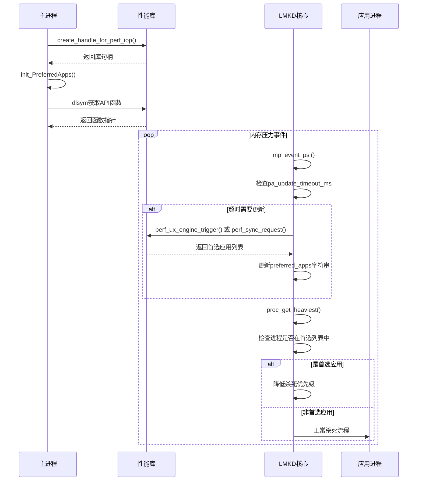
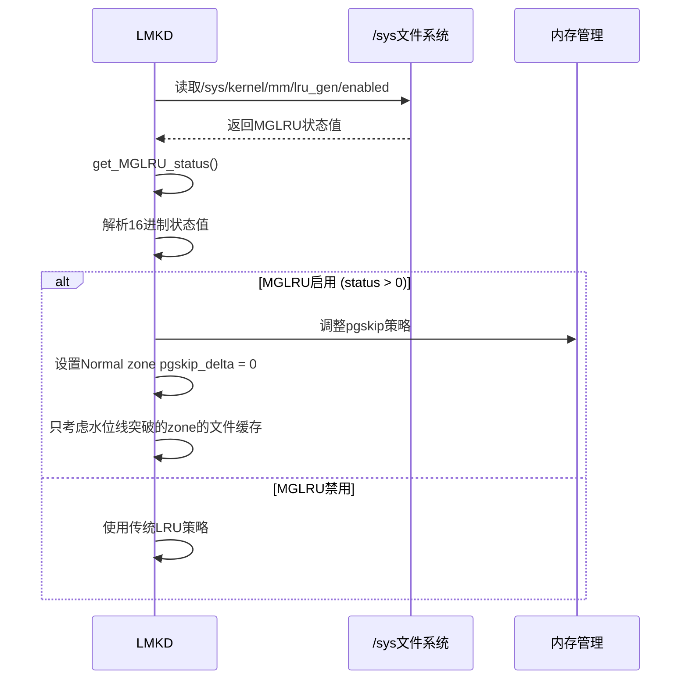
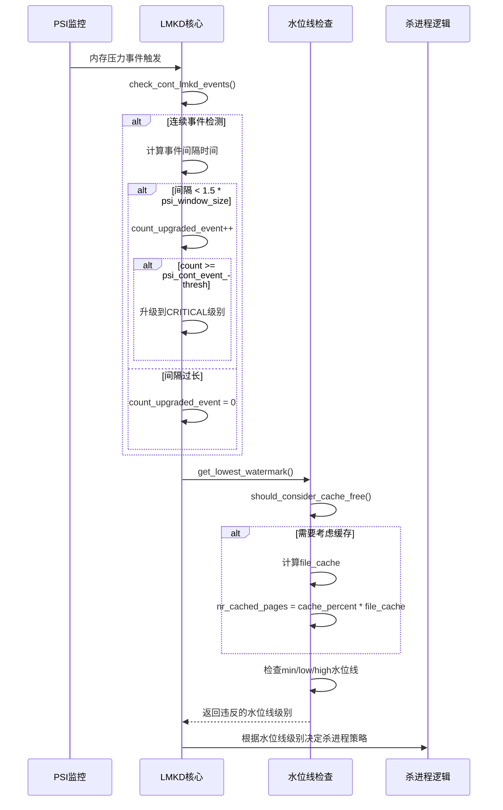
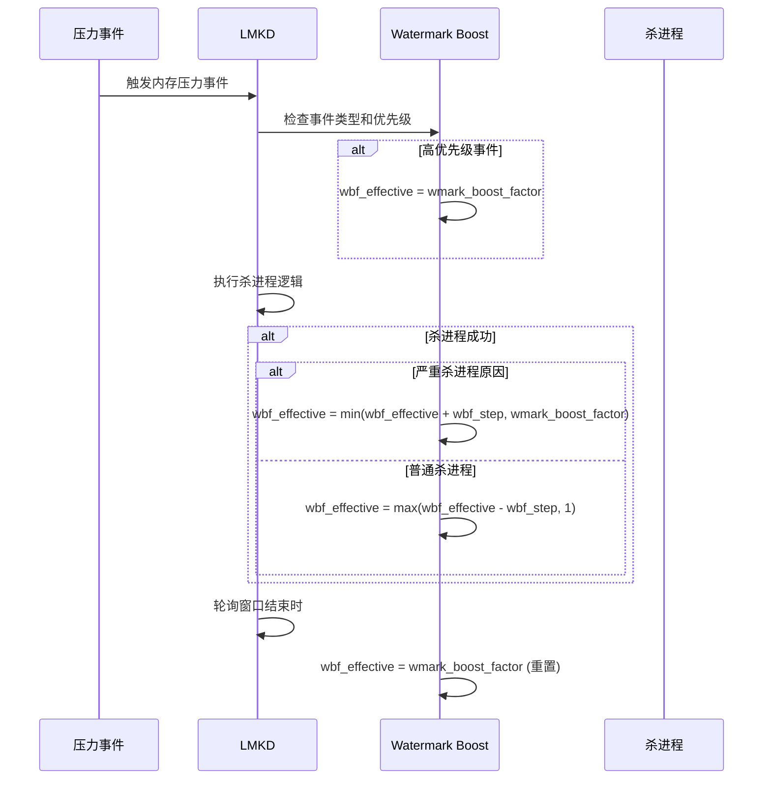
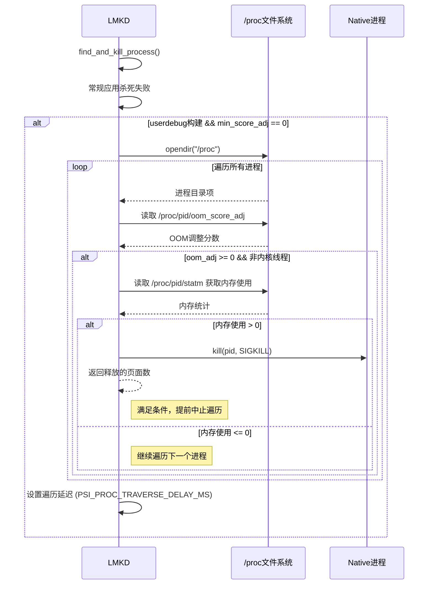
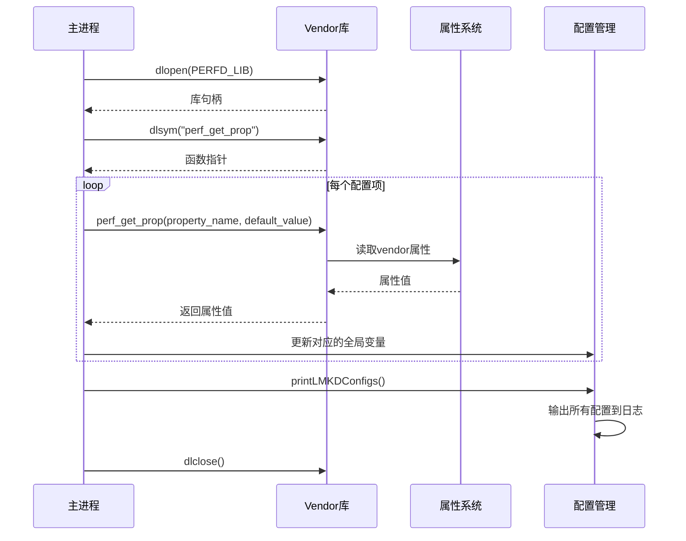

我将详细分析Qualcomm定制版lmkd的主要修改点，按功能分类列出关键函数和实现逻辑。

## 功能分类和关键函数分析

### 1. **首选应用(Preferred Apps)功能**

#### 关键函数：

- `init_PreferredApps()` - 初始化首选应用功能
- `update_perf_props()` - 更新性能属性
- `create_handle_for_perf_iop()` - 创建性能库句柄
- `close_handle_for_perf_iop()` - 关闭性能库句柄

#### 插入位置：

- 在 `main()` 函数中调用 `update_perf_props()`
- 在 `mp_event_psi()` 中集成首选应用更新逻辑

#### 实现逻辑和时序图：

### 2. **MGLRU状态检测和优化**

#### 关键函数：

- `get_MGLRU_status()` - 获取MGLRU状态
- `fill_log_pgskip_stats()` - 填充页面跳过统计
- `calc_zone_watermarks()` - 计算zone水位线

#### 插入位置：

- 在 `update_perf_props()` 中调用
- 在 `mp_event_psi()` 中用于内存策略决策

#### 实现逻辑：

### 3. **增强的内存压力检测**

#### 关键函数：

- `should_consider_cache_free()` - 判断是否考虑缓存为可用内存
- `get_lowest_watermark()` - 获取最低水位线违反情况
- `check_cont_lmkd_events()` - 检查连续LMKD事件

#### 插入位置：

- 在 `mp_event_psi()` 主循环中
- 在 `mainloop()` 的事件处理中

#### 实现逻辑：

### 4. **动态水位线增强(Watermark Boost)**

#### 关键函数：

- `wbf_effective` 全局变量管理
- 在 `mp_event_psi()` 中的动态调整逻辑

#### 插入位置：

- 在内存压力事件处理的开始和结束

#### 实现逻辑：

### 5. **Native进程扫描和杀死**

#### 关键函数：

- `proc_get_script()` - 扫描和杀死native进程

#### 插入位置：

- 在 `find_and_kill_process()` 末尾作为备选方案

#### 实现逻辑：

### 6. **增强的配置和属性管理**

#### 关键函数：

- `update_perf_props()` - 更新性能属性
- `printLMKDConfigs()` - 打印配置信息

#### 插入位置：

- 在 `update_props()` 函数末尾调用
- 在 `main()` 初始化时调用

#### 实现逻辑：

这些修改展现了Qualcomm版本在以下方面的显著增强：

1. **智能化程度更高** - 通过首选应用和动态调整策略
2. **硬件适配性更强** - 支持MGLRU等新特性
3. **配置灵活性更大** - 大量可调参数和vendor集成
4. **监控能力更强** - 更详细的统计和日志
5. **性能优化更精细** - 多层次的优化策略

每个功能模块都经过精心设计，确保在复杂的商用环境中能够提供更好的内存管理性能。